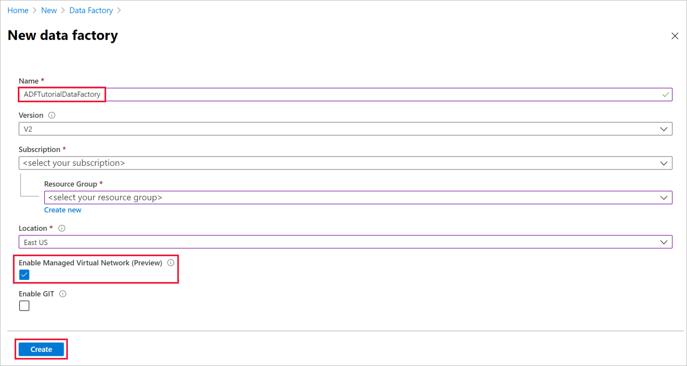
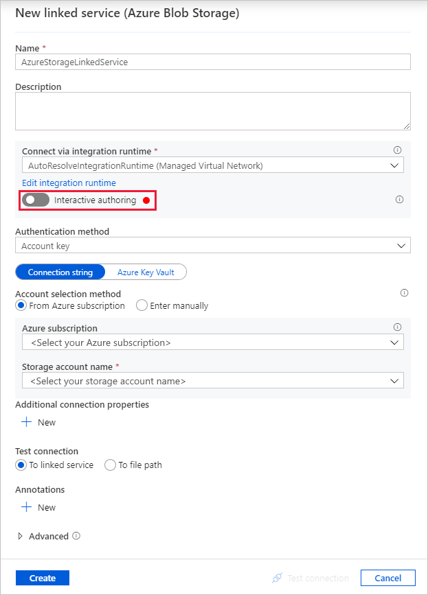
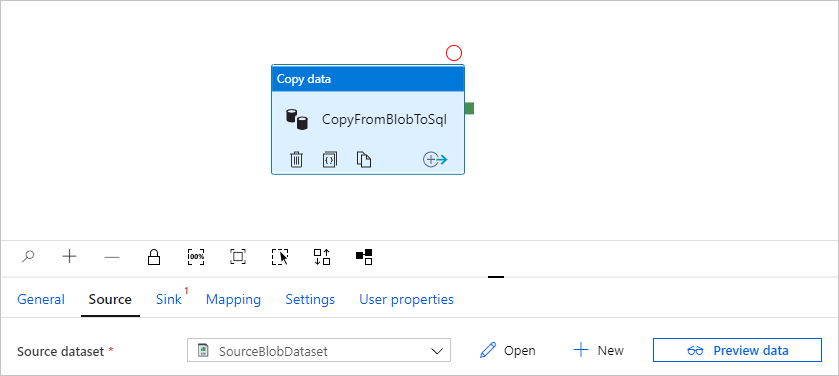
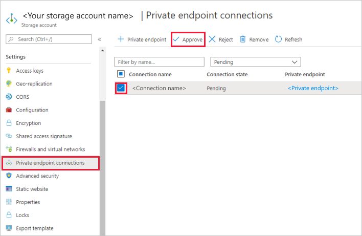

# Copy data securely from Azure Blob storage to a SQL database by using private endpoints

[!INCLUDE[appliesto-adf-xxx-md](includes/appliesto-adf-xxx-md.md)]

In this tutorial, you create a data factory by using the Azure Data Factory user interface (UI). **The pipeline in this data factory copies data securely from Azure Blob storage to an Azure SQL database (both allowing access to only selected networks) using private endpoints in [Azure Data Factory managed VNet](https://aka.ms/managed-vnet)**.** The configuration pattern in this tutorial applies to copying from a file-based data store to a relational data store. For a list of data stores supported as sources and sinks, see the [supported data stores](https://docs.microsoft.com/azure/data-factory/copy-activity-overview) table.

> [!NOTE]
>
> - If you're new to Data Factory, see [Introduction to Azure Data Factory](https://docs.microsoft.com/azure/data-factory/introduction).

In this tutorial, you perform the following steps:

> * Create a data factory
> * Create a pipeline with a copy activity


## Prerequisites
* **Azure subscription**. If you don't have an Azure subscription, create a [free Azure account](https://azure.microsoft.com/free/) before you begin.
* **Azure storage account**. You use Blob storage as a *source* data store. If you don't have a storage account, see [Create an Azure storage account](https://docs.microsoft.com/azure/storage/common/storage-account-create?tabs=azure-portal) for steps to create one. **Ensure the Storage account allows access only from 'Selected networks'.** 
* **Azure SQL Database**. You use the database as a *sink* data store. If you don't have an Azure SQL database, see [Create a SQL database](https://docs.microsoft.com/azure/sql-database/sql-database-get-started-portal) for steps to create one. **Ensure the Azure SQL Database account allows access only from 'Selected networks'.** 

### Create a blob and a SQL table

Now, prepare your Blob storage and SQL database for the tutorial by performing the following steps.

#### Create a source blob

1. Launch Notepad. Copy the following text, and save it as an **emp.txt** file on your disk:

    ```
    FirstName,LastName
    John,Doe
    Jane,Doe
    ```

1. Create a container named **adftutorial** in your Blob storage. Create a folder named **input** in this container. Then, upload the **emp.txt** file to the **input** folder. Use the Azure portal or tools such as [Azure Storage Explorer](https://storageexplorer.com/) to do these tasks.

#### Create a sink SQL table

1. Use the following SQL script to create the **dbo.emp** table in your SQL database:

    ```sql
    CREATE TABLE dbo.emp
    (
        ID int IDENTITY(1,1) NOT NULL,
        FirstName varchar(50),
        LastName varchar(50)
    )
    GO

    CREATE CLUSTERED INDEX IX_emp_ID ON dbo.emp (ID);
    ```

1. Allow Azure services to access SQL Server. Ensure that **Allow access to Azure services** is turned **ON** for your SQL Server so that Data Factory can write data to your SQL Server. To verify and turn on this setting, go to Azure SQL server > Overview > Set server firewall> set the **Allow access to Azure services** option to **ON**.

## Create a data factory
In this step, you create a data factory and start the Data Factory UI to create a pipeline in the data factory.

1. Open **Microsoft Edge** or **Google Chrome**. Currently, Data Factory UI is supported only in Microsoft Edge and Google Chrome web browsers.

> [!NOTE]
> During Private Preview, use [aka.ms/adfVnet](https://aka.ms/adfVnet) for creating a new data factory.

2. On the left menu, select **Create a resource** > **Analytics** > **Data Factory**.

3. On the **New data factory** page, under **Name**, enter **ADFTutorialDataFactory**.

   The name of the Azure data factory must be *globally unique*. If you receive an error message about the name value, enter a different name for the data factory. (for example, yournameADFTutorialDataFactory). For naming rules for Data Factory artifacts, see [Data Factory naming rules](https://docs.microsoft.com/azure/data-factory/naming-rules).

4. Select the Azure **subscription** in which you want to create the data factory.

5. For **Resource Group**, take one of the following steps:

    a. Select **Use existing**, and select an existing resource group from the drop-down list.

    b. Select **Create new**, and enter the name of a resource group. 
         
    To learn about resource groups, see [Use resource groups to manage your Azure resources](https://docs.microsoft.com/azure/azure-resource-manager/management/overview). 

6. Under **Version**, select **V2**.

7. Under **Location**, select a location for the data factory. Only locations that are supported are displayed in the drop-down list. The data stores (for example, Azure Storage and SQL Database) and computes (for example, Azure HDInsight) used by the data factory can be in other regions.

8. Select the checkbox for **Enable Managed Virtual Network (Preview)**.

9. Select **Create**.

   
> [!NOTE]
> If you do not see 'Enable Managed VNet (Preview)' option, then use [aka.ms/adfVnet](https://aka.ms/adfVnet) for creating a new data factory

10. After the creation is finished, you see the notice in Notifications center. Select **Go to resource** to navigate to the Data factory page.

11. Select **Author & Monitor** to launch the Data Factory UI in a separate tab.


## Create a pipeline
In this step, you create a pipeline with a copy activity in the data factory. The copy activity copies data from Blob storage to SQL Database. In the [Quickstart tutorial](https://docs.microsoft.com/azure/data-factory/quickstart-create-data-factory-portal), you created a pipeline by following these steps:

1. Create the linked service.
1. Create input and output datasets.
1. Create a pipeline.

In this tutorial, you start with creating the pipeline. Then you create linked services and datasets when you need them to configure the pipeline.

1. On the **Let's get started** page, select **Create pipeline**.

   
1. In the **Properties** pane for the pipeline, enter **CopyPipeline** for **Name** of the pipeline.

1. In the **Activities** tool box, expand the **Move and Transform** category, and drag and drop the **Copy Data** activity from the tool box to the pipeline designer surface. Specify **CopyFromBlobToSql** for **Name**.

    

### Configure source

>[!TIP]
>In this tutorial, you use *Account key* as the authentication type for your source data store, but you can choose other supported authentication methods: *SAS URI*,*Service Principal* and *Managed Identity* if needed. Refer to corresponding sections in [this article](https://docs.microsoft.com/azure/data-factory/connector-azure-blob-storage#linked-service-properties) for details.
>To store secrets for data stores securely, it's also recommended to use an Azure Key Vault. Refer to [this article](https://docs.microsoft.com/azure/data-factory/store-credentials-in-key-vault) for detailed illustrations.

#### Create source dataset and linked service

1. Go to the **Source** tab. Select **+ New** to create a source dataset.

1. In the **New Dataset** dialog box, select **Azure Blob Storage**, and then select **Continue**. The source data is in Blob storage, so you select **Azure Blob Storage** for the source dataset.

1. In the **Select Format** dialog box, choose the format type of your data, and then select **Continue**.

1. In the **Set Properties** dialog box, enter **SourceBlobDataset** for Name. Select the checkbox for **First row as header**. Under the **Linked service** text box, select **+ New**.

1. In the **New Linked Service (Azure Blob Storage)** dialog box, enter **AzureStorageLinkedService** as name, select your storage account from the **Storage account name** list. 

1. Make sure you enable **Interactive Authoring**. It might take around 1 minute to be enabled.

    

1. Select **Test connection**, it should fail when the Storage Account allows access only from 'Selected Network' and requires Azure Data Factory to create a Private Endpoint to it which should be approved prior to using it. In the error message, you should see a link to create a **private endpoint** that you can follow to create a managed private endpoint. *An alternative is to go directly to the Manage tab and follow instructions in [next section](#create-a-managed-private-endpoint) to create a managed private endpoint*
> [!NOTE]
> Manage tab may not be available for all data factory instances. If you do not see it, you can still access Private Endpoints through '**Author**' tab --> '**Connections**' --> '**Private Endpoint**'
1. Keep the dialog box open, and then go to your Storage Account selected above.

1. Follow instructions in [this section](#approval-of-a-private-link-in-storage-account) to approve the private link.

1. Go back to the dialog box. **Test connection** again and select **Create** to deploy the linked service.

1. After the linked service is created, it's navigated back to the **Set properties** page. Next to **File path**, select **Browse**.

1. Navigate to the **adftutorial/input** folder, select the **emp.txt** file, and then select **OK**.

1. Select **OK**. It automatically navigates to the pipeline page. In **Source** tab, confirm that **SourceBlobDataset** is selected. To preview data on this page, select **Preview data**.

    

#### Create a managed private endpoint

In case you did not click into the hyperlink when testing the connection above, follow the following path. Now you need to create a managed private endpoint that you will connect to the linked service created above.

1. Go to the Manage tab.
> [!NOTE]
> Manage tab may not be available for all data factory instances. If you do not see it, you can still access Private Endpoints through '**Author**' tab --> '**Connections**' --> '**Private Endpoint**'

1. Go to the Managed private endpoints section.

1. Select **+ New** under Managed private endpoints.

     

1. Select the Azure Blob Storage tile from the list and select **Continue**.

1. Enter the name of the Storage Account you created above.

1. Select **Create**.

1. You should see after waiting some seconds that the private link created needs an approval.

1. Select the Private Endpoint that you created above. You can see a hyperlink that will lead you to approve the Private Endpoint at the Storage Account level.

     

#### Approval of a private link in storage account
1. In the Storage Account, go to **Private endpoint connections** under Settings section.

1. Tick the Private endpoint you created above and select **Approve**.

    

1. Add a description and click **yes**
1. Go back to the **Managed private endpoints** section of the **Manage** tab in Azure Data Factory.
1. It should take around 1-2 minutes to get the approval for your private endpoint reflect in Azure Data Factory UI.


### Configure sink
>[!TIP]
>In this tutorial, you use *SQL authentication* as the authentication type for your sink data store, but you can choose other supported authentication methods: *Service Principal* and *Managed Identity* if needed. Refer to corresponding sections in [this article](https://docs.microsoft.com/azure/data-factory/connector-azure-sql-database#linked-service-properties) for details.
>To store secrets for data stores securely, it's also recommended to use an Azure Key Vault. Refer to [this article](https://docs.microsoft.com/azure/data-factory/store-credentials-in-key-vault) for detailed illustrations.

#### Create sink dataset and linked service
1. Go to the **Sink** tab, and select **+ New** to create a sink dataset.

1. In the **New Dataset** dialog box, input "SQL" in the search box to filter the connectors, select **Azure SQL Database**, and then select **Continue**. In this tutorial, you copy data to a SQL database.

1. In the **Set Properties** dialog box, enter **OutputSqlDataset** for Name. From the **Linked service** dropdown list, select **+ New**. A dataset must be associated with a linked service. The linked service has the connection string that Data Factory uses to connect to the SQL database at runtime. The dataset specifies the container, folder, and the file (optional) to which the data is copied.

1. In the **New Linked Service (Azure SQL Database)** dialog box, take the following steps:

    1. Under **Name**, enter **AzureSqlDatabaseLinkedService**.
    1. Under **Server name**, select your SQL Server instance.
    1. Make sure you enable **Interactive Authoring**.
    1. Under **Database name**, select your SQL database.
    1. Under **User name**, enter the name of the user.
    1. Under **Password**, enter the password for the user.
    1. Select **Test connection**. It should fail because the SQL server allows access only from 'selected networks' and requires Azure Data Factory to create a Private Endpoint to it which should be approved prior to using it. In the error message, you should see a link to create a **private endpoint** that you can follow to create a managed private endpoint. *An alternative is to go directly to the Manage tab and follow instructions in next section to create a managed private endpoint*
    1. Keep the dialog box open, and then go to your SQL server selected above.    
    1. Follow instructions in [this section](#approval-of-a-private-link-in-sql-server) to approve the private link.
    1. Go back to the dialog box. **Test connection** again and select **Create** to deploy the linked service.

1. It automatically navigates to the **Set Properties** dialog box. In **Table**, select **[dbo].[emp]**. Then select **OK**.

1. Go to the tab with the pipeline, and in **Sink Dataset**, confirm that **OutputSqlDataset** is selected.

           

You can optionally map the schema of the source to corresponding schema of destination by following [Schema mapping in copy activity](https://docs.microsoft.com/azure/data-factory/copy-activity-schema-and-type-mapping).

#### Create a managed private endpoint

In case you did not click into the hyperlink when testing the connection above, follow the following path. Now you need to create a managed private endpoint that you will connect to the linked service created above.

1. Go to the Manage tab.
1. Go to the Managed private endpoints section.
1. Select **+ New** under Managed private endpoints.

     

1. Select the Azure SQL Database tile from the list and select **Continue**.
1. Enter the name of the SQL server you selected above.
1. Select **Create**.
1. You should see after waiting some seconds that the private link created needs an approval.
1. Select the Private Endpoint that you created above. You can see a hyperlink that will lead you to approve the Private Endpoint at the SQL server level.


#### Approval of a private link in SQL server
1. In the SQL server, go to **Private endpoint connections** under Settings section.
1. Tick the Private endpoint you created above and select **Approve**.
1. Add a description and click **yes**.
1. Go back to the **Managed private endpoints** section of the **Manage** tab in Azure Data Factory.
1. It should take around 1-2 minutes to get the approval reflected for your private endpoint.

#### Debug and publish the pipeline

You can debug a pipeline before you publish artifacts (linked services, datasets, and pipeline) to Data Factory or your own Azure Repos Git repository.

1. To debug the pipeline, select **Debug** on the toolbar. You see the status of the pipeline run in the **Output** tab at the bottom of the window.
2. Once the pipeline can run successfully, in the top toolbar, select **Publish all**. This action publishes entities (datasets, and pipelines) you created to Data Factory.
3. Wait until you see the **Successfully published** message. To see notification messages, click the **Show Notifications** on the top-right (bell button).


#### Summary
The pipeline in this sample copies data from Blob storage to Azure SQL DB using private endpoint in managed VNet. You learned how to:

> * Create a data factory
> * Create a pipeline with a copy activity

