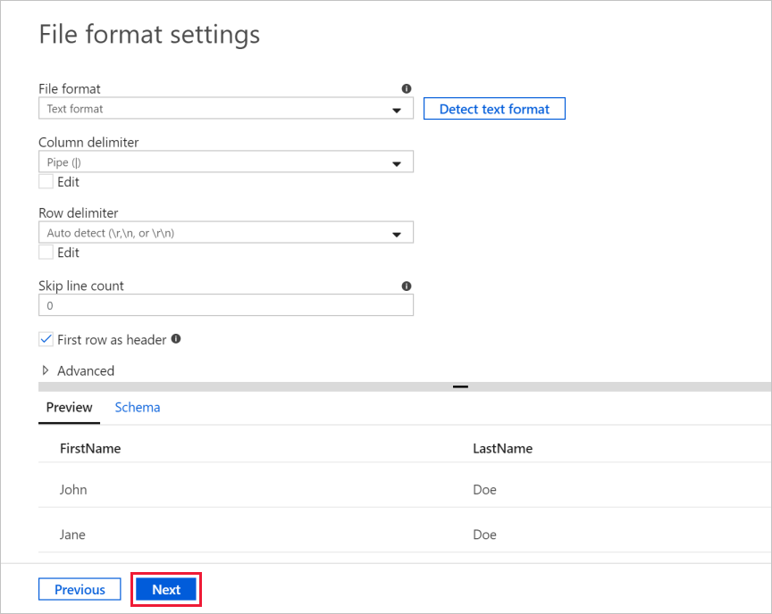
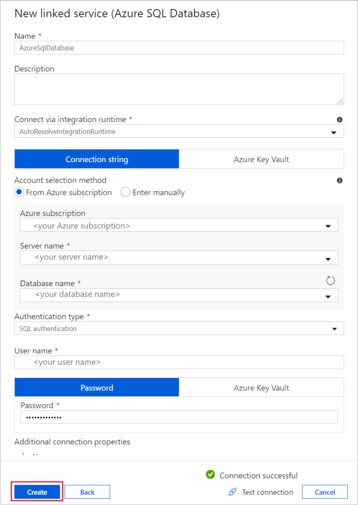
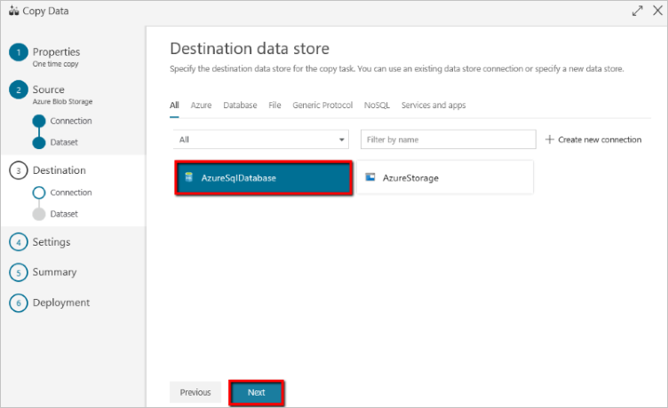
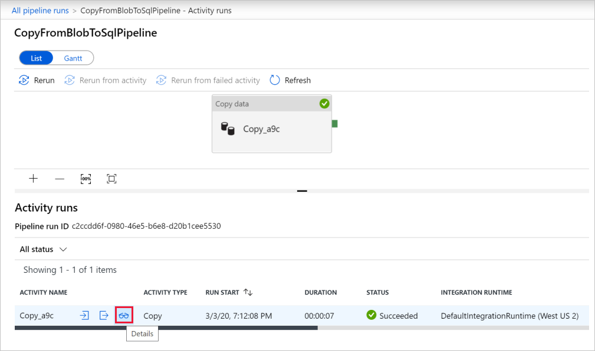

# Copy data from Azure Blob storage to a SQL database by using the Copy Data tool

> [!div class="op_single_selector" title1="Select the version of the Data Factory service that you're using:"]
> * [Version 1](v1/data-factory-copy-data-from-azure-blob-storage-to-sql-database.md)
> * [Current version](tutorial-copy-data-tool.md)

[!INCLUDE[appliesto-adf-xxx-md](includes/appliesto-adf-xxx-md.md)]

In this tutorial, you use the Azure portal to create a data factory. Then you use the Copy Data tool to create a pipeline that copies data from Azure Blob storage to a SQL database.

> [!NOTE]
> If you're new to Azure Data Factory, see [Introduction to Azure Data Factory](introduction.md).

In this tutorial, you perform the following steps:
> [!div class="checklist"]
> * Create a data factory.
> * Use the Copy Data tool to create a pipeline.
> * Monitor the pipeline and activity runs.

## Prerequisites

* **Azure subscription**: If you don't have an Azure subscription, create a [free account](https://azure.microsoft.com/free/) before you begin.
* **Azure storage account**: Use Blob storage as the _source_ data store. If you don't have an Azure storage account, see the instructions in [Create a storage account](../storage/common/storage-quickstart-create-account.md).
* **Azure SQL Database**: Use a SQL database as the _sink_ data store. If you don't have a SQL database, see the instructions in [Create a SQL database](../sql-database/sql-database-get-started-portal.md).

### Create a blob and a SQL table

Prepare your Blob storage and your SQL database for the tutorial by performing these steps.

#### Create a source blob

1. Launch **Notepad**. Copy the following text and save it in a file named **inputEmp.txt** on your disk:

	```
    John|Doe
    Jane|Doe
	```

1. Create a container named **adfv2tutorial** and upload the inputEmp.txt file to the container. You can use the Azure portal or various tools like [Azure Storage Explorer](https://storageexplorer.com/) to perform these tasks.

#### Create a sink SQL table

1. Use the following SQL script to create a table named **dbo.emp** in your SQL database:

    ```sql
    CREATE TABLE dbo.emp
    (
        ID int IDENTITY(1,1) NOT NULL,
        FirstName varchar(50),
        LastName varchar(50)
    )
    GO

    CREATE CLUSTERED INDEX IX_emp_ID ON dbo.emp (ID);
    ```

2. Allow Azure services to access SQL Server. Verify that the setting **Allow access to Azure services** is enabled for your server that's running SQL Database. This setting lets Data Factory write data to your database instance. To verify and turn on this setting, go to Azure SQL server > Overview > Set server firewall> set the **Allow access to Azure services** option to **ON**.

## Create a data factory

1. On the left menu, select **Create a resource** > **Analytics** > **Data Factory**:
    
    
1. On the **New data factory** page, under **Name**, enter **ADFTutorialDataFactory**.

    The name for your data factory must be _globally unique_. You might receive the following error message:
    
    

    If you receive an error message about the name value, enter a different name for the data factory. For example, use the name _**yourname**_**ADFTutorialDataFactory**. For the naming rules for Data Factory artifacts, see [Data Factory naming rules](naming-rules.md).
1. Select the Azure **subscription** in which to create the new data factory.
1. For **Resource Group**, take one of the following steps:
    
    a. Select **Use existing**, and select an existing resource group from the drop-down list.

    b. Select **Create new**, and enter the name of a resource group.
    
    To learn about resource groups, see [Use resource groups to manage your Azure resources](../azure-resource-manager/management/overview.md).

1. Under **version**, select **V2** for the version.
1. Under **location**, select the location for the data factory. Only supported locations are displayed in the drop-down list. The data stores (for example, Azure Storage and SQL Database) and computes (for example, Azure HDInsight) that are used by your data factory can be in other locations and regions.
1. Select **Create**.

1. After creation is finished, the **Data Factory** home page is displayed.
    
    
1. To launch the Azure Data Factory user interface (UI) in a separate tab, select the **Author & Monitor** tile.

## Use the Copy Data tool to create a pipeline

1. On the **Let's get started** page, select the **Copy Data** tile to launch the Copy Data tool.

    
1. On the **Properties** page, under **Task name**, enter **CopyFromBlobToSqlPipeline**. Then select **Next**. The Data Factory UI creates a pipeline with the specified task name.

1. On the **Source data store** page, complete the following steps:

    a. Click **+ Create new connection** to add a connection

    b. Select **Azure Blob Storage** from the gallery, and then select **Continue**.

    c. On the **New Linked Service** page, select your storage account from the **Storage account name** list, and then select **Finish**.

    d. Select the newly created linked service as source, then click **Next**.

    

1. On the **Choose the input file or folder** page, complete the following steps:
    
    a. Click **Browse** to navigate to the **adfv2tutorial/input** folder, select the **inputEmp.txt** file, then click **Choose**.

    b. Click **Next** to move to next step.

1. On the **File format settings** page, notice that the tool automatically detects the column and row delimiters. Select **Next**. You also can preview data and view the schema of the input data on this page.

    
1. On the **Destination data store** page, completes the following steps:

    a. Click **+ Create new connection** to add a connection

    b. Select **Azure SQL Database** from the gallery, and then select **Continue**.

    c. On the **New Linked Service** page, select your server name and DB name from the dropdown list, and specify the username and password, then select **Finish**.

    

    d. Select the newly created linked service as sink, then click **Next**.

    

1. On the **Table mapping** page, select the **[dbo].[emp]** table, and then select **Next**.

1. On the **Schema mapping** page, notice that the first and second columns in the input file are mapped to the **FirstName** and **LastName** columns of the **emp** table. Select **Next**.

    
1. On the **Settings** page, select **Next**.
1. On the **Summary** page, review the settings, and then select **Next**.
1. On the **Deployment page**, select **Monitor** to monitor the pipeline (task).
1. Notice that the **Monitor** tab on the left is automatically selected. The **Actions** column includes links to view activity run details and to rerun the pipeline. Select **Refresh** to refresh the list.

1. To view the activity runs that are associated with the pipeline run, select the **View Activity Runs** link in the **Actions** column. For details about the copy operation, select the **Details** link (eyeglasses icon) in the **Actions** column. To go back to the Pipeline Runs view, select the **Pipeline Runs** link at the top. To refresh the view, select **Refresh**.

    


1. Verify that the data is inserted into the **emp** table in your SQL database.


1. Select the **Author** tab on the left to switch to the editor mode. You can update the linked services, datasets, and pipelines that were created via the tool by using the editor. For details on editing these entities in the Data Factory UI, see [the Azure portal version of this tutorial](tutorial-copy-data-portal.md).

## Next steps
The pipeline in this sample copies data from Blob storage to a SQL database. You learned how to:

> [!div class="checklist"]
> * Create a data factory.
> * Use the Copy Data tool to create a pipeline.
> * Monitor the pipeline and activity runs.

Advance to the following tutorial to learn how to copy data from on-premises to the cloud:

>[!div class="nextstepaction"]
>[Copy data from on-premises to the cloud](tutorial-hybrid-copy-data-tool.md)
