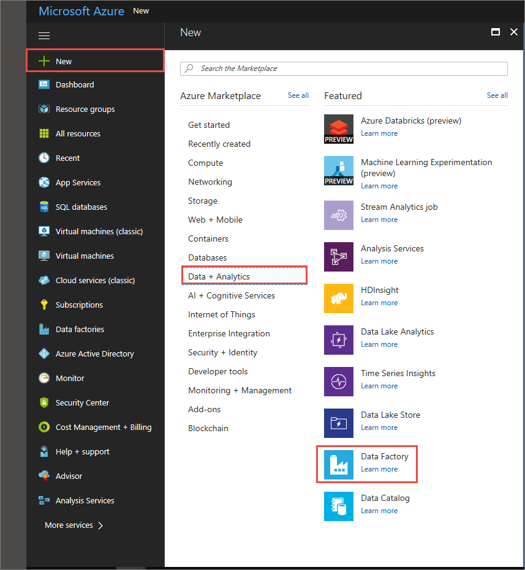

# Partition large files in ADF Mapping Data Flows
This tutorial provides steps for a simple Mapping Data Flow pattern that takes a [large CSV text file](https://www.kaggle.com/wendykan/lending-club-loan-data) with 887,380 rows and creates 20 partitions so that each file contains 44k rows. 

In this tutorial, you complete the following steps:

> [!div class="checklist"]
> * Create a data factory.
> * Create a data flow.

## Prerequisites

[!INCLUDE [updated-for-az](../../includes/updated-for-az.md)]

- **Azure subscription**. If you don't have an Azure subscription, create a [free account](https://azure.microsoft.com/free/) before you begin. 
- **Azure Blob Store Account**.
- **Loans CSV File**. [Download the file here](https://www.kaggle.com/wendykan/lending-club-loan-data)

## Create a data factory

1. Launch **Microsoft Edge** or **Google Chrome** web browser. Currently, Data Factory UI is supported only in Microsoft Edge and Google Chrome web browsers. 
1. Sign in to the [Azure portal](https://portal.azure.com/). 
1. Select **New** on the left menu, select **Data + Analytics**, and then select **Data Factory**. 

   

1. On the **New data factory** page, enter **MyAzureDataFlowFactory** under **Name**. 

   

   The name of the Azure data factory must be *globally unique*. If you receive the following error, change the name of the data factory (for example, **&lt;yourname&gt;MyAzureDataFlowFactory**) and try creating again. For naming rules for Data Factory artifacts, see the [Data Factory - naming rules](naming-rules.md) article. 

   `Data factory name “MyAzureDataFlowFactory” is not available`

1. For **Subscription**, select your Azure subscription in which you want to create the data factory. 
1. For **Resource Group**, do one of the following steps: 

   - Select **Use existing**, and select an existing resource group from the list. 
   - Select **Create new**, and enter the name of a resource group. 

   To learn about resource groups, see [Using resource groups to manage your Azure resources](../azure-resource-manager/resource-group-overview.md). 
1. For **Version**, select **V2 (Preview)**. 
1. For **Location**, select the location for the data factory. The list shows only locations that are supported for the creation of data factories. 
1. Select **Pin to dashboard**. 
1. Select **Create**. 
1. On the dashboard, you see the following tile with the status **Deploying data factory**: 

   

1. After the creation is complete, you see the **Data factory** page. 

   

1. Select **Author & Monitor** to open the Data Factory user interface (UI) on a separate tab. 
