# Transform data using mapping data flows

[!INCLUDE[appliesto-adf-xxx-md](includes/appliesto-adf-xxx-md.md)]

If you're new to Azure Data Factory, see [Introduction to Azure Data Factory](introduction.md).

In this tutorial, you'll use the Azure Data Factory user interface (UX) to create a pipeline that copies and transforms data from an Azure Data Lake Storage (ADLS) Gen2 source to an ADLS Gen2 sink using mapping data flow. The configuration pattern in this tutorial can be expanded upon when transforming data using mapping data flow

In this tutorial, you do the following steps:

> [!div class="checklist"]
> * Create a data factory.
> * Create a pipeline with a Data Flow activity.
> * Build a mapping data flow with four transformations. 
> * Test run the pipeline.
> * Monitor a Data Flow activity

## Prerequisites
* **Azure subscription**. If you don't have an Azure subscription, create a [free Azure account](https://azure.microsoft.com/free/) before you begin.
* **Azure storage account**. You use ADLS storage as a *source* and *sink* data stores. If you don't have a storage account, see [Create an Azure storage account](../storage/common/storage-quickstart-create-account.md) for steps to create one.

The file that we are transforming in this tutorial is MoviesDB.csv, which can be found [here](https://raw.githubusercontent.com/djpmsft/adf-ready-demo/master/moviesDB.csv). To retrieve the file from GitHub, copy the contents to a text editor of your choice to save locally as a .csv file. To upload the file to your storage account, see [Upload blobs with the Azure Portal](../storage/blobs/storage-quickstart-blobs-portal.md). The examples will be referencing a container named 'sample-data'.

## Create a data factory

In this step, you create a data factory and open the Data Factory UX to create a pipeline in the data factory. 

1. Open **Microsoft Edge** or **Google Chrome**. Currently, Data Factory UI is supported only in the Microsoft Edge and Google Chrome web browsers.
2. On the left menu, select **Create a resource** > **Analytics** > **Data Factory**: 
  
   

3. On the **New data factory** page, under **Name**, enter **ADFTutorialDataFactory**. 
 
   The name of the Azure data factory must be *globally unique*. If you receive an error message about the name value, enter a different name for the data factory. (for example, yournameADFTutorialDataFactory). For naming rules for Data Factory artifacts, see [Data Factory naming rules](naming-rules.md).
        
     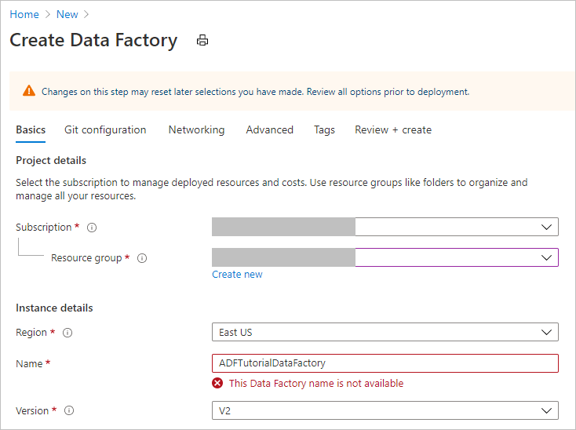
4. Select the Azure **subscription** in which you want to create the data factory. 
5. For **Resource Group**, take one of the following steps:
     
    a. Select **Use existing**, and select an existing resource group from the drop-down list.

    b. Select **Create new**, and enter the name of a resource group. 
         
    To learn about resource groups, see [Use resource groups to manage your Azure resources](../azure-resource-manager/resource-group-overview.md). 
6. Under **Version**, select **V2**.
7. Under **Location**, select a location for the data factory. Only locations that are supported are displayed in the drop-down list. Data stores (for example, Azure Storage and SQL Database) and computes (for example, Azure HDInsight) used by the data factory can be in other regions.
8. Select **Create**. 
9. After the creation is finished, you see the notice in Notifications center. Select **Go to resource** to navigate to the Data factory page.
10. Select **Author & Monitor** to launch the Data Factory UI in a separate tab.

## Create a pipeline with a Data Flow activity

In this step, you'll create a pipeline that contains a Data Flow activity.

1. On the **Let's get started** page, select **Create pipeline**. 

   

1. In the **General** tab for the pipeline, enter **TransformMovies** for **Name** of the pipeline.
1. In the factory top bar, slide the **Data Flow debug** slider on. Debug mode allows for interactive testing of transformation logic against a live Spark cluster. Data Flow clusters take 5-7 minutes to warm up and users are recommended to turn on debug first if they plan to do Data Flow development. For more information, see [Debug Mode](concepts-data-flow-debug-mode.md).

    
1. In the **Activities** pane, expand the **Move and Transform** accordion. Drag and drop the **Data Flow** activity from the pane to the pipeline canvas.

    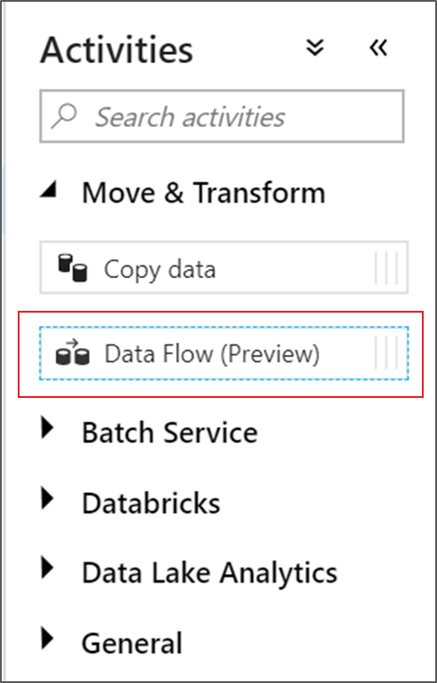
1. In the **Adding Data Flow** pop-up, select **Create new Data Flow** and then name your data flow **TransformMovies**. Click Finish when done.

    

## Build transformation logic in the data flow canvas

Once you create your Data Flow, you'll be automatically sent to the data flow canvas. In this step, you'll build a data flow that takes the moviesDB.csv in ADLS storage and aggregates the average rating of comedies from 1910 to 2000. You'll then write this file back to the ADLS storage.

1. In the data flow canvas, add a source by clicking on the **Add Source** box.

    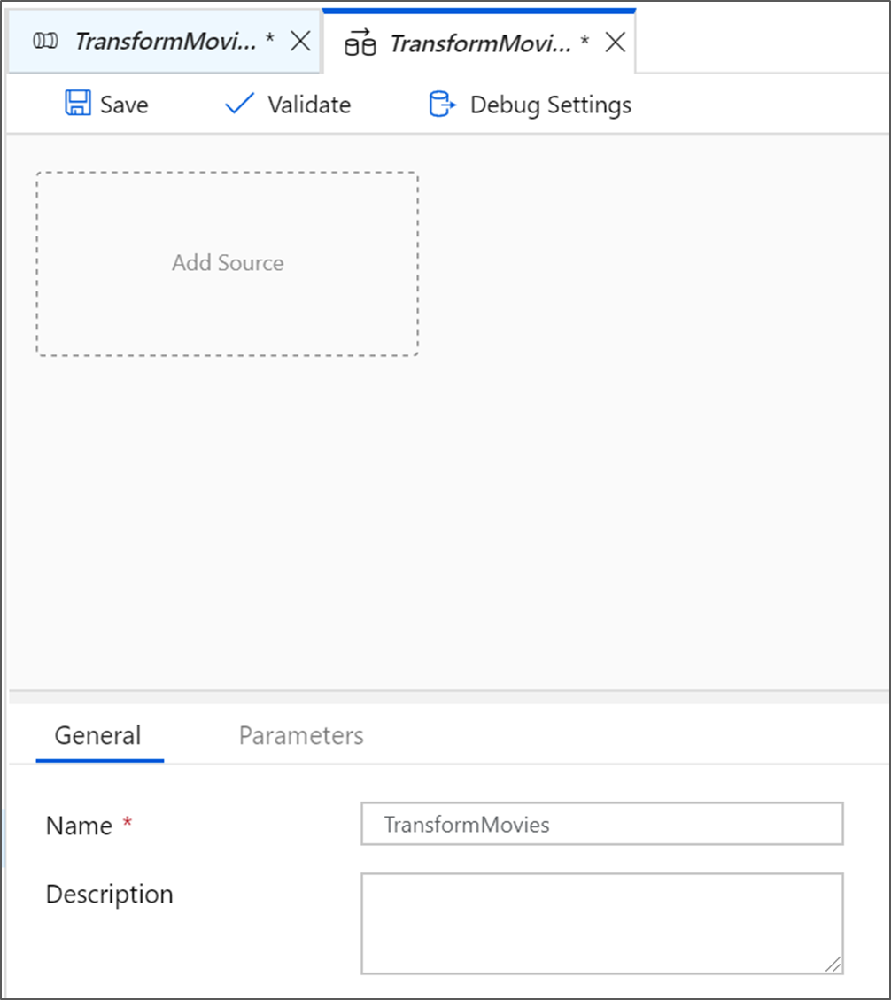
1. Name your source **MoviesDB**. Click on **New** to create a new source dataset.
    
    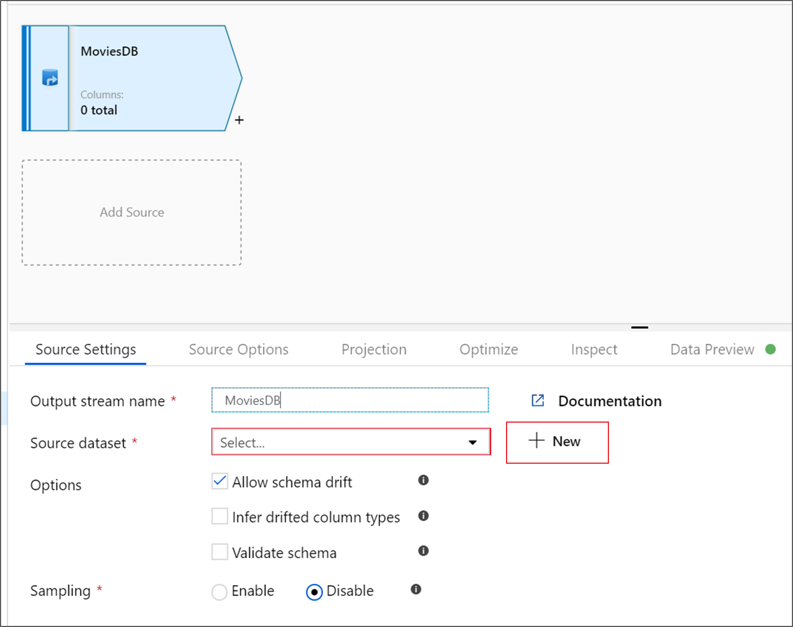
1. Choose **Azure Data Lake Storage Gen2**. Click Continue.

    
1. Choose **DelimitedText**. Click Continue.

    
1. Name your dataset **MoviesDB**. In the linked service dropdown, choose **New**.

    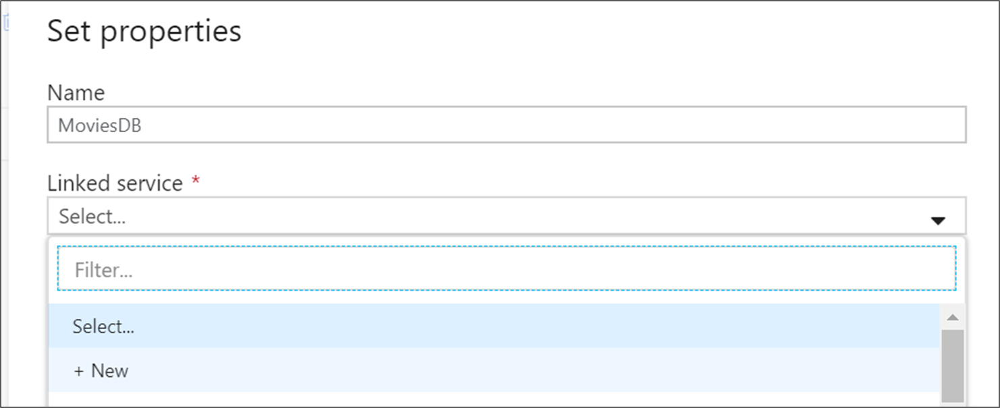
1. In the linked service creation screen, name your ADLS gen2 linked service **ADLSGen2** and specify your authentication method. Then enter your connection credentials. In this tutorial, we're using Account key to connect to our storage account. You can click **Test connection** to verify your credentials were entered correctly. Click Create when finished.

    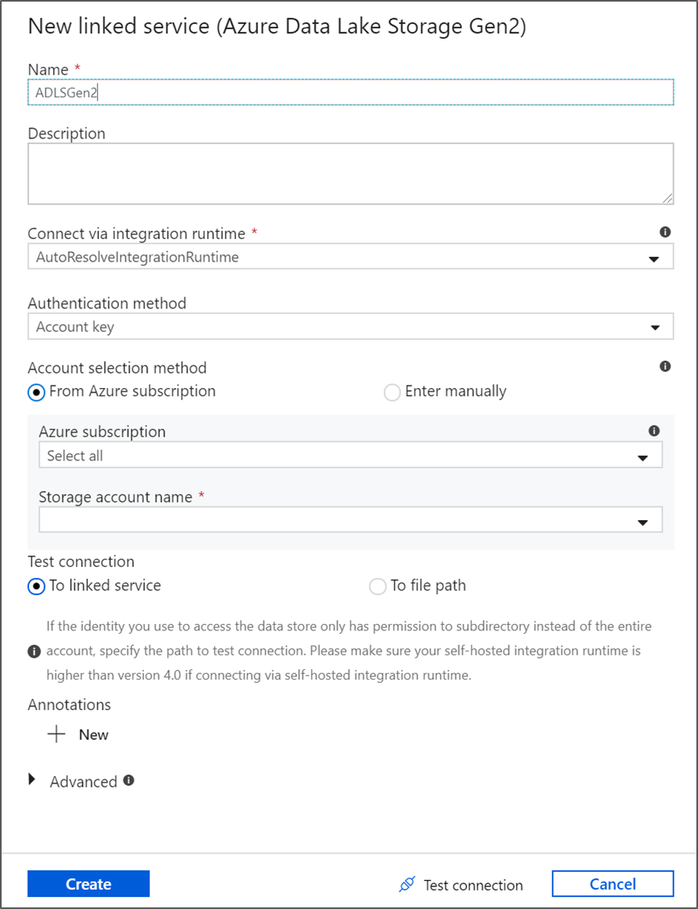
1. Once you're back at the dataset creation screen, enter where your file is located under the **File path** field. In this tutorial, the file moviesDB.csv is located in container sample-data. As the file has headers, check **First row as header**. Select **From connection/store** to import the header schema directly from the file in storage. Click OK when done.

    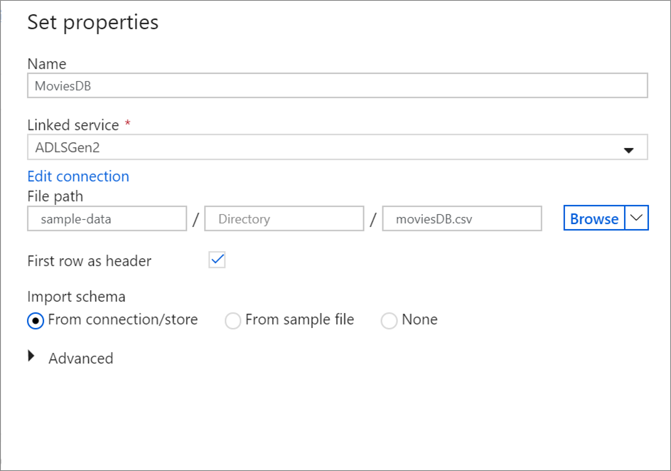
1. If your debug cluster has started, go to the **Data Preview** tab of the source transformation and click **Refresh** to get a snapshot of the data. You can use data preview to verify your transformation is configured correctly.
    
    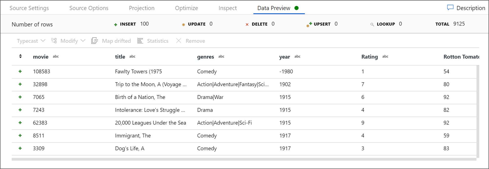
1. Next to your source node on the data flow canvas, click on the plus icon to add a new transformation. The first transformation you're adding is a **Filter**.
    
    
1. Name your filter transformation **FilterYears**. Click on the expression box next to **Filter on** to open the expression builder. Here you'll specify your filtering condition. 
    
    
1. The data flow expression builder lets you interactively build expressions to use in various transformations. Expressions can include built-in functions, columns from the input schema, and user-defined parameters. For more information on how to build expressions, see [Data Flow expression builder](concepts-data-flow-expression-builder.md).
    
    In this tutorial, you want to filter movies of genre comedy that came out between the years 1910 and 2000. As year is currently a string, you need to convert it to an integer using the ```toInteger()``` function. Use the greater than or equals to (>=) and less than or equals to (<=) operators to compare against literal year values 1910 and 200-. Union these expressions together with the and (&&) operator. The expression comes out as:

    ```toInteger(year) >= 1910 && toInteger(year) <= 2000```

    To find which movies are comedies, you can use the ```rlike()``` function to find pattern 'Comedy' in the column genres. Union the rlike expression with the year comparison to get:

    ```toInteger(year) >= 1910 && toInteger(year) <= 2000 && rlike(genres, 'Comedy')```

    If you've a debug cluster active, you can verify your logic by clicking **Refresh** to see expression output compared to the inputs used. There's more than one right answer on how you can accomplish this logic using the data flow expression language.
    
    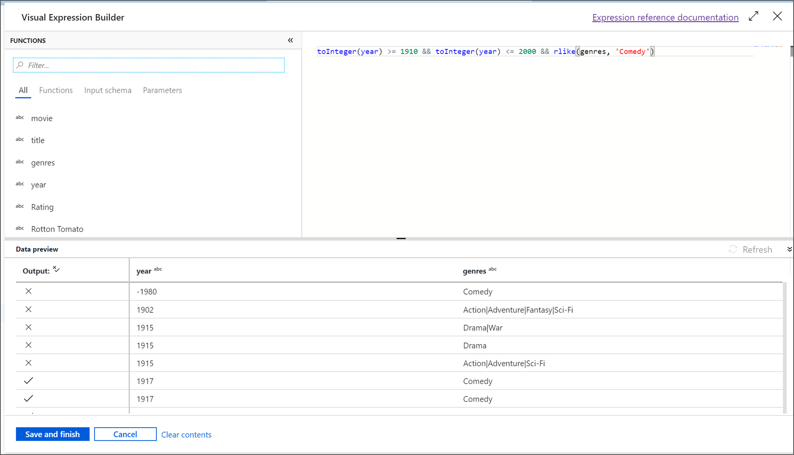

    Click **Save and Finish** once you're done with your expression.

1. Fetch a **Data Preview** to verify the filter is working correctly.
    
    
1. The next transformation you'll add is an **Aggregate** transformation under **Schema modifier**.
    
    
1. Name your aggregate transformation **AggregateComedyRatings**. In the **Group by** tab, select **year** from the dropdown to group the aggregations by the year the movie came out.
    
    
1. Go to the **Aggregates** tab. In the left text box, name the aggregate column **AverageComedyRating**. Click on the right expression box to enter the aggregate expression via the expression builder.
    
    
1. To get the average of column **Rating**, use the ```avg()``` aggregate function. As **Rating** is a string and ```avg()``` takes in a numerical input, we must convert the value to a number via the ```toInteger()``` function. This is expression looks like:

    ```avg(toInteger(Rating))```
    
    Click **Save and Finish** when done. 

    
1. Go to the **Data Preview** tab to view the transformation output. Notice only two columns are there, **year** and **AverageComedyRating**.
    
    
1. Next, you want to add a **Sink** transformation under **Destination**.
    
    
1. Name your sink **Sink**. Click **New** to create your sink dataset.
    
    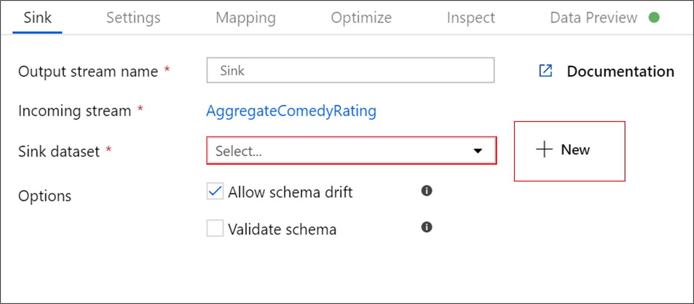
1. Choose **Azure Data Lake Storage Gen2**. Click Continue.

    
1. Choose **DelimitedText**. Click Continue.

    
1. Name your sink dataset **MoviesSink**. For linked service, choose the ADLS gen2 linked service you created in step 6. Enter an output folder to write your data to. In this tutorial, we're writing to folder 'output' in container 'sample-data'. The folder doesn't need to exist beforehand and can be dynamically created. Set **First row as header** as true and select **None** for **Import schema**. Click Finish.
    
    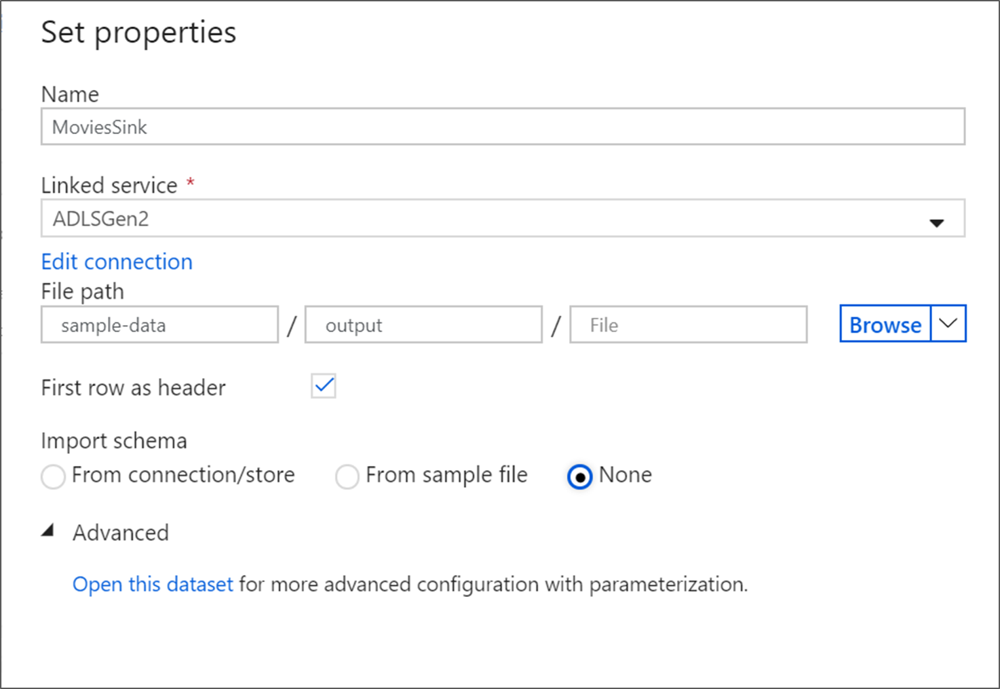

Now you've finished building your data flow. You're ready to run it in your pipeline.

## Running and monitoring the Data Flow

You can debug a pipeline before you publish it. In this step, you're going to trigger a debug run of the data flow pipeline. While data preview doesn't write data, a debug run will write data to your sink destination.

1. Go to the pipeline canvas. Click **Debug** to trigger a debug run.
    
    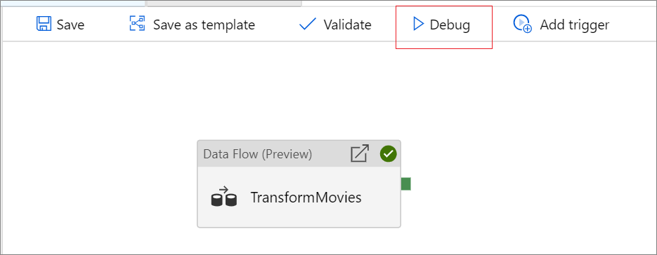
1. Pipeline debug of Data Flow activities uses the active debug cluster but still take at least a minute to initialize. You can track the progress via the **Output** tab. Once the run is successful, click on the eyeglasses icon to open the monitoring pane.
    
    
1. In the monitoring pane, you can see the number of rows and time spent in each transformation step.
    
    
1. Click on a transformation to get detailed information about the columns and partitioning of the data.
    
    

If you followed this tutorial correctly, you should have written 83 rows and 2 columns into your sink folder. You can verify the data is correct by checking your blob storage.

## Next steps

The pipeline in this tutorial runs a data flow that aggregates the average rating of comedies from 1910 to 2000 and writes the data to ADLS. You learned how to:

> [!div class="checklist"]
> * Create a data factory.
> * Create a pipeline with a Data Flow activity.
> * Build a mapping data flow with four transformations. 
> * Test run the pipeline.
> * Monitor a Data Flow activity

Learn more about the [data flow expression language](data-flow-expression-functions.md).