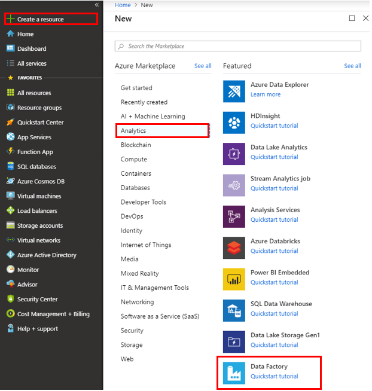
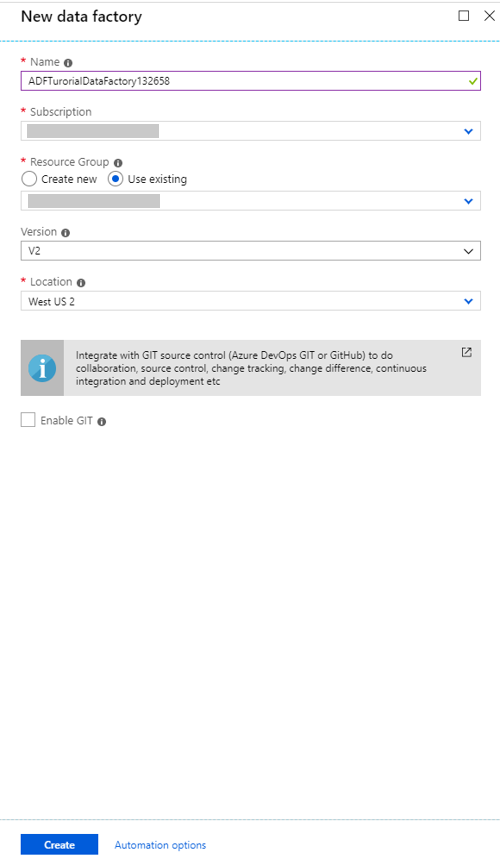
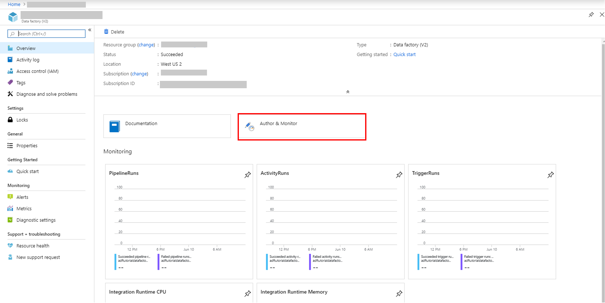
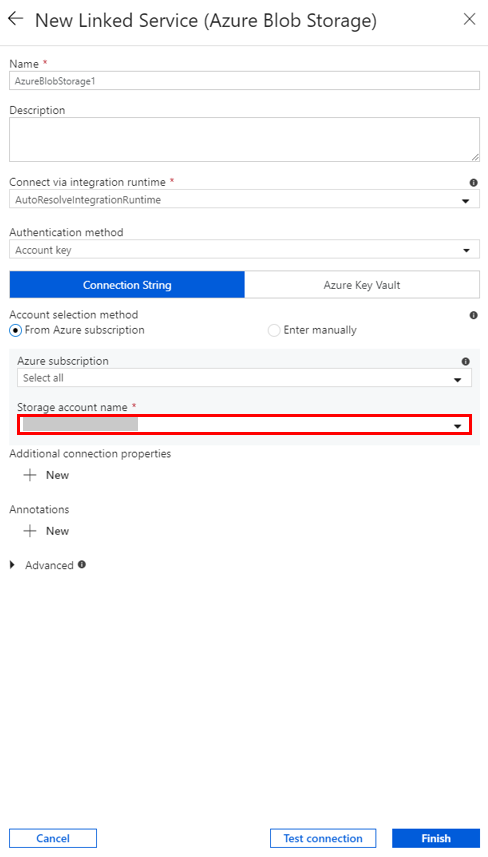
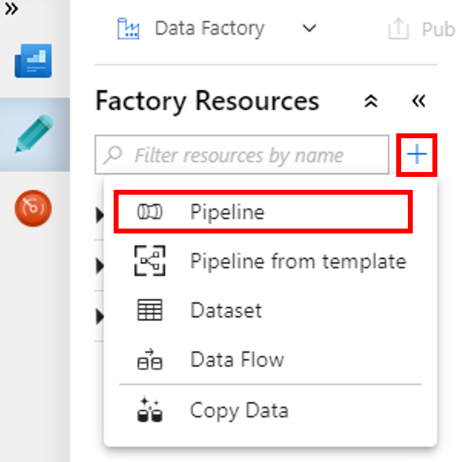
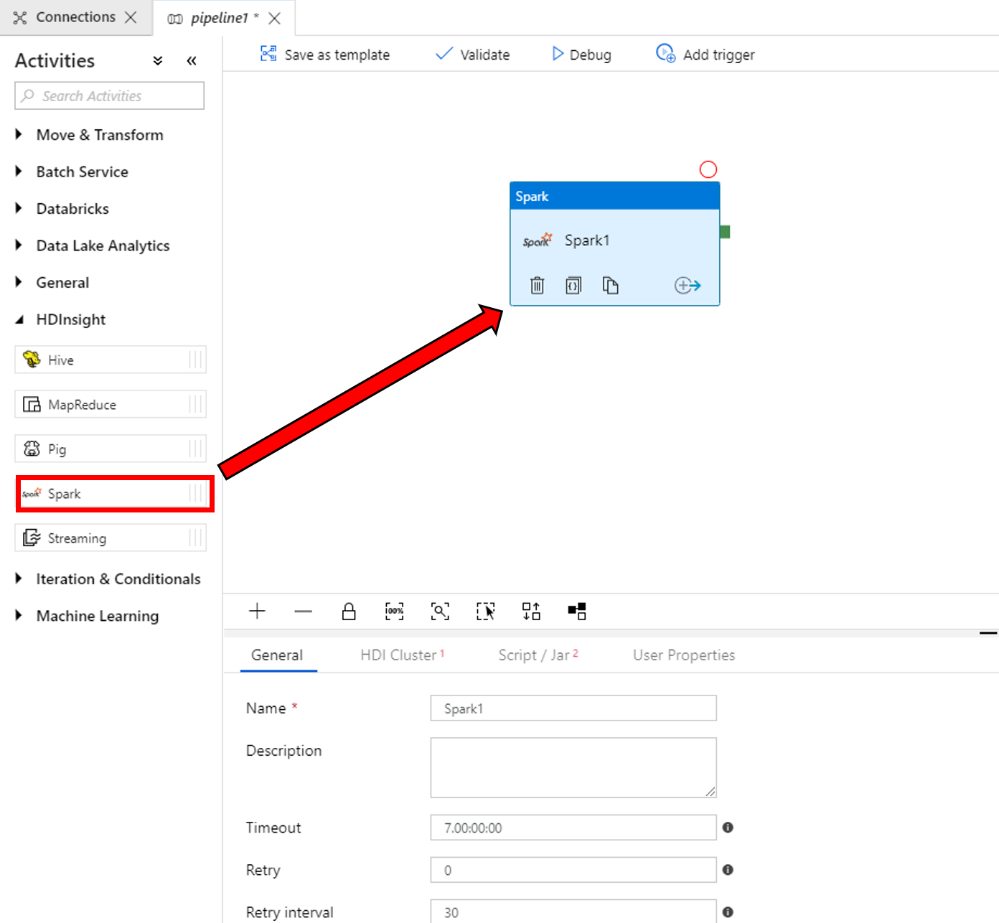

# Transform data in the cloud by using Spark activity in Azure Data Factory
In this tutorial, you use the Azure portal to create a Data Factory pipeline that transforms data using Spark Activity and an on-demand HDInsight linked service. You perform the following steps in this tutorial:

> [!div class="checklist"]
> * Create a data factory. 
> * Create a pipeline with a Spark activity
> * Trigger a pipeline run
> * Monitor the pipeline run.

> [!NOTE]
> This article applies to version 2 of Data Factory, which is currently in preview. If you are using version 1 of the Data Factory service, which is generally available (GA), see [documentation for Data Factory version 1](v1/data-factory-copy-data-from-azure-blob-storage-to-sql-database.md).

If you don't have an Azure subscription, create a [free](https://azure.microsoft.com/free/) account before you begin.

## Prerequisites
* **Azure Storage account**. You create a python script and an input file, and upload them to the Azure storage. The output from the spark program is stored in this storage account. The on-demand Spark cluster uses the same storage account as its primary storage.  
* **Azure PowerShell**. Follow the instructions in [How to install and configure Azure PowerShell](/powershell/azure/install-azurerm-ps).


### Upload python script to your Blob Storage account
1. Create a python file named **WordCount_Spark.py** with the following content: 

    ```python
    import sys
    from operator import add
    
    from pyspark.sql import SparkSession
    
    def main():
        spark = SparkSession\
            .builder\
            .appName("PythonWordCount")\
            .getOrCreate()
    		
        lines = spark.read.text("wasbs://adftutorial@<storageaccountname>.blob.core.windows.net/spark/inputfiles/minecraftstory.txt").rdd.map(lambda r: r[0])
        counts = lines.flatMap(lambda x: x.split(' ')) \
            .map(lambda x: (x, 1)) \
            .reduceByKey(add)
        counts.saveAsTextFile("wasbs://adftutorial@<storageaccountname>.blob.core.windows.net/spark/outputfiles/wordcount")
        
        spark.stop()
    
    if __name__ == "__main__":
    	main()
    ```
2. Replace **&lt;storageAccountName&gt;** with the name of your Azure Storage account. Then, save the file. 
3. In your Azure Blob Storage, create a container named **adftutorial** if it does not exist. 
4. Create a folder named **spark**.
5. Create a subfolder named **script** under **spark** folder. 
6. Upload the **WordCount_Spark.py** file to the **script** subfolder. 


### Upload the input file
1. Create a file named **minecraftstory.txt** with some text. The spark program counts the number of words in this text. 
2. Create a subfolder named `inputfiles` in the `spark` folder. 
3. Upload the `minecraftstory.txt` to the `inputfiles` subfolder. 

## Create a data factory

1. Click **New** on the left menu, click **Data + Analytics**, and click **Data Factory**. 
   
   
2. In the **New data factory** page, enter **ADFTutorialDataFactory** for the **name**. 
      
     
 
   The name of the Azure data factory must be **globally unique**. If you see the following error for the name field, change the name of the data factory (for example, yournameADFTutorialDataFactory). See [Data Factory - Naming Rules](naming-rules.md) article for naming rules for Data Factory artifacts.
  
     
3. Select your Azure **subscription** in which you want to create the data factory. 
4. For the **Resource Group**, do one of the following steps:
     
      - Select **Use existing**, and select an existing resource group from the drop-down list. 
      - Select **Create new**, and enter the name of a resource group.   
         
      Some of the steps in this quickstart assume that you use the name: **ADFTutorialResourceGroup** for the resource group. To learn about resource groups, see [Using resource groups to manage your Azure resources](../azure-resource-manager/resource-group-overview.md).  
4. Select **V2 (Preview)** for the **version**.
5. Select the **location** for the data factory. Currently, Data Factory V2 allows you to create data factories only in the East US, East US2, and West Europe regions. The data stores (Azure Storage, Azure SQL Database, etc.) and computes (HDInsight, etc.) used by data factory can be in other regions.
6. Select **Pin to dashboard**.     
7. Click **Create**.
8. On the dashboard, you see the following tile with status: **Deploying data factory**. 

    
9. After the creation is complete, you see the **Data Factory** page as shown in the image.
   
    
10. Click **Author & Monitor** tile to launch the Data Factory UI application in a separate tab.

## Create linked services
You author two Linked Services in this section: 
	
- An **Azure Storage Linked Service** that links an Azure Storage account to the data factory. This storage is used by the on-demand HDInsight cluster. It also contains the Spark script to be executed. 
- An **On-Demand HDInsight Linked Service**. Azure Data Factory automatically creates a HDInsight cluster, run the Spark program, and then deletes the HDInsight cluster after it's idle for a pre-configured time. 

### Create an Azure Storage linked service

1. In the **get started** page, click **Create pipeline** tile, or switch to the **Edit** tab on the left. 

    

2. Click **Connections** at the bottom of the window, and click **+ New**. 

    
3. In the **New Linked Service** window, select **Azure Blob Storage**, and click **Continue**. 

    
4. Select your **Azure Storage account name**, and click **Save**. 

    


### Create an on-demand HDInsight linked service

1. Create the **+ New** button again to create another linked service. 
2. In the **New Linked Service** window, select **Azure HDInsight**, and click **Continue**. 

    
2. In the **New Linked Service** window, do the following steps: 

    1. Enter **AzureHDInsightLinkedService** for **Name**.
    2. Confirm that **On-demand HDInsight** is selected for **Type**.
    3. Select **AzureStorage1** for **Azure Storage Linked Service**. You created this linked service earlier. If you used a different name, specify the right name for this field. 
    4. Select **spark** for **Cluster type**.
    5. Enter the **ID of the service principal** that has permission to create a HDInsight cluster. This service principal needs to be a member of the Contributor role of the subscription or the resource Group in which the cluster is created. See [create Azure Active Directory application and service principal](../azure-resource-manager/resource-group-create-service-principal-portal.md) for details.
    6. Enter the **Service principal key**. 
    7. Select the same resource group that you used when creating the data factory for **Resource group**. The Spark cluster is created in this resource group. 
    8. Expand **OS type**.
    9. Enter a **name** for the cluster **user**. 
    10. Enter the **password** for the user. 
    11. Click **Save**. 

        

> [!NOTE]
> Azure HDInsight has limitation on the total number of cores you can use in each Azure region it supports. For On-Demand HDInsight Linked Service, the HDInsight cluster will be created in the same location of the Azure Storage used as its primary storage. Ensure that you have enough core quotas for the cluster to be created successfully. For more information, see [Set up clusters in HDInsight with Hadoop, Spark, Kafka, and more](../hdinsight/hdinsight-hadoop-provision-linux-clusters.md). 

## Create a pipeline

2. Click + (plus) button, and click **Pipeline** in the menu.

    
3. In the **Activities** toolbox, expand **HDInsight**, and drag-drop **Spark** activity from the **Activities** toolbox to the pipeline desinger surface. 

    
4. In the properties for **Spark** activity window at the bottom, do the following steps: 

    1. switch to the **HDI Cluster** tab.
    2. Select **AzureHDInsightLinkedService** you created in the previous step. 
        
    
5. Switch to **Script/Jar** tab, and do the following steps: 

    1. Select **AzureStorage1** for **Job Linked Service**.
    2. Click **Browse Storage**. 
    3. Navigate to the **adftutorial/spark/script folder**, select **WordCount_Spark.py**, and click **Finish**.      

    
6. To validate the pipeline, click **Validate** button on the toolbar. Click the **right-arrow** (>>) button to close the validation window. 
    
    
7. Click **Publish**. Data Factory UI publishes entities (linked services and pipeline) to the Azure Data Factory service. 

## Trigger a pipeline run
Click **Trigger** on the toolbar, and click **Trigger Now**. 


## Monitor the pipeline run

1. Switch to the **Monitor** tab. Confirm that you see a pipeline run. It takes approximately 20 minutes to create a Spark cluster. 

    
2. Click **Refresh** periodically to check the status of the pipeline run. 

    
1. To see activity runs associated with the pipeline run, click **View Activity Runs** action in the Actions column. You can switch back to the pipeline runs view by clicking the **Pipelines** link at the top.

    

## Verify the output
Verify that the output file is created in the spark/otuputfiles/wordcount folder of the adftutorial container. 


The file should have each word from the input text file and the number of times the word appeared in the file. For example: 

```
(u'This', 1)
(u'a', 1)
(u'is', 1)
(u'test', 1)
(u'file', 1)
```

## Next steps
The pipeline in this sample transforms data using Spark Activity and an on-demand HDInsight linked service. You learned how to: 

> [!div class="checklist"]
> * Create a data factory. 
> * Create a pipeline with a Spark activity
> * Trigger a pipeline run
> * Monitor the pipeline run.

Advance to the next tutorial to learn how to transform data by running Hive script on an Azure HDInsight cluster that is in a virtual network. 

> [!div class="nextstepaction"]
> [Tutorial: transform data using Hive in Azure Virtual Network](tutorial-transform-data-hive-virtual-network.md).


