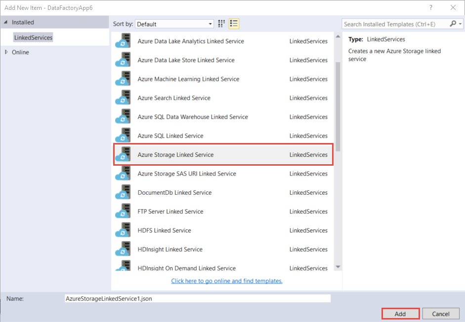
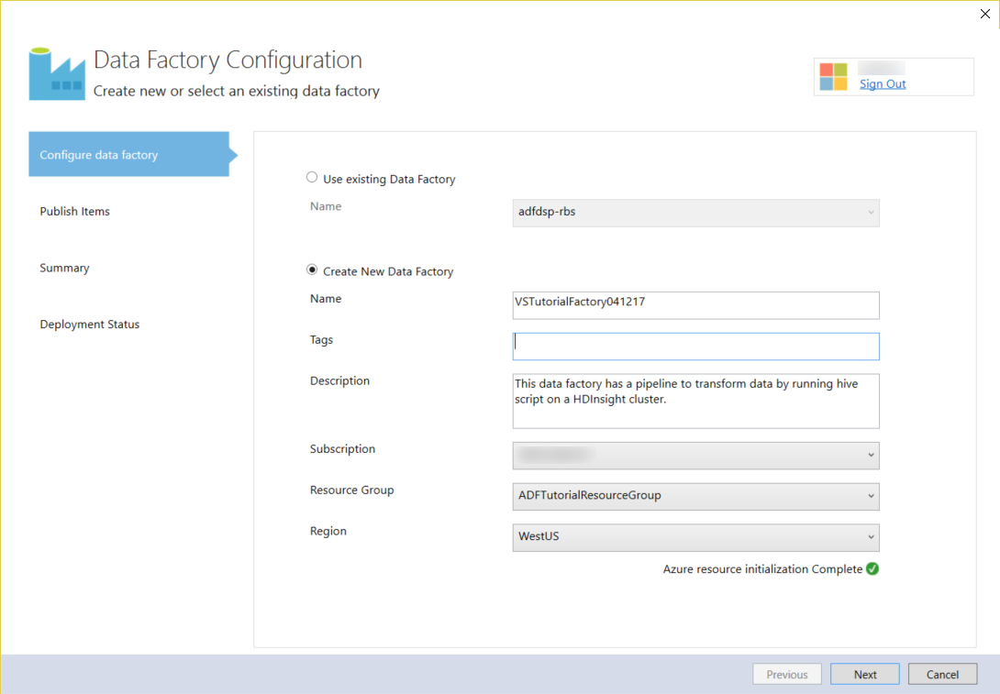
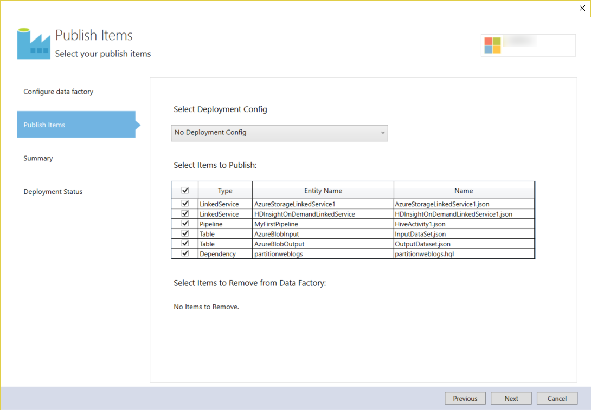
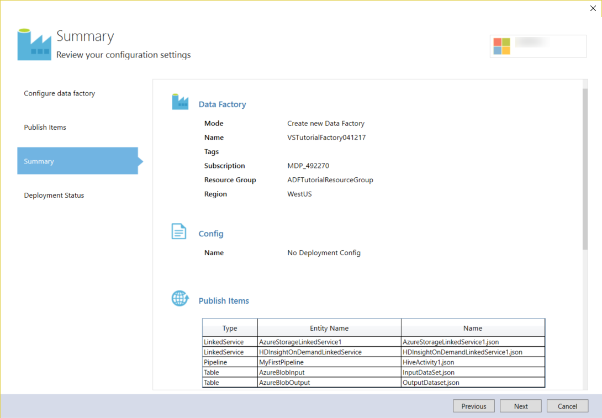
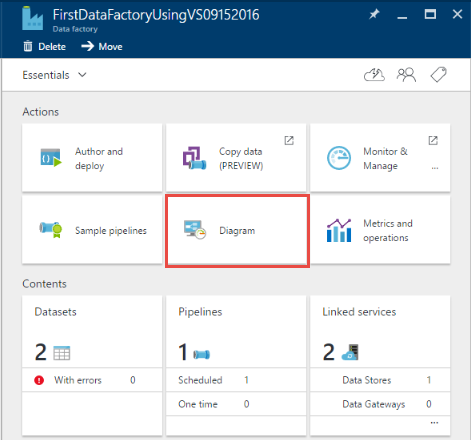
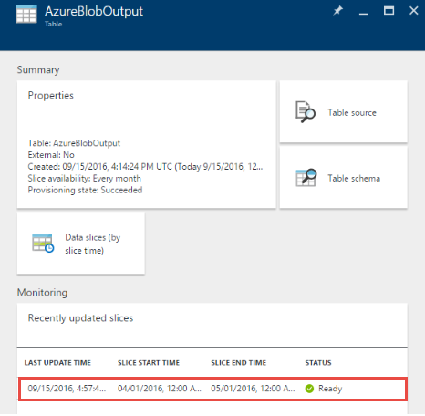

# Tutorial: Create a data factory by using Visual Studio
> [!div class="op_single_selector" title="Tools/SDKs"]
> * [Overview and prerequisites](data-factory-build-your-first-pipeline.md)
> * [Azure portal](data-factory-build-your-first-pipeline-using-editor.md)
> * [Visual Studio](data-factory-build-your-first-pipeline-using-vs.md)
> * [PowerShell](data-factory-build-your-first-pipeline-using-powershell.md)
> * [Resource Manager Template](data-factory-build-your-first-pipeline-using-arm.md)
> * [REST API](data-factory-build-your-first-pipeline-using-rest-api.md)

This tutorial shows you how to create an Azure data factory by using Visual Studio. You create a Visual Studio project using the Data Factory project template, define Data Factory entities (linked services, datasets, and pipeline) in JSON format, and then publish/deploy these entities to the cloud. 

The pipeline in this tutorial has one activity: **HDInsight Hive activity**. This activity runs a hive script on an Azure HDInsight cluster that transforms input data to produce output data. The pipeline is scheduled to run once a month between the specified start and end times. 

> [!NOTE]
> This tutorial does not show how copy data by using Azure Data Factory. For a tutorial on how to copy data using Azure Data Factory, see [Tutorial: Copy data from Blob Storage to SQL Database](data-factory-copy-data-from-azure-blob-storage-to-sql-database.md).
> 
> A pipeline can have more than one activity. And, you can chain two activities (run one activity after another) by setting the output dataset of one activity as the input dataset of the other activity. For more information, see [scheduling and execution in Data Factory](data-factory-scheduling-and-execution.md#multiple-activities-in-a-pipeline).


## Walkthrough: Create and publish Data Factory entities
Here are the steps you perform as part of this walkthrough:

1. Create two linked services: **AzureStorageLinkedService1** and **HDInsightOnDemandLinkedService1**. 
   
    In this tutorial, both input and output data for the hive activity are in the same Azure Blob Storage. You use an on-demand HDInsight cluster to process existing input data to produce output data. The on-demand HDInsight cluster is automatically created for you by Azure Data Factory at run time when the input data is ready to be processed. You need to link your data stores or computes to your data factory so that the Data Factory service can connect to them at runtime. Therefore, you link your Azure Storage Account to the data factory by using the AzureStorageLinkedService1, and link an on-demand HDInsight cluster by using the HDInsightOnDemandLinkedService1. When publishing, you specify the name for the data factory to be created or an existing data factory.  
2. Create two datasets: **InputDataset** and **OutputDataset**, which represent the input/output data that is stored in the Azure blob storage. 
   
	These dataset definitions refer to the Azure Storage linked service you created in the previous step. For the InputDataset, you specify the blob container (adfgetstarted) and the folder (inptutdata) that contains a blob with the input data. For the OutputDataset, you specify the blob container (adfgetstarted) and the folder (partitioneddata) that holds the output data. You also specify other properties such as structure, availability, and policy.
3. Create a pipeline named **MyFirstPipeline**. 
  
	In this walkthrough, the pipeline has only one activity: **HDInsight Hive Activity**. This activity transform input data to produce output data by running a hive script on an on-demand HDInsight cluster. To learn more about hive activity, see [Hive Activity](data-factory-hive-activity.md) 
4. Create a data factory named **DataFactoryUsingVS**. Deploy the data factory and all Data Factory entities (linked services, tables, and the pipeline).
5. After you publish, you use Azure portal blades and Monitoring & Management App to monitor the pipeline. 
  
### Prerequisites
1. Read through [Tutorial Overview](data-factory-build-your-first-pipeline.md) article and complete the **prerequisite** steps. You can also select the **Overview and prerequisites** option in the drop-down list at the top to switch to the article. After you complete the prerequisites, switch back to this article by selecting **Visual Studio** option in the drop-down list.
2. To create Data Factory instances, you must be a member of the [Data Factory Contributor](../../active-directory/role-based-access-built-in-roles.md#data-factory-contributor) role at the subscription/resource group level.  
3. You must have the following installed on your computer:
   * Visual Studio 2013 or Visual Studio 2015
   * Download Azure SDK for Visual Studio 2013 or Visual Studio 2015. Navigate to [Azure Download Page](https://azure.microsoft.com/downloads/) and click **VS 2013** or **VS 2015** in the **.NET** section.
   * Download the latest Azure Data Factory plugin for Visual Studio: [VS 2013](https://visualstudiogallery.msdn.microsoft.com/754d998c-8f92-4aa7-835b-e89c8c954aa5) or [VS 2015](https://visualstudiogallery.msdn.microsoft.com/371a4cf9-0093-40fa-b7dd-be3c74f49005). You can also update the plugin by doing the following steps: On the menu, click **Tools** -> **Extensions and Updates** -> **Online** -> **Visual Studio Gallery** -> **Microsoft Azure Data Factory Tools for Visual Studio** -> **Update**.

Now, let's use Visual Studio to create an Azure data factory.

### Create Visual Studio project
1. Launch **Visual Studio 2013** or **Visual Studio 2015**. Click **File**, point to **New**, and click **Project**. You should see the **New Project** dialog box.  
2. In the **New Project** dialog, select the **DataFactory** template, and click **Empty Data Factory Project**.   

    
3. Enter a **name** for the project, **location**, and a name for the **solution**, and click **OK**.

    

### Create linked services
In this step, you create two linked services: **Azure Storage** and **HDInsight on-demand**. 

The Azure Storage linked service links your Azure Storage account to the data factory by providing the connection information. Data Factory service uses the connection string from the linked service setting to connect to the Azure storage at runtime. This storage holds input and output data for the pipeline, and the hive script file used by the hive activity. 

With on-demand HDInsight linked service, The HDInsight cluster is automatically created at runtime when the input data is ready to processed. The cluster is deleted after it is done processing and idle for the specified amount of time. 

> [!NOTE]
> You create a data factory by specifying its name and settings at the time of publishing your Data Factory solution.

#### Create Azure Storage linked service
1. Right-click **Linked Services** in the solution explorer, point to **Add**, and click **New Item**.      
2. In the **Add New Item** dialog box, select **Azure Storage Linked Service** from the list, and click **Add**.
    
3. Replace `<accountname>` and `<accountkey>` with the name of your Azure storage account and its key. To learn how to get your storage access key, see the information about how to view, copy, and regenerate storage access keys in [Manage your storage account](../../storage/storage-create-storage-account.md#manage-your-storage-account).
    
4. Save the **AzureStorageLinkedService1.json** file.

#### Create Azure HDInsight linked service
1. In the **Solution Explorer**, right-click **Linked Services**, point to **Add**, and click **New Item**.
2. Select **HDInsight On Demand Linked Service**, and click **Add**.
3. Replace the **JSON** with the following JSON:

     ```json
    {
        "name": "HDInsightOnDemandLinkedService",
        "properties": {
        "type": "HDInsightOnDemand",
            "typeProperties": {
                "version": "3.5",
                "clusterSize": 1,
                "timeToLive": "00:05:00",
                "osType": "Linux",
                "linkedServiceName": "AzureStorageLinkedService1"
            }
        }
	}
	```

    The following table provides descriptions for the JSON properties used in the snippet:

	Property | Description
	-------- | ----------- 
	ClusterSize | Specifies the size of the HDInsight Hadoop cluster.
	TimeToLive | Specifies that the idle time for the HDInsight cluster, before it is deleted.
	linkedServiceName | Specifies the storage account that is used to store the logs that are generated by HDInsight Hadoop cluster. 

	> [!IMPORTANT]
	> The HDInsight cluster creates a **default container** in the blob storage you specified in the JSON (linkedServiceName). HDInsight does not delete this container when the cluster is deleted. This behavior is by design. With on-demand HDInsight linked service, a HDInsight cluster is created every time a slice is processed unless there is an existing live cluster (timeToLive). The cluster is automatically deleted when the processing is done.
	> 
	> As more slices are processed, you see many containers in your Azure blob storage. If you do not need them for troubleshooting of the jobs, you may want to delete them to reduce the storage cost. The names of these containers follow a pattern: `adf<yourdatafactoryname>-<linkedservicename>-datetimestamp`. Use tools such as [Microsoft Storage Explorer](http://storageexplorer.com/) to delete containers in your Azure blob storage.

    For more information about JSON properties, see [Compute linked services](data-factory-compute-linked-services.md#azure-hdinsight-on-demand-linked-service) article. 
4. Save the **HDInsightOnDemandLinkedService1.json** file.

### Create datasets
In this step, you create datasets to represent the input and output data for Hive processing. These datasets refer to the **AzureStorageLinkedService1** you have created earlier in this tutorial. The linked service points to an Azure Storage account and datasets specify container, folder, file name in the storage that holds input and output data.   

#### Create input dataset
1. In the **Solution Explorer**, right-click **Tables**, point to **Add**, and click **New Item**.
2. Select **Azure Blob** from the list, change the name of the file to **InputDataSet.json**, and click **Add**.
3. Replace the **JSON** in the editor with the following JSON snippet:

    ```json
    {
        "name": "AzureBlobInput",
        "properties": {
            "type": "AzureBlob",
            "linkedServiceName": "AzureStorageLinkedService1",
            "typeProperties": {
                "fileName": "input.log",
                "folderPath": "adfgetstarted/inputdata",
                "format": {
                    "type": "TextFormat",
                    "columnDelimiter": ","
                }
            },
            "availability": {
                "frequency": "Month",
                "interval": 1
            },
            "external": true,
            "policy": {}
        }
    }
    ```
    This JSON snippet defines a dataset called **AzureBlobInput** that represents input data for the hive activity in the pipeline. You specify that the input data is located in the blob container called `adfgetstarted` and the folder called `inputdata`.

    The following table provides descriptions for the JSON properties used in the snippet:

	Property | Description |
	-------- | ----------- |
	type |The type property is set to **AzureBlob** because data resides in Azure Blob Storage.
	linkedServiceName | Refers to the AzureStorageLinkedService1 you created earlier.
	fileName |This property is optional. If you omit this property, all the files from the folderPath are picked. In this case, only the input.log is processed.
	type | The log files are in text format, so we use TextFormat. |
	columnDelimiter | columns in the log files are delimited by the comma character (`,`)
	frequency/interval | frequency set to Month and interval is 1, which means that the input slices are available monthly.
	external | This property is set to true if the input data for the activity is not generated by the pipeline. This property is only specified on input datasets. For the input dataset of the first activity, always set it to true.
4. Save the **InputDataset.json** file.

#### Create output dataset
Now, you create the output dataset to represent output data stored in the Azure Blob storage.

1. In the **Solution Explorer**, right-click **tables**, point to **Add**, and click **New Item**.
2. Select **Azure Blob** from the list, change the name of the file to **OutputDataset.json**, and click **Add**.
3. Replace the **JSON** in the editor with the following JSON:
	
    ```json
    {
        "name": "AzureBlobOutput",
        "properties": {
            "type": "AzureBlob",
            "linkedServiceName": "AzureStorageLinkedService1",
            "typeProperties": {
                "folderPath": "adfgetstarted/partitioneddata",
                "format": {
                    "type": "TextFormat",
                    "columnDelimiter": ","
                }
            },
            "availability": {
                "frequency": "Month",
                "interval": 1
            }
        }
    }
	```
    The JSON snippet defines a dataset called **AzureBlobOutput** that represents output data produced by the hive activity in the pipeline. You specify that the output data is produced by the hive activity is placed in the blob container called `adfgetstarted` and the folder called `partitioneddata`. 
 	
	The **availability** section specifies that the output dataset is produced on a monthly basis. The output dataset drives the schedule of the pipeline. The pipeline runs monthly between its start and end times. 

    See **Create the input dataset** section for descriptions of these properties. You do not set the external property on an output dataset as the dataset is produced by the pipeline.
4. Save the **OutputDataset.json** file.

### Create pipeline
You have created the Azure Storage linked service, and input and output datasets so far. Now, you create a pipeline with a **HDInsightHive** activity. The **input** for the hive activity is set to **AzureBlobInput** and **output** is set to **AzureBlobOutput**. A slice of an input dataset is available monthly (frequency: Month, interval: 1), and the output slice is produced monthly too. 

1. In the **Solution Explorer**, right-click **Pipelines**, point to **Add**, and click **New Item.**
2. Select **Hive Transformation Pipeline** from the list, and click **Add**.
3. Replace the **JSON** with the following snippet:

	> [!IMPORTANT]
	> Replace `<storageaccountname>` with the name of your storage account.

	```json
    {
        "name": "MyFirstPipeline",
        "properties": {
            "description": "My first Azure Data Factory pipeline",
            "activities": [
                {
                    "type": "HDInsightHive",
                    "typeProperties": {
                        "scriptPath": "adfgetstarted/script/partitionweblogs.hql",
                        "scriptLinkedService": "AzureStorageLinkedService1",
                        "defines": {
                            "inputtable": "wasb://adfgetstarted@<storageaccountname>.blob.core.windows.net/inputdata",
                            "partitionedtable": "wasb://adfgetstarted@<storageaccountname>.blob.core.windows.net/partitioneddata"
                        }
                    },
                    "inputs": [
                        {
                            "name": "AzureBlobInput"
                        }
                    ],
                    "outputs": [
                        {
                            "name": "AzureBlobOutput"
                        }
                    ],
                    "policy": {
                        "concurrency": 1,
                        "retry": 3
                    },
                    "scheduler": {
                        "frequency": "Month",
                        "interval": 1
                    },
                    "name": "RunSampleHiveActivity",
                    "linkedServiceName": "HDInsightOnDemandLinkedService"
                }
            ],
            "start": "2016-04-01T00:00:00Z",
            "end": "2016-04-02T00:00:00Z",
            "isPaused": false
        }
    }
	```

	> [!IMPORTANT]
	> Replace `<storageaccountname>` with the name of your storage account.

    The JSON snippet defines a pipeline that consists of a single activity (Hive Activity). This activity runs a Hive script to process input data on an on-demand HDInsight cluster to produce output data. In the activities section of the pipeline JSON, you see only one activity in the array with type set to **HDInsightHive**. 

    In the type properties that are specific to HDInsight Hive activity, you specify what Azure Storage linked service has the hive script file, the path to the script file, and parameters to the script file. 

    The Hive script file, **partitionweblogs.hql**, is stored in the Azure storage account (specified by the scriptLinkedService), and in the `script` folder in the container `adfgetstarted`.

    The `defines` section is used to specify the runtime settings that are passed to the hive script as Hive configuration values (e.g `${hiveconf:inputtable}`, `${hiveconf:partitionedtable})`.

    The **start** and **end** properties of the pipeline specifies the active period of the pipeline. You configured the dataset to be produced monthly, therefore, only once slice is produced by the pipeline (because the month is same in start and end dates).

    In the activity JSON, you specify that the Hive script runs on the compute specified by the **linkedServiceName** – **HDInsightOnDemandLinkedService**.
4. Save the **HiveActivity1.json** file.

### Add partitionweblogs.hql and input.log as a dependency
1. Right-click **Dependencies** in the **Solution Explorer** window, point to **Add**, and click **Existing Item**.  
2. Navigate to the **C:\ADFGettingStarted** and select **partitionweblogs.hql**, **input.log** files, and click **Add**. You created these two files as part of prerequisites from the [Tutorial Overview](data-factory-build-your-first-pipeline.md).

When you publish the solution in the next step, the **partitionweblogs.hql** file is uploaded to the **script** folder in the `adfgetstarted` blob container.   

### Publish/deploy Data Factory entities
In this step, you publish the Data Factory entities (linked services, datasets, and pipeline) in your project to the Azure Data Factory service. In the process of publishing, you specify the name for your data factory. 

1. Right-click project in the Solution Explorer, and click **Publish**.
2. If you see **Sign in to your Microsoft account** dialog box, enter your credentials for the account that has Azure subscription, and click **sign in**.
3. You should see the following dialog box:

   
4. In the **Configure data factory** page, do the following steps:

	

   1. select **Create New Data Factory** option.
   2. Enter a unique **name** for the data factory. For example: **DataFactoryUsingVS09152016**. The name must be globally unique.
   3. Select the right subscription for the **Subscription** field. 
		> [!IMPORTANT]
		> If you do not see any subscription, ensure that you logged in using an account that is an admin or co-admin of the subscription.
   4. Select the **resource group** for the data factory to be created.
   5. Select the **region** for the data factory.
   6. Click **Next** to switch to the **Publish Items** page. (Press **TAB** to move out of the Name field to if the **Next** button is disabled.)

	> [!IMPORTANT]
	> If you receive the error **Data factory name “DataFactoryUsingVS” is not available** when publishing, change the name (for example, yournameDataFactoryUsingVS). See [Data Factory - Naming Rules](data-factory-naming-rules.md) topic for naming rules for Data Factory artifacts.   
1. In the **Publish Items** page, ensure that all the Data Factories entities are selected, and click **Next** to switch to the **Summary** page.

	     
2. Review the summary and click **Next** to start the deployment process and view the **Deployment Status**.

	
3. In the **Deployment Status** page, you should see the status of the deployment process. Click Finish after the deployment is done.

Important points to note:

- If you receive the error: **This subscription is not registered to use namespace Microsoft.DataFactory**, do one of the following and try publishing again:
	- In Azure PowerShell, run the following command to register the Data Factory provider.
		```PowerShell	
		Register-AzureRmResourceProvider -ProviderNamespace Microsoft.DataFactory
		```
		You can run the following command to confirm that the Data Factory provider is registered.

		```PowerShell
		Get-AzureRmResourceProvider
		```
	- Login using the Azure subscription in to the [Azure portal](https://portal.azure.com) and navigate to a Data Factory blade (or) create a data factory in the Azure portal. This action automatically registers the provider for you.
- The name of the data factory may be registered as a DNS name in the future and hence become publically visible.
- To create Data Factory instances, you need to be an admin or co-admin of the Azure subscription

### Monitor pipeline
In this step, you monitor the pipeline using Diagram View of the data factory. 

#### Monitor pipeline using Diagram View
1. Log in to the [Azure portal](https://portal.azure.com/), do the following steps:
   1. Click **More services** and click **Data factories**.
       
		
   2. Select the name of your data factory (for example: **DataFactoryUsingVS09152016**) from the list of data factories.
   
       
2. In the home page for your data factory, click **Diagram**.

    
3. In the Diagram View, you see an overview of the pipelines, and datasets used in this tutorial.

    
4. To view all activities in the pipeline, right-click pipeline in the diagram and click Open Pipeline.

    
5. Confirm that you see the HDInsightHive activity in the pipeline.

    

    To navigate back to the previous view, click **Data factory** in the breadcrumb menu at the top.
6. In the **Diagram View**, double-click the dataset **AzureBlobInput**. Confirm that the slice is in **Ready** state. It may take a couple of minutes for the slice to show up in Ready state. If it does not happen after you wait for sometime, see if you have the input file (input.log) placed in the right container (`adfgetstarted`) and folder (`inputdata`). And, make sure that the **external** property on the input dataset is set to **true**. 

   
7. Click **X** to close **AzureBlobInput** blade.
8. In the **Diagram View**, double-click the dataset **AzureBlobOutput**. You see that the slice that is currently being processed.

   
9. When processing is done, you see the slice in **Ready** state.

   > [!IMPORTANT]
   > Creation of an on-demand HDInsight cluster usually takes sometime (approximately 20 minutes). Therefore, expect the pipeline to take **approximately 30 minutes** to process the slice.  
   
        
10. When the slice is in **Ready** state, check the `partitioneddata` folder in the `adfgetstarted` container in your blob storage for the output data.  

    
11. Click the slice to see details about it in a **Data slice** blade.

      
12. Click an activity run in the **Activity runs list** to see details about an activity run (Hive activity in our scenario) in an **Activity run details** window. 
  
        

    From the log files, you can see the Hive query that was executed and status information. These logs are useful for troubleshooting any issues.  

See [Monitor datasets and pipeline](data-factory-monitor-manage-pipelines.md) for instructions on how to use the Azure portal to monitor the pipeline and datasets you have created in this tutorial.

#### Monitor pipeline using Monitor & Manage App
You can also use Monitor & Manage application to monitor your pipelines. For detailed information about using this application, see [Monitor and manage Azure Data Factory pipelines using Monitoring and Management App](data-factory-monitor-manage-app.md).

1. Click Monitor & Manage tile.

    
2. You should see Monitor & Manage application. Change the **Start time** and **End time** to match start (04-01-2016 12:00 AM) and end times (04-02-2016 12:00 AM) of your pipeline, and click **Apply**.

    
3. To see details about an activity window, select it in the **Activity Windows list** to see details about it.
    

> [!IMPORTANT]
> The input file gets deleted when the slice is processed successfully. Therefore, if you want to rerun the slice or do the tutorial again, upload the input file (input.log) to the `inputdata` folder of the `adfgetstarted` container.

### Additional notes
- A data factory can have one or more pipelines. A pipeline can have one or more activities in it. For example, a Copy Activity to copy data from a source to a destination data store and a HDInsight Hive activity to run a Hive script to transform input data. See [supported data stores](data-factory-data-movement-activities.md#supported-data-stores-and-formats) for all the sources and sinks supported by the Copy Activity. See [compute linked services](data-factory-compute-linked-services.md) for the list of compute services supported by Data Factory.
- Linked services link data stores or compute services to an Azure data factory. See [supported data stores](data-factory-data-movement-activities.md#supported-data-stores-and-formats) for all the sources and sinks supported by the Copy Activity. See [compute linked services](data-factory-compute-linked-services.md) for the list of compute services supported by Data Factory and [transformation activities](data-factory-data-transformation-activities.md) that can run on them.
- See [Move data from/to Azure Blob](data-factory-azure-blob-connector.md#azure-storage-linked-service) for details about JSON properties used in the Azure Storage linked service definition.
- You could use your own HDInsight cluster instead of using an on-demand HDInsight cluster. See [Compute Linked Services](data-factory-compute-linked-services.md) for details.
-  The Data Factory creates a **Linux-based** HDInsight cluster for you with the preceding JSON. See [On-demand HDInsight Linked Service](data-factory-compute-linked-services.md#azure-hdinsight-on-demand-linked-service) for details.
- The HDInsight cluster creates a **default container** in the blob storage you specified in the JSON (linkedServiceName). HDInsight does not delete this container when the cluster is deleted. This behavior is by design. With on-demand HDInsight linked service, a HDInsight cluster is created every time a slice is processed unless there is an existing live cluster (timeToLive). The cluster is automatically deleted when the processing is done.
    
	As more slices are processed, you see many containers in your Azure blob storage. If you do not need them for troubleshooting of the jobs, you may want to delete them to reduce the storage cost. The names of these containers follow a pattern: `adf**yourdatafactoryname**-**linkedservicename**-datetimestamp`. Use tools such as [Microsoft Storage Explorer](http://storageexplorer.com/) to delete containers in your Azure blob storage.
- Currently, output dataset is what drives the schedule, so you must create an output dataset even if the activity does not produce any output. If the activity doesn't take any input, you can skip creating the input dataset. 
- This tutorial does not show how copy data by using Azure Data Factory. For a tutorial on how to copy data using Azure Data Factory, see [Tutorial: Copy data from Blob Storage to SQL Database](data-factory-copy-data-from-azure-blob-storage-to-sql-database.md).


## Use Server Explorer to view data factories
1. In **Visual Studio**, click **View** on the menu, and click **Server Explorer**.
2. In the Server Explorer window, expand **Azure** and expand **Data Factory**. If you see **Sign in to Visual Studio**, enter the **account** associated with your Azure subscription and click **Continue**. Enter **password**, and click **Sign in**. Visual Studio tries to get information about all Azure data factories in your subscription. You see the status of this operation in the **Data Factory Task List** window.

    
3. You can right-click a data factory, and select **Export Data Factory to New Project** to create a Visual Studio project based on an existing data factory.

    

## Update Data Factory tools for Visual Studio
To update Azure Data Factory tools for Visual Studio, do the following steps:

1. Click **Tools** on the menu and select **Extensions and Updates**.
2. Select **Updates** in the left pane and then select **Visual Studio Gallery**.
3. Select **Azure Data Factory tools for Visual Studio** and click **Update**. If you do not see this entry, you already have the latest version of the tools.

## Use configuration files
You can use configuration files in Visual Studio to configure properties for linked services/tables/pipelines differently for each environment.

Consider the following JSON definition for an Azure Storage linked service. To specify **connectionString** with different values for accountname and accountkey based on the environment (Dev/Test/Production) to which you are deploying Data Factory entities. You can achieve this behavior by using separate configuration file for each environment.

```json
{
    "name": "StorageLinkedService",
    "properties": {
        "type": "AzureStorage",
        "description": "",
        "typeProperties": {
            "connectionString": "DefaultEndpointsProtocol=https;AccountName=<accountname>;AccountKey=<accountkey>"
        }
    }
}
```

### Add a configuration file
Add a configuration file for each environment by performing the following steps:   

1. Right-click the Data Factory project in your Visual Studio solution, point to **Add**, and click **New item**.
2. Select **Config** from the list of installed templates on the left, select **Configuration File**, enter a **name** for the configuration file, and click **Add**.

    
3. Add configuration parameters and their values in the following format:

	```json
	{
	    "$schema": "http://datafactories.schema.management.azure.com/vsschemas/V1/Microsoft.DataFactory.Config.json",
	    "AzureStorageLinkedService1": [
	        {
	            "name": "$.properties.typeProperties.connectionString",
	            "value": "DefaultEndpointsProtocol=https;AccountName=<accountname>;AccountKey=<accountkey>"
	        }
	    ],
	    "AzureSqlLinkedService1": [
	        {
	            "name": "$.properties.typeProperties.connectionString",
	            "value":  "Server=tcp:spsqlserver.database.windows.net,1433;Database=spsqldb;User ID=spelluru;Password=Sowmya123;Trusted_Connection=False;Encrypt=True;Connection Timeout=30"
	        }
	    ]
	}
	```

    This example configures connectionString property of an Azure Storage linked service and an Azure SQL linked service. Notice that the syntax for specifying name is [JsonPath](http://goessner.net/articles/JsonPath/).   

    If JSON has a property that has an array of values as shown in the following code:  

	```json
    "structure": [
          {
              "name": "FirstName",
            "type": "String"
          },
          {
            "name": "LastName",
            "type": "String"
        }
    ],
	```

    Configure properties as shown in the following configuration file (use zero-based indexing):

	```json
    {
        "name": "$.properties.structure[0].name",
        "value": "FirstName"
    }
    {
        "name": "$.properties.structure[0].type",
        "value": "String"
    }
    {
        "name": "$.properties.structure[1].name",
        "value": "LastName"
    }
    {
        "name": "$.properties.structure[1].type",
        "value": "String"
    }
	```

### Property names with spaces
If a property name has spaces in it, use square brackets as shown in the following example (Database server name):

```json
 {
     "name": "$.properties.activities[1].typeProperties.webServiceParameters.['Database server name']",
     "value": "MyAsqlServer.database.windows.net"
 }
```

### Deploy solution using a configuration
When you are publishing Azure Data Factory entities in VS, you can specify the configuration that you want to use for that publishing operation.

To publish entities in an Azure Data Factory project using configuration file:   

1. Right-click Data Factory project and click **Publish** to see the **Publish Items** dialog box.
2. Select an existing data factory or specify values for creating a data factory on the **Configure data factory** page, and click **Next**.   
3. On the **Publish Items** page: you see a drop-down list with available configurations for the **Select Deployment Config** field.

    
4. Select the **configuration file** that you would like to use and click **Next**.
5. Confirm that you see the name of JSON file in the **Summary** page and click **Next**.
6. Click **Finish** after the deployment operation is finished.

When you deploy, the values from the configuration file are used to set values for properties in the JSON files before the entities are deployed to Azure Data Factory service.   

## Use Azure Key Vault
It is not advisable and often against security policy to commit sensitive data such as connection strings to the code repository. See [ADF Secure Publish](https://github.com/Azure/Azure-DataFactory/tree/master/Samples/ADFSecurePublish) sample on GitHub to learn about storing sensitive information in Azure Key Vault and using it while publishing Data Factory entities. The Secure Publish extension for Visual Studio allows the secrets to be stored in Key Vault and only references to them are specified in linked services/ deployment configurations. These references are resolved when you publish Data Factory entities to Azure. These files can then be committed to source repository without exposing any secrets.

## Summary
In this tutorial, you created an Azure data factory to process data by running Hive script on a HDInsight hadoop cluster. You used the Data Factory Editor in the Azure portal to do the following steps:  

1. Created an Azure **data factory**.
2. Created two **linked services**:
   1. **Azure Storage** linked service to link your Azure blob storage that holds input/output files to the data factory.
   2. **Azure HDInsight** on-demand linked service to link an on-demand HDInsight Hadoop cluster to the data factory. Azure Data Factory creates a HDInsight Hadoop cluster just-in-time to process input data and produce output data.
3. Created two **datasets**, which describe input and output data for HDInsight Hive activity in the pipeline.
4. Created a **pipeline** with a **HDInsight Hive** activity.  

## Next Steps
In this article, you have created a pipeline with a transformation activity (HDInsight Activity) that runs a Hive script on an on-demand HDInsight cluster. To see how to use a Copy Activity to copy data from an Azure Blob to Azure SQL, see [Tutorial: Copy data from an Azure blob to Azure SQL](data-factory-copy-data-from-azure-blob-storage-to-sql-database.md).

You can chain two activities (run one activity after another) by setting the output dataset of one activity as the input dataset of the other activity. See [Scheduling and execution in Data Factory](data-factory-scheduling-and-execution.md) for detailed information. 


## See Also
| Topic | Description |
|:--- |:--- |
| [Pipelines](data-factory-create-pipelines.md) |This article helps you understand pipelines and activities in Azure Data Factory and how to use them to construct data-driven workflows for your scenario or business. |
| [Datasets](data-factory-create-datasets.md) |This article helps you understand datasets in Azure Data Factory. |
| [Data Transformation Activities](data-factory-data-transformation-activities.md) |This article provides a list of data transformation activities (such as HDInsight Hive transformation you used in this tutorial) supported by Azure Data Factory. |
| [Scheduling and execution](data-factory-scheduling-and-execution.md) |This article explains the scheduling and execution aspects of Azure Data Factory application model. |
| [Monitor and manage pipelines using Monitoring App](data-factory-monitor-manage-app.md) |This article describes how to monitor, manage, and debug pipelines using the Monitoring & Management App. |
