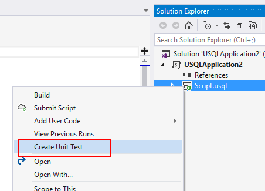
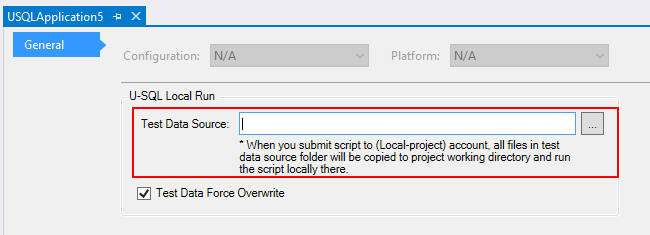

# Test your Azure Data Lake Analytics code

Azure Data Lake provides the U-SQL language, which combines declarative SQL with imperative C# to process data at any scale. In this document, you learn how to create test cases for U-SQL and extended C# UDO (user-defined operator) code.

## Test U-SQL scripts

The U-SQL script is compiled and optimized for executable code to run across machines on the cloud or on your local machine. The compilation and optimization process treats the entire U-SQL script as a whole. You can't do a traditional "unit test" for every statement. However, by using the U-SQL test SDK and the local run SDK, you can do script-level tests.

### Create test cases for U-SQL script

Azure Data Lake Tools for Visual Studio enables you to create U-SQL script test cases.

1.	Right-click a U-SQL script in Solution Explorer, and then select **Create Unit Test**.
2.	Create a new test project or insert the test case into an existing test project.

     

     

### Manage the test data source

When you test U-SQL scripts, you need test input files. You can manage the test data by configuring **Test Data Source** in the U-SQL project properties. 

When you call the `Initialize()` interface in the U-SQL test SDK, a temporary local data root folder is created under the working directory of the test project. 

Copy all files and subfolders (and files under subfolders) in the test data source folder into the temporary local data root folder before you run the U-SQL script test cases. You can add more test data source folders by splitting the test data folder path with a semicolon.



### Manage the database environment for testing

If your U-SQL scripts use or query with U-SQL database objects (for example, when calling stored procedures) then you need to initialize the database environment before running U-SQL test cases. The `Initialize()` interface in the U-SQL test SDK helps you deploy all databases that are referenced by the U-SQL project to the temporary local data root folder in the working directory of the test project. 

Learn more about [how to manage U-SQL database project references for a U-SQL project](data-lake-analytics-data-lake-tools-develop-usql-database.md#reference-a-u-sql-database-project).

### Verify test results

The `Run()` interface returns a job execution result. 0 means success, and 1 means failure. You can also use C# assert functions to verify the outputs. 

### Run test cases in Visual Studio

A U-SQL script test project is built on top of a C# unit test framework. After you build the project, you can run all test cases through **Test Explorer > Playlist**. Alternatively, right-click the .cs file, and then select **Run Tests**.

## Test C# UDOs

### Create test cases for C# UDOs

You can use a C# unit test framework to test your C# UDOs (user-defined operators). When testing UDOs, you need to prepare corresponding **IRowset** object as inputs.

There are two ways to create IRowset:

- Load data from a file to create IRowset:

    ```csharp
    //Schema: "a:int, b:int"
    USqlColumn<int> col1 = new USqlColumn<int>("a");
    USqlColumn<int> col2 = new USqlColumn<int>("b");
    List<IColumn> columns = new List<IColumn> { col1, col2 };
    USqlSchema schema = new USqlSchema(columns);

    //Generate one row with default values
    IUpdatableRow output = new USqlRow(schema, null).AsUpdatable();

    //Get data from file
    IRowset rowset = UnitTestHelper.GetRowsetFromFile(@"processor.txt", schema, output.AsReadOnly(), discardAdditionalColumns: true, rowDelimiter: null, columnSeparator: '\t');
    ```

- Use data from data collection to create IRowset:

    ```csharp
    //Schema: "a:int, b:int"
    USqlSchema schema = new USqlSchema(
        new USqlColumn<int>("a"),
        new USqlColumn<int>("b")
    );

    IUpdatableRow output = new USqlRow(schema, null).AsUpdatable();

    //Generate Rowset with specified values
    List<object[]> values = new List<object[]>{
        new object[2] { 2, 3 },
        new object[2] { 10, 20 }
    };

    IEnumerable<IRow> rows = UnitTestHelper.CreateRowsFromValues(schema, values);
    IRowset rowset = UnitTestHelper.GetRowsetFromCollection(rows, output.AsReadOnly());
    ```

### Verify test results

After you call UDO functions, you can verify the results through the schema and Rowset value verification by using C# assert functions. You can use sample code in a U-SQL C# UDO unit test sample project through **File > New > Project** in Visual Studio.

### Run test cases in Visual Studio

After you build the test project, you can run all test cases though **Test Explorer > Playlist**, or right-click the .cs file and choose **Run Tests**.

## Run test cases in Visual Studio Team Services

Both **U-SQL script test projects** and **C# UDO test projects** inherit C# unit test projects. The [Visual Studio test task](https://docs.microsoft.com/vsts/pipelines/test/getting-started-with-continuous-testing?view=vsts) in Visual Studio Team Services can run these test cases. 

### Run U-SQL test cases in Visual Studio Team Services

For a U-SQL test, make sure you load `CPPSDK` on your build machine, and then pass the `CPPSDK` path to USqlScriptTestRunner(cppSdkFolderFullPath: @"").

**What is CPPSDK?**

CPPSDK is a package that includes Microsoft Visual C++ 14 and Windows SDK 10.0.10240.0. This is the environment that's needed by the U-SQL runtime. You can get this package under the Azure Data Lake Tools for Visual Studio installation folder:

- For Visual Studio 2015, it is under `C:\Program Files (x86)\Microsoft Visual Studio 14.0\Common7\IDE\Extensions\Microsoft\Microsoft Azure Data Lake Tools for Visual Studio 2015\X.X.XXXX.X\CppSDK`
- For Visual Studio 2017, it is under `C:\Program Files (x86)\Microsoft Visual Studio\2017\Enterprise\SDK\ScopeCppSDK`

**Prepare CPPSDK in the Visual Studio Team Services build agent**

The most common way to prepare the CPPSDK dependency in Visual Studio Team Service is as follows:

1.	Zip the folder  that includes the CPPSDK libraries.
2.	Check in the .zip file to your source control system.   
3.	Unzip the .zip file in the build pipeline.
4.	Point `USqlScriptTestRunner` to this unzipped folder on the build machine.

### Run C# UDO test cases in Visual Studio Team Services

For a C# UDO test, make sure to reference the following assemblies, which  are needed for UDOs. If you reference them through [the Nuget package Microsoft.Azure.DataLake.USQL.Interfaces](https://www.nuget.org/packages/Microsoft.Azure.DataLake.USQL.Interfaces/), make sure you add a NuGet Restore task in your build pipeline.

* Microsoft.Analytics.Interfaces
* Microsoft.Analytics.Types
* Microsoft.Analytics.UnitTest

## Next steps

- [How to set up CI/CD pipeline for Azure Data Lake Analytics](data-lake-analytics-cicd-overview.md)
- [Run U-SQL script on your local machine](data-lake-analytics-data-lake-tools-local-run.md)
- [Use U-SQL database project to develop U-SQL database](data-lake-analytics-data-lake-tools-develop-usql-database.md)

