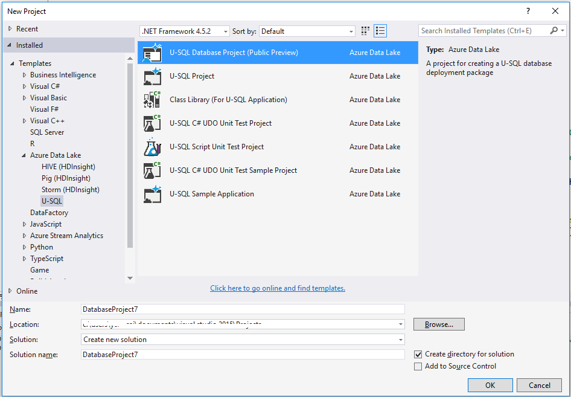
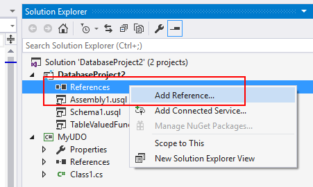
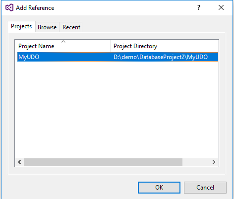
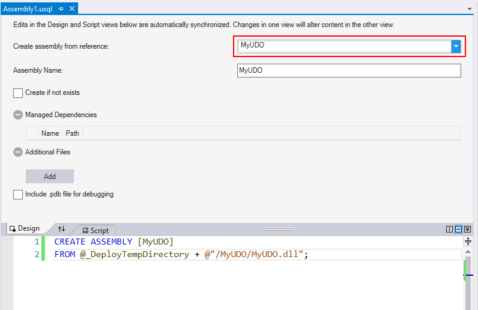
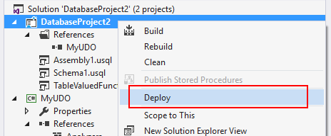
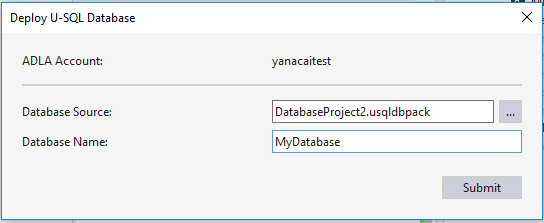
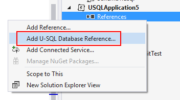
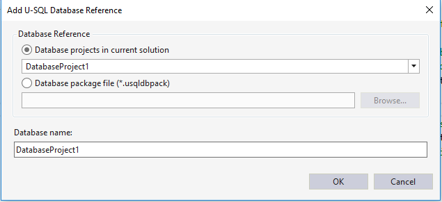

# Use U-SQL database project to develop U-SQL database for Azure Data Lake

U-SQL database provides structured views over the unstructured data, manage structured data in tables, and provides a general metadata catalog system to organize your structured data and custom code. The database is the concept that groups these related objects together.

Learn more about [U-SQL database and Data Definition Language (DDL)](https://msdn.microsoft.com/azure/data-lake-analytics/u-sql/data-definition-language-ddl-statements-u-sql). 

U-SQL database project is a project type in Visual Studio that helps developers develop, manage, and deploy their U-SQL databases fast and easily.

## Create a U-SQL database project

Azure Data Lake Tools for Visual Studio added a new project template called U-SQL database project after version 2.3.3000.0. To create a U-SQL project, go through **File > New > Project**, the U-SQL Database Project can be found under **Azure Data Lake > U-SQL node**.

 

## Develop U-SQL database objects using database project

Right-click the U-SQL database project, click **Add > New item**, all supported object types can be found in the Add New Item Wizard. 

1.	For non-assembly object, for example, table-valued function, a new U-SQL script is created after adding new item. You can start to develop the DDL statement for that object in the editor.
2.	For assembly object, the tool provides a user-friendly UI editor that helps you register the assembly and deploy .dll and additional files. Follow below steps to add an assembly object definition to the U-SQL database project:

1.	Add references of the C# project that includes the UDO/UDAG/UDF to the U-SQL database project.

     

    

2.	In assembly design view, choose the referenced assembly from **Create assembly from reference** drop-down.

    

3.	Add **Managed Dependencies** and **Additional Files** if any. When adding additional files, the tool will use the relative path to make sure it can find the assemblies both on your local machine and the build machine later. @_DeployTempDirectory is a pre-defined variable that points the tool to the build output folder. Under build output, every assembly has a subfolder named as the assembly name, all dlls, and additional files can be found there in the subfolder. 
 
## Build U-SQL database project

The build output for U-SQL database project is an U-SQL database deployment package, named with suffix `.usqldbpack`. The `.usqldbpack` package is a zip file includes all DDL statements in a single U-SQL script in **DDL** folder, and all dlls and additional files for assemblies in **Temp** folder.

Learn more about [how to build U-SQL database project with MSBuild command line and Visual Studio Team Service build task](data-lake-analytics-cicd-overview.md#build-u-sql-database-project).

## Deploy U-SQL database

The .usqldbpack package can be deployed to both local account or Azure Data Lake Analytics account using Visual Studio or the deployment SDK. 

### Deploy U-SQL database in Visual Studio

You can deploy a U-SQL database through a U-SQL database project or a .usqldbpack package in Visual Studio.

#### Deploy through U-SQL database project

1.	Right-click the U-SQL database project and choose **Deploy**.
2.	In the Deploy U-SQL Database wizard, select the **ADLA account** you would like to deploy the database to. Both (Local) account and ADLA account are supported.
3.	**Database Source** are filled in automatically pointing to the .usqldbpack package in project's build output folder
4.	Enter **Database Name** for creating a database. If there is a database with same existing in the target Azure Data Lake Analytics account, all objects defined in database project are created without recreating the database.
5.	Click **Submit** to deploy the U-SQL database. All resources (assemblies and additional files) are uploaded and a U-SQL job includes all DDL statements are submitted.

    

    

#### Deploy through U-SQL database deployment package

1.	Open **Server Explorer**, expand the **Azure Data Lake Analytics account** you would like to deploy the database to.
2.	Right click U-SQL Databases and choose **Deploy Database**.
3.	Set **Database Source** to the U-SQL database deployment package (.usqldbpack file) path.
4.	Enter the **Database Name** for creating a database. If there is a database with same existing in the target Azure Data Lake Analytics account, all objects that are defined in database project are created without recreating the database.

    

    
  
### Deploy U-SQL database using SDK

`PackageDeploymentTool.exe` provides the programming and command-line interfaces that help to deploy U-SQL databases. The SDK is included in the [U-SQL SDK Nuget package](https://www.nuget.org/packages/Microsoft.Azure.DataLake.USQL.SDK/), locating at `build/runtime/PackageDeploymentTool.exe`.

[Learn more about the SDK and how to set up CI/CD pipeline for U-SQL database deployment](data-lake-analytics-cicd-overview.md#deploy-u-sql-database-through-visual-studio-team-service).

## Reference a U-SQL database project

A U-SQL project can reference a U-SQL database project. The reference impacts two workload:

- Project build: The referenced database environments are set up before building the U-SQL scripts. 
- Local run against (Local-project) account: The referenced database environments are deployed to (Local-project) account before U-SQL script execution. [Learn more about local run and the difference between (Local-machine) and (Local-project) account here](data-lake-analytics-data-lake-tools-local-run.md).

### How to add U-SQL database reference

1. Right-click the U-SQL project in **Solution Explorer**, and choose **Add U-SQL Database Reference...**.

    

2. Configure database reference from a U-SQL database project in current solution or a U-SQL database package file.
3. Provide the name for the database.

    

## Next Steps

- [How to set up CI/CD pipeline for Azure Data Lake Analytics](data-lake-analytics-cicd-overview.md)
- [How to test your Azure Data Lake Analytics code](data-lake-analytics-cicd-test.md)
- [Run U-SQL script on your local machine](data-lake-analytics-data-lake-tools-local-run.md)
