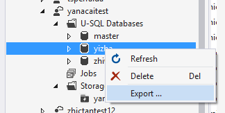
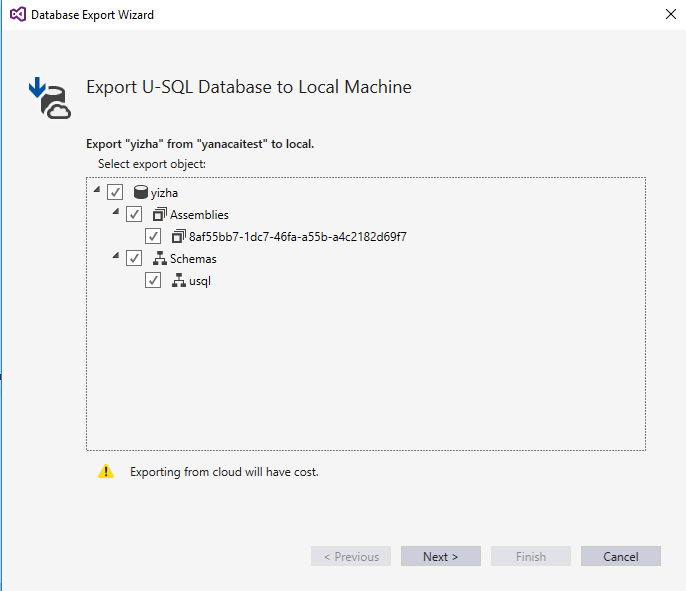
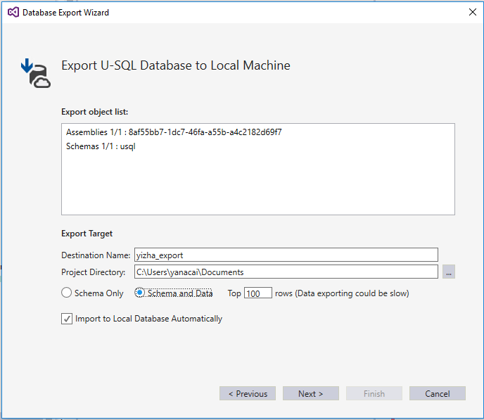
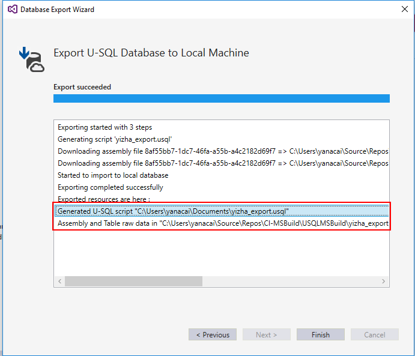

# How to export U-SQL database

In this document, you will learn how to use [Azure Data Lake Tools for Visual Studio](http://aka.ms/adltoolsvs) to export U-SQL database as a single U-SQL script and downloaded resources. Importing the exported database to local account is also supported in the same process.

Customers usually maintain multiple environments for development, test and production. These environments are hosted on both local account on developers' local machine and Azure Data Lake Analytics account on Azure. When developing and tuning U-SQL queries on development and test environments, it is common that developers need to recreate everything in production database. **Database Export Wizard** helps accelerate this process. By using the wizard, developers can clone the existing database environment and sample data to other Azure Data Lake Analytics accounts.

## Export steps

### Step 1: Right-click the database in Server Explorer and click "Export..."

All Azure Data Lake Analytics accounts you have permission to are listed in Server Explorer. Expand the one contains the database you want to export, and right-click the database to choose **Export...**. If you don't find the context menu, you need to [update the tool to the lasted release](http://aka.ms/adltoolsvs).

### Step 2: Configure the objects you want to export

Sometimes a database is large but you just need a small part of it, then you can configure the subset of objects you want to export in the export wizard. Note that the export action is completed by running a U-SQL job, and therefore exporting from Azure account incurs some cost.

### Step 3: Check the objects list and more configurations

In this step, you can double check the selected objects at the top of the dialog. If there are some errors, you can click Previous to go back and configure the objects you want to export again.

You can also do other configurations about export target, the descriptions of these configurations are listed in below table:

|Configuration|Description|
|-------------|-----------|
|Destination Name|This name indicates where you want to save the exported database resources, like assemblies, additional files and sample data. A folder with this name will be created under your local data root folder.|
|Project Directory|This path defines where you want to save the exported U-SQL script, which includes all database object definitions.|
|Schema Only|Selecting this option results in only database definitions and resources (like assemblies and additional files) being exported.|
|Schema and Data|Selecting this option results in database definitions, resources, and data to be exported. The top N rows of tables are exported.|
|Import to Local Database Automatically|Checking this configuration means the exported database will be imported to your local database automatically after exporting is completed.|

### Step 4: Check the export results

After all these settings and export progress, you can find the exported results from the log window in the wizard. Through the log marked by red rectangle in blow screenshot, you can find the location of the exported U-SQL script and database resources including assemblies, additional files and sample data.

## How to import the exported database to local account

The most convenient way to do this importing is checking **Import to Local Database Automatically** during the exporting progress in Step 3. If you forgot to do so, you can find the exported U-SQL script through the exporting log and run the U-SQL script locally to import the database to your local account.

## How to import the exported database to Azure Data Lake Analytics account

To import the database to other Azure Data Lake Analytics account, you need two steps:

1. Upload the exported resources including assemblies, additional files and sample data to the default Azure Data Lake Store account of the Azure Data Lake Analytics account you want to import to. You can find the exported resource folder under the local data root folder, and upload the entire folder to the root of the default store account.
2. Submit the exported U-SQL script to the Azure Data Lake Analytics account you want to import database to after uploading completed.

## Known limitation

Currently, if you selected **Schema and Data** in the wizard, the tool runs a U-SQL job to export the data stored in tables. That's why the data exporting process could be slow and incur cost. 

## Next steps

* [Understand U-SQL database](https://msdn.microsoft.com/en-us/library/azure/mt621299.aspx) 
* [how to test and debug U-SQL jobs by using local run and the Azure Data Lake U-SQL SDK](data-lake-analytics-data-lake-tools-local-run.md)

