# Use Azure Data Lake Tools for Visual Studio Code

In this article, learn how you can use Azure Data Lake Tools for Visual Studio Code (VS Code) to create, test, and run U-SQL scripts. The information is also covered in the following video:

## Prerequisites

Azure Data Lake Tools for VS Code supports Windows, Linux, and MacOS.  

- [Visual Studio Code](https://www.visualstudio.com/products/code-vs.aspx)

For MacOS and Linux:
- [.NET Core SDK 2.0](https://www.microsoft.com/net/download/core)
- [Mono 5.2.x](http://www.mono-project.com/download/)

## Install Azure Data Lake Tools

After you install the prerequisites, you can install Azure Data Lake Tools for VS Code.

**To install Azure Data Lake Tools**

1. Open Visual Studio Code.
2. Select **Extensions** in the left pane. Enter **Azure Data Lake Tools** in the search box.
3. Select **Install** next to **Azure Data Lake Tools**. 

   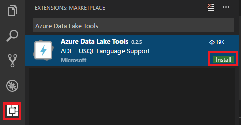

   After a few seconds, the **Install** button changes to **Reload**.
4. Select **Reload** to activate the **Azure Data Lake Tools** extension.
5. Select **Reload Window** to confirm. You can see **Azure Data Lake Tools** in the **Extensions** pane.

 
## Activate Azure Data Lake Tools
Create a new .usql file or open an existing .usql file to activate the extension. 

## Work with U-SQL

To work with U-SQL, you need open either a U-SQL file or a folder.

**To open the sample script**

Open the command palette (Ctrl+Shift+P) and enter **ADL: Open Sample Script**. It opens another instance of this sample. You can also edit, configure, and submit a script on this instance.

**To open a folder for your U-SQL project**

1. From Visual Studio Code, select the **File** menu, and then select **Open Folder**.
2. Specify a folder, and then select **Select Folder**.
3. Select the **File** menu, and then select **New**. An Untitled-1 file is added to the project.
4. Enter the following code in the Untitled-1 file:

        @departments  = 
            SELECT * FROM 
                (VALUES
                    (31,    "Sales"),
                    (33,    "Engineering"), 
                    (34,    "Clerical"),
                    (35,    "Marketing")
                ) AS 
                      D( DepID, DepName );
         
        OUTPUT @departments
            TO "/Output/departments.csv"
	    USING Outputters.Csv();

    The script creates a departments.csv file with some data included in the /output folder.

5. Save the file as **myUSQL.usql** in the opened folder.

**To compile a U-SQL script**

1. Select Ctrl+Shift+P to open the command palette. 
2. Enter **ADL: Compile Script**. The compile results appear in the **Output** window. You can also right-click a script file, and then select **ADL: Compile Script** to compile a U-SQL job. The compilation result appears in the **Output** pane.
 
**To submit a U-SQL script**

1. Select Ctrl+Shift+P to open the command palette. 
2. Enter **ADL: Submit Job**. You can also right-click a script file, and then select **ADL: Submit Job**. 

After you submit a U-SQL job, the submission logs appear in the **Output** window in VS Code. The job view appears in the right pane. If the submission is successful, the job URL appears too. You can open the job URL in a web browser to track the real-time job status. 

On the job view's **SUMMARY** tab, you can see the job details. Main functions include resubmit a script, duplicate a script, and open in the portal. On the job view's **DATA** tab, you can refer to the input files, output files, and resource files. Files can be downloaded to the local computer.

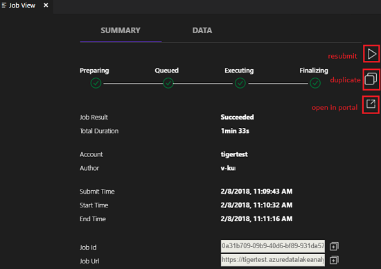

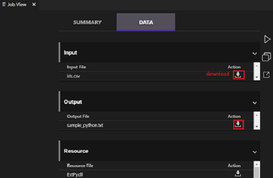

**To set the default context**

You can set the default context to apply this setting to all script files if you have not set parameters for files respectively.

1. Select Ctrl+Shift+P to open the command palette. 
2. Enter **ADL: Set Default Context**. Or right-click the script editor and select **ADL: Set Default Context**.
3. Choose the account, database, and schema that you want. The setting is saved to the xxx_settings.json configuration file.

**To set script parameters**

1. Select Ctrl+Shift+P to open the command palette. 
2. Enter **ADL: Set Script Parameters**.
3. The xxx_settings.json file is opened with the following properties:

   - Account: An Azure Data Lake Analytics account under your Azure subscription that's needed to compile and run U-SQL jobs. You need configure the computer account before you compile and run U-SQL jobs.
   - Database: A database under your account. The default is **master**.
   - Schema: A schema under your database. The default is **dbo**.
   - Optional settings:
        - Priority: The priority range is from 1 to 1000, with 1 as the highest priority. The default value is **1000**.
        - Parallelism: The parallelism range is from 1 to 150. The default value is the maximum parallelism allowed in your Azure Data Lake Analytics account. 

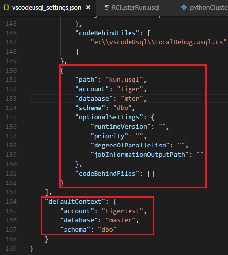
      
> [!NOTE] 
> After you save the configuration, the account, database, and schema information appear on the status bar at the lower-left corner of the corresponding .usql file if you don’t have a default context set up.

**To set Git ignore**

1. Select Ctrl+Shift+P to open the command palette. 
2. Enter **ADL: Set Git Ignore**.

   - If you don’t have a **.gitIgnore** file in your VS Code working folder, a file named **.gitIgnore** is created in your folder. Four items (**usqlCodeBehindReference**, **usqlCodeBehindGenerated**, **.cache**, **obj**) are added in the file by default. You can make more updates if needed.
   - If you already have a **.gitIgnore** file in your VS Code working folder, the tool adds four items (**usqlCodeBehindReference**, **usqlCodeBehindGenerated**, **.cache**, **obj**) in your **.gitIgnore** file if the four items were not included in the file.

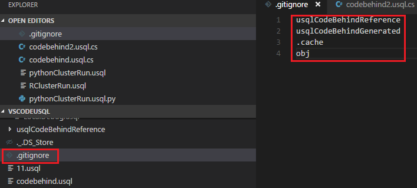

## Work with code-behind files: C Sharp, Python, and R

Azure Data Lake Tools supports multiple custom codes. For instructions, see [Develop U-SQL with Python, R, and C Sharp for Azure Data Lake Analytics in VS Code](data-lake-analytics-u-sql-develop-with-python-r-csharp-in-vscode.md).

## Work with assemblies

For information on developing assemblies, see [Develop U-SQL assemblies for Azure Data Lake Analytics jobs](data-lake-analytics-u-sql-develop-assemblies.md).

You can use Data Lake Tools to register custom code assemblies in the Data Lake Analytics catalog.

**To register an assembly**

You can register the assembly through the **ADL: Register Assembly** or **ADL: Register Assembly (Advanced)** command.

**To register through the ADL: Register Assembly command**
1.	Select Ctrl+Shift+P to open the command palette.
2.	Enter **ADL: Register Assembly**. 
3.	Specify the local assembly path. 
4.	Select a Data Lake Analytics account.
5.	Select a database.

The portal is opened in a browser and displays the assembly registration process.  

Another convenient way to trigger the **ADL: Register Assembly** command is to right-click the .dll file in File Explorer. 

**To register through the ADL: Register Assembly (Advanced) command**
1.	Select Ctrl+Shift+P to open the command palette.
2.	Enter **ADL: Register Assembly (Advanced)**. 
3.	Specify the local assembly path. 
4.  The JSON file is displayed. Review and edit the assembly dependencies and resource parameters, if needed. Instructions are displayed in the **Output** window. To proceed to the assembly registration, save (Ctrl+S) the JSON file.

    
>[!NOTE]
>- Assembly dependencies: Azure Data Lake Tools autodetects whether the DLL has any dependencies. The dependencies are displayed in the JSON file after they're detected. 
>- Resources: You can upload your DLL resources (for example, .txt, .png, and .csv ) as part of the assembly registration. 

Another way to trigger the **ADL: Register Assembly (Advanced)** command is to right-click the .dll file in File Explorer. 

The following U-SQL code demonstrates how to call an assembly. In the sample, the assembly name is *test*.

        REFERENCE ASSEMBLY [test];

        @a = 
            EXTRACT 
                Iid int,
            Starts DateTime,
            Region string,
            Query string,
            DwellTime int,
            Results string,
            ClickedUrls string 
            FROM @"Sample/SearchLog.txt" 
            USING Extractors.Tsv();

        @d =
            SELECT DISTINCT Region 
            FROM @a;

        @d1 = 
            PROCESS @d
            PRODUCE 
                Region string,
            Mkt string
            USING new USQLApplication_codebehind.MyProcessor();

        OUTPUT @d1 
            TO @"Sample/SearchLogtest.txt" 
            USING Outputters.Tsv();

## Use U-SQL local run and local debug for Windows users
U-SQL local run tests your local data and validates your script locally before your code is published to Data Lake Analytics. You can use the local debug feature to complete the following tasks before your code is submitted to Data Lake Analytics: 
- Debug your C# code-behind. 
- Step through the code. 
- Validate your script locally.

For instructions on local run and local debug, see [U-SQL local run and local debug with Visual Studio Code](data-lake-tools-for-vscode-local-run-and-debug.md).

## Connect to Azure

Before you can compile and run U-SQL scripts in Data Lake Analytics, you must connect to your Azure account.

<b id="sign-in-by-command">To connect to Azure by using a command</b>

1.	Select Ctrl+Shift+P to open the command palette. 
2.  Enter **ADL: Login**. The login information appears on the lower right.

    

    

3.  Select **Copy & Open** to open the [login webpage](https://aka.ms/devicelogin). Paste the code into the box, and then select **Continue**.

    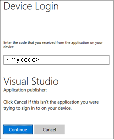  
     
4.  Follow the instructions to sign in from the webpage. When you're connected, your Azure account name appears on the status bar in the lower-left corner of the VS Code window. 

    > [!NOTE] 
    >- Data Lake Tools automatically signs you in the next time if you don't sign out.
    >- If your account has two factors enabled, we recommend that you use phone authentication rather than using a PIN.

To sign out, enter the command **ADL: Logout**.

**To connect to Azure from the explorer**

Expand **AZURE DATALAKE**, select **Sign in to Azure**, and then follow step 3 and step 4 of [To connect to Azure by using a command](#sign-in-by-command).

  

You can't sign out from the explorer. To sign out, see [To connect to Azure by using a command](#sign-in-by-command).

## Create an extraction script 
You can create an extraction script for .csv, .tsv, and .txt files by using the command **ADL: Create EXTRACT Script** or from the Azure Data Lake explorer.

**To create an extraction script by using a command**

1. Select Ctrl+Shift+P to open the command palette, and enter **ADL: Create EXTRACT Script**.
2. Specify the full path for an Azure Storage file, and select the Enter key.
3. Select one account.
4. For a .txt file, select a delimiter to extract the file. 

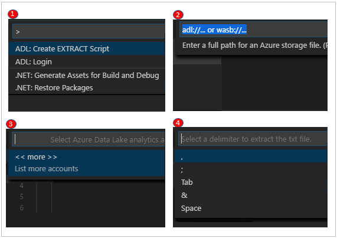

The extraction script is generated based on your entries. For a script that cannot detect the columns, choose one from the two options. If not, only one script will be generated.

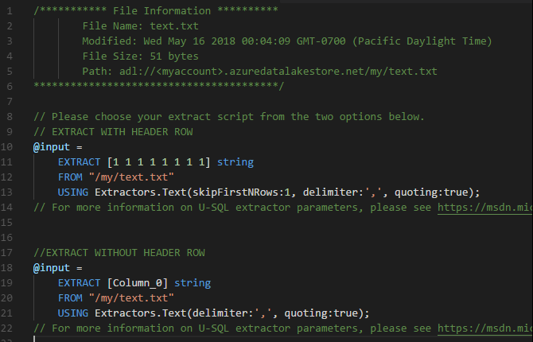

**To create an extraction script from the explorer**

Another way to create the extraction script is through the right-click (shortcut) menu on the .csv, .tsv, or .txt file in Azure Data Lake Store or Azure Blob storage.

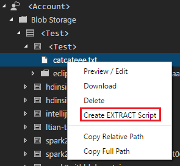

## Integrate with Azure Data Lake Analytics through a command

You can access Azure Data Lake Analytics resources, including listing accounts, accessing metadata, and viewing analytics jobs. 

**To list the Azure Data Lake Analytics accounts under your Azure subscription**

1. Select Ctrl+Shift+P to open the command palette.
2. Enter **ADL: List Accounts**. The accounts appear in the **Output** pane.

**To access Azure Data Lake Analytics metadata**

1.	Select Ctrl+Shift+P, and then enter **ADL: List Tables**.
2.	Select one of the Data Lake Analytics accounts.
3.	Select one of the Data Lake Analytics databases.
4.	Select one of the schemas. You can see the list of tables.

**To view Azure Data Lake Analytics jobs**
1.  Open the command palette (Ctrl+Shift+P) and select **ADL: Show Jobs**. 
2.	Select a Data Lake Analytics or local account. 
3.  Wait for the job list to appear for the account.
4.	Select a job from the job list. Data Lake Tools opens the job view in the right pane and displays some information in the VS Code output.

## Integrate with Azure Data Lake Store through a command

You can use Azure Data Lake Store-related commands to:
 - [Browse through the Azure Data Lake Store resources](#list-the-storage-path) 
 - [Preview the Azure Data Lake Store file](#preview-the-storage-file) 
 - [Upload the file directly to Azure Data Lake Store in VS Code](#upload-file-or-folder)
 - [Download the file directly from Azure Data Lake Store in VS Code](#download-file)

### List the storage path 

**To list the storage path through the command palette**

1. Right-click the script editor and select **ADL: List Path**.
2. Choose the folder in the list, or select **Enter a path** or **Browse from root path**. (Here, we use **Enter a path** as an example.) 
3. Select your Data Lake Analytics account.
4. Browse to or enter the storage folder path (for example, /output/).  

The command palette lists the path information based on your entries.

A more convenient way to list the relative path is through the shortcut menu.

**To list the storage path through the shortcut menu**

Right-click the path string and select **List Path**.

### Preview the storage file

1. Right-click the script editor and select **ADL: Preview File**.
2. Select your Data Lake Analytics account. 
3. Enter an Azure Storage file path (for example, /output/SearchLog.txt). 

The file opens in VS Code.

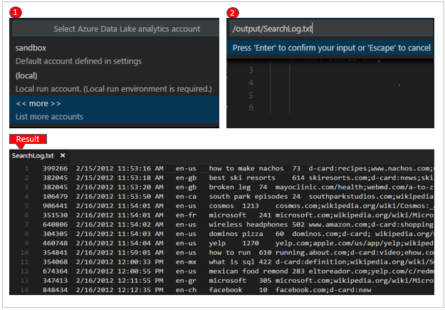

Another way to preview the file is through the shortcut menu on the file's full path or the file's relative path in the script editor. 

### Upload a file or folder

1. Right-click the script editor and select **Upload File** or **Upload Folder**.
2. Choose one file or multiple files if you selected **Upload File**, or choose the whole folder if you selected **Upload Folder**. Then select **Upload**. 
3. Choose the storage folder in the list, or select **Enter Path** or **Browse from Root**. (We're using **Enter Path** as an example.) 
4. Select your Data Lake Analytics account. 
5. Browse to or enter the storage folder path (for example, /output/). 
6. Select **Choose Current Folder** to specify your upload destination.

    

Another way of uploading files to storage is through the shortcut menu on the file's full path or the file's relative path in the script editor.

At the same time, you can [monitor the upload status](#check-storage-tasks-status).

### Download a file 
You can download files by using the command **ADL: Download File** or **ADL: Download File (Advanced)**.

**To download files through the ADL: Download File (Advanced) command**
1. Right-click the script editor, and then select **Download File (Advanced)**.
2. VS Code displays a JSON file. You can enter file paths and download multiple files at the same time. Instructions are displayed in the **Output** window. To proceed to download the file, save (Ctrl+S) the JSON file.

    

The **Output** window displays the file download status.

     

At the same time, you can [monitor the download status](#check-storage-tasks-status).

**To download files through the ADL: Download File command**

1. Right-click the script editor, select **Download File**, and then select the destination folder from the **Select Folder** dialog box.
2. Choose the folder in the list, or select **Enter Path** or **Browse from Root**. (We're using **Enter Path** as an example.) 
3. Select your Data Lake Analytics account. 
4. Browse to or enter the storage folder path (for example, /output/), and then choose a file to download.

 

Another way of downloading storage files is through the shortcut menu on the file's full path or the file's relative path in the script editor.

At the same time, you can [monitor the download status](#check-storage-tasks-status).

### Check storage tasks' status
The upload and download status appears on the status bar. Select the status bar, and then the status appears on the **OUTPUT** tab.

## Integrate with Azure Data Lake Analytics from the explorer

After you log in, all the subscriptions under your Azure account are listed in the left pane, under **AZURE DATALAKE**. 

### Data Lake Analytics metadata navigation

Expand your Azure subscription. Under the **U-SQL Databases** node, you can browse through your U-SQL database and view folders like **Schemas**, **Credentials**, **Assemblies**, **Tables**, and **Index**.

### Data Lake Analytics metadata entity management

Expand **U-SQL Databases**. You can create a new database, schema, table, table type, index, or statistic by right-clicking the corresponding node, and then selecting **Script to Create** on the shortcut menu. In the opened script page, edit the script according to your needs, and then submit the job by right-clicking it and then selecting **ADL: Submit Job**. 

After you finish creating the item, right-click the node and then select **Refresh** to show the item. You can also delete the item by right-clicking it and then selecting **Delete**.

### Data Lake Analytics assembly registration

You can register an assembly in the corresponding database by right-clicking the **Assemblies** node, and then selecting **Register assembly**.

## Integrate with Azure Data Lake Store from the explorer

Browse to **Data Lake Store**, and then:

- You can right-click the folder node and then use the **Refresh**, **Delete**, **Upload**, **Upload Folder**, **Copy Relative Path**, and **Copy Full Path** commands on the shortcut menu.

   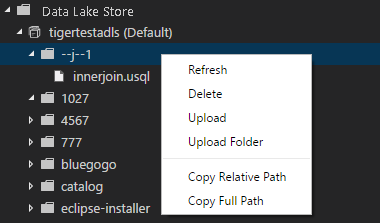

- You can right-click the file node and then use the **Preview**, **Download**, **Delete**, **Create EXTRACT Script** (available only for CSV, TSV, and TXT files), **Copy Relative Path**, and **Copy Full Path** commands on the shortcut menu.

   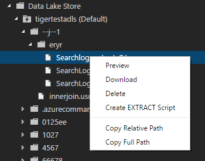

## Integrate with Azure Blob storage from the explorer

Browse to Blob storage, and then:

- You can right-click the blob container node and then use the **Refresh**, **Delete Blob Container**, and **Upload Blob** commands on the shortcut menu.

   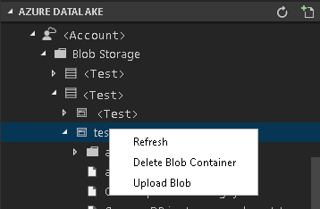

- You can right-click the folder node and then use the **Refresh** and **Upload Blob** commands on the shortcut menu.

   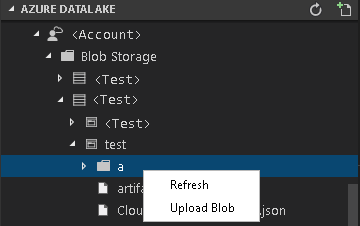

- You can right-click the file node and then use the **Preview/Edit**, **Download**, **Delete**, **Create EXTRACT Script** (available only for CSV, TSV, and TXT files), **Copy Relative Path**, and **Copy Full Path** commands on the shortcut menu.

    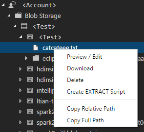

## Open the Data Lake explorer in the portal
1. Select Ctrl+Shift+P to open the command palette.
2. Enter **Open Web Azure Storage Explorer** or right-click a relative path or the full path in the script editor, and then select **Open Web Azure Storage Explorer**.
3. Select a Data Lake Analytics account.

Data Lake Tools opens the Azure storage path in the Azure portal. You can find the path and preview the file from the web.

## Additional features

Data Lake Tools for VS Code supports the following features:

-	**IntelliSense autocomplete**: Suggestions appear in pop-up windows around items, such as keywords, methods, and variables. Different icons represent different types of objects:

    - Scala data type
    - Complex data type
    - Built-in UDTs
    - .NET collection and classes
    - C# expressions
    - Built-in C# UDFs, UDOs, and UDAAGs 
    - U-SQL functions
    - U-SQL windowing function
 
    
 
-	**IntelliSense autocomplete on Data Lake Analytics metadata**: Data Lake Tools downloads the Data Lake Analytics metadata information locally. The IntelliSense feature automatically populates objects, including the database, schema, table, view, table-valued function, procedures, and C# assemblies, from the Data Lake Analytics metadata.
 
    

-	**IntelliSense error marker**: Data Lake Tools underlines the editing errors for U-SQL and C#. 
-	**Syntax highlights**: Data Lake Tools uses colors to differentiate items, such as variables, keywords, data types, and functions. 

    

>[!NOTE]
>We recommend that users of Azure Data Lake Tools for Visual Studio Code upgrade to version 0.2.13 or later. This version includes changes based on the most recent data protection requirements. Previous versions are not available for download and are deprecated. 
 
   
## Next steps
- [Develop U-SQL with Python, R, and C Sharp for Azure Data Lake Analytics in VS Code](data-lake-analytics-u-sql-develop-with-python-r-csharp-in-vscode.md)
- [U-SQL local run and local debug with Visual Studio Code](data-lake-tools-for-vscode-local-run-and-debug.md)
- [Tutorial: Get started with Azure Data Lake Analytics](data-lake-analytics-get-started-portal.md)
- [Tutorial: Develop U-SQL scripts by using Data Lake Tools for Visual Studio](data-lake-analytics-data-lake-tools-get-started.md)
