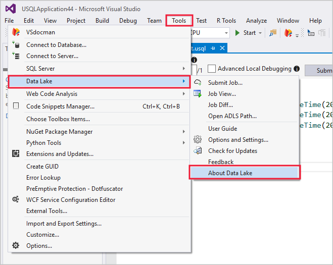
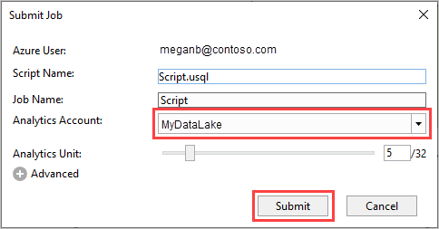
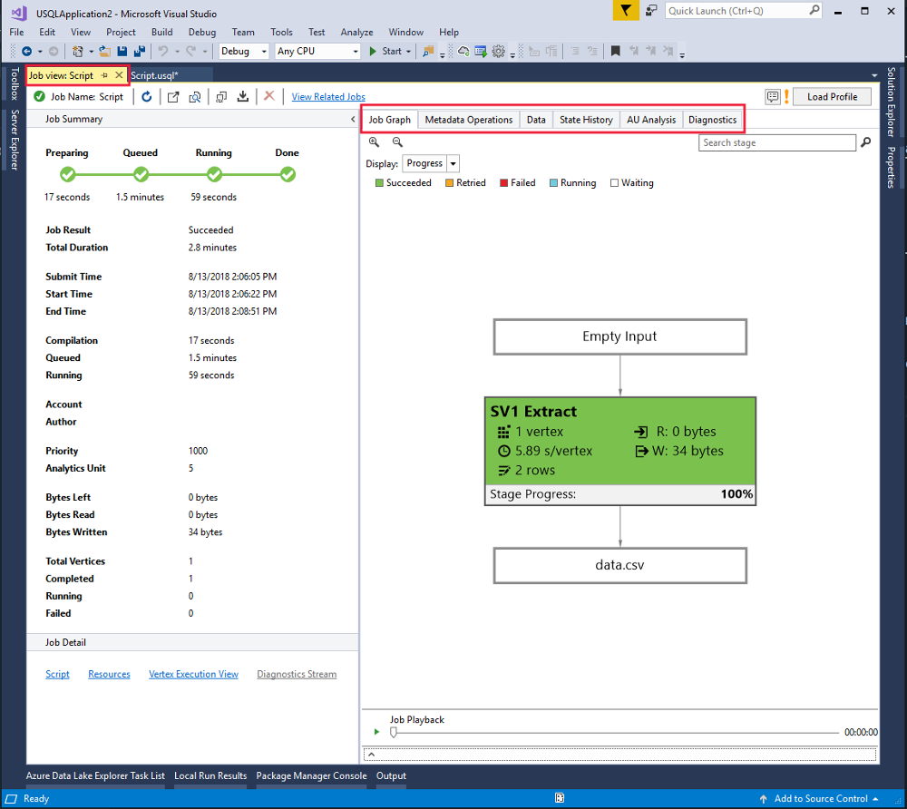

# Develop U-SQL scripts by using Data Lake Tools for Visual Studio

[!INCLUDE [get-started-selector](../../includes/data-lake-analytics-selector-get-started.md)]

Azure Data Lake and Stream Analytics Tools include functionality related to two Azure services, Azure Data Lake Analytics and Azure Stream Analytics. For more information about the Azure Stream Analytics scenarios, see [Azure Stream Analytics tools for Visual Studio](../stream-analytics/stream-analytics-tools-for-visual-studio-install.md).

This article describes how to use Visual Studio to create Azure Data Lake Analytics accounts. You can define jobs in [U-SQL](data-lake-analytics-u-sql-get-started.md), and submit jobs to the Data Lake Analytics service. For more information about Data Lake Analytics, see [Azure Data Lake Analytics overview](data-lake-analytics-overview.md).

> [!IMPORTANT]
> We recommend you upgrade to Azure Data Lake Tools for Visual Studio version 2.3.3000.4 or later. The previous versions are no longer available for download and are now deprecated.
>
> 1. Check if you are using an earlier version than 2.3.3000.4 of Azure Data Lake Tools for Visual Studio.
>
>    
>
> 1. If your version is an earlier version of 2.3.3000.4, update your Azure Data Lake Tools for Visual Studio by visiting the download center:
>    - [For Visual Studio 2017 and 2019](https://marketplace.visualstudio.com/items?itemName=ADLTools.AzureDataLakeandStreamAnalyticsTools)
>    - [For Visual Studio 2013 and 2015](https://www.microsoft.com/en-us/download/details.aspx?id=49504)

## Prerequisites

* **Visual Studio**: All editions except Express are supported.

  * Visual Studio 2019
  * Visual Studio 2017
  * Visual Studio 2015
  * Visual Studio 2013

* **Microsoft Azure SDK for .NET** version 2.7.1 or later. Install it by using the [Web platform installer](https://www.microsoft.com/web/downloads/platform.aspx).
* A **Data Lake Analytics** account. To create an account, see [Get Started with Azure Data Lake Analytics using Azure portal](data-lake-analytics-get-started-portal.md).

## Install Azure Data Lake Tools for Visual Studio

This tutorial requires that Data Lake Tools for Visual Studio is installed. For more information, see [Install Data Lake Tools for Visual Studio](data-lake-analytics-data-lake-tools-install.md).

## Connect to an Azure Data Lake Analytics account

1. Open Visual Studio.

1. Open **Server Explorer** by selecting **View** > **Server Explorer**.

1. Right-click **Azure**, then select **Connect to Microsoft Azure Subscription**. In **Sign in to your account**, follow the instructions.

1. In **Server Explorer**, select **Azure** > **Data Lake Analytics**. You see a list of your Data Lake Analytics accounts.

## Write your first U-SQL script

The following text is a simple U-SQL script. It defines a small dataset and writes that dataset to the default Data Lake Store as a file called `/data.csv`.

```sql
USE DATABASE master;
USE SCHEMA dbo;
@a  = 
    SELECT * FROM 
        (VALUES
            ("Contoso", 1500.0),
            ("Woodgrove", 2700.0)
        ) AS 
              D( customer, amount );
OUTPUT @a
    TO "/data.csv"
    USING Outputters.Csv();
```

## Submit a Data Lake Analytics job

1. In Visual Studio, select **File** > **New** > **Project**.

1. Select the **U-SQL Project** type, and then select **Next**. In **Configure your new project**, select **Create**.

   Visual Studio creates a solution that contains a **Script.usql** file.

1. Paste the script from [Write your first U-SQL script](#write-your-first-u-sql-script) into the **Script.usql** window.

1. In **Solution Explorer**, right-click **Script.usql**, and select **Submit Script**.

1. In **Submit Job**, choose your Data Lake Analytics account and select **Submit**.

   

After the job submission, the **Job view** tab opens to show the job progress.

* **Job Summary** shows the summary of the job.
* **Job Graph** visualizes the progress of the job.
* **MetaData Operations** shows all the actions that were taken on the U-SQL catalog.
* **Data** shows all the inputs and outputs.
* **State History** shows the timeline and state details.
* **AU Analysis** shows how many AUs were used in the job and explore simulations of different AU allocation strategies.
* **Diagnostics** provides an advanced analysis for job execution and performance optimization.



To see the latest job status and refresh the screen, select **Refresh**.

## Check job status

1. In **Server Explorer**, select **Azure** > **Data Lake Analytics**.

1. Expand the Data Lake Analytics account name.

1. Double-click **Jobs**.

1. Select the job that you previously submitted.

## See the job output

1. In **Server Explorer**, browse to the job you submitted.

1. Click the **Data** tab.

1. In the **Job Outputs** tab, select the `"/data.csv"` file.

## Next steps

* [Run U-SQL scripts on your own workstation for testing and debugging](data-lake-analytics-data-lake-tools-local-run.md)
* [Debug C# code in U-SQL jobs using Azure Data Lake Tools for Visual Studio Code](data-lake-tools-for-vscode-local-run-and-debug.md)
* [Use the Azure Data Lake Tools for Visual Studio Code](data-lake-analytics-data-lake-tools-for-vscode.md)
