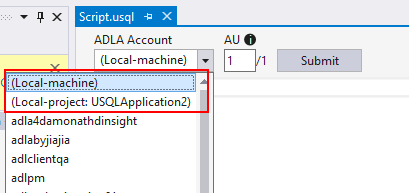
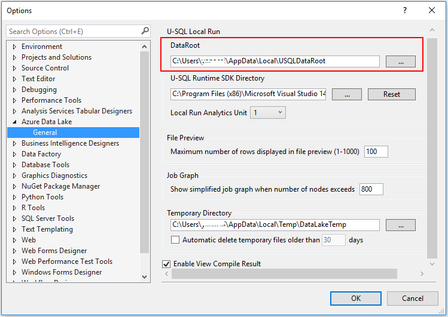

# Run U-SQL script on your local machine

When developing U-SQL script, it's common to run U-SQL script locally as it saves cost and time. Azure Data Lake Tools for Visual Studio supports to run U-SQL scripts on your local machine. 

## Basic concepts for local run

Below chart shows the components for local run and how these components map to cloud run.

|Component|Local Run|Cloud Run|
|---------|---------|---------|
|Storage|Local Data Root folder|Default Azure Data Lake Store account|
|Compute|U-SQL local run engine|Azure Data Lake Analytics service|
|Execution environment|Working directory on local machine|Azure Data Lake Analytics cluster|

More explanation for Local Run components:

### Local Data Root folder

Local Data Root folder is a "local store" for the local compute account. Any folder in the local file system on your local machine can be a local Data Root folder. It's equal to the default Azure Data Lake Store account of a Data Lake Analytics account. Switching to a different Data Root folder is just like switching to a different default store account. 

The Data Root folder is used to:
- Store metadata, like databases, tables, table-valued functions, and assemblies.
- Look up the input and output paths that are defined as relative paths in U-SQL script. Using relative paths makes it easier to deploy your U-SQL scripts to Azure.

### U-SQL local run engine

U-SQL local run engine is a "local compute account" for U-SQL jobs. Users can run U-SQL jobs locally through Azure Data Lake Tools for Visual Studio. Local execution is also supported through Azure Data Lake U-SQL SDK command-line and programming interfaces. [Learn more about Azure Data Lake U-SQL SDK](https://www.nuget.org/packages/Microsoft.Azure.DataLake.USQL.SDK/).

### Working directory

When running a U-SQL script, a working directory folder is needed for caching compile results, execution logs and so on. In Azure Data Lake Tools for Visual Studio, the working directory is the U-SQL project’s working directory (usually located under <U-SQL project root path>/bin/debug>). The working directory will be cleaned every time a new run triggered.

## Local run in Visual Studio

Azure Data Lake Tools for Visual Studio has a built-in local run engine, and surfaces it as local compute account. To run a U-SQL script locally, select (Local-machine) or (Local-project) account in script’s editor margin drop-down and click **Submit**.

 
 
### Local run with (Local-machine) account

(Local-machine) account is a shared local compute account with a single local Data Root folder as the local store account. The Data Root folder is by default located at “C:\Users\<username>\AppData\Local\USQLDataRoot”, it's also configurable through **Tools > Data Lake > Options and Settings**.

  
A U-SQL project is required for local run. The U-SQL project’s working directory is used for U-SQL local execution working directory. Compile results, execution logs, and other job execution-related files are generated and stored under working directory folder during local run. Note that every time you rerun the script, all these files in working directory will be cleaned and regenerated.

### Local run with (Local-project) account

(Local-project) account is a project-isolated local compute account for each project with isolated local Data Root folder. Every active U-SQL project opening in Solution Explorer has a corresponding **(Local-project: <project name>)** account listed both in Server Explorer and U-SQL script editor margin. 

The (Local-project) account provides a clean and isolated development environment for developers. Unlike (Local-machine) account that has a shared local Data Root folder storing metadata and input/output data for all local jobs, (Local-project) account creates a temporary local Data Root folder under U-SQL project working directory every time a U-SQL script gets run. This temporary Data Root folder gets cleaned when rebuild or rerun happens. 

U-SQL project provides good experience to manage this isolated local run environment through project reference and property. You can both configure the input data sources for U-SQL scripts in the project, as well as the referenced database environments.

#### Manage input data source for (Local-project) account

The U-SQL project takes care of the local Data Root folder creation and data setting up for (Local-project) account. A temporary Data Root folder is cleaned and recreated under U-SQL project working directory every time rebuild and local run happens. All data sources configured by the U-SQL project are copied to this temporary local Data Root folder before local job execution. 

You can configure the root folder of your data sources through **right click U-SQL project > Property > Test Data Source**. When running U-SQL script on (Local-project) account, all files and subfolders (including files under subfolders) in **Test Data Source** folder are copied to the temporary local Data Root folder. After local job execution completes, output results can also be found under the temporary local Data Root folder in project working directory. Note that all these outputs will be deleted and cleaned when project gets rebuilt and cleaned. 

#### Manage referenced database environment for (Local-project) account 

If a U-SQL query uses or queries with U-SQL database objects, you must make the database environments ready locally before running this U-SQL script locally. For (Local-project) account, U-SQL database dependencies can be managed by U-SQL project references. You can add U-SQL database project references to your U-SQL project. Before running U-SQL scripts on (Local-project) account, all referenced databases are deployed to the temporary local Data Root folder. And for each run, the temporary Data Root folder is cleaned as a fresh isolated environment.

Related articles:
* [Learn how to manage U-SQL database definition through U-SQL database project](data-lake-analytics-data-lake-tools-develop-usql-database.md#reference-a-u-sql-database-project)
* [Learn how to manage U-SQL database reference in U-SQL project](data-lake-analytics-data-lake-tools-develop-usql-database.md)

### Difference between (Local-machine) and (Local-project) account

(Local-machine) account aims to simulate an Azure Data Lake Analytics account on users’ local machine. It shares same experience with Azure Data Lake Analytics account. (Local-project) aims to provide a user-friendly local development environment that helps users deploy databases references and input data before running the script locally. (Local-machine) account provides a shared permanent environment, which can be accessed through all projects. (Local-project) account provides an isolated development environment for each project, and it is refreshed for each run. Based on above, (Local-project) account offers a faster development experience by applying new changes quickly.

You can find more difference between (Local-machine) and (Local-project) account in chart as follows:

|Difference angle|(Local-machine)|(Local-project)|
|----------------|---------------|---------------|
|Local access|Can be accessed by all projects|Only the corresponding project can access this account|
|Local Data Root Folder|A permanent local folder. Configured through **Tools > Data Lake > Options and Settings**|A temporary folder created for each local run under U-SQL project working directory. The folder gets cleaned when rebuild or rerun happens|
|Input data for U-SQL script|Relative path under the permanent local Data Root folder|Set through **U-SQL project property > Test Data Source**. All files, subfolders are copied to the temporary Data Root folder before local execution|
|Output data for U-SQL script|Relative path under the permanent local Data Root folder|Outputted to the temporary Data Root folder. The results are cleaned when rebuild or rerun happens.|
|Referenced database deployment|Referenced databases are not deployed automatically when running against (Local-machine) account. Same for submitting to Azure Data Lake Analytics account.|Referenced databases are deployed to the (Local-project) account automatically before local execution. All database environments are cleaned and redeployed when rebuild or rerun happens.|

## Local run with U-SQL SDK

Besides of running U-SQL scripts locally in Visual Studio, you can also use the Azure Data Lake U-SQL SDK to run U-SQL scripts locally with command-line and programming interfaces. Through these interfaces, you can automate U-SQL local run and test.

[Learn more about Azure Data Lake U-SQL SDK](data-lake-analytics-u-sql-sdk.md).

## Next Steps

- [Learn more about Azure Data Lake U-SQL SDK](data-lake-analytics-u-sql-sdk.md).
- [How to set up CI/CD pipeline for Azure Data Lake Analytics](data-lake-analytics-cicd-overview.md)
- [Use U-SQL database project to develop U-SQL database](data-lake-analytics-data-lake-tools-develop-usql-database.md)
- [How to test your Azure Data Lake Analytics code](data-lake-analytics-cicd-test.md)
