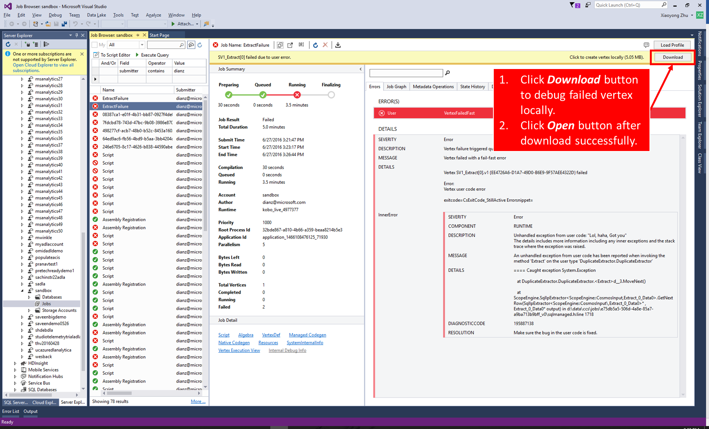
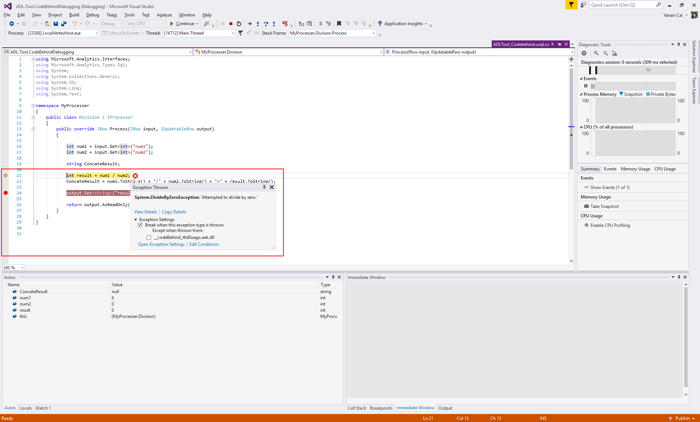
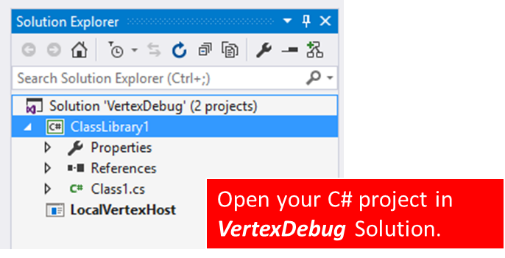
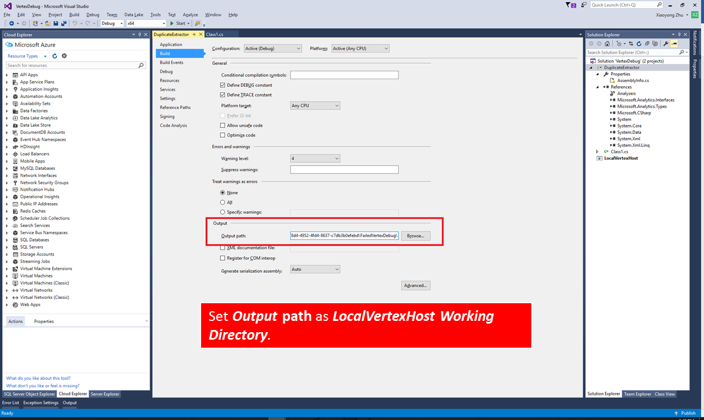

# Debug user-defined C# code for failed U-SQL jobs

U-SQL provides an extensibility model using C#. In U-SQL scripts, it is easy to call C# functions and perform analytic functions that SQL-like declarative language does not support. To learn more for U-SQL extensibility, see [U-SQL programmability guide](https://docs.microsoft.com/azure/data-lake-analytics/data-lake-analytics-u-sql-programmability-guide#use-user-defined-functions-udf). 

In practice, any code may need debugging, but it is hard to debug a distributed job with custom code on the cloud with limited log files. [Azure Data Lake Tools for Visual Studio](http://aka.ms/adltoolsvs) provides a feature called **Failed Vertex Debug**, which helps you more easily debug the failures that occur in your custom code. When U-SQL job fails, the service keeps the failure state and the tool helps you to download the cloud failure environment to the local machine for debugging. The local download captures the entire cloud environment, including any input data and user code.

The following video demonstrates Failed Vertex Debug in Azure Data Lake Tools for Visual Studio.

> [!VIDEO https://www.youtube.com/embed/3enkNvprfm4]
>

> [!IMPORTANT]
> Visual Studio requires the following two updates for using this feature: [Microsoft Visual C++ 2015 Redistributable Update 3](https://www.microsoft.com/en-us/download/details.aspx?id=53840) and the [Universal C Runtime for Windows](https://www.microsoft.com/download/details.aspx?id=50410).
>

## Download failed vertex to local machine

When you open a failed job in Azure Data Lake Tools for Visual Studio, you see a yellow alert bar with detailed error messages in the error tab.

1. Click **Download** to download all the required resources and input streams. If the download doesn't complete, click **Retry**.

2. Click **Open** after the download completes to generate a local debugging environment. A new debugging solution will be opened, and if you have existing solution opened in Visual Studio, please make sure to save and close it before debugging.

## Configure the debugging environment

> [!NOTE]
> Before debugging, be sure to check **Common Language Runtime Exceptions** in the Exception Settings window (**Ctrl + Alt + E**).

In the new launched Visual Studio instance, you may or may not find the user-defined C# source code:

1. [I can find my source code in the solution](#source-code-is-included-in-debugging-solution)

2. [I cannot find my source code in the solution](#source-code-is-not-included-in-debugging-solution)

### Source code is included in debugging solution

There are two cases that the C# source code is captured:

1. The user code is defined in code-behind file (typically named `Script.usql.cs` in a U-SQL project).

2. The user code is defined in C# class library project for U-SQL application, and registered as assembly with **debug info**.

If the source code is imported to the solution, you can use the Visual Studio debugging tools (watch, variables, etc.) to troubleshoot the problem:

1. Press **F5** to start debugging. The code runs until it is stopped by an exception.

2. Open the source code file and set breakpoints, then press **F5** to debug the code step by step.

    

### Source code is not included in debugging solution

If the user code is not included in code-behind file, or you did not register the assembly with **debug info**, then the source code is not included automatically in the debugging solution. In this case, you need extra steps to add your source code:

1. Right-click **Solution 'VertexDebug' > Add > Existing Project...** to find the assembly source code and add the project to the debugging solution.

    

2. Get the project folder path for **FailedVertexDebugHost** project. 

3. Right-Click **the added assembly source code project > Properties**, select the **Build** tab at left, and paste the copied path ending with \bin\debug as **Output > Output path**. The final output path is like "<DataLakeTemp path>\fd91dd21-776e-4729-a78b-81ad85a4fba6\loiu0t1y.mfo\FailedVertexDebug\FailedVertexDebugHost\bin\Debug\".

    

After these settings, start debugging with **F5** and breakpoints. You can also use the Visual Studio debugging tools (watch, variables, etc.) to troubleshoot the problem.

> [!NOTE]
> Rebuild the assembly source code project each time after you modify the code to generate updated .pdb files.

## Resubmit the job

After debugging, if the project completes successfully the output window shows the following message:

    The Program 'LocalVertexHost.exe' has exited with code 0 (0x0).

To resubmit the failed job:

1. For jobs with code-behind solutions, copy the C# code into the code-behind source file (typically `Script.usql.cs`).

2. For jobs with assemblies, right-click the assembly source code project in debugging solution and register the updated .dll assemblies into your Azure Data Lake catalog.

3. Resubmit the U-SQL job.

## Next steps

- [U-SQL programmability guide](data-lake-analytics-u-sql-programmability-guide.md)
- [Develop U-SQL User-defined operators for Azure Data Lake Analytics jobs](data-lake-analytics-u-sql-develop-user-defined-operators.md)
- [Test and debug U-SQL jobs by using local run and the Azure Data Lake U-SQL SDK](data-lake-analytics-data-lake-tools-local-run.md)
- [How to troubleshoot an abnormal recurring job](data-lake-analytics-data-lake-tools-debug-recurring-job.md)
