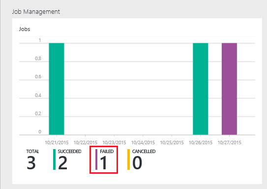

# Troubleshoot Azure Data Lake Analytics jobs using Azure Portal
Learn how to use the Azure Portal to troubleshoot Data Lake Analytics jobs.

In this tutorial, you will setup a missing source file problem, and use the Azure Portal to troubleshoot the problem.

## Submit a Data Lake Analytics job

Submit the following U-SQL job:

```
@searchlog =
   EXTRACT UserId          int,
           Start           DateTime,
           Region          string,
           Query           string,
           Duration        int?,
           Urls            string,
           ClickedUrls     string
   FROM "/Samples/Data/SearchLog.tsv1"
   USING Extractors.Tsv();

OUTPUT @searchlog   
   TO "/output/SearchLog-from-adls.csv"
   USING Outputters.Csv();
```
    
The source file defined in the script is **/Samples/Data/SearchLog.tsv1**, where it should be **/Samples/Data/SearchLog.tsv**.


## Troubleshoot the job

**To see all the jobs**

1. From the Azure portal, click **Microsoft Azure** in the upper left corner.
2. Click the tile with your Data Lake Analytics account name.  The job summary is shown on the **Job Management** tile.

    

    The job Management gives you a glance of the job status. Notice there is a failed job.
3. Click the **Job Management** tile to see the jobs. The jobs are categorized in **Running**, **Queued**, and **Ended**. You shall see your failed job in the **Ended** section. It shall be first one in the list. When you have a lot of jobs, you can click **Filter** to help you to locate jobs.

    
4. Click the failed job from the list to open the job details in a new blade:

    

    Notice the **Resubmit** button. After you fix the problem, you can resubmit the job.
5. Click highlighted part from the previous screenshot to open the error details.  You shall see something like:

    

    It tells you the source folder is not found.
6. Click **Duplicate Script**.
7. Update the **FROM** path to the following:

    "/Samples/Data/SearchLog.tsv"
8. Click **Submit Job**.

## See also
* [Azure Data Lake Analytics overview](data-lake-analytics-overview.md)
* [Get started with Azure Data Lake Analytics using Azure PowerShell](data-lake-analytics-get-started-powershell.md)
* [Get started with Azure Data Lake Analytics and U-SQL using Visual Studio](data-lake-analytics-u-sql-get-started.md)
* [Manage Azure Data Lake Analytics using Azure Portal](data-lake-analytics-manage-use-portal.md)
