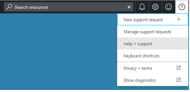
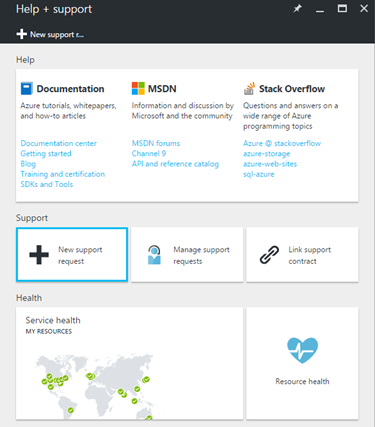
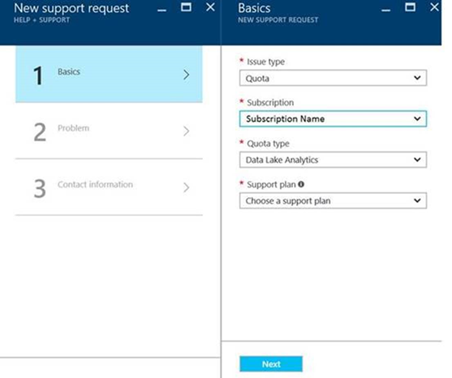
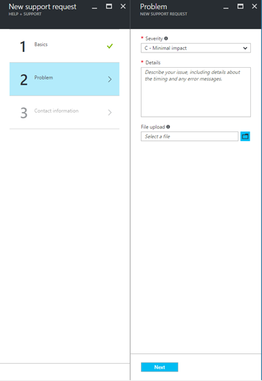

# Azure Data Lake Analytics Quota Limits

Learn how to adjust and increase quota limits in Azure Data Lake Analytics (ADLA) accounts. Knowing these limits may help you understand your U-SQL job behavior. All quota limits are soft, so you can increase the maximum limits by contacting Azure support.

## Azure subscriptions limits

**Maximum number of ADLA accounts per subscription per region:**  5

If you try to create a sixth ADLA account, you will get an error "You have reached the maximum number of Data Lake Analytics accounts allowed (5) in region under subscription name". 

If you want to go beyond this limit, you can try these options:
* choose another region if suitable
* contact Azure support by [opening a support ticket](#increase-maximum-quota-limits) to request a quota increase.

## Default ADLA account limits

**Maximum number of Analytics Units (AUs) per account:** 32

This is the maximum number of AUs that can run concurrently in your account. If your total number of running AUs across all jobs exceeds this limit, newer jobs are queued automatically. For example:

* If you have only one job running with 32 AUs, when you submit a second job it will wait in the job queue until the first job completes.
* If you already have four jobs running and each is using 8 AUs, when you submit a fifth job that needs 8 AUs it waits in the job queue until there are 8 AUs available.

**Maximum number of Analytics Units (AUs) per job:** 32

This is the default maximum number of AUs that each individual job can be assigned in your account. Jobs that are assigned more than this limit will be rejected, unless the submitter is affected by a compute policy (job submission limit) that gives them more AUs per job. The upper bound of this value is the AU limit for the account.

**Maximum number of concurrent U-SQL jobs per account:** 20

This is the maximum number of jobs that can run concurrently in your account. Above this value, newer jobs are queued automatically.

## Adjust ADLA account limits

1. Sign on to the [Azure portal](https://portal.azure.com).
2. Choose an existing ADLA account.
3. Click **Properties**.
4. Adjust the values for **Maximum AUs**, **Maximum number of running jobs**, and **Job submission limits** to suit your needs.

## Increase maximum quota limits

You can find more information about Azure limits in the [Azure service-specific limits documentation](../azure-subscription-service-limits.md#data-lake-analytics-limits).

1. Open a support request in Azure portal.

    

    
2. Select the issue type **Quota**.
3. Select your **Subscription** (make sure it is not a "trial" subscription).
4. Select quota type **Data Lake Analytics**.

    

5. In the problem page, explain your requested increase limit with **Details** of why you need this extra capacity.

    

6. Verify your contact information and create the support request.

Microsoft reviews your request and tries to accommodate your business needs as soon as possible.

## Next steps

* [Overview of Microsoft Azure Data Lake Analytics](data-lake-analytics-overview.md)
* [Manage Azure Data Lake Analytics using Azure PowerShell](data-lake-analytics-manage-use-powershell.md)
* [Monitor and troubleshoot Azure Data Lake Analytics jobs using Azure portal](data-lake-analytics-monitor-and-troubleshoot-jobs-tutorial.md)
