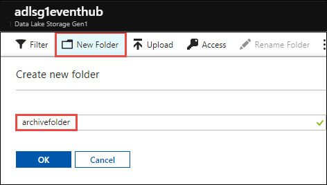
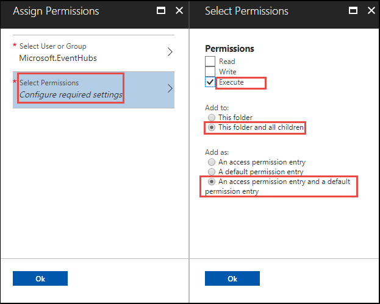
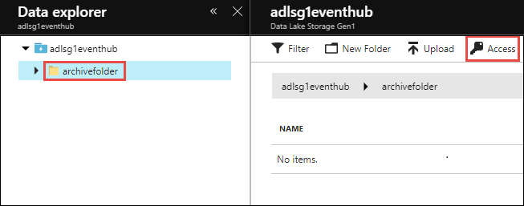
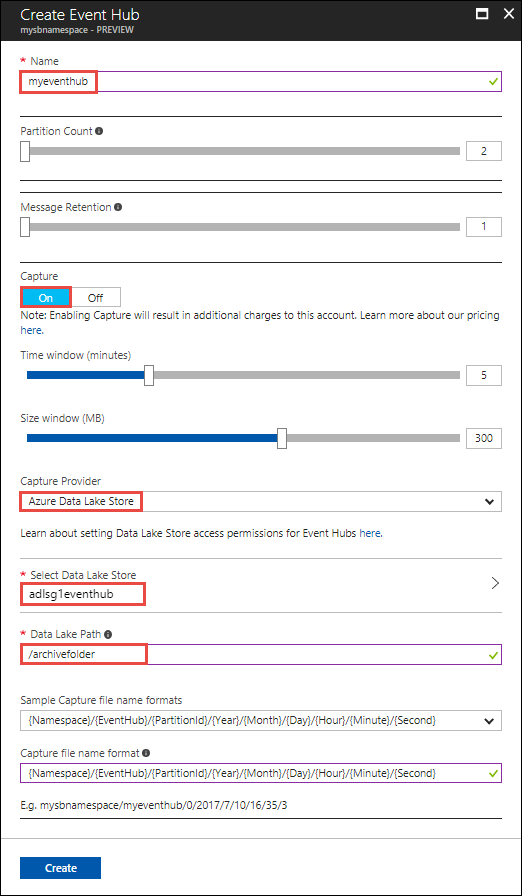
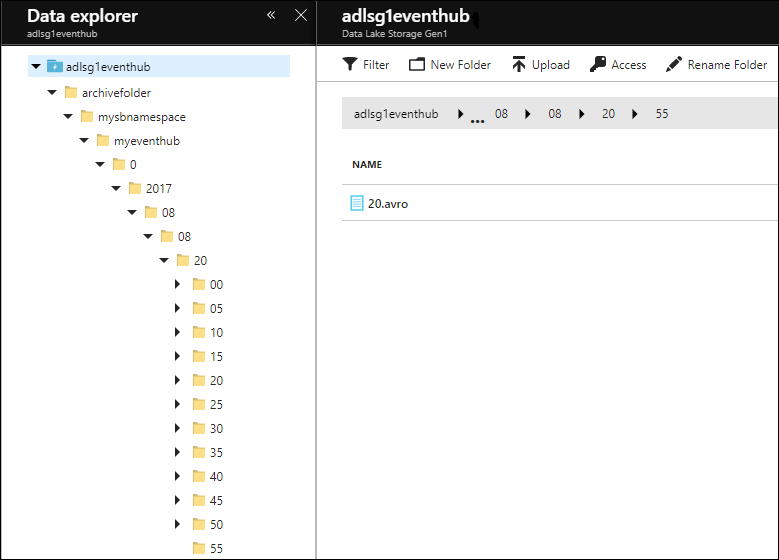

# Use Azure Data Lake Store to capture data from Event Hubs

Learn how to use Azure Data Lake Store to capture data received by Azure Event Hub.

## Prerequisites
Before you begin this article, you must have the following:

* **An Azure subscription**. See [Get Azure free trial](https://azure.microsoft.com/pricing/free-trial/).

* **An Azure Data Lake Store account**. For instructions on how to create one, see [Get started with Azure Data Lake Store](data-lake-store-get-started-portal.md)

*  **An Event Hubs namespace**. For instructions, see [Create an Event Hubs namespace](../event-hubs/event-hubs-create.md#create-an-event-hubs-namespace). Make sure the Data Lake Store account and the Event Hubs namespace are in the same Azure subscription.

## Assign permissions to EventHub

In this section you create a folder within the account where you want to capture the data from Event Hubs. You will also assign permissions to Event Hub so that it can write data into a Data Lake Store account. 

1. Open the Data Lake Store account where you want to capture data from Event Hubs and then click on **Data Explorer**.

    

2.  Click **New Folder** and then enter a name for folder where you want to capture the data.

    

3. Assign permissions at the root of the Data Lake Store. 

    a. Click **Data Explorer**, select the root of the Data Lake Store account, and then click **Access**.

    

    b. In the **Access** blade, click **Add**, click **Select User or Group**, and then search for `Microsoft.EventHubs`. 

    
    
    Click **Select**.

    c. In the **Assign Permissions** tab, click **Select Permissions**. Set **Permissions** to **Execute**, set **Add to** to **This folder and children**, and set **Add as** to **An access permission entry and a default permission entry**.

    

    Click **OK**.

4. Assign permissions for the folder under Data Lake Store account where you will capture data.

    a. Click **Data Explorer**, select the folder in the Data Lake Store account, and then click **Access**.

    

    b. b. In the **Access** blade, click **Add**, click **Select User or Group**, and then search for `Microsoft.EventHubs`. 

    
    
    Click **Select**.

    c. In the **Assign Permissions** tab, click **Select Permissions**. Set **Permissions** to **Read, Write,** and **Execute**, set **Add to** to **This folder and children**, and set **Add as** to **An access permission entry and a default permission entry**.

    
    
    Click **OK**. 

## Configure Event Hub to capture data to Data Lake Store

In this section you create an an Event Hub within an Event Hubs namespace. You also configure the Event Hub to capture data to an Azure Data Lake Store account. This section assumes that you have already created an Event Hubs namespace.

2. From the **Overview** blade of the Event Hubs namespace, click **+ Event Hub**.

    

3. Provide the following values to configure Event Hubs to capture data to Data Lake Store.

    

    a. Provide a name for the Event Hub.
    
    b. For this tutorial, set **Partition Count** and **Message Retention** to the default values.
    
    c. Set **Capture** to **On**. Set the **Time Window** (how frequently to capture) and **Size Window** (data size to capture). 
    
    d. For **Archive Provider**, select **Azure Data Lake Store** and the select the Data Lake Store you created earlier. For **Data Lake Path**, enter the name of the folder you created in the Data Lake Store account. You only need to provide the relative path to the folder.

    e. Leave the **Sample capture file name formats** to the default value. This governs the folder structure that is created under the capture folder.

    f. Click **Create**.

## Test the setup

You can now test the solution by sending data to the Azure Event Hub. Follow the instructions at [Send events to Azure Event Hubs](../event-hubs/event-hubs-dotnet-framework-getstarted-send.md). Once you start sending the data, you will see the data reflected in Data Lake Store using the folder structure you specified. For example, you will see a folder structure like this in your Data Lake Store.

## Analyze data in Data Lake Store

Once the data is in Data Lake Store, you can run analytical jobs to process and crunch the data. See [USQL Avro Example](https://github.com/Azure/usql/tree/master/Examples/AvroExamples) on how to do this using Azure Data Lake Analytics.
  

## See also
* [Secure data in Data Lake Store](data-lake-store-secure-data.md)
* [Copy data from Azure Storage Blobs to Data Lake Store](data-lake-store-copy-data-azure-storage-blob.md)
