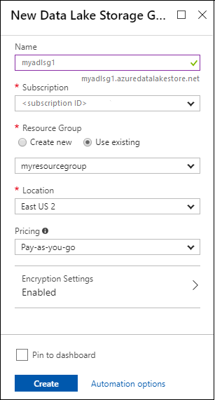
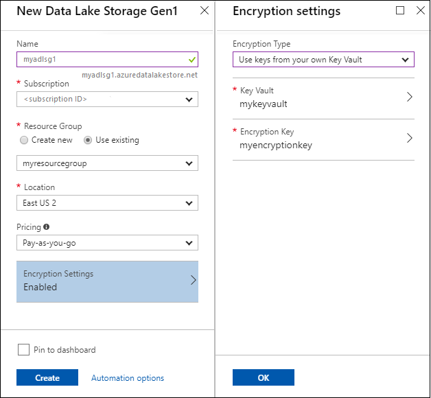
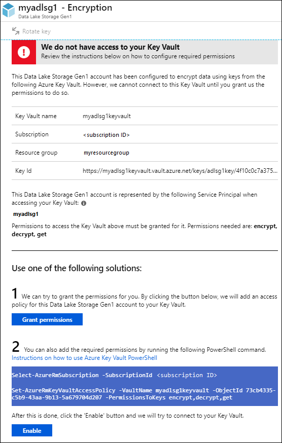
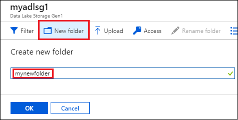
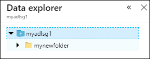
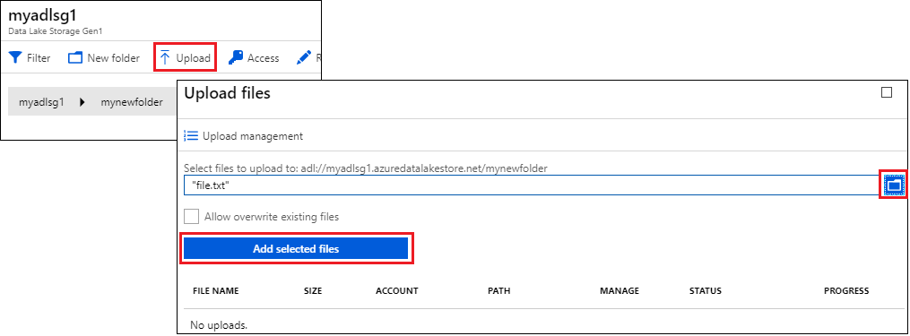

# Get started with Azure Data Lake Store using the Azure portal
> [!div class="op_single_selector"]
> * [Portal](data-lake-store-get-started-portal.md)
> * [PowerShell](data-lake-store-get-started-powershell.md)
> * [Azure CLI 2.0](data-lake-store-get-started-cli-2.0.md)
>
> 

Learn how to use the Azure portal to create an Azure Data Lake Store account and perform basic operations such as create folders, upload, and download data files, delete your account, etc. For more information, see [Overview of Azure Data Lake Store](data-lake-store-overview.md).

## Prerequisites
Before you begin this tutorial, you must have the following items:

* **An Azure subscription**. See [Get Azure free trial](https://azure.microsoft.com/pricing/free-trial/).

## Create an Azure Data Lake Store account

1. Sign on to the new [Azure portal](https://portal.azure.com).
2. Click **NEW**, click **Data + Storage**, and then click **Azure Data Lake Store**. Read the information in the **Azure Data Lake Store** blade, and then click **Create** in the bottom left corner of the blade.
3. In the **New Data Lake Store** blade, provide the values as shown in the following screenshot:
   
    
   
   * **Name**. Enter a unique name for the Data Lake Store account.
   * **Subscription**. Select the subscription under which you want to create a new Data Lake Store account.
   * **Resource Group**. Select an existing resource group, or select the **Create new** option to create one. A resource group is a container that holds related resources for an application. For more information, see [Resource Groups in Azure](../azure-resource-manager/resource-group-overview.md#resource-groups).
   * **Location**: Select a location where you want to create the Data Lake Store account.
   * **Encryption Settings**. There are three options:
     
     * **Do not enable encryption**.
     * **Use keys managed by Azure Data Lake**.  if you want Azure Data Lake Store to manage your encryption keys.
     * **Use keys from your own Key Vault**. You can select an existing Azure Key Vault or create a new Key Vault. To use the keys from a Key Vault, you must assign permissions for the Azure Data Lake Store account to access the Azure Key Vault. For the instructions, see [Assign permissions to Azure Key Vault](#assign-permissions-to-azure-key-vault).
       
        
       
        Click **OK** in the **Encryption Settings** blade.

        For more information, see [Encryption of data in Azure Data Lake Store](./data-lake-store-encryption.md).

4. Click **Create**. If you chose to pin the account to the dashboard, you are taken back to the dashboard and you can see the progress of your Data Lake Store account provisioning. Once the Data Lake Store account is provisioned, the account blade shows up.

### Assign permissions to Azure Key Vault
If you used keys from an Azure Key Vault to configure encryption on the Data Lake Store account, you must configure access between the Data Lake Store account and the Azure Key Vault account. Perform the following steps to do so.

1. If you used keys from the Azure Key Vault, the blade for the Data Lake Store account displays a warning at the top. Click the warning to open **Encryption**.
   
    
2. The blade shows two options to configure access.

    
   
   * In the first option, click **Grant Permissions** to configure access. The first option is enabled only when the user that created the Data Lake Store account is also an admin for the Azure Key Vault.
   * The other option is to run the PowerShell cmdlet displayed on the blade. You need to be the owner of the Azure Key Vault or have the ability to grant permissions on the Azure Key Vault. After you have run the cmdlet, come back to the blade and click **Enable** to configure access.

> [!NOTE]
> You can also create a Data Lake Store account using Azure Resource Manager templates. These templates are accessible from [Azure QuickStart Templates](https://azure.microsoft.com/resources/templates/?term=data+lake+store):
    - Without data encryption: [Deploy Azure Data Lake Store account with no data encryption](https://azure.microsoft.com/en-us/resources/templates/101-data-lake-store-no-encryption/).
    - With data encryption using Data Lake Store: [Deploy Data Lake Store account with encryption(Data Lake)](https://azure.microsoft.com/resources/templates/101-data-lake-store-encryption-adls/).
    - With data encryption using Azure Key Vault: [Deploy Data Lake Store account with encryption(Key Vault)](https://azure.microsoft.com/resources/templates/101-data-lake-store-encryption-key-vault/).
> 
> 

## Create folders in Azure Data Lake Store account
You can create folders under your Data Lake Store account to manage and store data.

1. Open the Data Lake Store account that you created. From the left pane, click **Browse**, click **Data Lake Store**, and then from the Data Lake Store blade, click the account name under which you want to create folders. If you pinned the account to the startboard, click that account tile.
2. In your Data Lake Store account blade, click **Data Explorer**.
   
    
3. In your Data Lake Store account blade, click **New Folder**, enter a name for the new folder, and then click **OK**.
   
    
   
    The newly created folder is listed in the **Data Explorer** blade. You can create nested folders upto any level.
   
    

## Upload data to Azure Data Lake Store account
You can upload your data to an Azure Data Lake Store account directly at the root level or to a folder that you created within the account. In the following screenshot, follow the steps to upload a file to a subfolder from the **Data Explorer** blade. In this screen capture, the file is uploaded to a subfolder shown in the breadcrumbs (marked in a red box).

If you are looking for some sample data to upload, you can get the **Ambulance Data** folder from the [Azure Data Lake Git Repository](https://github.com/MicrosoftBigData/usql/tree/master/Examples/Samples/Data/AmbulanceData).

## Properties and actions available on the stored data
Click the newly added file to open the **Properties** blade. The properties associated with the file and the actions you can perform on the file are available in this blade. You can also copy the full path to file in your Azure Data Lake Store account, highlighted in the red box in the following screenshot:

* Click **Preview** to see a preview of the file, directly from the browser. You can specify the format of the preview as well. Click **Preview**, click **Format** in the **File Preview** blade, and in the **File Preview Format** blade specify the options such as number of rows to display, encoding to use, delimiter to use, etc.
  
  
* Click **Download** to download the file to your computer.
* Click **Rename file** to rename the file.
* Click **Delete file** to delete the file.

## Secure your data
You can secure the data stored in your Azure Data Lake Store account using Azure Active Directory and access control (ACLs). For instructions on how to do that, see [Securing data in Azure Data Lake Store](data-lake-store-secure-data.md).

## Delete Azure Data Lake Store account
To delete an Azure Data Lake Store account, from your Data Lake Store blade, click **Delete**. To confirm the action, you'll be prompted to enter the name of the account you wish to delete. Enter the name of the account, and then click **Delete**.

## Next steps
* [Use Azure Data Lake Store for big data requirements](data-lake-store-data-scenarios.md) 
* [Secure data in Data Lake Store](data-lake-store-secure-data.md)
* [Use Azure Data Lake Analytics with Data Lake Store](../data-lake-analytics/data-lake-analytics-get-started-portal.md)
* [Use Azure HDInsight with Data Lake Store](data-lake-store-hdinsight-hadoop-use-portal.md)

