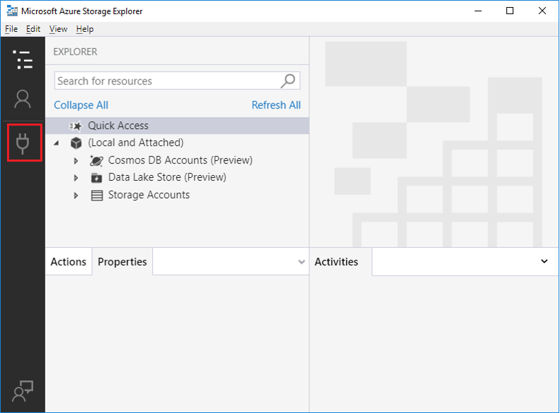
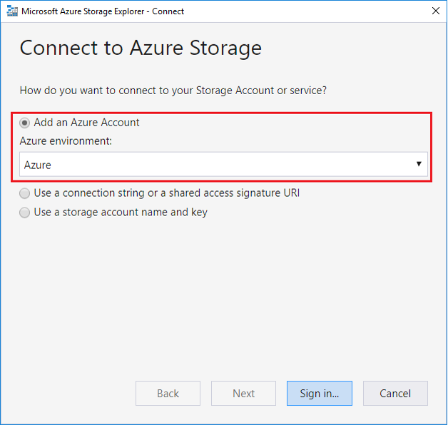
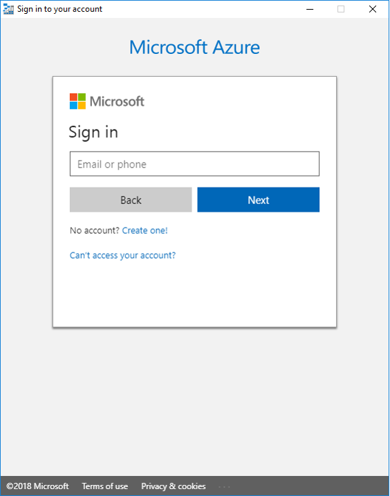
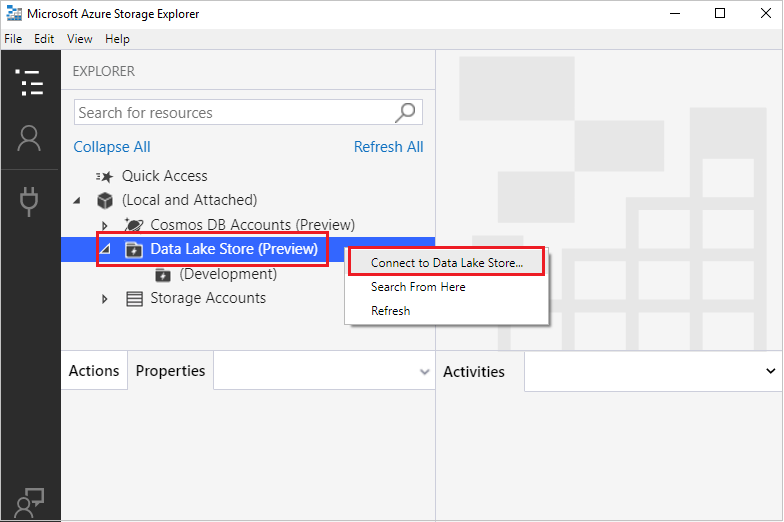
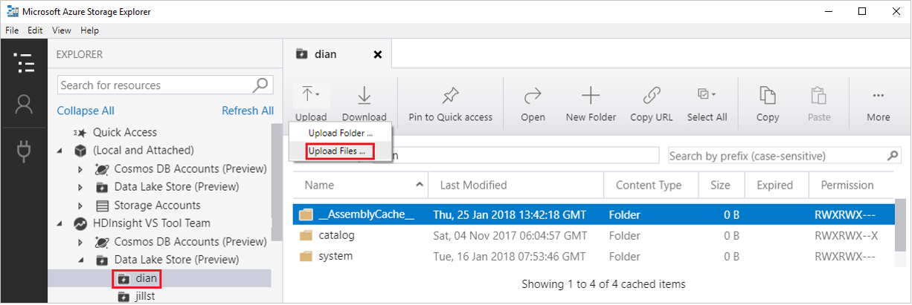
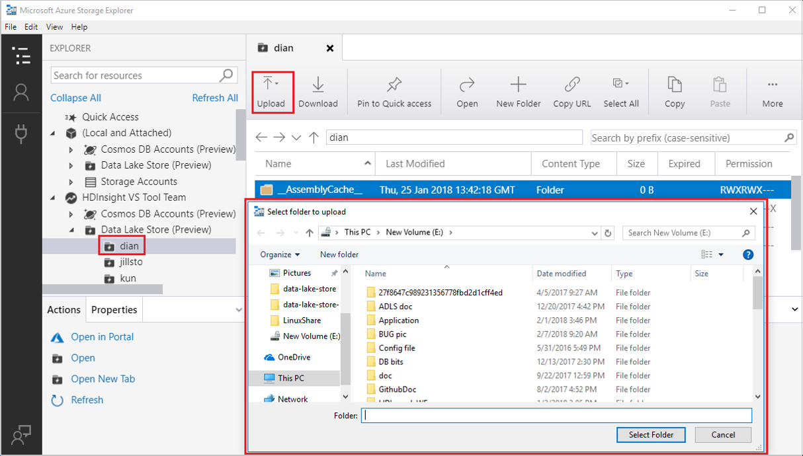
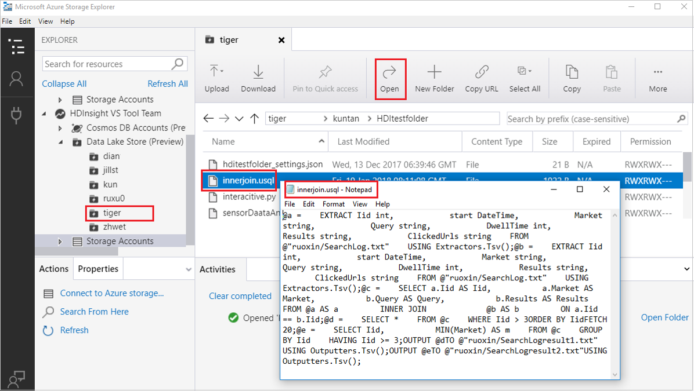
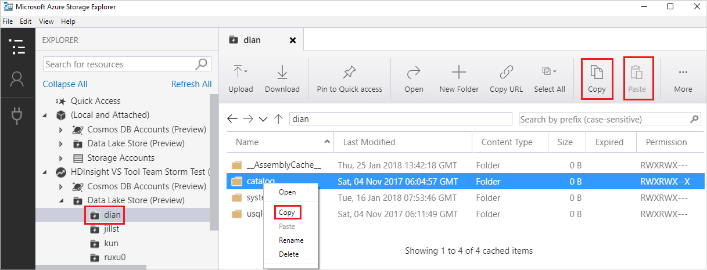
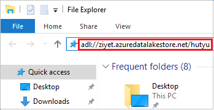

# Manage Azure Data Lake Store resources with Storage Explorer (preview)

[Azure Data Lake Store(ADLS)](https://docs.microsoft.com/en-us/azure/data-lake-store/data-lake-store-overview) is a service for storing large amounts of unstructured data, such as text or binary data. User can get access to the data from anywhere via HTTP or HTTPS. ADLS in Azure Storage Explorer enables users to access and manage ADLS data and resources along with other Azure entities like blob and queue. Now users can use the same tool to manage their different Azure entities in one place.

Another advantage is that users do not need to have subscription permission to manage ADLS data. In Storage Explorer, users can attach the ADLS path to "Local and Attached" node as long as others grant the permission.

## Prerequisites
To complete the steps in this article, you need the following prerequisites:

*	An Azure subscription. See [Get Azure free trial](https://azure.microsoft.com/pricing/free-trial).
*	An Azure Data Lake Store account. For instructions on how to create one, see [Get Started with Azure Data Lake Store](https://docs.microsoft.com/en-us/azure/data-lake-store/data-lake-store-get-started-portal)

## Installation

Install the newest Azure Storage Explorer bits here: [Azure Storage Explorer](https://azure.microsoft.com/features/storage-explorer/). Now we support Windows, Linux, and MAC version.

## Connect to an Azure subscription

1. After installing the **Azure Storage Explorer**, click the **plug-in** icon on the left as shown in the following image.
       
   
 
2. Select **Add an Azure Account**, and then click **Sign-in**.

   

2. In the **Azure Sign in** dialog box, select **Sign in**, and then enter your Azure credentials.

    

3. Select your subscription from the list and then click **Apply**.

    

    The Explorer pane updates and displays the accounts in the selected subscription.

    

    You have successfully connected to your **Azure Data Lake Store** to your Azure subscription.

## Connect to Data Lake Store
If you want to get access to the resources, which do not exist in your subscription. But others grant you to get the Uri for the resources. In this case, you can connect to Data Lake Store using the Uri after you have signed in. Refer to following steps.
1. Open Storage Explorer (Preview).
2. In the left pane, expand **Local and Attached**.
3. Right-click **Data Lake Store**, and - from the context menu - select **Connect to Data Lake Store...**.

      

4. Enter the Uri, then the tool navigates to the location of the URL you just entered.

      

      

## Azure Data Lake Store resources management

You can manage Azure Data Lake Store resources by doing following operations:
*	Navigate  ADLS resources across multiple ADL accounts.  
*	Use connection string to connect to and manage ADLS directly. 
*	View ADLS resources shared by others through ACL under Local & Attached.
*	Perform File/Folder CRUD Operations: support recursive folder and multi-selected files. 
*	Drag, drop and add folder to quick access and recent locations, which mirrors desktop file explorer experience. 
*	Copy and open ADL hyperlink with Storage Explorer with one click. 
*	Display activity log in the lower right pane to view activity status.
*	Display folder statistics and file property.

## View an Azure Data Lake Store account's contents
An Azure Data Lake Store account's resources contain folders and files.

The following steps illustrate how to view the contents of an ADLS account within Storage Explorer (Preview):

1. Open Storage Explorer (Preview).
2. In the left pane, expand the subscription containing the Azure Data Lake Store account you wish to view.
3. Expand **Data Lake Store**.
4. Right-click the Azure Data Lake Store account node you wish to view, and - from the context menu - select **Open**. You can also double-click the ADLS account to open. 
5. The main pane displays the ADLS account's contents.

      

## Manage resources in Azure Storage Explorer
Once you've created an Azure Data Lake Store account, you can upload folders and files, download, and open resources on your local computer. And you can pin to quick access, new folder, copy URL, select All. In addition, you are able to copy, paste, rename, delete, folder statistics, refresh.

The following items illustrate how to manage resources within an Azure Data Lake Store account. Follow these steps depending on the task you wish to perform:
   * **Upload files**

     1. On the main pane's toolbar, select **Upload**, and then **Upload Files...** from the drop-down menu.

         

     2. In the **Select files to Upload** dialog, select the files you wish to upload.

        

     3. Select **Open** to begin upload.
   * **Upload a folder**

     1. On the main pane's toolbar, select **Upload**, and then **Upload Folder...** from the drop-down menu.

         
     2. In the **Select folder to Upload** dialog, select a folder you wish to upload.

              

     3. Select **Select Folder** to begin upload folders.

         

      > [!NOTE] 
          > You can directly drag the folders and files in local computer to implement uploading. 
       
   * **Download folders or files to your local computer**

     1. Select the folders or files you wish to download.
     2. On the main pane's toolbar, select **Download**.
     3. In the **Select a folder to save the downloaded files into** dialog, specify the location where you want folders or files downloaded. And specify the name you wish to give it.
     4. Select **Save**.
   * **Open folder or file from your local computer**

     1. Select the folder or file you wish to open.
     2. On the main pane's toolbar, select **Open** or right-click the selected folder or file, from the context menu, click **open**.
     3. The file is downloaded and opened using the application associated with the files' underlying file type. Or the folder is opened in the main pane.

         

   * **Copy folders or files to the clipboard**

     1. Select the folders or files you wish to copy.
     2. On the main pane's toolbar, select **Copy** right-click the selected folders or files, from the context menu, click **Copy**.
     3. In the left pane, navigate to another ADLS account, and double-click it to view it in the main pane.
     4. On the main pane's toolbar, select **Paste** to create a copy. Or click context menu **Paste** on the destination.

        

      > [!NOTE] 
          > + Copy-Paste across storage type **is not** supported. You can copy ADLS folders or files and paste to another ADLS account. But you **cannot** copy ADLS folders or files and paste to blob storage or the other way around. 
          > + The Copy-Paste works by downloading the folders or files to local and then upload to the destination. The tool **does not** perform the action in the backend. Copy-Paste on large files is slow. The optimization of high-performance file copy-move is undergoing.
   * **Delete folders or files**

     1. Select the folders or files you wish to delete.
     2. On the main pane's toolbar, select **Delete**, or right-click the selected folders or files, from the context menu, click **Delete**.
     3. Select **Yes** on the confirmation dialog.

        

   * **Pin to Quick access**

     1. Select the folder you wish to pin.
     2. On the main pane's toolbar, select **Pin to Quick access**.
     3. In the left pane, you see the selected folder is added to **Quick Access** node.

        
     4. After Create the quick access, you can easily get access to the resources.
   * **Deep Links**
     1. If you have a URL, you can just enter the URL into the address path in **File Explorer** or browser.
     2. Then **Storage Explorer.exe** is launched automatically to navigate to the location of the URL you just entered.

        

## Next steps
* View the [latest Storage Explorer (Preview) release notes and videos](http://www.storageexplorer.com).
* Learn how to [create applications using Azure blobs, tables, queues, and files](https://azure.microsoft.com/documentation/services/storage/).
* Learn how to [Manage Azure Cosmos DB in Azure Storage Explorer](https://docs.microsoft.com/en-us/azure/cosmos-db/tutorial-documentdb-and-mongodb-in-storage-explorer)
