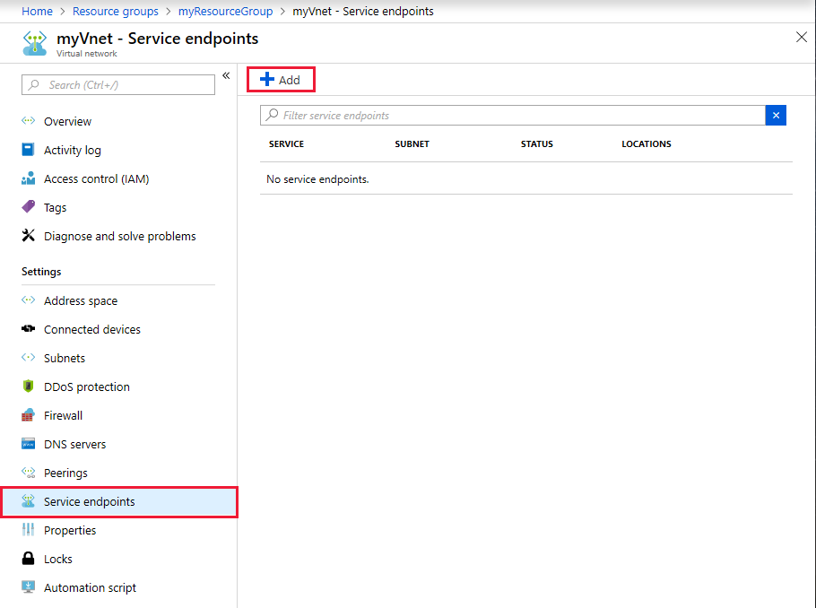
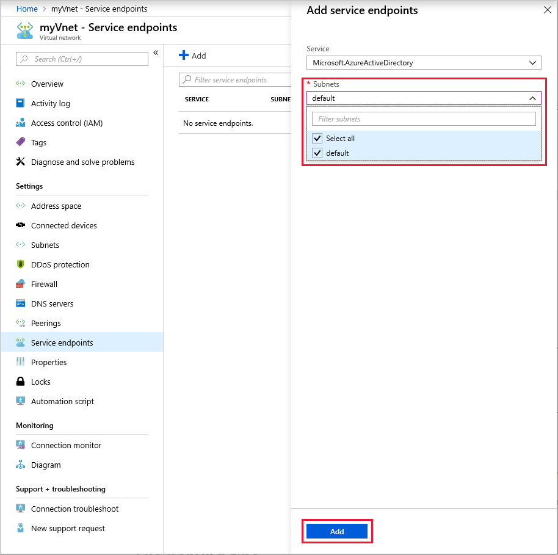
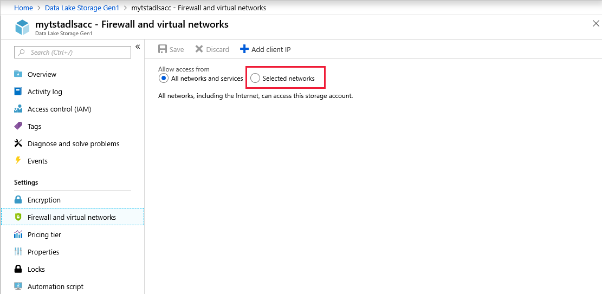
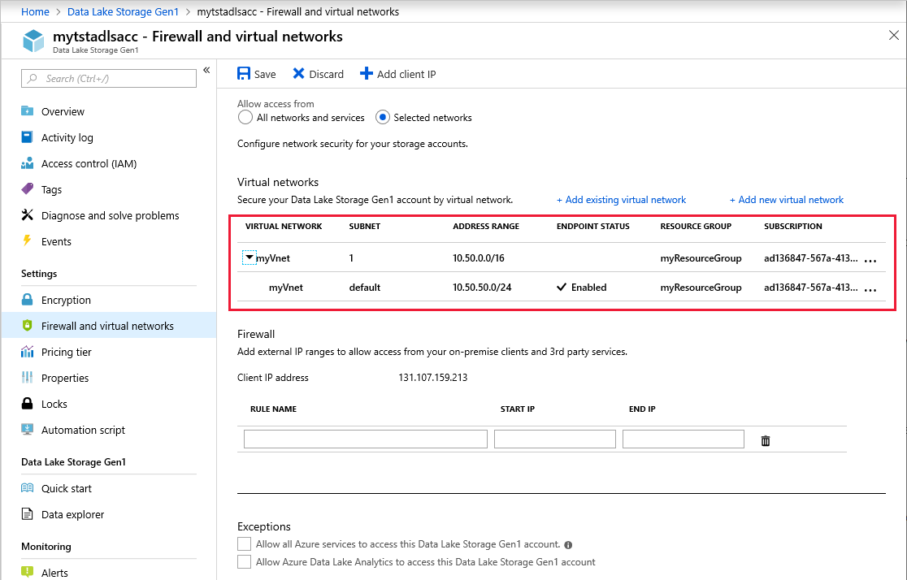
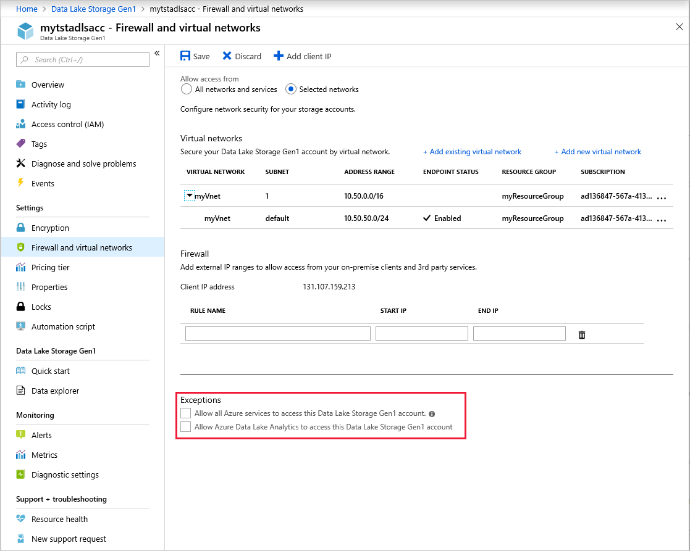

# Virtual Network integration for Azure Data Lake Storage Gen1 - Preview

This article introduces Virtual Network integration for Azure Data Lake Storage Gen1 (in preview). With VNet integration, you can prevent unauthorized access to your Azure Data Lake Storage Gen1 accounts. You can lock these accounts to your specific virtual networks and subnets. You can now configure your Data Lake Storage Gen1 account to accept traffic only from the designated virtual vetworks and subnets and block access from everywhere else. This feature helps secure your Data Lake Storage account from external threats.

VNet integration for Data Lake Storage Gen1 makes use of the virtual network service endpoint security between your virtual network and Azure Active Directory to generate additional security claims in the access token. These claims are then used for authenticating your virtual network to your Data Lake Storage Gen1 account and allowing access.

> [!NOTE]
> This is a preview technology. We don't recommend it for use in production environments.
>
> There's no additional charge associated with using these capabilities. Your account is billed at the standard rate for Data Lake Storage Gen1 ([pricing](https://azure.microsoft.com/pricing/details/data-lake-store/?cdn=disable)) and all Azure services that you use ([pricing](https://azure.microsoft.com/pricing/#product-picker)).

## Scenarios for VNET Integration for Data Lake Storage Gen1

With Data Lake Storage Gen1 VNet Integration, you can restrict access to your Data Lake Storage Gen1 account from designated virtual networks and subnets. Other VNets/VMs in Azure will not be allowed access to your account after it's locked to the specified VNet subnet. Functionally, Data Lake Storage Gen1 VNet Integration enables the same scenario as [virtual network service endpoints](https://docs.microsoft.com/azure/virtual-network/virtual-network-service-endpoints-overview). A few key differences are detailed in the following sections. 


> [!NOTE]
> The existing IP firewall rules can be used in addition to VNet rules to allow access from on-premises networks as well. 

## Optimal routing with Data Lake Storage Gen1 VNet integration

A key benefit of VNet service endpoints is [optimal routing](https://docs.microsoft.com/azure/virtual-network/virtual-network-service-endpoints-overview#key-benefits) from your virtual network. You can perform the same route optimization to Data Lake Storage Gen1 accounts. Use the following [user-defined routes](https://docs.microsoft.com/azure/virtual-network/virtual-networks-udr-overview#user-defined) from your VNet to your Data Lake Storage Gen1 account:

- **Data Lake Storage Public IP Address** – Use the public IP address for your target Data Lake Storage Gen1 accounts. To identify the IP addresses for your Data Lake Storage Gen1 account, [resolve the DNS names](https://docs.microsoft.com/azure/data-lake-store/data-lake-store-connectivity-from-vnets#enabling-connectivity-to-azure-data-lake-storage-gen1-from-vms-with-restricted-connectivity) of your accounts. Create a separate entry for each address.

```azurecli
# Create a Route table for your resource group
az network route-table create --resource-group $RgName --name $RouteTableName

# Create Route Table Rules for Data Lake Storage Public IP Addresses
# There will be one rule per Data Lake Storage Public IP Addresses 
az network route-table route create --name toADLSregion1 --resource-group $RgName --route-table-name $RouteTableName --address-prefix <ADLS Public IP Address> --next-hop-type Internet

# Update the VNet and apply the newly created Route Table to it
az network vnet subnet update --vnet-name $VnetName --name $SubnetName --resource-group $RgName --route-table $RouteTableName
```

## Data exfiltration from the customer VNet

In addition to securing the Data Lake Storage accounts for access from Virtual Network, you might want to make sure there's no exfiltration to an unauthorized account.

Use a firewall solution in your VNet to filter the outbound traffic based on the destination account URL and allow access to only authorized Data Lake Storage Gen1 accounts.

Some available options are:
- [Azure Firewall](https://docs.microsoft.com/azure/firewall/overview): You can [deploy and configure an Azure Firewall](https://docs.microsoft.com/azure/firewall/tutorial-firewall-deploy-portal) for your VNet You can secure the outbound Data Lake Storage traffic and lock it down to the known and authorized account URL.
- [Network Virtual Appliance](https://azure.microsoft.com/solutions/network-appliances/) Firewall: Your administrator might authorize use of only certain commercial firewall vendors. Use an NVA firewall solution available at the Azure Marketplace to perform the same function.

> [!NOTE]
> Using Firewalls in the data path introduces an additional hop in the data path. It might affect the network performance for end-to-end data exchange. This include throughput available and connection latency. 

## Limitations
1.	HDInsight clusters must be newly created after they're added to the preview. Clusters created before Data Lake Storage Gen1 VNet integration support was available must be re-created to support this new feature.
 
2.	When you create a new HDInsight cluster, selecting an Data Lake Storage Gen1 account with VNet integration enabled causes the process to fail. First disable the VNet rule, or you can select **Allow access from all networks and services** on the **Firewall and virtual networks** blade of the Data Lake Storage account. For more information, see the [Exceptions](##Exceptions) section.

3.	The Data Lake Storage Gen1 VNet integration preview does not work with [managed identities for Azure resources](https://docs.microsoft.com/azure/active-directory/managed-identities-azure-resources/overview).
  
4.	File/folder data in your VNet-enabled Data Lake Storage Gen1 account isn't accessible from the portal.  This includes access from a VM that’s within the VNET and activities such as using Data Explorer. Account management activities continue to work. File and folder data in you VNET-enabled Data Lake Storage account is accessible via all non-portal resources. These resources include SDK access, PowerShell scripts, and other Azure services when they don't originate from the portal. 

## Configuration

### Step1: Configure your VNET to use AAD Service Endpoint

1.	Go to the Azure portal and log into your account.
 
2.	[Create a new virtual network ](https://docs.microsoft.com/azure/virtual-network/quick-create-portal)in your subscription, or go to an existing virtual network. The VNET must be in the same region as the Data Lake Storage Gen 1 account.
 
3.	From the Virtual network blade, select **Service endpoints**.
 
4.	Select **Add** to add a new service endpoint.

    

5.	Select **Microsoft.AzureActiveDirectory** as the service for the endpoint.

     

6.	Select the subnets for which you intend to allow connectivity, and select **Add**.

    

7.	It can take up to 15 minutes for the service endpoint to be added. After it's added, it shows up in the list. Verify that it shows up and that all details are as configured.
 
    

### Step 2: Set up the allowed VNET/subnet for your Data Lake Storage Gen1 account

1.	After you configure your VNET, [create a new Azure Data Lake Storage Gen1 account](data-lake-store-get-started-portal.md#create-a-data-lake-storage-gen1-account) in your subscription. Or go to an existing Data Lake Storage Gen1 account. The Data Lake Storage Gen1 account must be in the same region as the VNET.
 
2.	Select **Firewall and virtual networks**.

    > [!NOTE]
    > If you don't see **Firewall and virtual networks** in the settings, log off the portal. Close the browser, and clear the browser cache. Restart the machine and retry.

       

3.	Select **Selected networks**.
 
4.	Select **Add existing virtual network**.

    

5.	Select the VNets and subnets to allow for connectivity, and then select **Add**.

    

6.	Ensure that the VNets and subnets show up correctly in the list, and select **Save**.

    

  > [!NOTE]
  > It might take up to 5 minutes for the settings to take into effect after you save.

7.	[Optional] In addition to VNets and subnets, to allow connectivity from specific IP addresses, you can do that in the **Firewall** section on the same page. 

## Exceptions
Two check boxes in the Exceptions area on the **Firewall and virtual networks** blade enable connectivity from a set of services and virtual machines on Azure.

- **Allow all Azure services to access this Data Lake Storage Gen1 account** allows all Azure services such as Azure Data Factory, Event Hubs, all Azure VMs, etc… to communicate to your Data Lake Storage account.

- **Allow Azure Data Lake Analytics to access this Data Lake Storage Gen1 account** allows the Azure Data Lake Analytics service connectivity to this Data Lake Storage account. 

We recommend that you keep these exceptions turned off. Turn them on only if you need connectivity from these other services from outside of your VNet.
