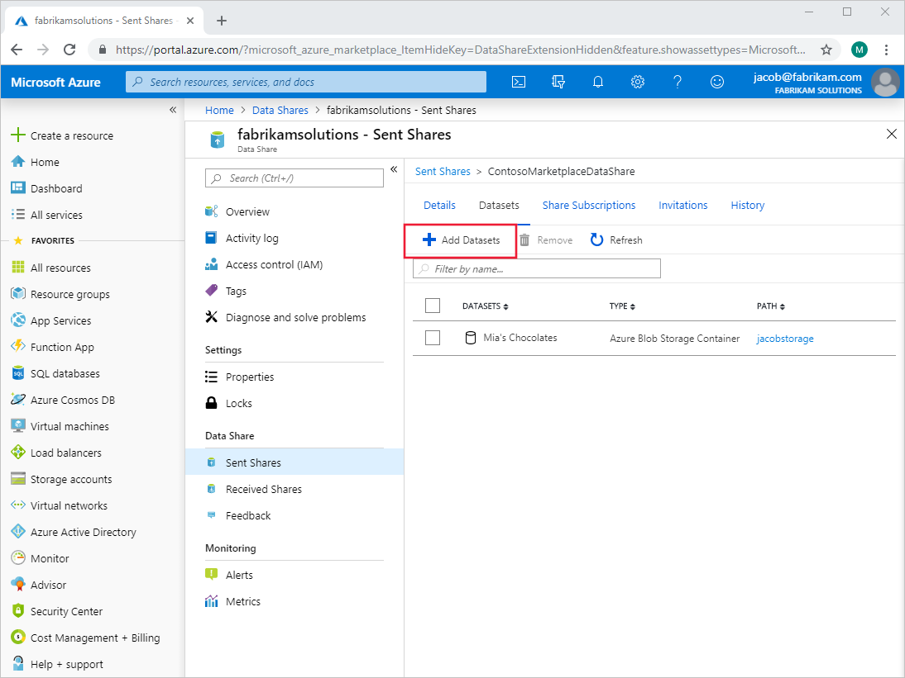
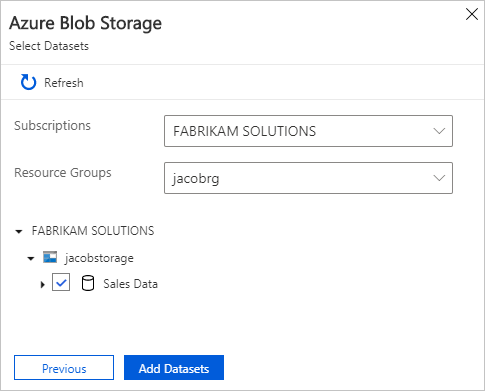

# How to add datasets to an existing share in Azure Data Share

This article explains how to add datasets to a pre-existing data share using Azure Data Share. This allows you to share more data with the same recipients without having to create a new share.

For information on how to add datasets as you create a share, see the [Share data](share-your-data.md) tutorial.

## Navigate to a sent data share

In Azure Data Share, navigate to your sent share and select the **Datasets** tab. Click **+ Add Datasets** button to add more datasets.

In the panel on the right, select the dataset type you would like to add and then click **Next**. Select the subscription and resource group of the data you would like to add. Using the dropdown arrows, find and then check the box next to the data to add.

Once you click **Add Datasets**, the datasets will be added to your share. 
Note: A snapshot must be triggered by your consumers in order for them to see the new datasets. If there are snapshot settings configured, consumers will see the new datasets once the next scheduled snapshot completes. 
Without snapshot settings configured, the consumer must manually trigger a full or incremental copy of the data to receive the updates. 
For more information on snapshots, see [Snapshots](terminology.md).

## Next steps
Learn more about how to [add recipients to an existing data share](how-to-add-recipients.md).