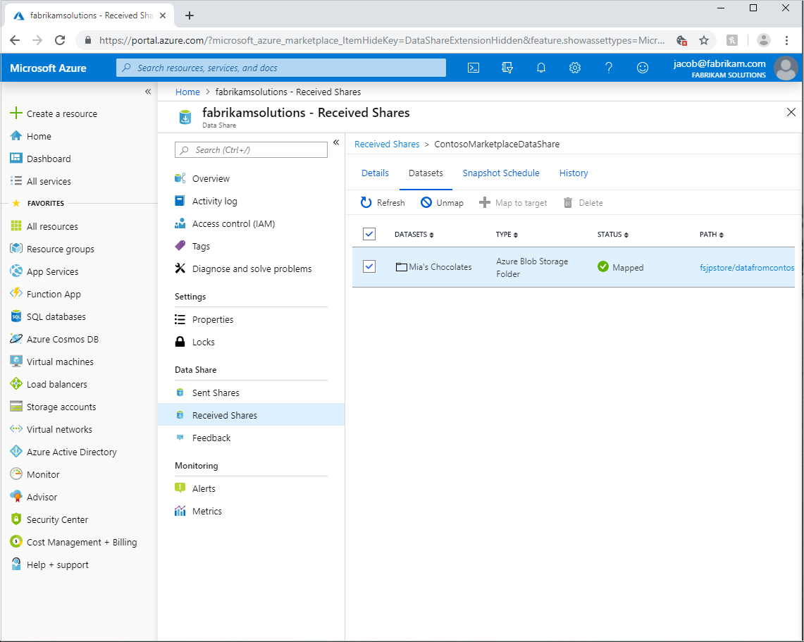

# How to configure a dataset mapping for a received share in Azure Data Share

This article explains how to configure a dataset mapping for a Received Share using Azure Data Share. You'll want to do this if you accepted a data share invitation but opted to "Accept and configure later". Otherwise, you may simply want to change the destination storage account for your received data. 

## Navigate to a received data share

In the Azure Data Share service, navigate to your received share and select the **Details** tab. 

 

Check the box next to the dataset you'd like to assign a destination to, and click **+ Map to target**. You may need to unmap first if you had already configured a destination storage account and you want to change the mapping to a different storage account. 

 

## Select a new storage account 

Select a storage account that you'd like the data to land in. Note that any data that already exists in any previously mapped storage accounts will not be automatically moved to the new storage account.

 

## Next steps

To learn how to start sharing data, continue to the [share your data](share-your-data.md) tutorial.

