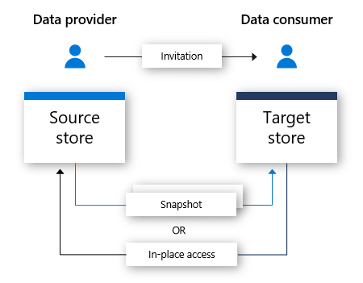

# What is Azure Data Share Preview?

Azure Data Share Preview empowers organizations to simply and securely share data with multiple customers and partners. In just a few clicks, you can provision a new data share account, add datasets, and invite your customers and partners to your data share. 

Azure Data Share makes it easy for you to manage and monitor data that you have shared with customers and partners. Data providers can monitor and track who and what they've shared with external organizations. 

Azure Data Share ensures that the data provider is always in control. Data consumers must accept your terms of use before they can receive data. Data providers can also specify the frequency at which their data consumers receive updates. Access to new updates can be revoked by the data provider. 

Azure Data Share helps enhance insights by making it easy to combine internal data with third-party data to enrich analytics use cases. Easily use the power ot Azure analytics tools to prepare, process, and analyze data shared using Azure Data Share. 

# How it works

Azure Data Share uses a snapshot-based sharing approach, where data is shared through data movement. As a data provider, you provision a data share and invite recipients to the data share. Data consumers receive an invitation to your data share via e-mail. Once a data consumer accepts the invitation, they can trigger a full snapshot of the data shared you shared them. This data is received into the data consumers storage account. Data consumers can receive regular, incremental updates to the data shared with them so that they always have the latest version of the data. 

## Key capabilities

Azure Data Share enables Data Providers to:

* Share data from Azure Storage and Azure Data Lake Store with customers and partners outside of your organization

* Keep track of who you have shared your data with

* How frequently your data consumers are receiving updates to your data

* Allow your customers to pull the latest version of your data as needed, or allow them to automatically receive incremental changes to your data at an interval defined by you

Azure Data Share enables Data Consumers to: 

* View a description of the type of data being shared

* View terms of use for the data

* Accept or reject an Azure Data Share invitation

* Trigger a full or incremental snapshot of a Data Share that an organization has shared with you

* Subscribe to a Data Share to receive the latest copy of the data through incremental snapshot copy

* Accept data shared with you into an Azure Blob Storage or Azure Data Lake Gen2 account

All key capabilities listed above are supported through the Azure or via REST APIs. For more details on using Azure Data Share through REST APIs, check out our reference documentation. 

# Pricing

Azure Data Share Preview bills for two components:
1. Management

Azure Data Share charges for the volume of datasets managed by your Data Share account. While in preview, Data Share Management will be free.

1. Dataset Movement

Azure Data Share charges for the movement of data from the data provider’s Azure tenant to the data consumer’s Azure tenant. You pay for dataset movement per dataset movement operation and the compute required to move a dataset. Dataset movement compute is charged per vCore-hour. Dataset movement compute charges are prorated by the minute in and rounded up. While in preview, dataset movement operations are free. 

For more information about pricing, visit the Azure Data Share [pricing page](https://azure.microsoft.com/pricing/).