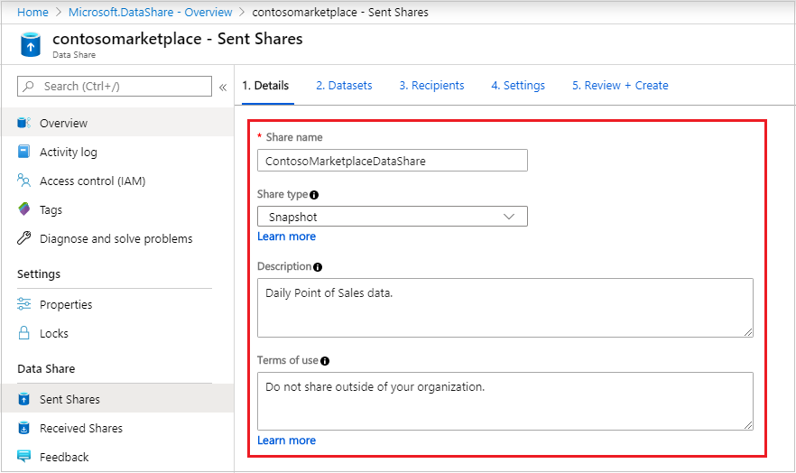

# Tutorial: Share your data using Azure Data Share Preview

Learn how to share data from Azure Blob Storage or Azure Data Lake Store using Azure Data Share. 

In this tutorial, you'll learn how to:

> [!div class="checklist"]
> * Create a Data Share.
> * Add datasets to your Data Share.
> * Enable a synchronization schedule for your Data Share. 
> * Add recipients to your Data Share. 

## Prerequisites

* If you don't have an Azure subscription, create a [free Azure account](https://azure.microsoft.com/free/) before you begin.
* Azure Storage account, Azure Data Lake account or both

## Sign in to the Azure portal

Sign in to the [Azure portal](https://portal.azure.com/).

## Create a Data Share Account

Create an Azure Data Share resource in an Azure resource group.

1. Select the **Create a resource** button (+) in the upper-left corner of the  portal.

1. Search for *Azure Data Share*.

1. Under **Azure Data Share**, at the bottom of the screen, select **Create**.

1. Fill out the basic details of your Azure Data Share resource with the following information. 

     **Setting** | **Suggested value** | **Field description**
    |---|---|---|
    | Name | *datashareacount* | Specify a name for your data share account. |
    | Subscription | Your subscription | Select the Azure subscription that you want to use for your data share account.|
    | Resource group | *test-resource-group* | Use an existing resource group or create a new resource group. |
    | Location | *East US 2* | Select a region for your data share account.
    | | |

1. Select **New** to provision your data share account. Provisioning a new data share account typically takes about 1 minute or less. 

1. When the deployment is complete, select **Go to resource**.

## Create a Data Share

1. In your data share account, select 'Start sharing your data'. 

    

1. Select **Create**.
   

1. Fill out the details for your Data Share. Specify a name, description of share contents, and terms of use (optional). 

     

1. Click **Continue**

1. To add Datasets to your Data Share, click **Add Datasets**. 

    

1. Select the dataset type that you would like to add. Navigate to the object you would like to share and click 'Add Datasets'. 

1. Click **Continue**

1. In the Recipients tab, enter in the email addresses of your Data Consumer by selecting '+ Add Recipient'. 

1. Click **Continue**

1. If you would like to offer a synchronization schedule for your Data Consumer, enable the scheduled refresh slider shown below and select a recurrence interval. 

1. Select a start time and recurrence interval. 

1. Click **Continue**

1. In the Review + Create tab, review your Package Contents, Settings, Recipients, and Synchronization Settings. Click **Create**

Your Azure Data Share has now been created and the recipient of your Data Share is now ready to accept your invitation. 

## Next steps
In this tutorial, you learnt how to create an Azure Data Share and invite recipients. To learn about how a Data Consumer can accept and receive a data share, continue to the next tutorial. 

> [!div class="nextstepaction"]
> [Tutorial: Accept and receive data](subscribe-to-data-share.md)