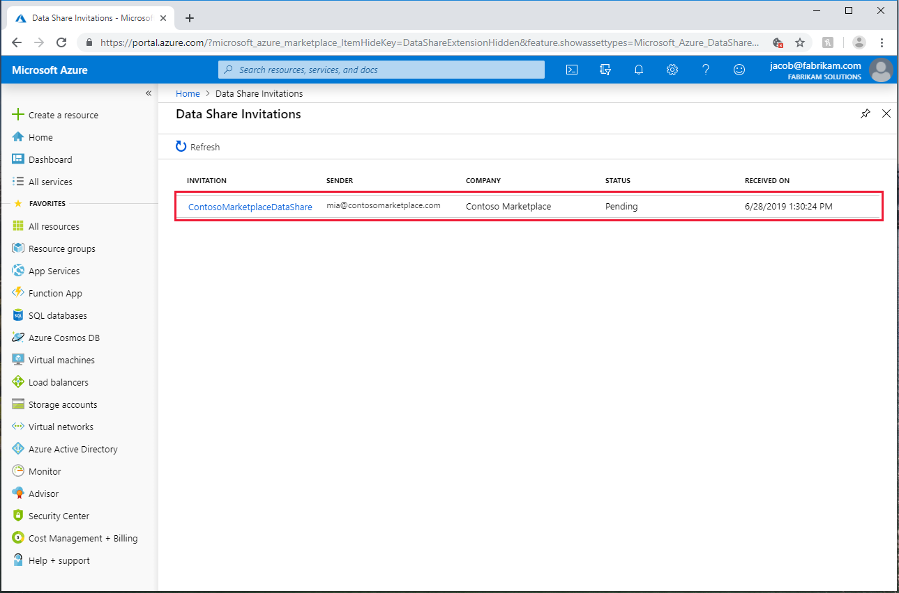
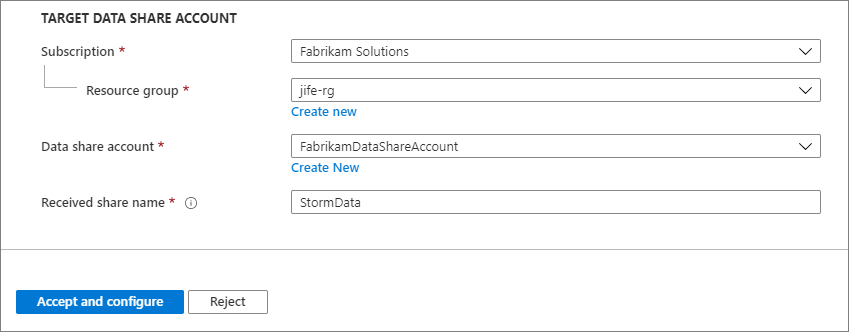

# Tutorial: Accept and receive data using Azure Data Share Preview

In this tutorial, you will learn how to accept a data share invitation using Azure Data Share Preview. You will learn how to receive data being shared with you, as well as how to enable a regular refresh interval to ensure that you always have the most recent snapshot of the data being shared with you. 

> [!div class="checklist"]
> * How to accept an Azure Data Share Preview invitation
> * Create an Azure Data Share Preview account
> * Specify a destination for your data
> * Create a subscription to your data share for scheduled refresh

## Prerequisites
Before you can accept a data share invitation, you must provision a number of Azure resources, which are listed below. 

Ensure that all pre-requisites are complete before accepting a data share invitation. 

* Azure Subscription: If you don't have an Azure subscription, create a [free account](https://azure.microsoft.com/free/) before you begin.
* An Azure Storage account: If you don't already have one, you can create an [Azure Storage account](https://docs.microsoft.com/azure/storage/common/storage-quickstart-create-account). 
* A Data Share invitation: An invitation from Microsoft Azure with a subject titled "Azure Data Share invitation from **<yourdataprovider@domain.com>**".
* Permission to add role assignment to the storage account, which is present in the *Microsoft.Authorization/role assignments/write* permission. This permission exists in the owner role. 
* Resource Provider registration for Microsoft.DataShare. See [Azure resource Providers](https://docs.microsoft.com/azure/azure-resource-manager/resource-manager-supported-services) for information on how to do this. 

> [!IMPORTANT]
> To accept and receive an Azure Data Share, you must first register the Microsoft.DataShare resource provider and you must be an owner of the storage account that you accept data into. Follow the instructions documented in [Troubleshoot Azure Data Share Preview](data-share-troubleshoot.md) to register the data share resource provider as well as add yourself as an owner of the storage account. 

## Sign in to the Azure portal

Sign in to the [Azure portal](https://portal.azure.com/).

## Open invitation

Check your inbox for an invitation from your data provider. The invitation is from Microsoft Azure, titled **Azure Data Share invitation from <yourdataprovider@domain.com>**. Take note of the share name to ensure you're accepting the correct share if there are multiple invitations. 

Select on **View invitation** to see your invitation in Azure. This takes you to your Received Shares view.

 

Select the share you would like to view. 

## Accept invitation
Make sure all fields are reviewed, including the **Terms of Use**. If you agree to the terms of use, you'll be required to check the box to indicate you agree. 

 

Under *Target Data Share Account*, select the Subscription and Resource Group that you'll be deploying your Data Share into. 

For the **Data Share Account** field, select **Create new** if you don't have an existing Data Share account. Otherwise, select an existing Data Share account that you'd like to accept your data share into. 

For the *Received Share Name* field, you may leave the default specified by the Data Provide, or specify a new name for the received share. 

 

Once you've agreed to the terms of use and specified a location for your share, Select on *Accept and Configure*. If you chose this option, a share subscription will be created and the next screen will ask you to select a target storage account for your data to be copied into. 

 

If you prefer to accept the invitation now but configure your storage at a later time, Select *Accept and Configure later*. This option allows you to configure your target storage account later. To continue configuring your storage later, see [how to configure your storage account](how-to-configure-mapping.md) page for detailed steps on how to resume your data share configuration. 

If you don't want to accept the invitation, Select *Reject*. 

## Configure storage
Under *Target Storage Settings*, select the Subscription, Resource group, and storage account that you'd like to receive your data into. 

 

To receive regular refreshes of your data, make sure you enable the snapshot settings. Note that you will only see a snapshot setting schedule if your data provider has included it in the data share. 

 

Select *Save*. 

## Trigger a snapshot

You can trigger a snapshot in the Received Shares -> Details tab by selecting **Trigger snapshot**. Here, you can trigger a full or  incremental snapshot of your data. If it is your first time receiving data from your data provider, select full copy. 

 

When the last run status is *successful*, open the storage account to view the received data. 

To check which storage account you used, Select on **Datasets**. 

 

## View history
To view a history of your snapshots, navigate to Received Shares -> History. Here you'll find a history of all snapshots that were generated for the past 60 days. 

## Next steps
In this tutorial, you learnt how to accept and receive an Azure Data Share. To learn more about Azure Data Share concepts, continue to [Concepts: Azure Data Share Terminology](terminology.md).