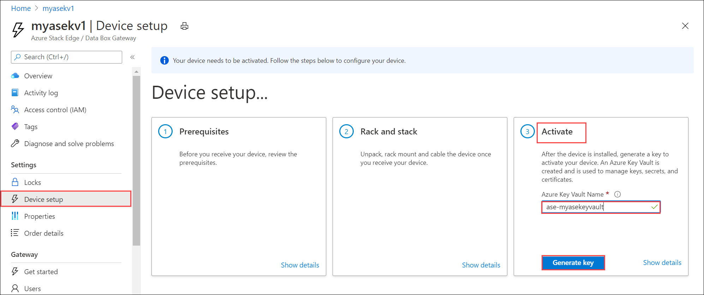

# Azure Key Vault integration with Azure Stack Edge 

Azure Key Vault is integrated with Azure Stack Edge resource for secret management. This article provides details on how an Azure Key Vault is created for Azure Stack Edge resource during device activation and is then used for secret management. 

## About Key vault and Azure Stack Edge

Azure Key Vault cloud service is used to securely store and control access to tokens, passwords, certificates, API keys, and other secrets. Key Vault also makes it easy to create and control the encryption keys used to encrypt your data. For more information about allowed transactions and corresponding charges, see [Pricing for Azure Key Vault](https://azure.microsoft.com/pricing/details/key-vault/).

For Azure Stack Edge service, one of the secrets used is Channel Integrity Key (CIK). This key allows you to encrypt your secrets. With the integration of key vault, the CIK is securely stored in the key vault. For more information, see [Securely store secrets and keys](../key-vault/general/overview.md#securely-store-secrets-and-keys).

## Key vault creation

A key vault is created for Azure Stack Edge resource during the process of activation key generation. 

- When you create Azure Stack Edge resource, you need to register the *Microsoft.KeyVault* resource provider. The resource provider is automatically registered if you have owner or contributor access to the subscription. The key vault is created in the same subscription and the resource group as the Azure Stack Edge resource. 

- When you create an Azure Stack Edge resource, a Managed Service Identity (MSI) is also created that persists for the lifetime of the resource and communicates with the resource provider on the cloud. 

    When the MSI is enabled, Azure creates a trusted identity for the Azure Stack Edge resource.

- After you have created the Azure Stack Edge resource and you generate an activation key from the Azure portal, a key vault is created. This key vault is used for secret management and persists for as long as the Azure Stack Edge resource exists. 

    

- You can choose to accept the default key name or specify a custom name for the key vault. The key vault name must be from 3 to 24 characters long. You cannot use a key vault that is already in use. <!--The MSI is then used to authenticate to key vault to retrieve secrets.--> 

    

- To prevent accidental deletion, a resource lock is enabled on the key vault. A soft-delete is also enabled on the key vault that allows the key vault to be restored within 90 days if there is an accidental deletion. For more information, see [Azure Key Vault soft-delete overview](../key-vault/general/soft-delete-overview.md)

    If the key vault is accidentally deleted and the purge protection duration of 90 days hasn't elapsed, follow these steps to [Recover your key vault](../key-vault/general/soft-delete-powershell.md#recovering-a-key-vault). 

- If you had an existing Azure Stack Edge resource before the Azure Key Vault was integrated with Azure Stack Edge resource, you are not affected. You can continue to use your existing Azure Stack Edge resource. 

- When your Azure Stack Edge resource is deleted, the Azure Key Vault is also deleted with the resource. You are prompted for confirmation. If you do not intend to delete this key vault, you can choose to not provide consent. Only the Azure Stack Edge resource is deleted leaving the key vault intact. 

- If this key vault was used to store other keys, then you can still restore it within 90 days of deletion. During that purge protection period, the key vault name can't be used to create a new key vault.

If you run into any issues related to key vault and device activation, see [Troubleshoot device activation issues](azure-stack-edge-gpu-troubleshoot-activation.md).

<!--## Key vault secret management

When you generate an activation key, the following events occur:

1. You request an activation key in the Azure portal. The request is then sent to Key Vault resource provider. 
1. A standard tier key vault with access policy is created and is locked by default. This key vault uses the default name or the custom name that you specified.
1. The key vault authenticates with MSI the request to generate activation key. The MSI is also added to the key vault access policy and a channel integrity key is generated and placed in the key vault.
1. The activation key is returned to the Azure portal. You can then copy this key and use it in the local UI to activate your device.-->

## Next steps

- Learn more about how to [Generate activation key](azure-stack-edge-gpu-deploy-prep.md#get-the-activation-key).

