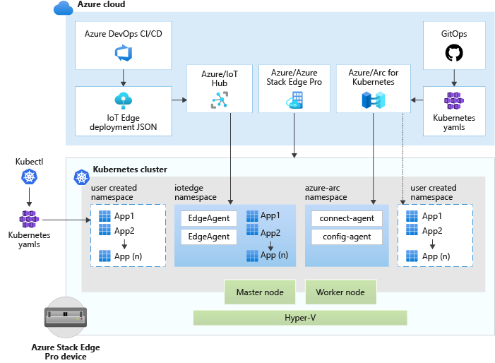

# Kubernetes workload management on your Azure Stack Edge Pro device

On your Azure Stack Edge Pro device, a Kubernetes cluster is created when you configure compute role. Once the Kubernetes cluster is created, then containerized applications can be deployed on the Kubernetes cluster in Pods. There are distinct ways to deploy workloads in your Kubernetes cluster. 

This article describes the various methods that can be used to deploy workloads on your Azure Stack Edge Pro device.

## Workload types

The two common types of workloads that you can deploy on your Azure Stack Edge Pro device are stateless applications or stateful applications.

- **Stateless applications** do not preserve their state and save no data to persistent storage. All of the user and session data stays with the client. Some examples of stateless applications include web frontends like Nginx, and other web applications.

    You can create a Kubernetes deployment to deploy a stateless application on your cluster. 

- **Stateful applications** require that their state be saved. Stateful applications use persistent storage, such as persistent volumes, to save data for use by the server or by other users. Examples of stateful applications include databases like MongoDB.

    You can create a Kubernetes deployment to deploy a stateful application. 

## Deployment flow

To deploy applications on an Azure Stack Edge Pro device, you will follow these steps: 
 
1. **Configure access**: First, you will use the PowerShell runspace to create a user, create a namespace, and grant user access to that namespace.
2. **Configure storage**: Next, you will use the Azure Stack Edge resource in the Azure portal to create persistent volumes using either static or dynamic provisioning for the stateful applications that you will deploy.
3. **Configure networking**: Finally, you will use the services to expose applications externally and within the Kubernetes cluster.
 
## Deployment types

There are three primary ways of deploying your workloads. Each of these deployment methodologies allows you to connect to a distinct namespace on the device and then deploy stateless or stateful applications.

- **Local deployment**: This deployment is through the command-line access tool such as `kubectl` that allows you to deploy Kubernetes `yamls`. You access the Kubernetes cluster on your Azure Stack Edge Pro via a `kubeconfig` file. For more information, go to [Access a Kubernetes cluster via kubectl](azure-stack-edge-gpu-create-kubernetes-cluster.md).

- **IoT Edge deployment**: This is through IoT Edge, which connects to the Azure IoT Hub. You connect to the Kubernetes cluster on your Azure Stack Edge Pro device via the `iotedge` namespace. The IoT Edge agents deployed in this namespace are responsible for connectivity to Azure. You apply the `IoT Edge deployment.json` configuration using Azure DevOps CI/CD. Namespace and IoT Edge management is done through cloud operator.

- **Azure/Arc deployment**: Azure Arc is a hybrid management tool that will allow you to deploy applications on your Kubernetes clusters. You connect to the Kubernetes cluster on your Azure Stack Edge Pro device via the `azure-arc namespace`. The agents deployed in this namespace are responsible for connectivity to Azure. You apply the deployment configuration by using the GitOps-based configuration management. 
    
    Azure Arc will also allow you to use Azure Monitor for containers to view and monitor your cluster. For more information, go to [What is Azure-Arc enabled Kubernetes?](https://docs.microsoft.com/azure/azure-arc/kubernetes/overview).

## Choose the deployment type

While deploying applications, consider the following information:

- **Single or multiple types**: You can choose a single deployment option or a mix of different deployment options.
- **Cloud versus local**: Depending on your applications, you can choose local deployment via kubectl or cloud deployment via IoT Edge and Azure Arc. 
    - When you choose a local deployment, you are restricted to the network in which your Azure Stack Edge Pro device is deployed.
    - If you have a cloud agent that you can deploy, you should deploy your cloud operator and use cloud management.
- **IoT vs Azure Arc**: Choice of deployment also depends on the intent of your product scenario. If you are deploying applications or containers that have deeper integration with IoT or IoT ecosystem, then select IoT Edge to deploy your applications. If you have existing Kubernetes deployments, Azure Arc would be the preferred choice.

## Next steps

To locally deploy an app via kubectl, see:

- [Deploy a stateless application on your Azure Stack Edge Pro via kubectl](azure-stack-edge-j-series-deploy-stateless-application-kubernetes.md).

To deploy an app via IoT Edge, see:

- [Deploy a sample module on your Azure Stack Edge Pro via IoT Edge](azure-stack-edge-gpu-deploy-sample-module.md).

To deploy an app via Azure Arc, see:

- [Deploy an application using Azure Arc](azure-stack-edge-gpu-deploy-arc-kubernetes-cluster.md).
