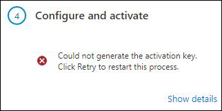
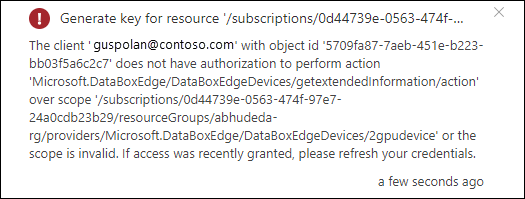

# Troubleshoot activation issues on your Azure Stack Edge Pro GPU device 

<!--[!INCLUDE [applies-to-skus](../../includes/azure-stack-edge-applies-to-all-sku.md)]-->

This article describes how to troubleshoot activation issues on your Azure Stack Edge Pro GPU device. 

## Activation errors

The following table summarizes the errors related to device activation and the corresponding recommended resolution.

| Error   message| Recommended   resolution |
|------------------------------------------------------|--------------------------------------|
| If the Azure Key Vault used for activation is deleted before the device is activated with the activation key, then you receive this error.     | If the key vault has been deleted, you can recover the key vault if the vault is in purge-protection duration. Follow the steps in [Recover a key vault](../key-vault/general/key-vault-recovery.md#recovering-a-key-vault).  If the purge-protection duration has elapsed, then the key vault cannot be recovered. Contact Microsoft Support for next steps. |
| If the Azure Key Vault is deleted after the device is activated, and you then try to perform any operation that involves encryption, for example: **Add User**, **Add Share**, **Configure Compute**, then you receive this error.       | If the key vault has been deleted, you can recover the key vault if the vault is in purge-protection duration. Follow the steps in Recover a key vault.  If the purge-protection duration has elapsed, then the key vault cannot be recovered. Contact Microsoft Support for next steps. |
| If the Channel Integrity Key in the Azure Key Vault is deleted and you, then try to perform any operations that involve encryption, for example: **Add User**, **Add Share**, **Configure Compute** - then you will receive this error.    | If the Channel Integrity Key in the key vault is deleted, but it is still within the purge duration, follow the steps in [Undo Key vault key removal](/powershell/module/az.keyvault/undo-azkeyvaultkeyremoval).  If the purge protection duration has elapsed, and if you have the key backed up, you can restore from the backup else you can't recover the key. Contact Microsoft Support for next steps. |
| If the activation key generation fails due to any error, then you receive this error. Additional details are present in the notification.      | Wait a few minutes and retry the operation. If the problem persists, contact Microsoft Support. |
| If the user has read-only permissions, then the user is not allowed to generate an activation key and this error is presented.    | This could be because you don't have the right access or  *Microsoft.KeyVault* is not registered.<li>Make sure that you have owner or contributor access at the resource group level used for your Azure Stack Edge resource.</li><li>Make sure that the Microsoft.KeyVault resource provider is registered. To register a resource provider, go to the subscription used for Azure Stack Edge resource. Go to **Resource providers**, search for *Microsoft.KeyVault* and select and **Register**.</li> |

## Next steps

- Learn more on how to [Troubleshoot device issues](azure-stack-edge-gpu-troubleshoot.md).