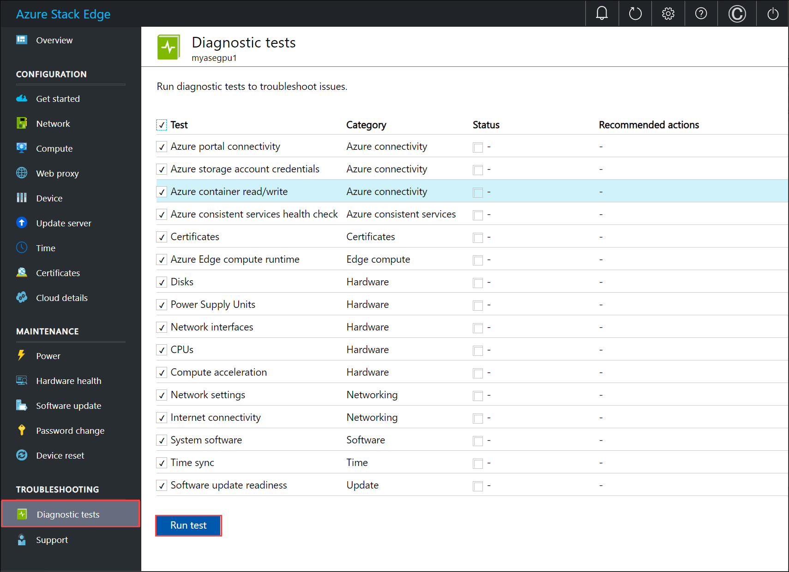
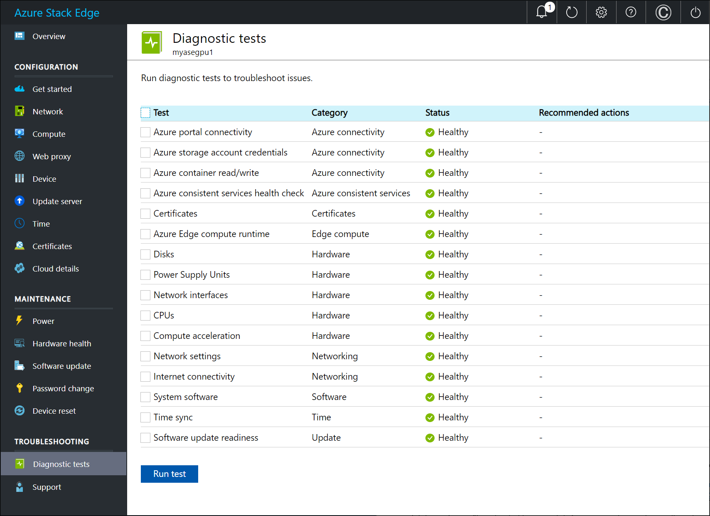
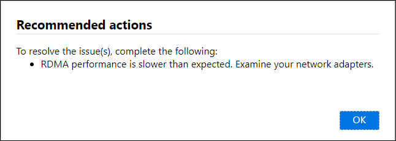
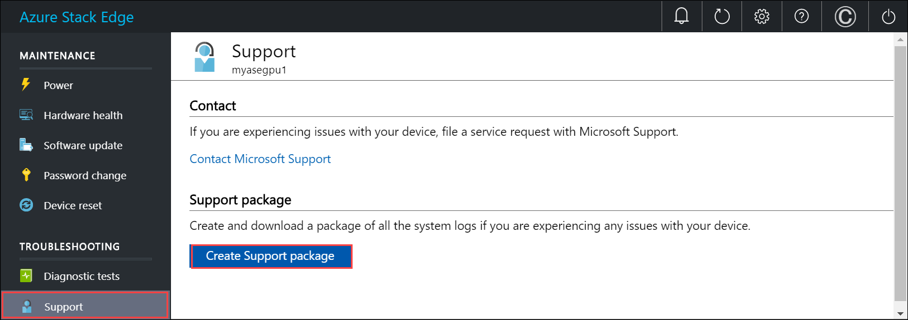
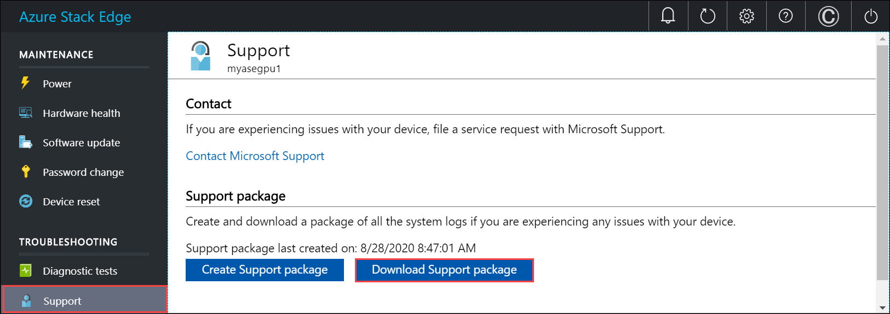

# Troubleshoot issues on your Azure Stack Edge Pro GPU device 

<!--[!INCLUDE [applies-to-skus](../../includes/azure-stack-edge-applies-to-all-sku.md)]-->

This article describes how to troubleshoot issues on your Azure Stack Edge Pro GPU device. 


## Run diagnostics

To diagnose and troubleshoot any device errors, you can run the diagnostics tests. Do the following steps in the local web UI of your device to run diagnostic tests.

1. In the local web UI, go to **Troubleshooting > Diagnostic tests**. Select the test you want to run and select **Run test**. This runs the tests to diagnose any possible issues with your network, device, web proxy, time, or cloud settings. You are notified that the device is running tests.

    
 
2. After the tests have completed, the results are displayed. 

    

    If a test fails, then a URL for recommended action is presented. Select the URL to view the recommended action.
 
    


## Collect Support package

A log package is composed of all the relevant logs that can help Microsoft Support troubleshoot any device issues. You can generate a log package via the local web UI.

Do the following steps to collect a Support package. 

1. In the local web UI, go to **Troubleshooting > Support**. Select **Create support package**. The system starts collecting support package. The package collection may take several minutes.

    
 
2. After the Support package is created, select **Download Support package**. A zipped package is downloaded on the path you chose. You can unzip the package and the view the system log files.

    

## Gather advanced security logs

The advanced security logs can be software or hardware intrusion logs for your Azure Stack Edge Pro device.

### Software intrusion logs

The software intrusion or the default firewall logs are collected for inbound and outbound traffic. 

- When the device is imaged at the factory, the default firewall logging is enabled. These logs are bundled in the support package by default when you create a support package via the local UI or via the Windows PowerShell interface of the device.

- If only the firewall logs are needed in the support package to review any software (NW) intrusion in the device, use `-Include FirewallLog` option when creating the support package. 

- If no specific include option is provided, firewall log is included as a default in the support package.

- In the support package, firewall log  is the `pfirewall.log` and sits in the root folder. Here is an example of the software intrusion log for the Azure Stack Edge Pro device. 

    ```
    #Version: 1.5
    #Software: Microsoft Windows Firewall
    #Time Format: Local
    #Fields: date time action protocol src-ip dst-ip src-port dst-port size tcpflags tcpsyn tcpack tcpwin icmptype icmpcode info path
    
    2019-11-06 12:35:19 DROP UDP 5.5.3.197 224.0.0.251 5353 5353 59 - - - - - - - RECEIVE
    2019-11-06 12:35:19 DROP UDP fe80::3680:dff:fe01:9e88 ff02::fb 5353 5353 89 - - - - - - - RECEIVE
    2019-11-06 12:35:19 DROP UDP fe80::3680:dff:fe01:9e88 ff02::fb 5353 5353 89 - - - - - - - RECEIVE
    2019-11-06 12:35:19 DROP UDP fe80::3680:dff:fe01:9e88 ff02::fb 5353 5353 89 - - - - - - 
    2019-11-06 12:35:19 DROP UDP fe80::3680:dff:fe01:9d87 ff02::fb 5353 5353 79 - - - - - - - RECEIVE
    2019-11-06 12:35:19 DROP UDP 5.5.3.193 224.0.0.251 5353 5353 59 - - - - - - - RECEIVE
    2019-11-06 12:35:19 DROP UDP fe80::3680:dff:fe08:20d5 ff02::fb 5353 5353 89 - - - - - - - RECEIVE
    2019-11-06 12:35:19 DROP UDP fe80::3680:dff:fe08:20d5 ff02::fb 5353 5353 89 - - - - - - - RECEIVE
    2019-11-06 12:35:19 DROP UDP fe80::3680:dff:fe01:9e8b ff02::fb 5353 5353 89 - - - - - - - RECEIVE
    2019-11-06 12:35:19 DROP UDP fe80::3680:dff:fe01:9e8b ff02::fb 5353 5353 89 - - - - - - - RECEIVE
    2019-11-06 12:35:19 DROP UDP 5.5.3.33 224.0.0.251 5353 5353 59 - - - - - - - RECEIVE
    2019-11-06 12:35:19 DROP UDP fe80::3680:dff:fe01:9e8b ff02::fb 5353 5353 89 - - - - - - - RECEIVE
    2019-11-06 12:35:19 DROP UDP fe80::3680:dff:fe01:9e8a ff02::fb 5353 5353 89 - - - - - - - RECEIVE
    2019-11-06 12:35:19 DROP UDP fe80::3680:dff:fe01:9e8b ff02::fb 5353 5353 89 - - - - - - - RECEIVE
    ```

### Hardware intrusion logs

To detect any hardware intrusion into the device, currently all the chassis events such as opening or close of chassis, are logged. 

- The system event log from the device is read using the `racadm` cmdlet. These events are then filtered for chassis-related event in to a `HWIntrusion.txt` file.

- To get only the hardware intrusion log in the support package, use `-Include HWSelLog` option when creating the support package. 

- If no specific include option is provided, the hardware intrusion log is included as a default in the support package.

- In the support package, the hardware intrusion log is the `HWIntrusion.txt` and sits in the root folder. Here is an example of the hardware intrusion log for the Azure Stack Edge Pro device. 

    ```
    09/04/2019 15:51:23 system Critical The chassis is open while the power is off.
    09/04/2019 15:51:30 system Ok The chassis is closed while the power is off.
    ```

## Use logs to troubleshoot

Any errors experienced during the upload and refresh processes are included in the respective error files.

1. To view the error files, go to your share and select the share to view the contents. 


2. Select the _Microsoft Data Box Edge folder_. This folder has two subfolders:

    - Upload folder that has log files for upload errors.
    - Refresh folder for errors during refresh.

    Here is a sample log file for refresh.

    ```
    <root container="test1" machine="VM15BS020663" timestamp="03/18/2019 00:11:10" />
    <file item="test.txt" local="False" remote="True" error="16001" />
    <summary runtime="00:00:00.0945320" errors="1" creates="2" deletes="0" insync="3" replaces="0" pending="9" />
    ``` 

3. When you see an error in this file (highlighted in the sample), note down the error code, in this case it is 16001. Look up the description of this error code against the following error reference.

    [!INCLUDE [data-box-edge-edge-upload-error-reference](../../includes/data-box-edge-gateway-upload-error-reference.md)]

## Use error lists to troubleshoot

The errors lists are compiled from identified scenarios and can be used for self-diagnosis and troubleshooting. 

## Azure Resource Manager

Here are the errors that may show up during the configuration of Azure Resource Manager to access your device. 

| **Issue / Errors** |  **Resolution** | 
|------------|-----------------|
|General issues|<li>[Verify that the Edge device is configured properly](#verify-the-device-is-configured-properly).<li> [Verify that the client is configured properly](#verify-the-client-is-configured-properly)|
|Add-AzureRmEnvironment : An error occurred while sending the request.<br>At line:1 char:1<br>+ Add-AzureRmEnvironment -Name Az3 -ARMEndpoint "https://management.dbe ...|This error means that your Azure Stack Edge Pro device is not reachable or configured properly. Verify that the Edge device and the client are configured correctly. For guidance, see the **General issues** row in this table.|
|Service returned error. Check InnerException for more details: The underlying connection was closed: Could not establish trust relationship for the SSL/TLS secure channel. |   This error is likely due to one or more bring your own certificate steps incorrectly performed. You can find guidance [here](https://docs.microsoft.com/azure/databox-online/azure-stack-edge-j-series-connect-resource-manager#step-2-create-and-install-certificates). |
|Operation returned an invalid status code 'ServiceUnavailable' <br> Response status code does not indicate success: 503 (Service Unavailable). | This error could be the result of any of these conditions.<li>ArmStsPool is in stopped state.</li><li>Either of the Azure Resource Manager/Security token services websites are down.</li><li>The Azure Resource Manager cluster resource is down.</li><br><strong>Note:</strong> Restarting the appliance might fix the issue, but you should collect the support package so that you can debug it further.|
|AADSTS50126: Invalid username or password.<br>Trace ID: 29317da9-52fc-4ba0-9778-446ae5625e5a<br>Correlation ID: 1b9752c4-8cbf-4304-a714-8a16527410f4<br>Timestamp: 2019-11-15 09:21:57Z: The remote server returned an error: (400) Bad Request.<br>At line:1 char:1 |This error could be the result of any of these conditions.<li>For an invalid username and password, validate that the customer has changed the password from Azure portal by following the steps [here](https://docs.microsoft.com/azure/databox-online/azure-stack-edge-j-series-set-azure-resource-manager-password) and then by using the correct password.<li>For an invalid tenant ID, the tenant ID is a fixed GUID and should be set to `c0257de7-538f-415c-993a-1b87a031879d`</li>|
|connect-AzureRmAccount : AADSTS90056: The resource is disabled or does not exist. Check your app's code to ensure that you have specified the exact resource URL for the resource you are trying to access.<br>Trace ID: e19bdbc9-5dc8-4a74-85c3-ac6abdfda115<br>Correlation ID: 75c8ef5a-830e-48b5-b039-595a96488ff9 Timestamp: 2019-11-18 07:00:51Z: The remote server returned an error: (400) Bad |The resource endpoints used in the `Add-AzureRmEnvironment` command is incorrect.|
|Unable to get endpoints from the cloud.<br>Please ensure you have network connection. Error detail: HTTPSConnectionPool(host='management.dbg-of4k6suvm.microsoftdatabox.com', port=30005): Max retries exceeded with url: /metadata/endpoints?api-version=2015-01-01 (Caused by SSLError(SSLError("bad handshake: Error([('SSL routines', 'tls_process_server_certificate', 'certificate verify failed')],)",),)) |This error appears mostly in a Mac/Linux environment, and is due to the following issues:<li>A PEM format certificate wasn't added to the python certificate store.</li> |

### Verify the device is configured properly

1. From the local UI, verify that the device network is configured correctly.

2. Verify that certificates are updated for all the endpoints as mentioned [here](azure-stack-edge-j-series-connect-resource-manager.md#step-2-create-and-install-certificates).

3. Get the Azure Resource Manager management and login endpoint from the **Device** page in local UI.

4. Verify that the device is activated and registered in Azure.


### Verify the client is configured properly

1. Validate that the correct PowerShell version is installed as mentioned [here](azure-stack-edge-j-series-connect-resource-manager.md#step-3-install-powershell-on-the-client).

2. Validate that the correct PowerShell modules are installed as mentioned [here](azure-stack-edge-j-series-connect-resource-manager.md#step-4-set-up-azure-powershell-on-the-client).

3. Validate that Azure Resource Manager and login endpoints are reachable. You can try to ping the endpoints. For example:

   `ping management.28bmdw2-bb9.microsoftdatabox.com`
   `ping login.28bmdw2-bb9.microsoftdatabox.com`
   
   If they aren't reachable, add DNS / host file entries as mentioned [here](azure-stack-edge-j-series-connect-resource-manager.md#step-5-modify-host-file-for-endpoint-name-resolution).
   
4. Validate that client certificates are installed as mentioned [here](azure-stack-edge-j-series-connect-resource-manager.md#import-certificates-on-the-client-running-azure-powershell).

5. If the customer is using PowerShell, you should enable the debug preference to see detailed messages by running this PowerShell command. 

    `$debugpreference = "continue"`

## Blob Storage on device 

Here are the errors related to blob storage on Azure Stack Edge Pro/ Data Box Gateway device.

| **Issue / Errors** |  **Resolution** | 
|--------------------|-----------------|
|Unable to retrieve child resources. The value for one of the HTTP headers is not in the correct format.| From the **Edit** menu, select **Target Azure Stack APIs**. Then, restart Azure Storage Explorer.|
|getaddrinfo ENOTFOUND <accountname>.blob.<serialnumber>.microsoftdatabox.com|Check that the endpoint name `<accountname>.blob.<serialnumber>.microsoftdatabox.com` is added to the hosts file at this path: `C:\Windows\System32\drivers\etc\hosts` on Windows, or `/etc/hosts` on Linux.|
|Unable to retrieve child resources.<br> Details: self-signed certificate |Import the SSL certificate for your device into Azure Storage Explorer: <ol><li>Download the certificate from the Azure portal. For more information, see [Download the certificate](https://docs.microsoft.com/azure/databox/data-box-deploy-copy-data-via-rest#download-certificate).</li><li>From the **Edit** menu, select SSL Certificates and then select **Import Certificates**.</li></ol>|
|AzCopy command appears to stop responding for a minute before displaying this error:<br>`Failed to enumerate directory https://… The remote name could not be resolved <accountname>.blob.<serialnumber>.microsoftdatabox.com`|Check that the endpoint name `<accountname>.blob.<serialnumber>.microsoftdatabox.com` is added to the hosts file at: `C:\Windows\System32\drivers\etc\hosts`.|
|AzCopy command appears to stop responding for a minute before displaying this error:<br>`Error parsing source location. The underlying connection was closed: Could not establish trust relationship for the SSL/TLS secure channel`. |Import the SSL certificate for your device into the system's certificate store. For more information, see [Download the certificate](https://docs.microsoft.com/azure/databox/data-box-deploy-copy-data-via-rest#download-certificate).|
|AzCopy command appears to stop responding for 20 minutes before displaying this error:<br>`Error parsing source location https://<accountname>.blob.<serialnumber>.microsoftdatabox.com/<cntnr>. No such device or address`. |Check that the endpoint name `<accountname>.blob.<serialnumber>.microsoftdatabox.com` is added to the hosts file at: `/etc/hosts`.|
|AzCopy command appears to stop responding for 20 minutes before displaying this error:<br>`Error parsing source location… The SSL connection could not be established`. |Import the SSL certificate for your device into the system's certificate store. For more information, see [Download the certificate](https://docs.microsoft.com/azure/databox/data-box-deploy-copy-data-via-rest#download-certificate).|
|AzCopy command appears to stop responding for 20 minutes before displaying this error:<br>`Error parsing source location https://<accountname>.blob.<serialnumber>.microsoftdatabox.com/<cntnr>. No such device or address`|Check that the endpoint name `<accountname>.blob.<serialnumber>.microsoftdatabox.com` is added to the hosts file at: `/etc/hosts`.|
|AzCopy command appears to stop responding for 20 minutes before displaying this error: `Error parsing source location… The SSL connection could not be established`.|Import the SSL certificate for your device into the system's certificate store. For more information, see [Download the certificate](https://docs.microsoft.com/azure/databox/data-box-deploy-copy-data-via-rest#download-certificate).|
|The value for one of the HTTP headers is not in the correct format.|The installed version of the Microsoft Azure Storage Library for Python is not supported by Data Box. See Azure Data Box Blob storage requirements for supported versions.|
|… [SSL: CERTIFICATE_VERIFY_FAILED] …| Before running Python, set the REQUESTS_CA_BUNDLE environment variable to the path of the Base64-encoded SSL certificate file (see how to [Download the certificate](https://docs.microsoft.com/azure/databox/data-box-deploy-copy-data-via-rest#download-certificate). For example:<br>`export REQUESTS_CA_BUNDLE=/tmp/mycert.cer`<br>`python`<br>Alternately, add the certificate to the system's certificate store, and then set this environment variable to the path of that store. For example, on Ubuntu:<br>`export REQUESTS_CA_BUNDLE=/etc/ssl/certs/ca-certificates.crt`<br>`python`.|
|The connection times out.|Sign into the Azure Stack Edge Pro and then check that it's unlocked. Any time the device restarts, it stays locked until someone signs in.|

## Activation and Azure Key Vault 

| Error   message| Recommended   resolution |
|------------------------------------------------------|--------------------------------------|
| If the Azure Key Vault used for activation is deleted before the device is actually activated with the activation key, then you receive this error.  | In the Azure portal, go to your Azure Stack Edge resource and provide an Azure Key Vault name. This would create another Azure Key Vault and you can generate a new activation key. Use this key to activate your device. |
| If the Azure Key Vault is deleted after the device is activated, and you then try to perform any operation that involves encryption, for example: **Add User**, **Add Share**, **Configure Compute**, then you receive this error.    | If the key vault has been deleted, you can recover the key vault if the vault is in purge-protection duration. Follow the steps in Recover a key vault. <br>If the purge-protection duration has elapsed, then the key vault cannot be recovered. Contact Microsoft Support for next steps. |
| If the Channel Integrity Key in the Azure Key Vault is deleted and you then try to perform any operations that involves encryption, for example: **Add User**, **Add Share**, **Configure Compute** - then you will receive this error. | If the Channel Integrity Key in the key vault is deleted, but it is still within the purge duration, follow the steps in Undo Key vault key removal. <br>If the purge protection duration has elapsed, and if you have the key backed-up, you can restore from the backup else you can't recover the key. Contact Microsoft Support for next steps. |
| If the activation key generation fails due to any error, then you receive this error. Additional details are present in the notification.  | Wait a few minutes and retry the operation. If the problem persists, contact Microsoft Support. |
| If the user has read only permissions, then the user is not allowed to generate an activation key and this error is presented.| Mare sure that you have owner or contributor access at the resource group level used for your Azure Stack Edge resource. Only then you can generate an activation key.  |


## Next steps

- Learn more about the [known issues in this release](azure-stack-edge-gpu-2008-release-notes.md).
