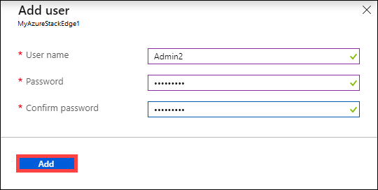
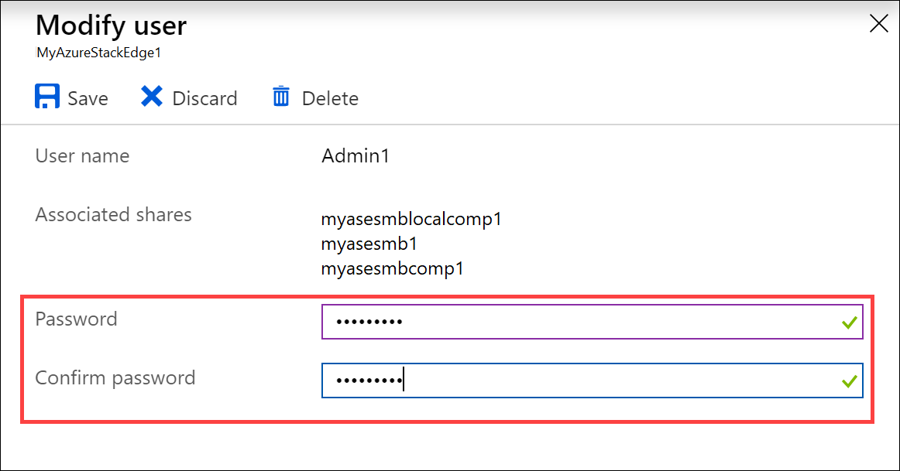
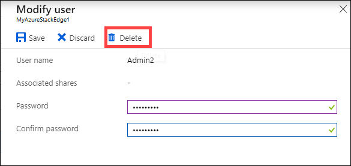
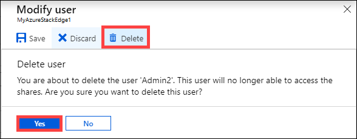

# Use the Azure portal to manage users on your Azure Azure Stack Edge

This article describes how to manage users on your Azure Stack Edge. You can manage the Azure Stack Edge via the Azure portal or via the local web UI. Use the Azure portal to add, modify, or delete users.

In this article, you learn how to:

> [!div class="checklist"]
> * Add a user
> * Modify user
> * Delete a user

## About users

Users can be read-only or full privilege. As the names indicate, the read-only users can only view the share data. The full privilege users can read share data, write to these shares, and modify or delete the share data.

 - **Full privilege user** - A local user with full access.
 - **Read-only user** - A local user with read-only access. These users are associated with shares that allow read-only operations.

The user permissions are first defined when the user is created during share creation. Modification of share-level permissions is currently not supported.

## Add a user

Do the following steps in the Azure portal to add a user.

1. In the Azure portal, go to your Azure Stack Edge resource and then go to **Overview > Users**. Select **+ Add user** on the command bar.

    

2. Specify the username and password for the user you want to add. Confirm the password and select **Add**.

    

    > [!IMPORTANT] 
    > These users are reserved by the system and should not be used: Administrator, EdgeUser, EdgeSupport, HcsSetupUser, WDAGUtilityAccount, CLIUSR, DefaultAccount, Guest.  

3. A notification is shown when the user creation starts and is completed. After the user is created, from the command bar, select **Refresh** to view the updated list of users.

## Modify user

You can change the password associated with a user once the user is created. Select from the list of users. Enter and confirm the new password. Save the changes.
 

## Delete a user

Do the following steps in the Azure portal to delete a user.

1. In the Azure portal, go to your Azure Stack Edge resource and then go to **Overview > Users**.

    

2. Select a user from the list of users and then select **Delete**.  

   

3. When prompted, confirm the deletion. 

   

The list of users is updated to reflect the deleted user.

## Next steps

- Learn how to [Manage bandwidth](data-box-edge-manage-bandwidth-schedules.md).
