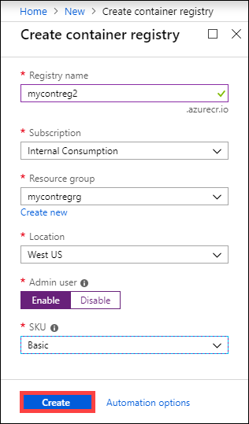
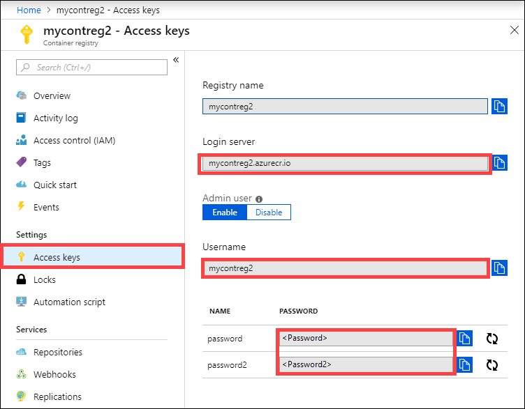
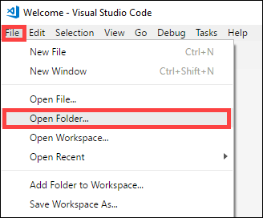
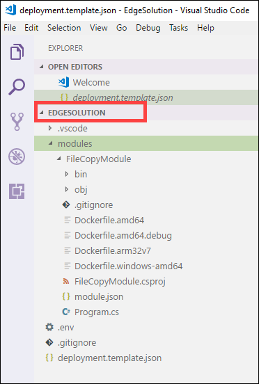
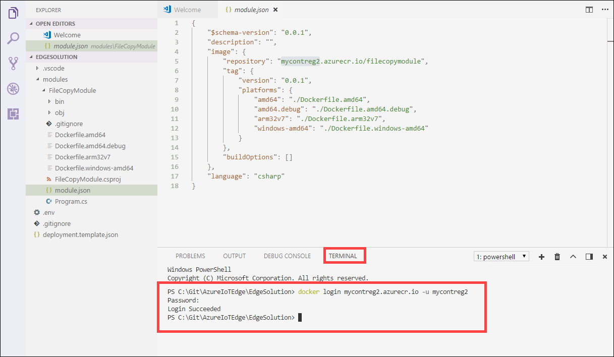
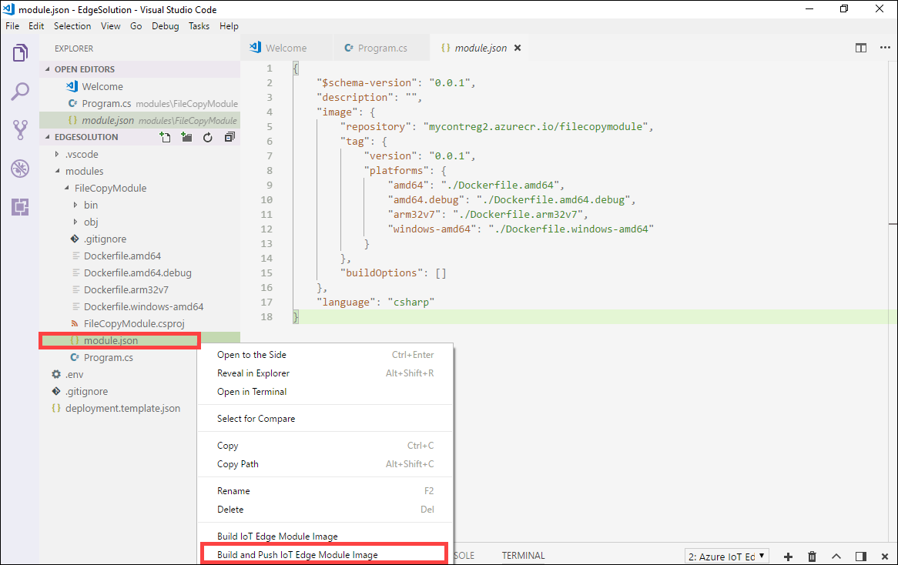

# Develop a C# IoT Edge module to move files on Data Box Edge (Preview)

This tutorial steps you through how to create an IoT Edge module for deployment with your Data Box Edge device. Azure Data Box Edge is a storage solution that allows you to process data and send it over network to Azure.

You can use Azure IoT Edge modules with your Data Box Edge to transform the data as it moved to Azure. The module used in this article implements the logic to copy a file from a local share to a cloud share on your Data Box Edge device.

This procedure can take around XX-YY minutes to complete.

In this tutorial, you learn how to:

> [!div class="checklist"]
> * Create a container registry to store and manage your modules (Docker images).
> * Create an IoT Edge module to deploy on your Data Box Edge device.

> [!IMPORTANT]
> Data Box Edge is in preview. Review the [Azure terms of service for preview](https://azure.microsoft.com/support/legal/preview-supplemental-terms/) before you order and deploy this solution. 

## About the IoT Edge module

Your Data Box Edge device can deploy and run IoT Edge modules. Edge modules are essentially Docker containers that perform a specific task, such as ingest a message from a device, transform a message, or send a message to an IoT Hub. In this tutorial, you will create a module that copies files from a local share to a cloud share on your Data Box Edge device.

1. Files are written to the local share on your Data Box Edge device.
2. The file event generator creates a file event for each file written to the local share. The file events are then sent to IoT Edge Hub (in IoT Edge runtime).

   > [!IMPORTANT]
   > The file events are generated only for the newly created files. Modification of existing files does not generate any file events.

3. The IoT Edge custom module processes the file event and converts to a file event object that also contains a relative path for the file. The module generates an absolute path using the relative file path and copies the file from the local share to the cloud share. The module then deletes the file from the local share.

Once the file is in the cloud share, it automatically gets uploaded to your Azure Storage account.

## Prerequisites

Before you begin, make sure you have:

- A Data Box Edge device that is running.

    - The device also has an associated IoT Hub resource. For more information, go to [Create an IoT Hub resource](data-box-edge-deploy-configure-compute.md#create-an-iot-hub-resource) for your Data Box Edge.
    - The device has Edge compute role configured. For more information, go to [Set up compute role](data-box-edge-deploy-configure-compute.md#set-up-compute-role) on your Data Box Edge.

- The following development resources:

    - [Visual Studio Code](https://code.visualstudio.com/).
    - [C# for Visual Studio Code (powered by OmniSharp) extension](https://marketplace.visualstudio.com/items?itemName=ms-vscode.csharp).
    - [Azure IoT Edge extension for Visual Studio Code](https://marketplace.visualstudio.com/items?itemName=vsciot-vscode.azure-iot-edge).
    - [.NET Core 2.1 SDK](https://www.microsoft.com/net/download).
    - [Docker CE](https://store.docker.com/editions/community/docker-ce-desktop-windows). You may have to create an account to download and install the software.

## Create a container registry

An Azure container registry is a private Docker registry in Azure where you can store and manage your private Docker container images. The two popular Docker registry services available in the cloud are Azure Container Registry and Docker Hub. This article uses the Container Registry.

1. Sign in to the Azure portal at [https://portal.azure.com](https://portal.azure.com).
2. Select **Create a resource > Containers > Container Registry**. Click **Create**.
3. Provide:

    1. A unique **Registry name** within Azure that contains 5 to 50 alphanumeric characters.
    2. Choose a **Subscription**.
    3. Create new or choose an existing **Resource group**.
    4. Select a **Location**. We recommend that this be the same region or close to where we deploy the Data Box Edge device.
    5. Toggle **Admin user** to **Enable**.
    6. Set the SKU to **Basic**.

    
 
4. Select **Create**.
5. After your container registry is created, browse to it, and select **Access keys**.

    
 
6. Copy the values for **Login server**, **Username**, and **Password**. You use these values later to publish the Docker image to your registry and to add the registry credentials to the Azure IoT Edge runtime.

## Create an IoT Edge module project

The following steps create an IoT Edge module project based on the .NET Core 2.1 SDK. The project uses Visual Studio Code and the Azure IoT Edge extension.

### Create a new solution

Create a C# solution template that you can customize with your own code.

1. In Visual Studio Code, select **View > Command Palette** to open the VS Code command palette.
2. In the command palette, enter and run the command **Azure: Sign in** and follow the instructions to sign in your Azure account. If you're already signed in, you can skip this step.
3. In the command palette, enter and run the command **Azure IoT Edge: New IoT Edge solution**. In the command palette, provide the following information to create your solution:

    1. Select the folder where you want to create the solution.
    2. Provide a name for your solution or accept the default **EdgeSolution**.
    
        

    3. Choose **C# Module** as the module template.
    4. Replace the default module name with the name you want to assign, in this case, it is **FileCopyModule**.
    
        

    5. Specify the container registry that you created in the previous section as the image repository for your first module. Replace **localhost:5000** with the login server value that you copied.

        The final string looks like `<Login server name>/<Module name>`. In this example, the string is: `mycontreg2.azurecr.io/filecopymodule`.

        

4. Go to **File > Open Folder**.

    

5. Browse and point to the EdgeSolution folder that you created earlier. The VS Code window loads your IoT Edge solution workspace with its five top-level components. You won't edit the **.vscode** folder, **.gitignore** file, **.env** file, and the **deployment.template.json** in this tutorial.
    
    The only component that you modify is the modules folder. This folder has the C# code for your module and Docker files to build your module as a container image.

    

### Update the module with custom code

## Build your IoT Edge solution

In the previous section, you created an IoT Edge solution and added code to the FileCopyModule to copy files from local share to the cloud share. Now you need to build the solution as a container image and push it to your container registry.

1. Sign in to Docker by entering the following command in the Visual Studio Code integrated terminal.

    `docker login <ACR login server> -u <ACR username>` 

    Use the login server and username that you copied from your container registry. 

    

2. When prompted for password, supply the password. You can also retrieve the values for login server, username, and password from the **Access Keys** in your container registry in the Azure portal.
 
3. Once the credentials are supplied, you can push your module image to your Azure container registry. In the VS Code Explorer, right-click the **module.json** file and select **Build and Push IoT Edge solution**.

    
 
    When you tell Visual Studio Code to build your solution, it runs two commands in the integrated terminal: docker build and docker push. These two commands build your code, containerize the CSharpModule.dll, and then push the code to the container registry that you specified when you initialized the solution.

    You may see the following warning that you can ignore:

    *Program.cs(77,44): warning CS1998: This async method lacks 'await' operators and will run synchronously. Consider using the 'await' operator to await non-blocking API calls, or 'await Task.Run(...)' to do CPU-bound work on a background thread.*

4. You can see the full container image address with tag in the VS Code integrated terminal. The image address is built from information that's in the module.json file with the format `<repository>:<version>-<platform>`. For this tutorial, it should look like `mycontreg2.azurecr.io/filecopymodule:0.0.1-amd64`.

## Clean up resources

## Next steps

To deploy and run this module on Data Box Edge, see the steps in [Add a custom module](data-box-edge-deploy-configure-compute.md#add-a-custom-module).
