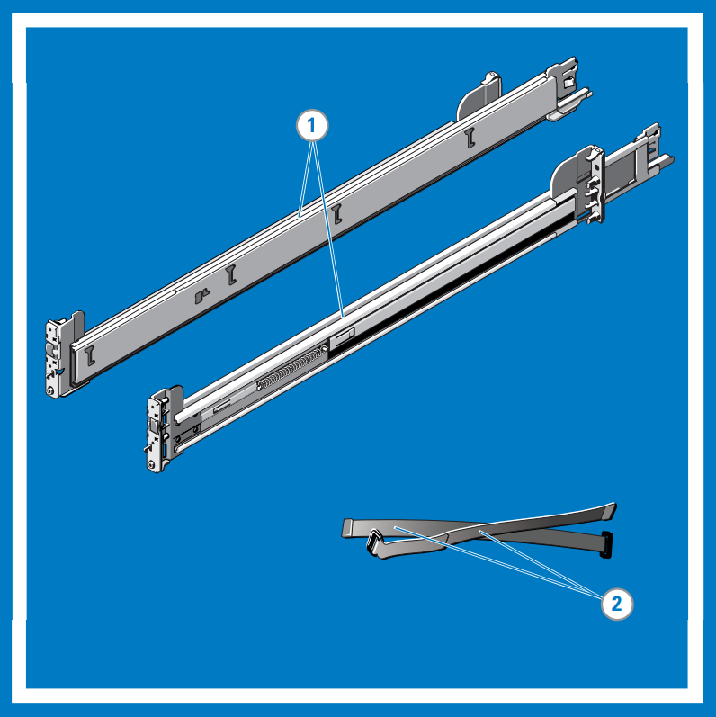
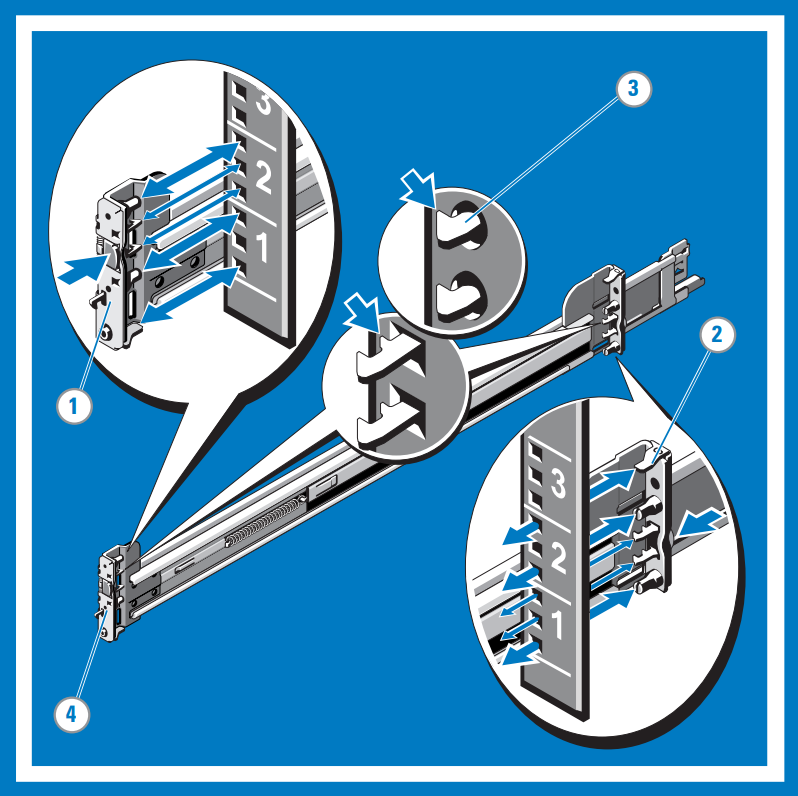
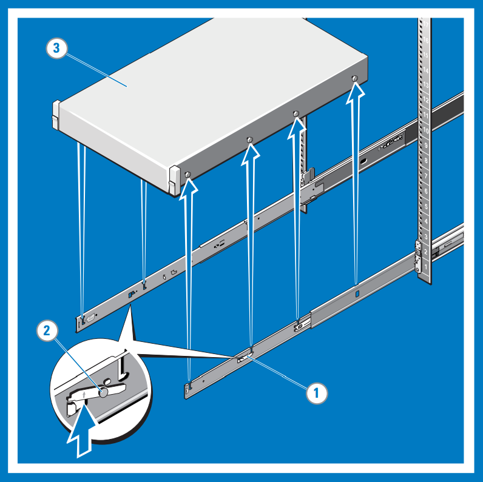
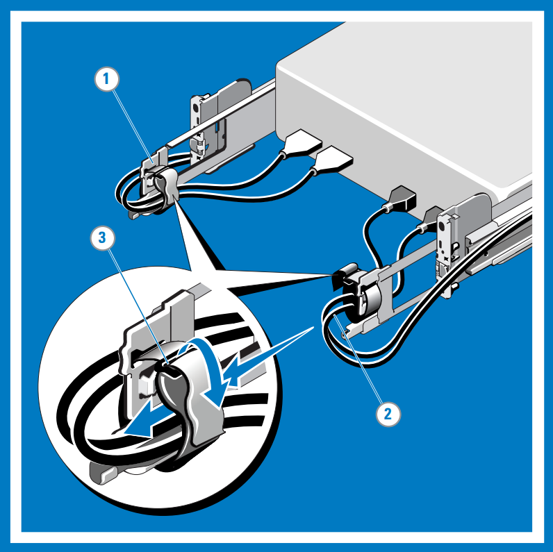
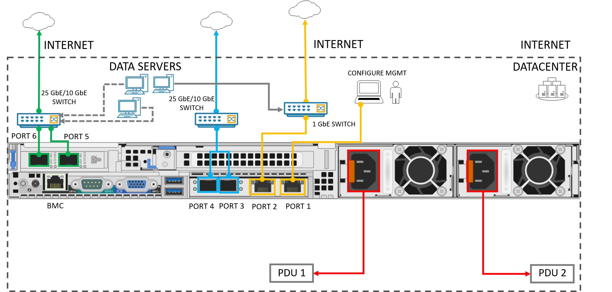

# Tutorial: Install Azure Data Box Edge

This tutorial describes how to install a Data Box Edge physical device. The installation procedure involves unpacking, rack mounting, and cabling the device. 

The installation can take around two hours to complete.

In this tutorial, you learn how to:

> [!div class="checklist"]
> * Unpack the device
> * Rack mount the device
> * Cable the device

## Prerequisites

The prerequisites for installing a physical device as follows:

### For the Data Box Edge resource

Before you begin, make sure that:

* You've completed all the steps in [Prepare to deploy Azure Data Box Edge](data-box-edge-deploy-prep.md).
    * You've created a Data Box Edge resource to deploy your device.
    * You've generated the activation key to activate your device with the Data Box Edge resource.

 
### For the Data Box Edge physical device

Before you deploy a device:

- Make sure that the device rests safely on a flat, stable, and level work surface.
- Verify that the site where you intend to set up has:
    - Standard AC power from an independent source

        -OR-
    - A rack power distribution unit (PDU) with an uninterruptible power supply (UPS)
    - An available 1U slot on the rack on which you intend to mount the device

### For the network in the datacenter

Before you begin:

- Review the networking requirements for deploying Data Box Edge, and configure the datacenter network per the requirements. For more information, see [Data Box Edge networking requirements](data-box-edge-system-requirements.md#networking-port-requirements).

- Make sure that the minimum Internet bandwidth is 20 Mbps for optimal functioning of the device.

## Unpack the device

This device is shipped in a single box. Complete the following steps to unpack your device. 

1. Place the box on a flat, level surface.
2. Inspect the box and the packaging foam for crushes, cuts, water damage, or any other obvious damage. If the box or packaging is severely damaged, don't open it. Contact Microsoft Support to help you assess whether the device is in good working order.
3. Unpack the box. After unpacking the box, make sure that you have:
    - One single enclosure Edge device
    - Two power cords
    - One rail kit assembly
    - A Safety, Environmental, and Regulatory Information booklet

If you didn't receive all of the items listed here, contact Data Box Edge support. The next step is to rack mount your device.

## Rack the device

The device must be installed on a standard 19-inch rack. Use the following procedure to rack mount your device on a standard 19-inch rack.

> [!IMPORTANT]
> Data Box Edge devices must be rack-mounted for proper operation.

### Prerequisites

- Before you begin, read the safety instructions in your Safety, Environmental, and Regulatory Information booklet. This booklet was shipped with the device.
- Begin installing the rails in the allotted space that is closest to the bottom of the rack enclosure.
- For the tooled rail mounting configuration:
    -  You need to supply eight screws: #10-32, #12-24, #M5, or #M6. The head diameter of the screws must be less than 10 mm (0.4").
    -  You need a flat-tipped screwdriver.

### Identify the rail kit contents

Locate the components for installing the rail kit assembly:
1. Two A7 Dell ReadyRails II sliding rail assemblies
2. Two hook and loop straps

### Install and remove tool-less rails (Square hole or round hole racks)

> [!TIP]
> This option is tool-less because it does not require tools to install and remove the rails into the unthreaded square or round holes in the racks.

1. Position the left and right rail end pieces labeled **FRONT** facing inward and orient each end piece to seat in the holes on the front side of the vertical rack flanges .
2. Align each end piece in the bottom and top holes of the desired U spaces.
3. Engage the back end of the rail until it fully seats on the vertical rack flange and the latch clicks into place. Repeat these steps to position and seat the front end piece on the vertical rack flange.
4. To remove the rails, pull the latch release button on the end piece midpoint and unseat each rail.

### Install and remove tooled rails (Threaded hole racks)

> [!TIP]
> This option is tooled because it requires a tool (_a flat-tipped screwdriver_) to install and remove the rails into the threaded round holes in the racks.

1. Remove the pins from the front and rear mounting brackets using a flat-tipped screwdriver.
2. Pull and rotate the rail latch subassemblies to remove them from the mounting brackets.
3. Attach the left and right mounting rails to the front vertical rack flanges using two pairs of screws.
4. Slide the left and right back brackets forward against the rear vertical rack flanges and attach them using two pairs of screws.

### Install the system in a rack

1. Pull the inner slide rails out of the rack until they lock into place.
2. Locate the rear rail standoff on each side of the system and lower them into the rear J-slots on the slide assemblies. Rotate the system downward until all the rail standoffs are seated in the J-slots.
3. Push the system inward until the lock levers click into place.
4. Press the slide-release lock buttons on both rails and slide the system into the rack.

### Remove the system from the rack

1. Locate the lock levers on the sides of the inner rails.
2. Unlock each lever by rotating it up to its release position.
3. Grasp the sides of the system firmly and pull it forward until the rail standoffs are at the front of the J-slots. Lift the system up and away from the rack and place it on a level surface.

### Engage and release the slam latch

NOTE: For systems not equipped with slam latches, secure the system using screws, as described in step 3 of this procedure.

1. Facing the front, locate the slam latch on either side of the system.
2. The latches engage automatically as the system is pushed into the rack and are released by pulling up on the latches.
3. To secure the system for shipment in the rack or for other unstable environments, locate the hard-mount screw under each latch and tighten each screw with a #2 Phillips screwdriver.

### Route the cables

> [!NOTE]
>  If you did not order the optional Cable Management Arm (CMA), use the two hook and loop straps provided in the rail kit to route the cables at the back of your system.

1. Locate the outer CMA brackets on the interior sides of both rack flanges.
2. Bundle the cables gently, pulling them clear of the system connectors to the left and right sides.
3. Thread the hook and loop straps through the slots on the outer CMA brackets on each side of the system to secure the cable bundles.

## Cable the device

The following procedures explain how to cable your Edge device for power and network.

Before you start cabling your device, you need the following:

- Your Edge physical device, unpacked, and rack mounted.
- Two power cables. 
- At least one 1-GbE RJ-45 network cable to connect to the management interface. There are two 1-GbE network interfaces, one management and one data, on the device.
- One 25-GbE SFP+ copper cable for each data network interface to be configured. At least one data network interface from among PORT 2, PORT 3, PORT 4, PORT 5, or PORT 6 needs to be connected to the Internet (with connectivity to Azure).  
- Access to two power distribution units (recommended).

> [!NOTE]
> - If you are connecting only one data network interface, we recommend that you use a 25/10-GbE network interface such as PORT 3, PORT 4, PORT 5, or PORT 6 to send data to Azure. 
> - For best performance and to handle large volumes of data, consider connecting all the data ports.
> - The Edge device should be connected to the datacenter network so that it can ingest data from data source servers.

Your Edge device has 8 NVMe SSDs. The front panel also has status LEDs and power buttons. The device includes redundant power supply units (PSUs) at the back. Your device has six network interfaces:

- Two 1-Gbps interfaces
- Four 25-Gbps interfaces that can also serve as 10-Gbps interfaces.
- A baseboard management controller (BMC). 

Identify the various ports on the backplane of your device.
 
  

The device has two network cards corresponding to the 6 ports: 

 - QLogic FastLinQ 41264
 - QLogic FastLinQ 41262

For a full list of supported cables, switches, and transceivers for these network cards, go to [Cavium FastlinQ 41000 Series Interoperability Matrix](https://www.marvell.com/documents/xalflardzafh32cfvi0z/).
 
Take the following steps to cable your device for power and network.

1. Connect the power cords to each of the PSUs in the enclosure. To ensure high availability, install and connect both PSUs to different power sources.

2. Attach the power cords to the rack power distribution units (PDUs). Make sure that the two PSUs use separate power sources.

3. Connect the 1-GbE network interface PORT 1 to the computer that's used to configure the physical device. PORT 1 is the dedicated management interface.

4. Connect one or more of PORT 2, PORT 3, PORT 4, PORT 5, or PORT 6 to the datacenter network/Internet. If connecting PORT 2, use the RJ-45 network cable. For the 10/25-GbE network interfaces, use the SFP+ copper cables.  

## Next steps

In this tutorial, you learned about Data Box Edge topics such as how to:

> [!div class="checklist"]
> * Unpack the device
> * Rack the device
> * Cable the device

Advance to the next tutorial to learn how to connect, set up, and activate your device.

> [!div class="nextstepaction"]
> [Connect and set up Data Box Edge](./data-box-edge-deploy-connect-setup-activate.md)

