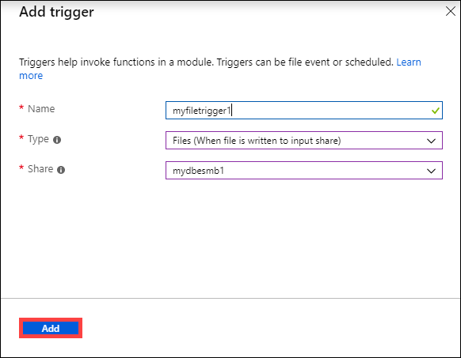
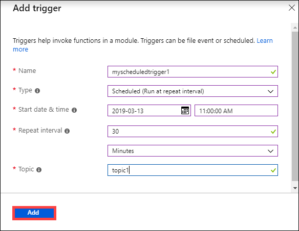
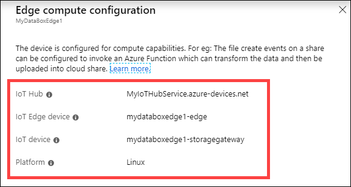
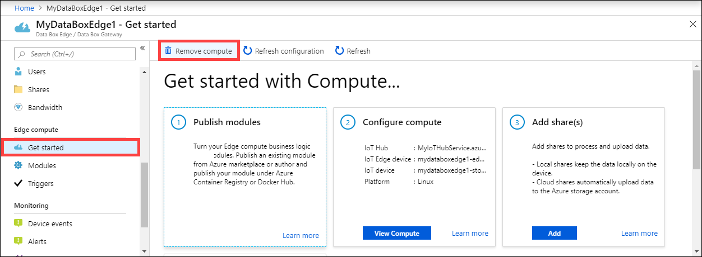
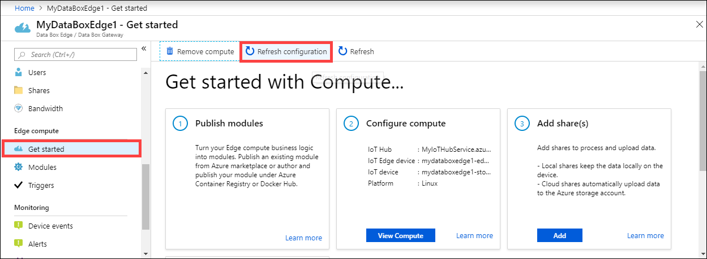

# Manage compute on your Azure Stack Edge

This article describes how to manage compute on your Azure Stack Edge. You can manage the compute via the Azure portal or via the local web UI. Use the Azure portal to manage modules, triggers, and compute configuration, and the local web UI to manage compute settings.

In this article, you learn how to:

> [!div class="checklist"]
> * Manage triggers
> * Manage compute configuration

## Manage triggers

Events are things that happen within your cloud environment or on your device that you might want to take action on. For example, when a file is created in a share, it is an event. Triggers raise the events. For your Azure Stack Edge, triggers can be in response to file events or a schedule.

- **File**: These triggers are in response to file events such as creation of a file, modification of a file.
- **Scheduled**: These triggers are in response to a schedule that you can define with a start date, start time, and the repeat interval.

### Add a trigger

Take the following steps in the Azure portal to create a trigger.

1. In the Azure portal, go to your Azure Stack Edge resource and then go to **Edge compute > Trigger**. Select **+ Add trigger** on the command bar.

    

2. In **Add trigger** blade, provide a unique name for your trigger.
    
    <!--Trigger names can only contain numbers, lowercase letters, and hyphens. The share name must be between 3 and 63 characters long and begin with a letter or a number. Each hyphen must be preceded and followed by a non-hyphen character.-->

3. Select a **Type** for the trigger. Choose **File** when the trigger is in response to a file event. Select **Scheduled** when you want the trigger to start at a defined time and run at a specified repeat interval. Depending on your selection, a different set of options is presented.

    - **File trigger** - Choose from the dropdown list a mounted share. When a file event is fired in this share, the trigger would invoke an Azure Function.

        

    - **Scheduled trigger** - Specify the start date/time, and the repeat interval in hours, minutes, or seconds. Also, enter the name for a topic. A topic will give you the flexibility to route the trigger to a module deployed on the device.

        An example route string is: `"route3": "FROM /* WHERE topic = 'topicname' INTO BrokeredEndpoint("modules/modulename/inputs/input1")"`.

        

4. Select **Add** to create the trigger. A notification shows that the trigger creation is in progress. After the trigger is created, the blade updates to reflect the new trigger.
 
    

### Delete a trigger

Take the following steps in the Azure portal to delete a trigger.

1. From the list of triggers, select the trigger that you want to delete.

    

2. Right-click and then select **Delete**.

    

3. When prompted for confirmation, click **Yes**.

    

The list of triggers updates to reflect the deletion.

## Manage compute configuration

Use the Azure portal to view the compute configuration, remove an existing compute configuration, or to refresh the compute configuration to sync up access keys for the IoT device and IoT Edge device for your Azure Stack Edge.

### View compute configuration

Take the following steps in the Azure portal to view the compute configuration for your device.

1. In the Azure portal, go to your Azure Stack Edge resource and then go to **Edge compute > Modules**. Select **View compute** on the command bar.

    

2. Make a note of the compute configuration on your device. When you configured compute, you created an IoT Hub resource. Under that IoT Hub resource, an IoT device and an IoT Edge device are configured. Only the Linux modules are supported to run on the IoT Edge device.

    

### Remove compute configuration

Take the following steps in the Azure portal to remove the existing Edge compute configuration for your device.

1. In the Azure portal, go to your Azure Stack Edge resource and then go to **Edge compute > Get started**. Select **Remove compute** on the command bar.

    

2. If you remove the compute configuration, you will need to reconfigure your device in case you need to use compute again. When prompted for confirmation, select **Yes**.

    

### Sync up IoT device and IoT Edge device access keys

When you configure compute on your Azure Stack Edge, an IoT device and an IoT Edge device are created. These devices are automatically assigned symmetric access keys. As a security best practice, these keys are rotated regularly via the IoT Hub service.

To rotate these keys, you can go to the IoT Hub service that you created and select the IoT device or the IoT Edge device. Each device has a primary access key and a secondary access keys. Assign the primary access key to the secondary access key and then regenerate the primary access key.

If your IoT device and IoT Edge device keys have been rotated, then you need to refresh the configuration on your Azure Stack Edge to get the latest access keys. The sync helps the device get the latest keys for your IoT device and IoT Edge device. Azure Stack Edge uses only the primary access keys.

Take the following steps in the Azure portal to sync the access keys for your device.

1. In the Azure portal, go to your Azure Stack Edge resource and then go to **Edge compute > Get started**. Select **Refresh configuration** on the command bar.

    

2. Select **Yes** when prompted for confirmation.

     

3. Exit out of the dialog once the sync is complete.

## Next steps

- Learn how to [Manage Edge compute network via Azure portal](data-box-edge-extend-compute-access-modules.md).
