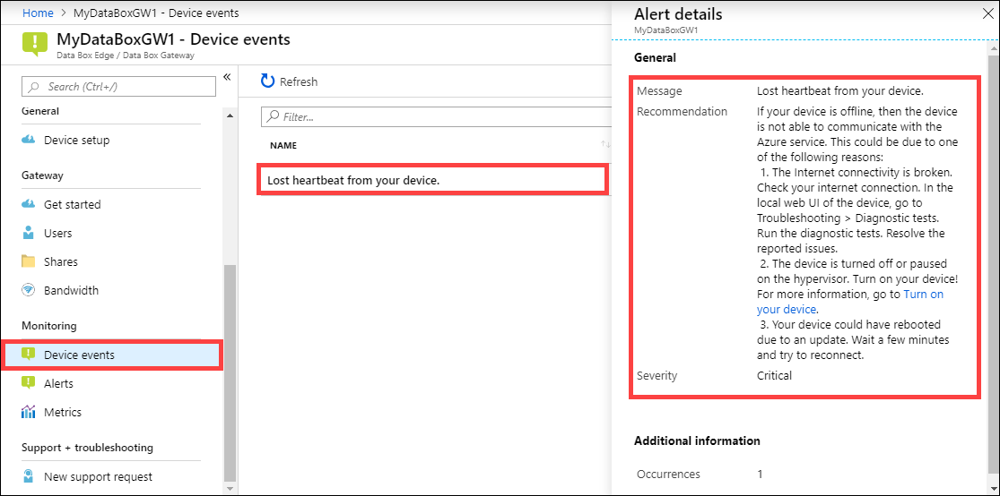

# Monitor your Azure Data Box Edge

This article describes how to monitor your Azure Data Box Edge. To monitor your device, you can use Azure portal or the local web UI. Use the Azure portal to view device events and configure and view alerts. Use the local web UI to view the hardware status of the various device components.

In this article, you learn how to:

> [!div class="checklist"]
> * View device events
> * View hardware status
> * View alerts

## View device events

Take the following steps in the Azure portal to view a device event.

1. In the Azure portal, go to your Data Box Edge/ Data Box Gateway resource and then go to **Monitoring > Device events**.
2. Select an event and view the alert details. Take appropriate action to resolve the alert condition.

    

## View hardware status

Take the following steps in the local web UI to view the hardware status of your device components.

1. Connect to the local web UI of your device.
2. Go to **Maintenance > Hardware status**. You can view the health of the various device components.

    

## View alerts

Configure alert rules to inform you of alert conditions related to the consumption of resources on your device. You can configure alert rules to monitor your device for alert conditions. For more detailed information on alerts, go to [Create, view, and manage metric alerts in Azure monitor](../../azure-monitor/platform/alerts-metric.md).

## View metrics

You can also view the metrics to monitor the performance of the device. There are two types of metrics available:

- **Resource**: You can select the subscription, resource group, resource type, and the specific resource for which you want to show the metrics.
- **Metric namespace**:
- **Metric**: These can be **Capacity metrics** or **Transaction metrics**. The capacity metrics are related to the capacity of the device. The transaction metrics are related to the read and write operations to Azure Storage.

    |Capacity metrics                     |Column2  |
    |-------------------------------------|---------|
    |**Available capacity**               |         |
    |**Total capacity**                   |         |
    
    |**Transaction metrics**              | Description         |
    |-------------------------------------|---------|
    |**Cloud bytes uploaded (device)**    |         |
    |**Cloud bytes uploaded (share)**     |         |
    |**Cloud download throughput (share)**|         |
    |**Cloud read throughput**            |         |
    |**Cloud upload throughput**          |         |
    |**Cloud upload throughput (share)**  |         |
    |**Read through (network)**           |         |
    |**Write throughput (network)**       |         |
    |**Edge compute - memory usage**      |         |
    |**Edge compute - percentage CPU**    |         |

- **Aggregation**: When a metric is selected, aggregation can be defined. Aggregation refers to the actual value aggregated over a specified span of time. These can be average, minimum, or the maximum value.

+ New chart
+ Refresh
+ Share - To export the chart data to an Excel spreadsheet. You can also get a link to this chart that you can share.

## Next steps

- Learn how to [Manage bandwidth](data-box-edge-manage-bandwidth-schedules.md).
