# Update your Azure Data Box Gateway

This article describes the steps required to install update on your Azure Data Box Gateway via the local web UI and through the Azure portal. You apply the software updates or hotfixes to keep your Data Box Gateway device up-to-date.

> [!IMPORTANT]
>
> - Update **1911** corresponds to **1.6.1049.786** software version on your device. For information on this update, go to [Release notes](data-box-gateway-1911-release-notes.md).
>
> - Keep in mind that installing an update or hotfix restarts your device. Given that the Data Box Gateway is a single node device, any I/O in progress is disrupted and your device experiences a downtime of up to 30 minutes for the device software update.

Each of these steps is described in the following sections.

## Use the Azure portal

We recommend that you install updates through the Azure portal. The device automatically scans for updates once a day. Once the updates are available, you see a notification in the portal. You can then download and install the updates.

> [!NOTE]
> Make sure that the device is healthy and status shows as **Online** before you proceed to install the updates.

1. When the updates are available for your device, you see a notification. Select the notification or from the top command bar, **Update device**. This will allow you to apply device software updates.

    <!-- 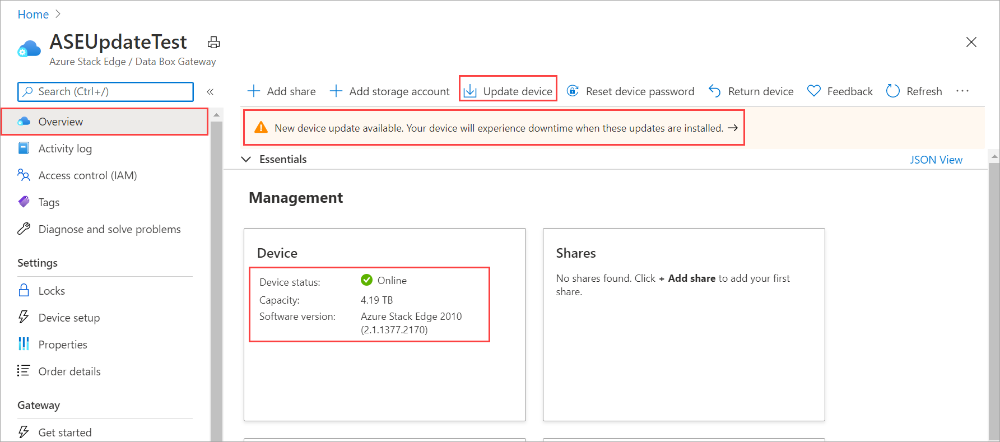 -->

2. In the **Device updates** blade, check that you have reviewed the license terms associated with new features in the release notes.

    You can choose to **Download and install** the updates or just **Download** the updates. You can then choose to install these updates later.

    <!-- 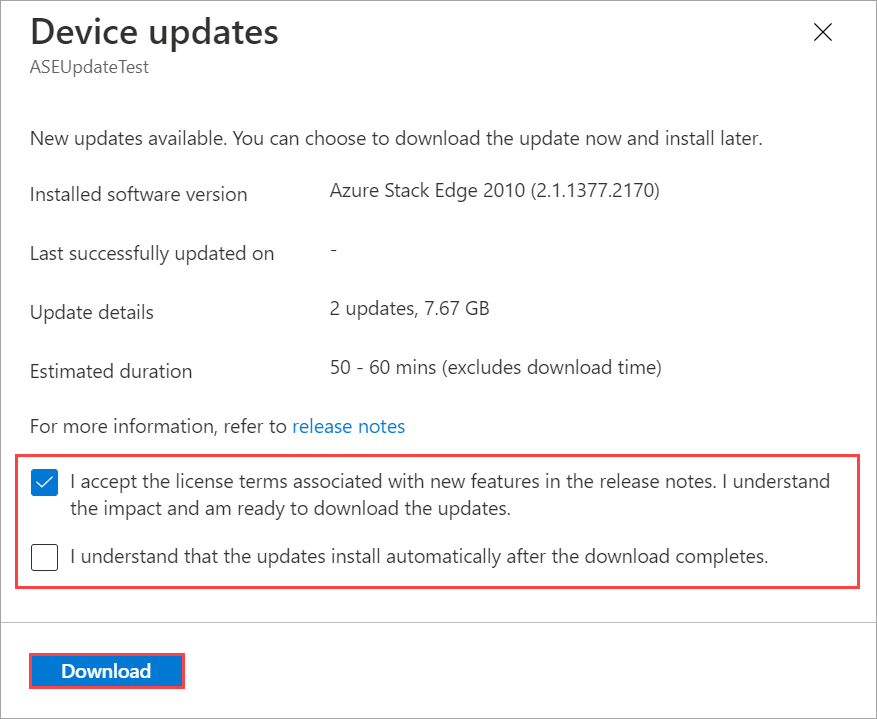 -->

    If you want to download and install the updates, check the option that updates install automatically after the download completes.

    <!--  -->

3. The download of updates starts. You see a notification that the download is in progress.

    <!--  -->

    A notification banner is also displayed in the Azure portal. This indicates the download progress. 

    <!-- 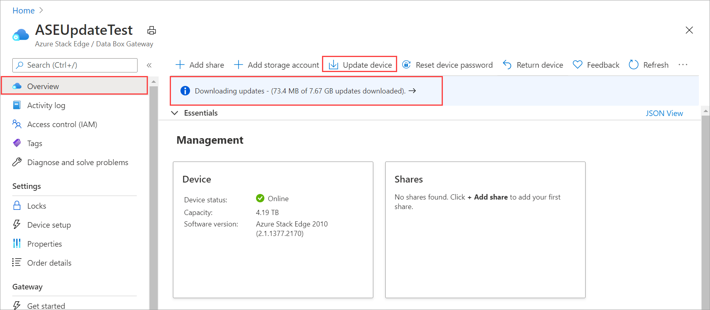 -->

    You can select this notification or select **Update device** to see the detailed status of the update.

    <!-- 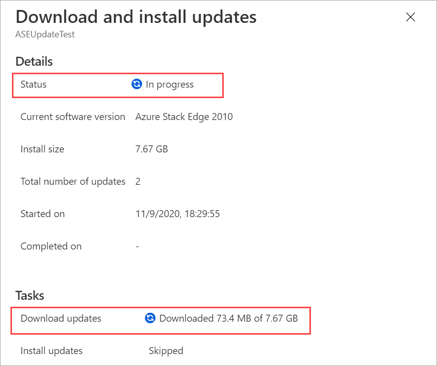    -->

4. After the download is complete, the notification banner updates to indicate the completion. If you chose to download and install the updates, the installation will begin automatically.

    <!--  -->

    If you chose to download updates only, then select the notification to open the **Device updates** blade. Select **Install**.
  
    <!--  -->

5. You see a notification that the install is in progress.

    <!--  -->

    The portal also displays an informational alert to indicate that the install is in progress. The device goes offline and is in maintenance mode.

    <!-- 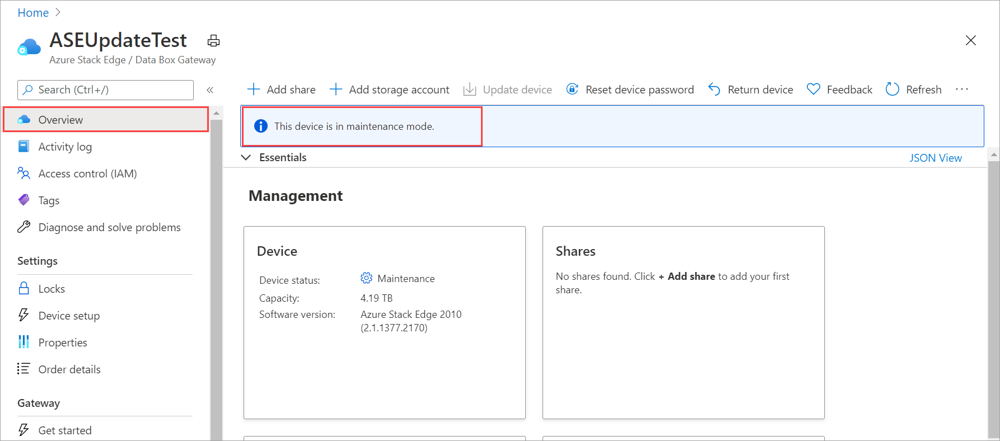 -->

6. As this is a 1-node device, the device will restart after the updates are installed. The critical alert during the restart will indicate that the device heartbeat is lost.

    <!-- 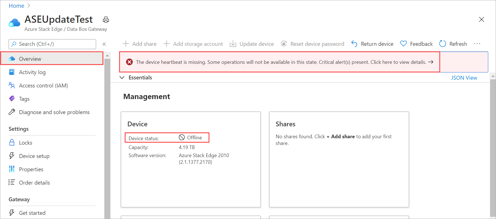 -->

    Select the alert to see the corresponding device event.

    <!-- 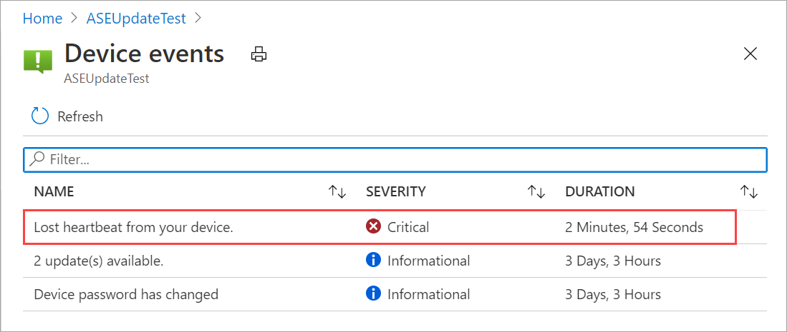 -->

7. After the restart, the device is again put in the maintenance mode and an informational alert is displayed to indicate that.

    <!---->

    If you select the **Update device** from the top command bar, you can see the progress of the updates.
    
    <!---->

8. The device status updates to **Online** after the updates are installed.

    <!-- 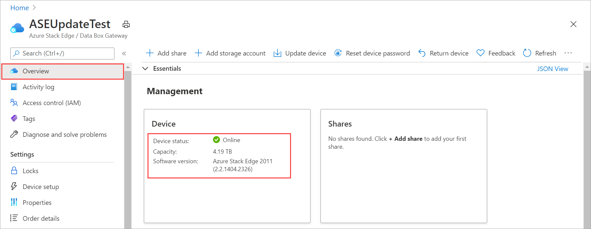 -->

    From the top command bar, select **Device updates**. Verify that update has successfully installed and the device software version reflects that.

    <!-- 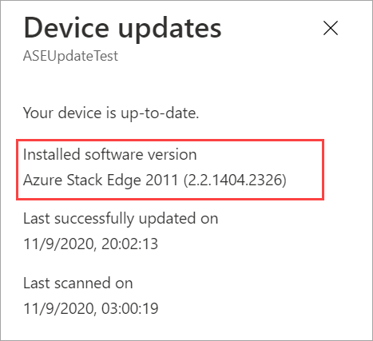 -->

    <!-- 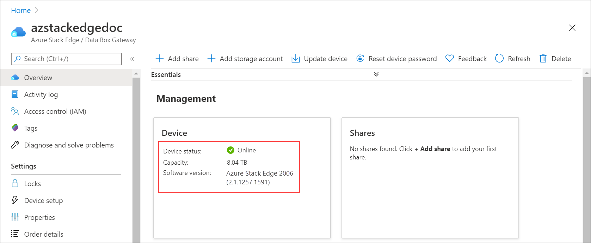 -->

## Use the local web UI

There are two steps when using the local web UI:

- Download the update or the hotfix
- Install the update or the hotfix

Each of these steps is described in detail in the following sections.

### Download the update or the hotfix

Perform the following steps to download the update. You can download the update from the Microsoft-supplied location or from the Microsoft Update Catalog.

Do the following steps to download the update from the Microsoft Update Catalog.

1. Start the browser and navigate to [https://catalog.update.microsoft.com](https://catalog.update.microsoft.com).

   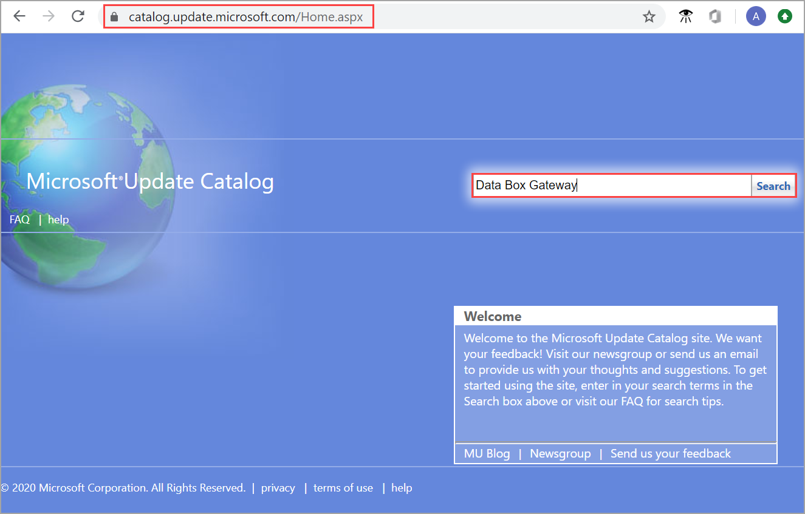

2. In the search box of the Microsoft Update Catalog, enter the Knowledge Base (KB) number of the hotfix or terms for the update you want to download. For example, enter **Azure Data Box Gateway**, and then click **Search**.

   The update listing appears as **Azure Data Box Gateway 1911**.

   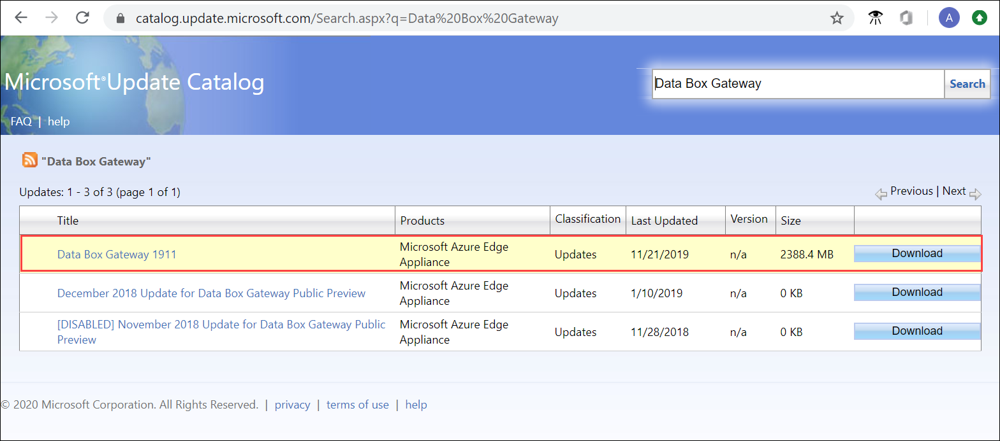

3. Select **Download**. There is a single file to download called *SoftwareUpdatePackage.exe* that corresponds to the device software update. Download the file to a folder on the local system. You can also copy the folder to a network share that is reachable from the device.

   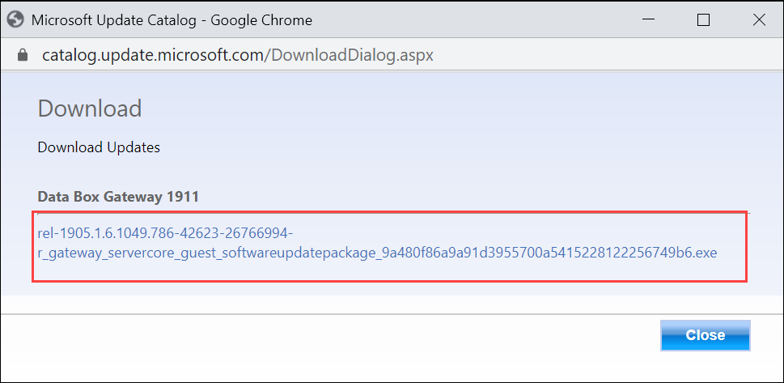

### Install the update or the hotfix

Prior to the update or hotfix installation, make sure that:

- You have the update or the hotfix downloaded either locally on your host or accessible via a network share.
- Your device status is healthy as shown in the **Overview** page of the local web UI.

   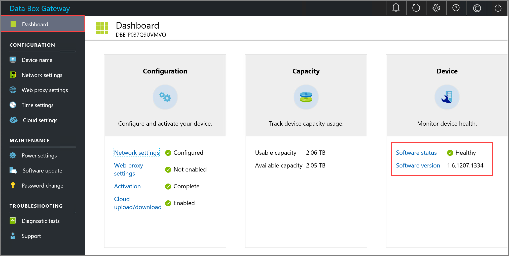

This procedure takes around 20 minutes to complete. Perform the following steps to install the update or hotfix.

1. In the local web UI, go to **Maintenance** > **Software update**. Make a note of the software version that you are running.

   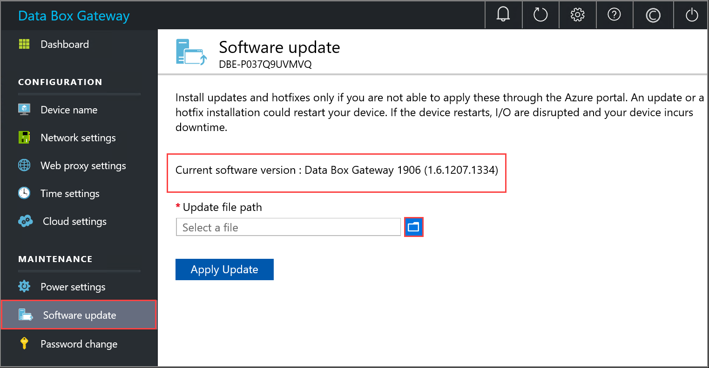

2. Provide the path to the update file. You can also browse to the update installation file if placed on a network share. Select the software update file with *SoftwareUpdatePackage.exe* suffix.

   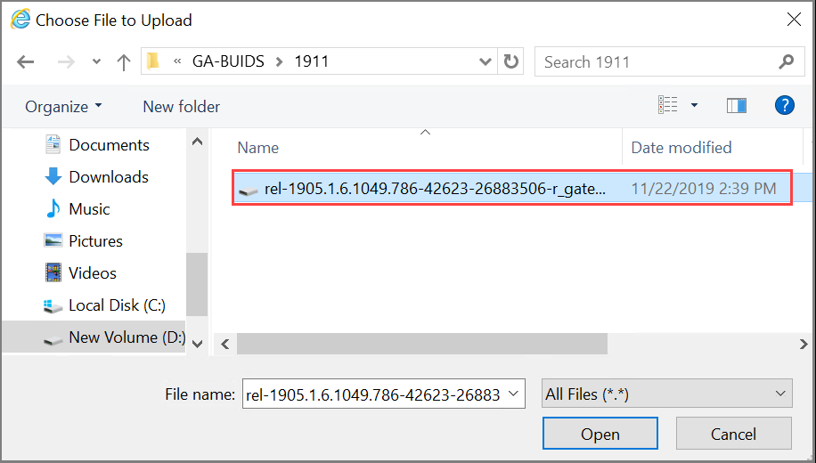

3. Select **Apply**.

   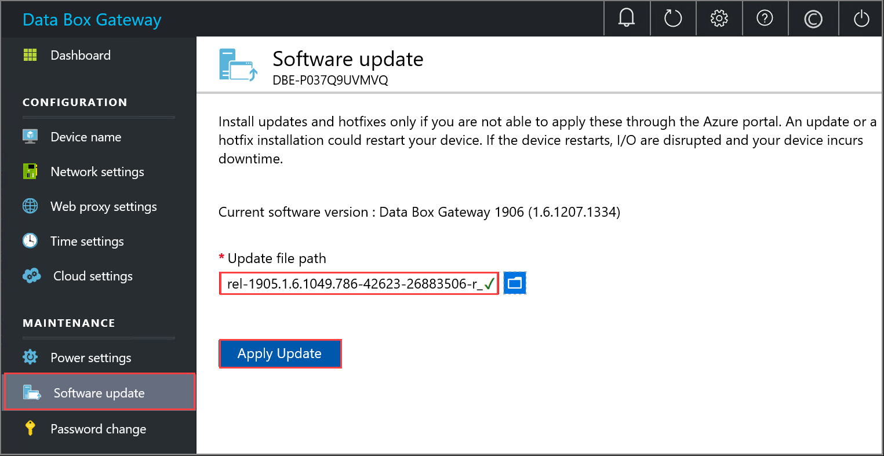

4. When prompted for confirmation, select **Yes** to proceed. Given the device is a single node device, after the update is applied, the device restarts and there is downtime.
   

5. The update starts. After the device is successfully updated, it restarts. The local UI is not accessible in this duration.

6. After the restart is complete, you are taken to the **Sign in** page. To verify that the device software has updated, in the local web UI, go to **Maintenance** > **Software update**. The displayed software version in this example is **1.6.1049.786**.

   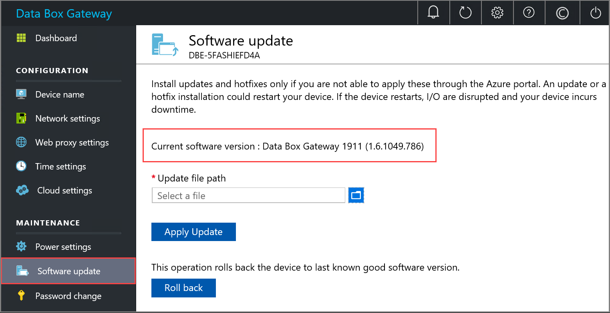

## Next steps

Learn more about [administering your Azure Data Box Gateway](data-box-gateway-manage-users.md).
