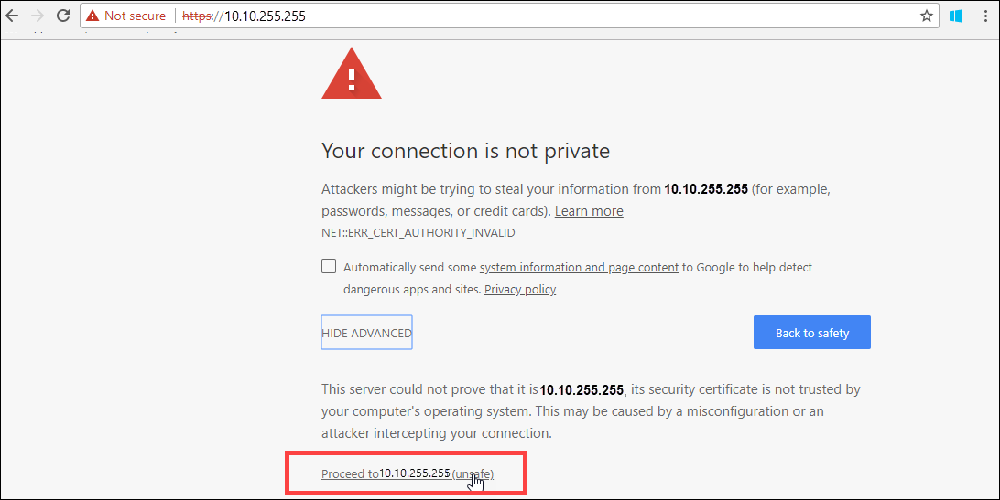
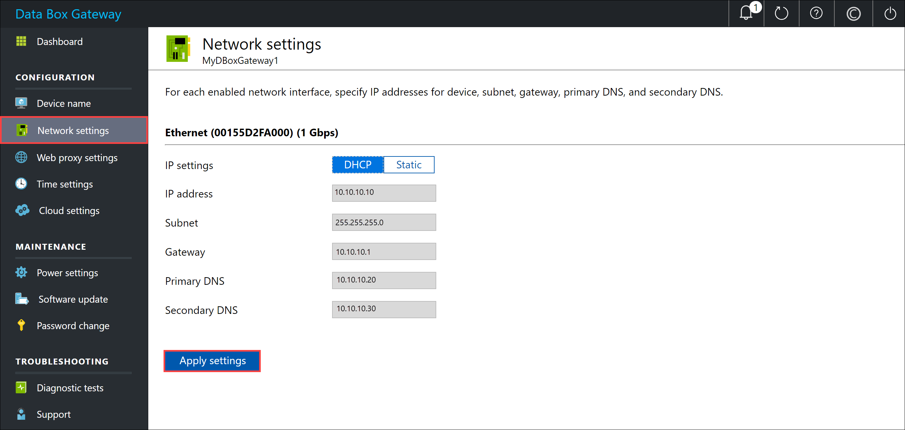

# Tutorial: Connect, set up, activate Azure Data Box Gateway (Preview) 

## Introduction

This tutorial describes how to connect to, set up, and activate your Data Box Gateway device using the local web UI. 

The setup and activation process can take around 10 minutes to complete. 

In this tutorial, you learn how to:

> [!div class="checklist"]
> * Connect to virtual device
> * Set up and activate virtual device

If you don't have an Azure subscription, create a [free account](https://azure.microsoft.com/free/?WT.mc_id=A261C142F) before you begin.

> [!IMPORTANT]
> - Data Box Gateway is in preview. Review the [Azure terms of service for preview](https://azure.microsoft.com/support/legal/preview-supplemental-terms/) before you order and deploy this solution. 

## Prerequisites

Before you configure and set up your Data Box Gateway, make sure that:

* You have provisioned a virtual device and obtained a connected URL to it as detailed in the [Provision a Data Box Gateway in Hyper-V](data-box-gateway-deploy-provision-hyperv.md) or [Provision a Data Box Gateway in VMware](data-box-gateway-deploy-provision-vmware.md).
* You have the activation key from the Data Box Gateway service that you created to manage Data Box Gateway devices. For more information, go to [Prepare to deploy Azure Data Box Gateway](data-box-gateway-deploy-prep.md).

## Connect to the local web UI setup 

1. Open a browser window and connect to the local web UI. Type:
   
   [https://ip-address-of-network-interface](https://ip-address-of-network-interface)
   
   Use the connection URL noted in the previous tutorial. You see an error indicating that there is a problem with the website’s security certificate. Click **Continue to this webpage**. (These steps may be different based on the browser used.)
   
    

2. Sign in to the web UI of your virtual device. The default password is *Password1*. 
   
    

3. You are prompted to change the device administrator password. Type in a new password that contains between 8 and 16 characters. The password must contain 3 of the following: uppercase, lowercase, numeric, and special characters.

    

You are now at the **Dashboard** of your device.

## Set up and activate the virtual device
 
1. From the dashboard, you can go to various settings required to configure and register the virtual device with the Data Box Gateway service. The **Network settings**, **Web proxy settings**, and **Time settings** are optional. The only required settings are **Device name** and **Cloud settings**.
   
    

2. In the **Device name** page, configure a friendly name for your device. The friendly name can be 1 to 15 characters long and can contain letter, numbers and hyphens.

    

3. (Optionally) configure your **Network settings**. You see at least 1 network interface and more depending on how many you configured in the underlying virtual machine. The **Network settings** page for a virtual device with one network interface enabled is as shown below.
    
    
   
    When configuring network settings, keep the following in mind:

    - If DHCP is enabled in your environment, network interfaces are automatically configured. Hence, an IP address, subnet, gateway, and DNS are automatically assigned.
    - If DHCP is not enabled, you can assign static IPs if needed.
    - You can configure your network interface as IPv4.

    >[!NOTE] 
    > We recommend that you do not switch the local IP address of the network interface from static to DHCP, unless you have another IP address to connect to the device. If using one network interface and you switch to DHCP, there would be no way to determine the DHCP address. If you want to change to a DHCP address, wait until after the device has registered with the service, and then change. You can then view the IPs of all the adapters in the **Device properties** in the Azure portal for your service.

4. (Optionally) configure your web proxy server. Although web proxy configuration is optional, be aware that if you use a web proxy, you can only configure it here.
   
   
   
   In the **Web proxy** page:
   
   1. Supply the **Web proxy URL** in this format: *http://&lt;host-IP address or FQDN&gt;:Port number*. Note that HTTPS URLs are not supported.
   2. Specify **Authentication** as **Basic** or **None**.
   3. If using authentication, you will also need to provide a **Username** and **Password**.
   4. Click **Apply**. This will validate and apply the configured web proxy settings.

5. (Optionally) configure the time settings for your device, such as time zone and the primary and secondary NTP servers. NTP servers are required because your device must synchronize time so that it can authenticate with your cloud service providers.
    
    
    
    In the **Time settings** page:
    
    1. From the dropdown list, select the **Time zone** based on the geographic location in which the device is being deployed. The default time zone for your device is PST. Your device will use this time zone for all scheduled operations.
    2. Specify a **Primary NTP server** for your device or accept the default value of time.windows.com. Ensure that your network allows NTP traffic to pass from your datacenter to the Internet.
    3. Optionally specify a **Secondary NTP server** for your device.
    4. Click **Apply**. This will validate and apply the configured time settings.

6. In the **Cloud settings** page, activate your device with the Data Box Gateway service in Azure portal.
    
    1. Enter the **Activation key** that you got in [Get the activation key](data-box-gateway-deploy-prep.md#get-the-activation-key) for Data Box Gateway.

    2. Click **Activate**. 
       
         
    
    3. You may need to wait a minute before the device is successfully activated. After the activation, the page updates to indicate that the device is successfully activated.

## Next steps

In this tutorial, you learned about Data Box Gateway topics such as:

> [!div class="checklist"]
> * Connect to virtual device
> * Set up and activate virtual device

Advance to the next tutorial to learn how to transfer data with your Data Box Gateway.

> [!div class="nextstepaction"]
> [Transfer data with Data Box Gateway](./data-box-gateway-deploy-add-shares.md).
