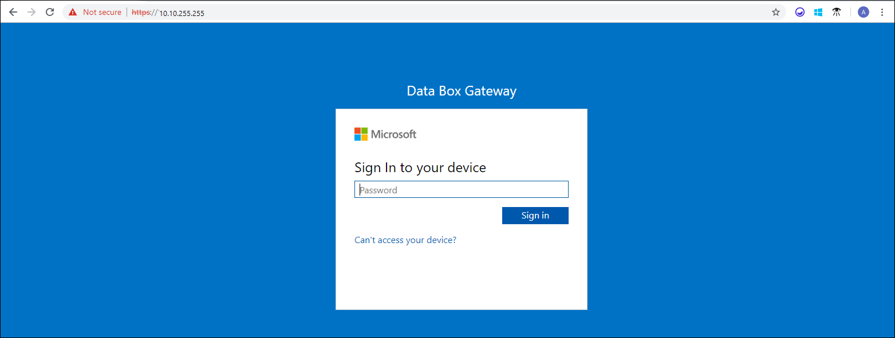
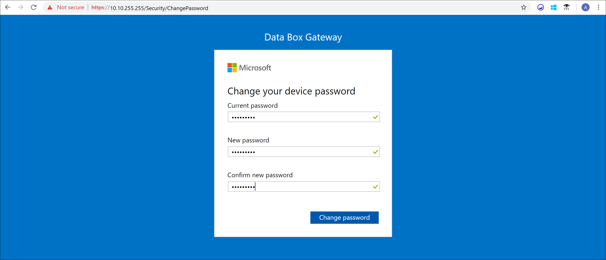
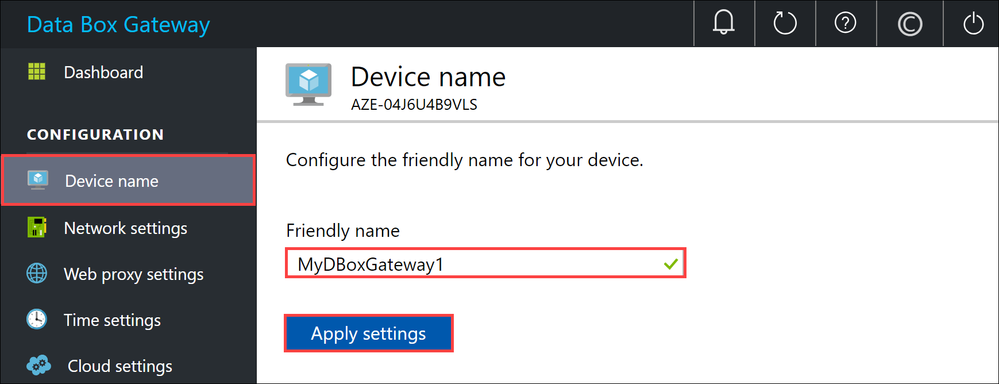
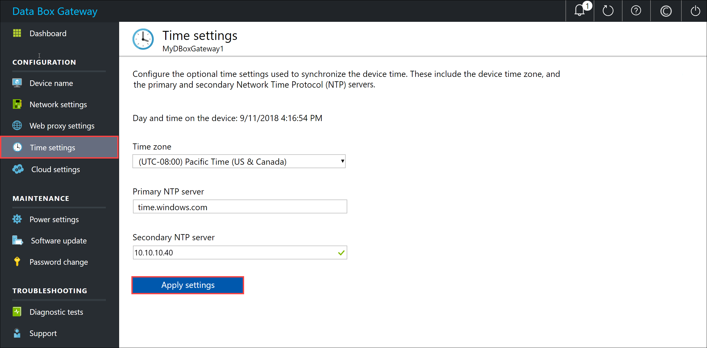
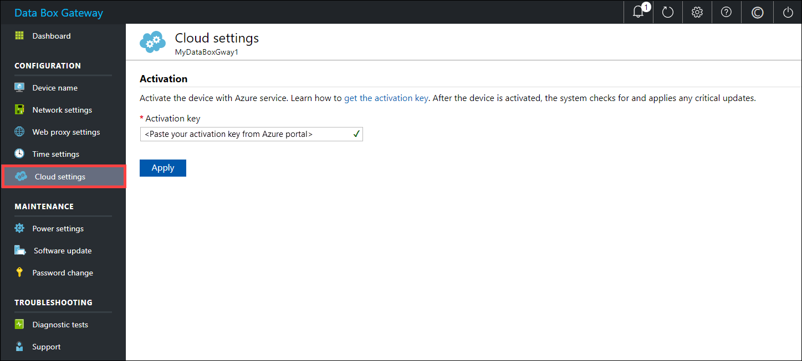
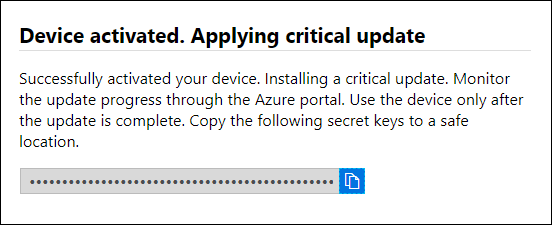
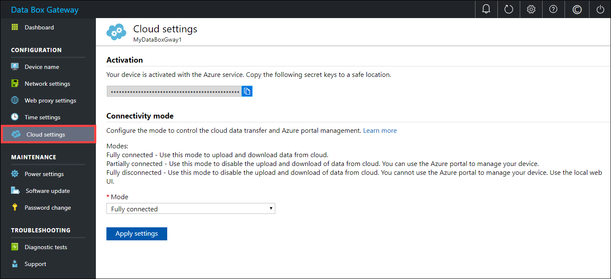

# Tutorial: Connect, set up, activate Azure Data Box Gateway

## Introduction

This tutorial describes how to connect to, set up, and activate your Data Box Gateway device by using the local web UI. 

The setup and activation process can take around 10 minutes to complete. 

In this tutorial, you learn how to:

> [!div class="checklist"]
> * Connect to a virtual device
> * Set up and activate the virtual device

## Prerequisites

Before you configure and set up your Data Box Gateway, make sure that:

* You've provisioned a virtual device and obtained a connected URL to it as detailed in the [Provision a Data Box Gateway in Hyper-V](data-box-gateway-deploy-provision-hyperv.md) or [Provision a Data Box Gateway in VMware](data-box-gateway-deploy-provision-vmware.md).
* You have the activation key from the Data Box Gateway service that you created to manage Data Box Gateway devices. For more information, go to [Prepare to deploy Azure Data Box Gateway](data-box-gateway-deploy-prep.md).

## Connect to the local web UI setup 

1. Open a browser window and access the local web UI of the device at:
   
   [https://ip-address-of-network-interface](https://ip-address-of-network-interface)
   
   Use the connection URL noted in the previous tutorial. You see an error or a warning indicating that there is a problem with the website's security certificate.

2. Select **Continue to this webpage**. These steps might vary depending on the browser you're using.
   
    

3. Sign in to the web UI of your virtual device. The default password is *Password1*. 
   
    

4. At the prompt, change the device password. The new password must contain between 8 and 16 characters. It must contain 3 of the following: uppercase, lowercase, numeric, and special characters.

    

You're now at the **Dashboard** of your device.

## Set up and activate the virtual device
 
Your dashboard displays the various settings that are required to configure and register the virtual device with the Data Box Gateway service. The **Device name**, **Network settings**, **Web proxy settings**, and **Time settings** are optional. The only required settings are **Cloud settings**.
   

1. In the left-pane, select **Device name**, and then enter a friendly name for your device. The friendly name must contain from 1 to 15 characters long and have letter, numbers, and hyphens. 

    

2. (Optional) In the left-pane, select **Network settings** and then configure the settings. On your virtual device, you'll see at least one network interface and more depending on how many you configured in the underlying virtual machine. The **Network settings** page for a virtual device with one network interface enabled is as shown below.
    
    
   
    As you configure network settings, keep in mind:

    - If DHCP is enabled in your environment, network interfaces are automatically configured. An IP address, subnet, gateway, and DNS are automatically assigned.
    - If DHCP isn't enabled, you can assign static IPs if needed.
    - You can configure your network interface as IPv4.

     >[!NOTE] 
     > We recommend that you do not switch the local IP address of the network interface from static to DHCP, unless you have another IP address to connect to the device. If using one network interface and you switch to DHCP, there would be no way to determine the DHCP address. If you want to change to a DHCP address, wait until after the device has registered with the service, and then change. You can then view the IPs of all the adapters in the **Device properties** in the Azure portal for your service.

3. (Optional) configure your web proxy server. Although web proxy configuration is optional, if you use a web proxy, you can configure it only on this page.
   
   
   
   On the **Web proxy** page, do the following:
   
   1. In the **Web proxy URL** box, enter the URL in this format: `http://&lt;host-IP address or FQDN&gt;:Port number`. HTTPS URLs are not supported.
   2. Under **Authentication**, select **None** or **NTLM**.
   3. If you're using authentication, enter a **Username** and **Password**.
   4. To validate and apply the configured web proxy settings, select **Apply**.

   > [!NOTE]
   > Proxy-auto config (PAC) files are not supported. A PAC file defines how web browsers and other user agents can automatically choose the appropriate proxy server (access method) for fetching a given URL.
   > Proxies that try to intercept and read all the traffic (then re-sign everything with their own certification) aren't compatible since the proxy's cert is not trusted.
   > Typically transparent proxies work well with Azure Data Box Gateway.

4. (Optional) In the left pane, select **Time settings**, and then configure the time zone and the primary and secondary NTP servers for your device. 

    NTP servers are required because your device must synchronize time so that it can authenticate with your cloud service providers.
    
    
    
    In the **Time settings** page, do the following:
    
    1. In the **Time zone** drop-down list, select the time zone that corresponds to the geographic location in which the device is deployed.
        The default time zone for your device is PST. Your device will use this time zone for all scheduled operations.

    2. Specify a **Primary NTP server** for your device or accept the default value of `time.windows.com`.   
        Ensure that your network allows NTP traffic to pass from your datacenter to the Internet.

    3. Optionally, in the **Secondary NTP server** box, enter a  secondary server for your device.

    4. To validate and apply the configured time settings, select **Apply**.

6. In the left pane, select **Cloud settings**, and then activate your device with the Data Box Gateway service in Azure portal.
    
    1. In the **Activation key** box, enter the **Activation key** that you got in [Get the activation key](data-box-gateway-deploy-prep.md#get-the-activation-key) for Data Box Gateway.

    2. Select **Activate**.
       
         
    
    3. The device is activated and critical updates, if available, are automatically applied. You see a notification to that effect. Monitor the update progress via the Azure portal.

        
        
        **The dialog also has a recovery key that you should copy and save in a safe location. This key is used to recover your data in the event the device can't boot up.**

    4. You may need to wait several minutes for the update to successfully complete. After the update is complete, sign in to the device. The **Cloud settings** page updates to indicate that the device is successfully activated.

        

The device setup is complete. You can now add shares on your device.

## Next steps

In this tutorial, you learned how to:

> [!div class="checklist"]
> * Connect to a virtual device
> * Set up and activate the virtual device

To learn how to transfer data with your Data Box Gateway, see:

> [!div class="nextstepaction"]
> [Transfer data with Data Box Gateway](./data-box-gateway-deploy-add-shares.md).
