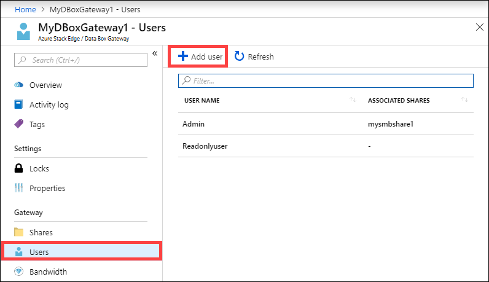
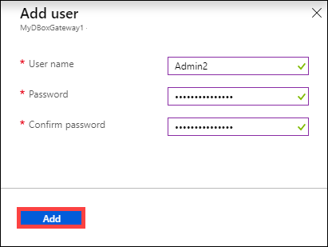
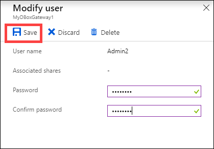
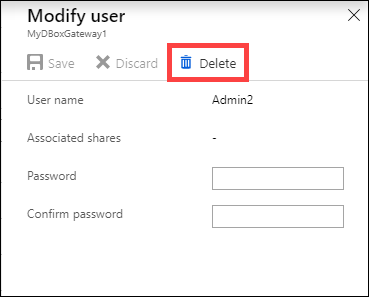
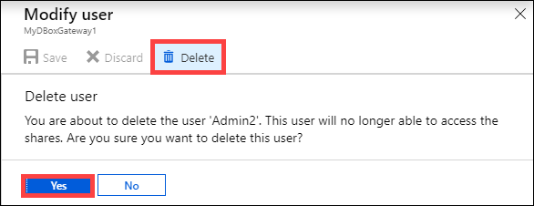
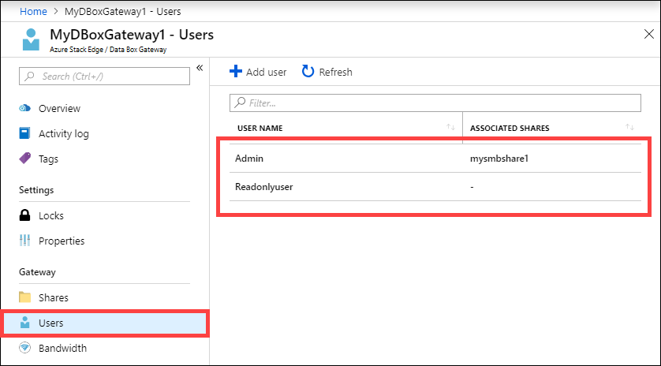

# Use the Azure portal to manage users on your Azure Data Box Gateway 

This article describes how to manage users on your Azure Data Box Gateway. You can manage the Azure Data Box Gateway via the Azure portal or via the local web UI. Use the Azure portal to add, modify, or delete users.

> [!IMPORTANT]
> - Data Box Gateway is in preview. Review the [Azure terms of service for preview](https://azure.microsoft.com/support/legal/preview-supplemental-terms/) before you order and deploy this solution.

In this article, you learn how to:

> [!div class="checklist"]
> * Add a user
> * Modify user
> * Delete a user 

## About users

Users can be read-only or full privilege. As the names indicate the read-only users can only view the share data whereas the full privilege users can read share data, write to these shares, and modify or delete the share data. 

 - **Full privilege user** - A local user with full access. 
 - **Read-only user** - A local user with read-only access. These users are associated with shares that allow read only operations.

The user permissions are first defined when the user is created during share creation. After the permissions associated with a user are defined, these can be modified by using File Explorer. 

## Add a user

Perform the following steps in the Azure portal to add a user.

1. In the Azure portal go to your Data Box Gateway resource and then navigate to **Overview**. Click **+ Add user** on the command bar.

    

2. Specify the username and password for the user you want to add. Confirm the password and click **Add**.

    

    >[!IMPORTANT] These users are reserved by the system and should not be used: Administrator, EdgeUser, EdgeSupport, HcsSetupUser, WDAGUtilityAccount, CLIUSR, DefaultAccount, Guest.  

3. You are notified when the user creation starts and is completed. Once the user is created, from the command bar, click **Refresh** to view the updated list of users.

## Modify user

You can change the password associated with a user once the user is created. Select and click from the list of users. Supply and confirm the new password. Save the changes.
 

## Delete a user

Perform the following steps in the Azure portal to delete a user.

1. Select and click a user from the list of users and then click **Delete**.  

   

2. When prompted, confirm the deletion. 

   

The list of users is updated to reflect the deleted user.

## Next steps

- Learn how to [Manage bandwidth](data-box-gateway-manage-bandwidth.md).
