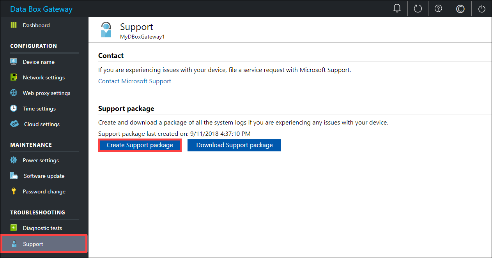
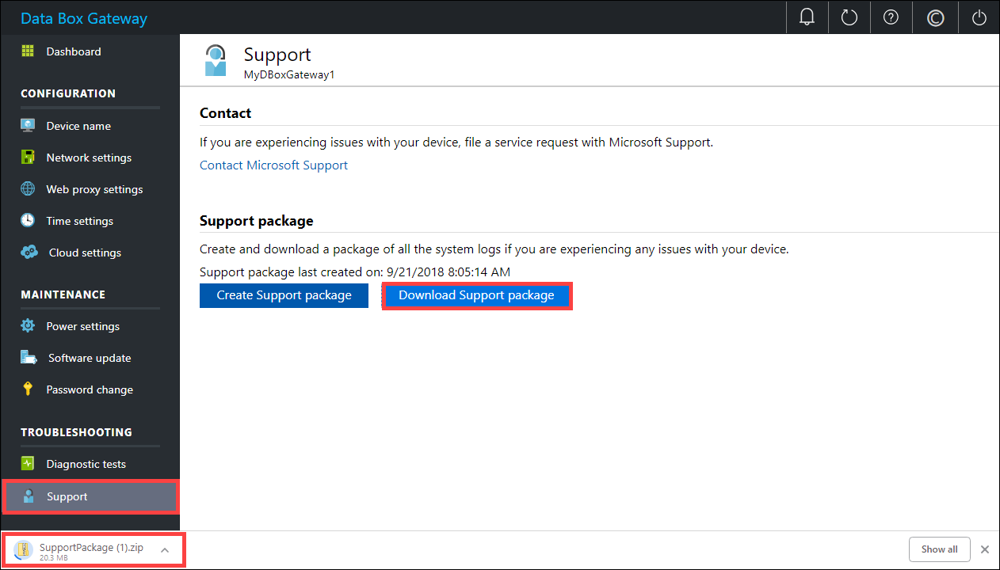
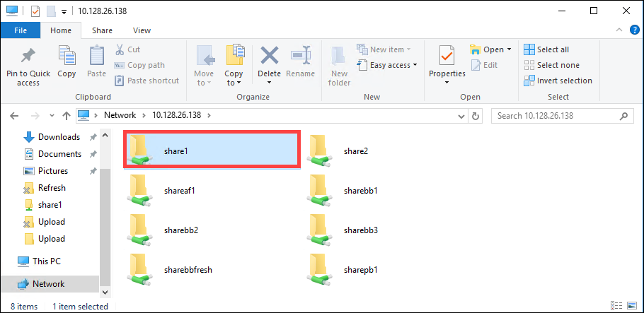

# Troubleshoot your Azure Data Box Gateway issues 

This article describes how to monitor your Azure Data Box Gateway. 

> [!IMPORTANT]
> - Data Box Gateway is in preview. Review the [Azure terms of service for preview](https://azure.microsoft.com/support/legal/preview-supplemental-terms/) before you order and deploy this solution.

In this article, you learn how to:

> [!div class="checklist"]
> * View alerts
> * Monitor device usage
> * View device events
> * Use charts

## View alerts

## Monitor device usage

You can view the device usage via the Dashboard page.
 
The various terms can be explained as follows:

 - **Local capacity** – the total capacity of the device.

 - **Available capacity** – the total size of the files that can be written to the device. In other words, this is the capacity that can be made available on the device. You can free up the device capacity by deleting the local copy of files that have a copy on both the device as well as the cloud.

## View alerts

Perform the following steps to collect a Support package. 

A log package is comprised of all the relevant logs that can assist Data Box Gateway Support with troubleshooting any device issues. In this release, a log package can be generated via the local web UI.

1. In the local web UI, go to **Troubleshooting > Support**. Click **Create support package**. The system starts collecting support package. The package collection may take several minutes.

    
 
2. After the Support package is created, click **Download Support package**. A zipped package is downloaded on the path you chose. You can unzip the package and the view the system log files.

    

## View device events

Any errors experienced during the upload and refresh processes are included in the respective error files.

1. To view the error files, go to your share and click the share to view the contents. 

       

## View metrics

## Next steps

- Learn how to [Manage bandwidth](data-box-gateway-manage-bandwidth-schedules.md).
