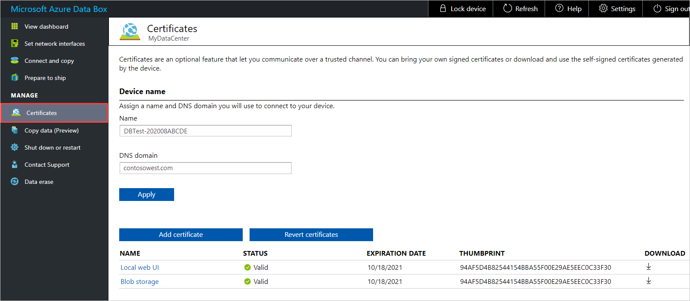
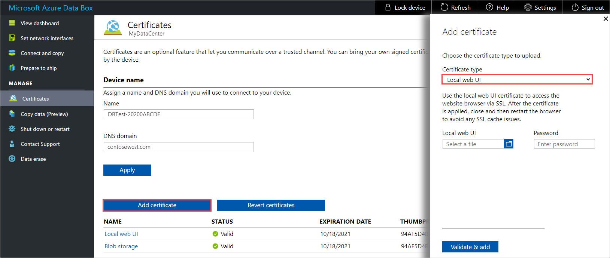
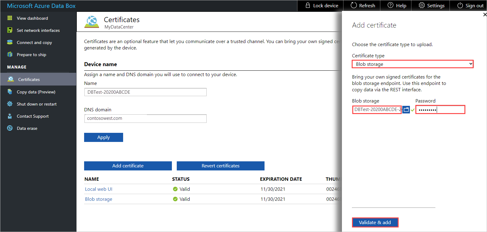
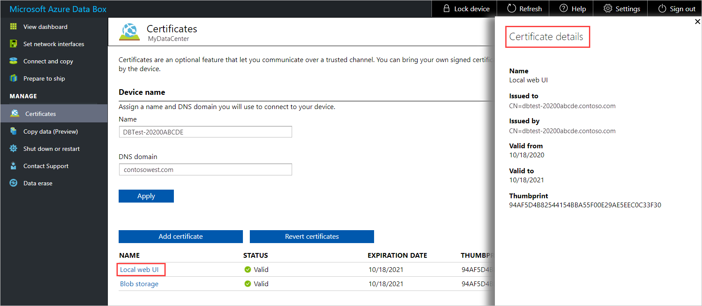
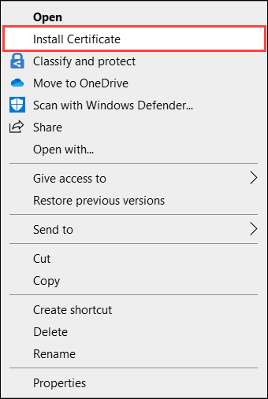
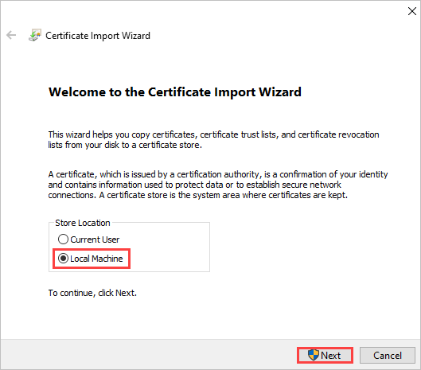
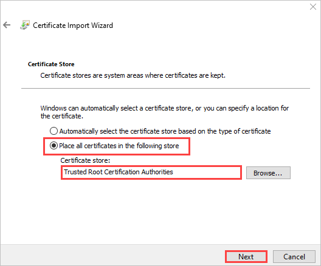
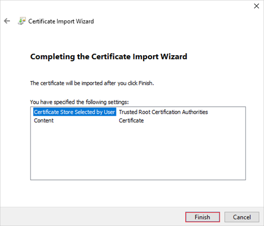
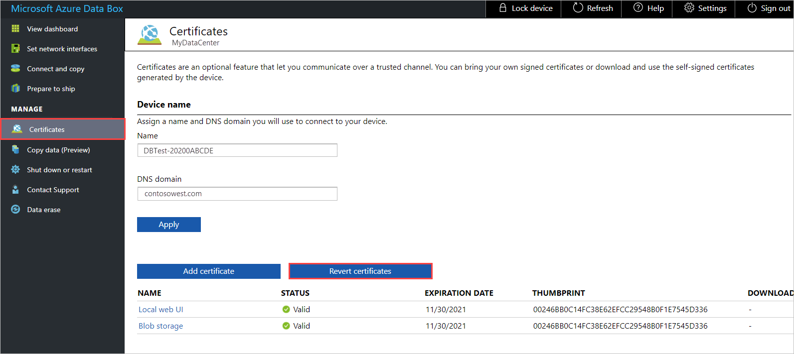

# Use your own certificates with Data Box and Data Box Heavy devices

When an Azure Data Box order is processed, self-signed certificates are generated for accessing the local web UI and blob storage. If you'd rather communicate with your device over a trusted channel, you can use your own certificates.

This article describes how to install your own certificates and how to revert to the default certificates before returning your device to the datacenter. It also gives a summary of basic certificate requirements.

This article applies to both Data Box devices and Data Box Heavy devices.

## About certificates

A certificate provides a link between a **public key** and an entity (such as domain name) that has been **signed** (verified) by a trusted third party (such as a **certificate authority**).  A certificate provides a convenient way of distributing trusted public encryption keys. In this way, certificates ensure that your communication is trusted and that you're sending encrypted information to the right server.

When your Data Box device is initially configured, self-signed certificates are automatically generated. Optionally, you can bring your own certificates. There are guidelines that you need to follow if you plan to bring your own certificates.

On a Data Box or Data Box Heavy device, two types of endpoint certificates are used:

- Blob storage certificate: Used when accessing blob storage via the REST APIs.
- Local UI certificate: Used to access the local web UI on your device using a browser.

This section gives a summary of basic requirements for the certificates. For more information, see [Certificate requirements](../../articles/databox-online/azure-stack-edge-j-series-certificate-requirements.md).

### Certificate requirements

The certificates must meet the following requirements:

- The endpoint certificate needs to be in `.pfx` format with a private key that can be exported.
- You can use an individual certificate for each endpoint, a multidomain certificate for multiple endpoints, or a wildcard endpoint certificate.
- The properties of an endpoint certificate are similar to those of a typical SSL certificate.
- A corresponding certificate in DER format (`.cer` filename extension) is required on the client machine.
- After you upload the local UI certificate, you'll need to restart the browser and clear the cache. Refer to the specific instructions for your browser.
- The certificate must be changed if the device name or the DNS domain name changes.
- Use the following table when creating endpoint certificates:

    |Type |Subject name (SN)  |Subject alternative name (SAN)  |Subject name example |
    |---------|---------|---------|---------|
    |Local web UI| `<Device name>.<DNS domain>`|`<Device name>.<DNS domain>`| `mydevice1.microsoftdatabox.com` |
    |Blob storage|`*.blob.<Device name>.<DNS domain>`|`*.blob.< Device name>.<DNS domain>`|`*.blob.mydevice1.microsoftdatabox.com` |
    |Multi-SAN single certificate for more than one endpoint|`<Device name>.<DNS domain>`|`<Device name>.<DNS domain>` `login.<Device name>.<DNS domain>` `management.<Device name>.<DNS domain>` `*.blob.<Device name>.<DNS domain>`|`mydevice1.microsoftdatabox.com` |

## Add certificates to device

You can use your own certificates for accessing the local web UI and for accessing blob storage.

> [!IMPORTANT]
> If the device name or the DNS domain for the device is changed, new certificates must be created. The client certificates and the device certificates should then be updated with the new device name and DNS domain.

To add your own certificate to your device, follow these steps:

1. In the local web UI, go to **Manage** > **Certificates**.

   **Name** shows the device name. **DNS domain** shows the domain name for the DNS server.

   The bottom of the screen shows the certificates currently in use. For a new device, you'll see the self-signed certificates that were generated during order processing.

   

2. To add a certificate, select **Add certificate** to open the **Add certificate** panel. Then select the **Certificate type** - either **Blob storage** or **Local web UI**.

   

3. Select the certificate file (in `.pfx` format), and enter the password to use for the certificate. Then select **Validate & Add**.

   Choose the certificate file in `.pfx` format, and enter the password set when the certificate was exported.

   

   After the certificate's successfully added, the **Certificates** screen shows the thumbprint for the new certificate. The certificate's status is **Valid**.

   

   If you changed the local web UI certificate, you'll see the following error. This error will go away when you install the new certificate on the client computer you're using to access the local web UI.

   

4. To see certificate details, click the certificate name. The certificate will expire after a year.<!--Is this standard for all certs applied to a device?-->

   

5. Install the new certificate on the client computer you're using to access the local web UI. For instructions, see [Import certificates to client](#import-certificates-to-client), below.

6. If you changed the certificate for the local Web UI, you need to restart the local web UI. Go to **Shut down or restart**, and select **Restart**. This step is needed to avoid any SSL cache issues.

   

   Wait a few minutes, and sign in again.

## Import certificates to client

After you add a certificate to your Data Box device, you need to import the certificate to the client computer you use to access the device. You'll import the certificate to the Trusted Root Certificate Authority store for Local Machine.

To import a certificate on a Windows client, take the following steps:

1. In File Explorer, right-click the certificate file (with `.cer` format), and select **Install certificate**. This action starts the Certificate Import Wizard.

    

2. For **Store location**, select **Local Machine**, and then select **Next**.

    

3. Select **Place all certificates in the following store**, select **Trusted Root Certificate Authority**, and then select **Next**.

   

4. Review your settings, and select **Finish**. A message will tell you the import was successful.

   

## Revert to default certificates

Before you return your device to the Azure datacenter, you should revert to the original certificates that were generated during order processing.

To revert to the original certificates for the device, follow these steps:

1. Go to **Manage** > **Certificates**, and select **Revert certificates**.

   Reverting certificates returns to using the self-signed certificates that were generated during order processing. Your own certificates are removed from the device.

   

2. After certificate reversion completes successfully, go to **Shut down or restart**, and select **Restart**. This step is needed to avoid any SSL cache issues.

   

   Wait a few minutes, and then sign in to the local web UI again.
