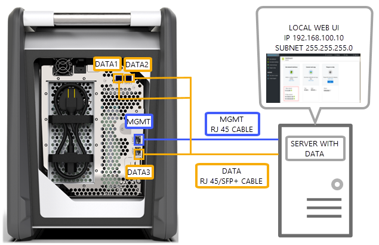
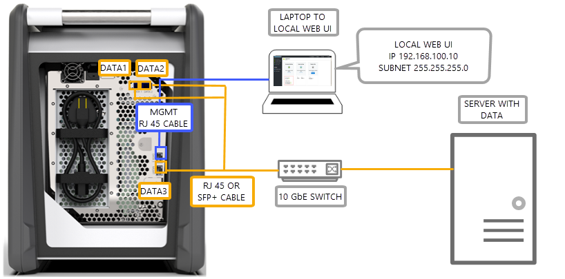

# Cabling options for your Azure Data Box

This article describes the various ways in which your Azure Data Box can be cabled.

## One port setup

This is the absolute minimum configuration for your Data Box. You can configure only the MGMT port for both management and data.

Perform the following steps to cable your device.

1. Use an RJ45 cable to connect the MGMT port to the server containing the data.

    

2. On the server, set:

    - **IP address** to 192.168.100.5
    - **Subnet** to 255.255.255.0

3. Access the local web UI of the device at: 192.168.100.10. Sign in and unlock the Data Box using the unlock password from the Azure portal.

4. Set up a direct network connection (e.g. net use) to the Data Box shared folders. Use a copy tool (e.g. Robocopy) on the server to copy data to the Data Box.

## Two port setup with static IPs

You can configure two ports for your Data Box, the MGMT port for management traffic and one of the data ports for data. The data ports could be DATA 1, DATA 2, or DATA 3.

We strongly recommend that if you configure only one data port, it should a 10 GbE port such as DATA 1 or DATA 2. A 1 GbE port would dramatically increase the time it takes for the data transfer.

Perform the following steps to cable your device.

1. Use an RJ45 Ethernet cable from the server directly to the MGMT portal for configuration.
2. Use an RJ45 for DATA 3 or SFP+ cables to connect DATA 1 or DATA 2 to the server. We recommend that you use 10 GbE DATA 1 or DATA 2 ports for good performance.

    

3. Access the local web UI of the device at: 192.168.100.10. Sign in and unlock the Data Box using the unlock password from the Azure portal.
4. Assign static IPs to the data ports that you have configured.
5. Set up a direct network connection (e.g. net use) to the Data Box shared folders. Use a copy tool (e.g. Robocopy) on the server to copy data to the Data Box.

## Two port setup with a switch

Perform the following steps to cable your device.

1. Use an RJ45 Ethernet cable from the server directly to the MGMT portal for configuration.
2. Use an RJ45 for DATA 3 or SFP+ cables to connect DATA 1 or DATA 2 to the server. We recommend that you use 10 GbE DATA 1 or DATA 2 ports for good performance. The data ports are connected via a 10 GbE switch to the server with data.

    

3. Access the local web UI of the device at: 192.168.100.10. Sign in and unlock the Data Box using the unlock password from the Azure portal.
4. Identify the IP addresses assigned by the DHCP server.
5. Set up a direct network connection (e.g. net use) to the Data Box shared folders. Use a copy tool (e.g. Robocopy) on the server to copy data to the Data Box.

## Two port setup via a switch and static IPs

Perform the following steps to cable your device.

1. Use an RJ45 Ethernet cable from the server directly to the MGMT portal for configuration.
2. Use an RJ45 for DATA 3 or SFP+ cables to connect DATA 1 or DATA 2 to the server. We recommend that you use 10 GbE DATA 1 or DATA 2 ports for good performance.

    

3. Access the local web UI of the device at: 192.168.100.10. Sign in and unlock the Data Box using the unlock password from the Azure portal.
4. Assign static IPs to the data ports that you have configured.
5. Set up a direct network connection (e.g. net use) to the Data Box shared folders. Use a copy tool (e.g. Robocopy) on the server to copy data to the Data Box.

## DHCP server only setup

Perform the following steps to cable your device.

1. Use an RJ45 or SFP+ cable via a switch (where DHCP server is accessible) to the server.

    
2. Use DHCP server or DNS server to identify the IP address.
3. From a server on the same network, access the local web UI of the device using the IP address assigned by the DHCP server. Sign in and unlock the Data Box using the unlock password from the Azure portal.
4. Set up a direct network connection (e.g. net use) to the Data Box shared folders. Use a copy tool (e.g. Robocopy) on the server to copy data to the Data Box.

## Next steps

- After you have cabled the device, go to [Copy data to your Azure Data Box](data-box-deploy-copy-data.md).
