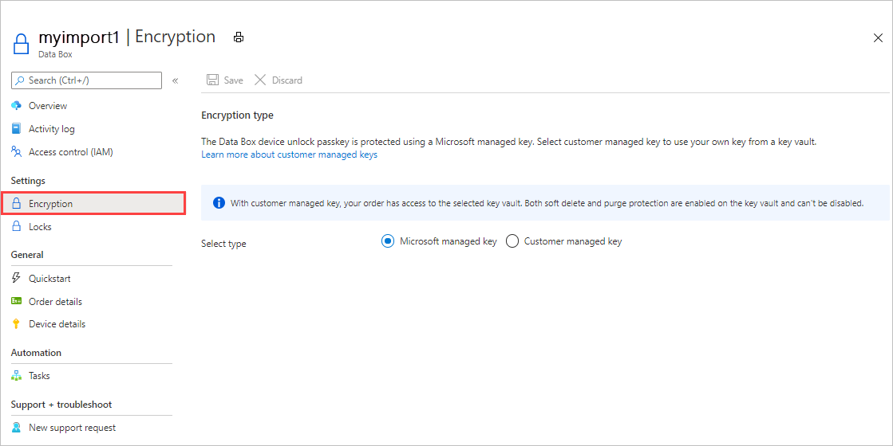
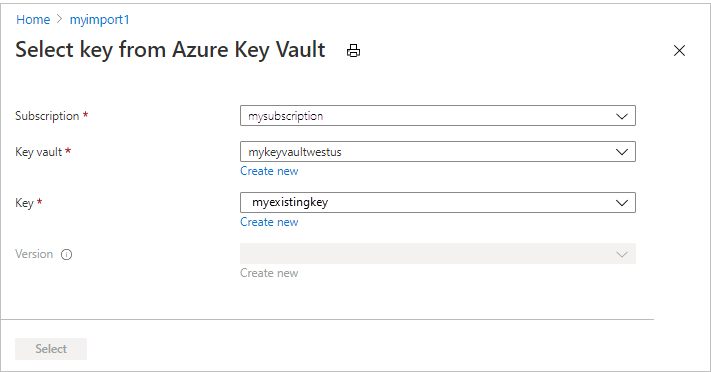
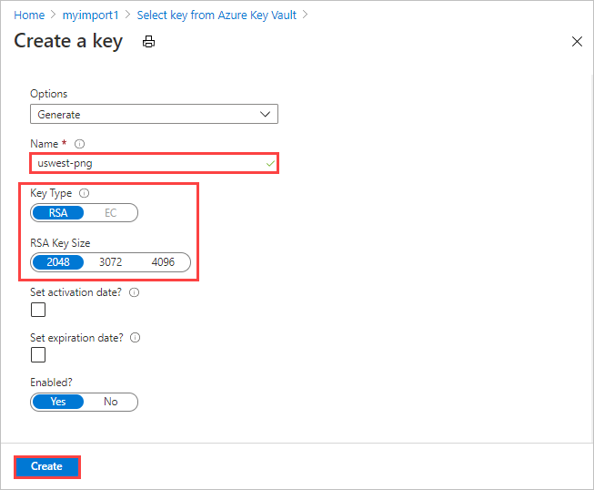

# Use Customer Lockbox for Azure Data Box (Preview)

Azure Data Box is used to transfer customer data to and from Azure. There are instances where Microsoft Support may need to access customer data during a Support request. Use Customer Lockbox as an interface to review and approve or reject these data access requests. 

This article covers how Customer Lockbox requests are initiated and tracked for Data Box import as well as export orders. The article applies to both Azure Data Box devices and Azure Data Box Heavy devices. 

> [!IMPORTANT]
> Customer Lockbox is currently in preview for Data Box service. To enable Customer Lockbox for Data Box for your organization, sign up for [Customer Lockbox for Azure Public Preview](https://forms.office.com/Pages/ResponsePage.aspx?id=v4j5cvGGr0GRqy180BHbR_Kwz02N6XVCoKNpxIpqE_hUNzlTUUNYVkozOVlFNVRSWDVHRkkwTFQyViQlQCN0PWcu).

## Prerequisites

Before you begin, make sure:

1. You have created an Azure Data Box import order as per the instructions in [Tutorial: Order Azure Data Box](data-box-deploy-ordered.md).

2. You have configured Customer Lockbox for Data Box. This is an opt-in service. To learn how to create a key vault using the Azure portal, see [Quickstart: Set and retrieve a secret from Azure Key Vault using the Azure portal](../key-vault/secrets/quick-create-portal.md).

3. Customer Lockbox is automatically available for all customers who have an Azure support plan with a minimal level of Developer. How do you enable Lockbox? <!--change this for Azure Data Box, perhaps you need a different support plan When you have an eligible support plan, no action is required by you to enable Customer Lockbox. Customer Lockbox requests are initiated by a Microsoft engineer if this action is needed to progress a support ticket that is filed from somebody in your organization.-->

4. A service request or a  Support ticket is already opened for this issue. For information on support ticket, see [File a service request for Data Box](data-box-disk-contact-microsoft-support).

## Data access scenario

The customer data is typically not accessed. For Data Box, the following are the most common cases where there is a need to access customer data: 

- Prepare to ship step was not run.
- The data was copied in the wrong folder.
- The data is copied in an incorrect format.

In these cases, Microsoft will try to access your data in the Azure datacenter and will require your explicit consent to access the data. The access is requested and tracked via the Customer Lockbox interface if you have enabled Lockbox. 

If Lockbox is not enabled, then 

## Initiate request via Lockbox

 To create a request to access customer data, follow these steps:

1. Typically a customer initiates a service request via Lockbox. However, for Data Box, if Microsoft detects that there is an issue with uploading or downloading the data at Azure datacenter, for example, the Data Box order was halted during the Data Copy stage. The Support team reaches out to the customer. 
 
1. If the support engineer can’t troubleshoot the issue by using standard tools and telemetry, the next step is to request elevated permissions by using a Just-In-Time (JIT) access service.

3. When the request requires direct access to customer data, a Customer Lockbox request is initiated.Accessed pod through support session and validated that the disks are locked and shares are not accessible. Raised JIT request for “Unlock Databox” ACIS operation

    

2. When Support reaches out to you, they will ask you to provide access to your subscription.

		b. Geneva actions - can do ad hoc operations on the service or DB. If we want to get customer email ID to contact them - need to get manager approval. JIT action - configure a claim that to see customer data for a particular operation, I need access to customer data. Then the access gets approved.
		c. This is done via JIT portal. Notification goes to the admin of the subscription. Also you can configure to add a group to the customer's lockbox.
		d. Once the request is approved - for DB - device disks are locked by a key. The service has the BitLocker key to unlock the disks. When we have the approval, we unlock the disks.
Support person can access DB using DC infra and can access the data.Job went through provisioning and was halted during DataCopy stage

    

5. Approved the lockbox request from portal

    

    You can also select **Create new** to create a new key vault. In the **Create key vault blade**, enter the resource group and the key vault name. Ensure that the **Soft delete** and **Purge protection** are enabled. Accept all other defaults. Select **Review + Create**.

    

7. Executed the action after approval.

    

8. Validated the unlocked disk and share access in support session.

    

9. Disabled support session

    

10. Resumed the job to completion

    

> [!IMPORTANT]
> You can disable Microsoft managed key and move to customer-managed key at any stage of the Data Box order. However, once you have created the customer-managed key, you cannot switch back to the Microsoft-managed key.

## Next steps

- [Customer Lockbox for Microsoft Azure](https://docs.microsoft.com/azure/security/fundamentals/customer-lockbox-overview)
- [Approve, audit support access requests to VMs using Customer Lockbox for Azure](https://azure.microsoft.com/blog/approve-audit-support-access-requests-to-vms-using-customer-lockbox-for-azure/)