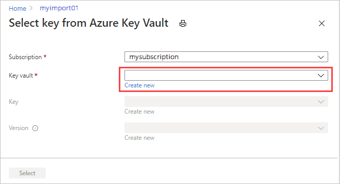
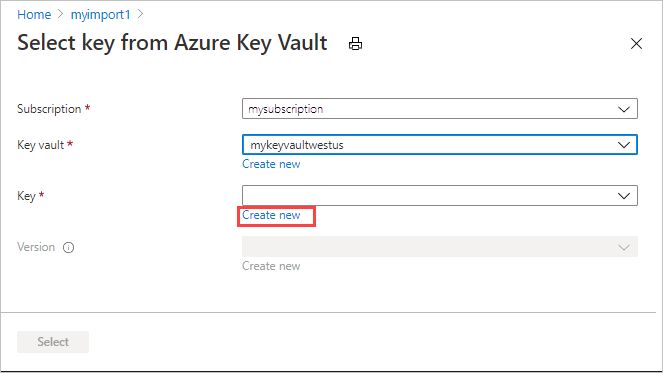
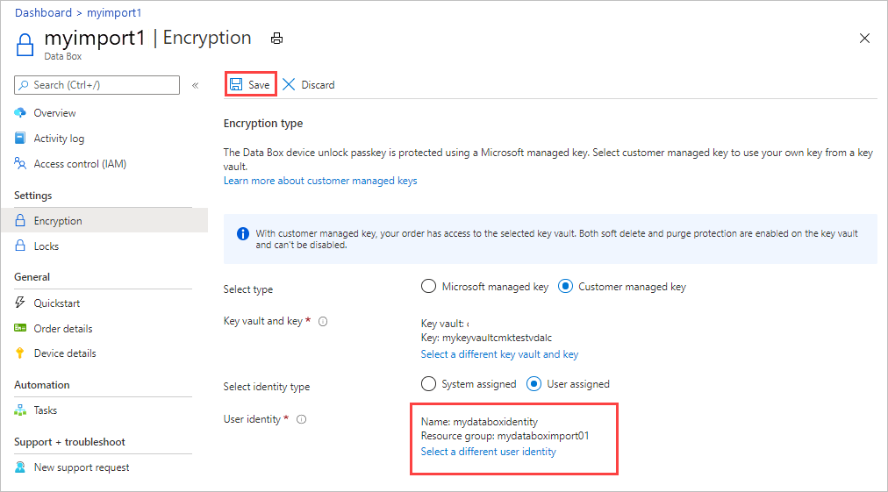

# Manage customer-managed keys in Azure Key Vault for Azure Data Box

Azure Data Box protects the device unlock key (also known as the device password) that is used to lock the device via an encryption key. By default, this encryption key is a Microsoft managed key. For additional control over the device unlock key, you can instead use a customer-managed key for this encryption. The encryption key does not affect how data is 

This article shows how to use the [Azure portal](https://portal.azure.com/) to change to a customer-managed encryption key for an order that currently uses a Microsoft managed key. This article applies to Data Box orders and Data Box Heavy orders.<!--They can do other things - change from customer-managed to the Microsoft managed key, or change the customer-managed key for an order. But I assume the procedure should stay focused on switching to a customer-managed key.-->

To keep this level of control throughout the order process, use a customer-managed key when you create your Data Box order. For more information, see [Tutorial: Order Azure Data Box](data-box-deploy-ordered.md).

## Requirements

The customer-managed key for a Data Box order must meet the following requirements:<!--If the only requirement for this procedure is to have an existing Data Box or Data Box Heavy order, then there really are no requirements. Is it adequate to just weave key and key vault requirements into the procedures and never set them out in a highly visible place? Can they be added as UI text? When they add a key while creating an order, they also must select a user identity - not a requirement here.-->
 
- The key must be created and stored in an Azure Key Vault that has **Soft delete** and **Do not purge** enabled. For more information, see [What is Azure Key Vault?](../key-vault/general/overview.md). You can create a key vault and key while creating or updating your order.

- The key must be an RSA key of 2048 size or larger.<!--Double-check: Isn't 2048 the minimum available size for an RSA key? Could both requirements be boiled down to: "The customer-managed key for a Data Box order must be an RSA key stored in an Azure Key Vault that has **Soft delete** and **Do not purge** enabled."? Might fit snugly into the intro.-->

## Add key to order

To add a customer-managed key to a Data Box order in the Azure portal, follow these steps:

1. Go to the **Overview** screen for your completed Data Box order.

    

2. Go to **Settings > Encryption**. Under **Encryption type**, you can choose how you want to protect your device unlock key. If a customer-managed key isn't added, a Microsoft managed key is used.

    

3. Select **Customer managed key** as the encryption type. Then select **Select a key vault and key**.<!--Recast steps as in the Order tutorial to group key vault instructions, key instructions, and identity instructions. Hard to follow the options.-->

    

4. On the **Select key from Azure Key Vault** screen, the subscription is automatically populated. For **Key vault**, you can select an existing key vault from the dropdown list.

    

    You can also select **Create new** to create a new key vault. On the **Create key vault** screen, enter the resource group and a key vault name. Ensure that **Soft delete** and **Purge protection** are enabled. Accept all other defaults. Select **Review + Create**.

    

5. Review the information associated with your key vault, and select **Create**. Wait for a couple minutes for key vault creation to complete.

    

6. On the **Select key from Azure Key Vault** screen, you can select a key in the existing key vault.

    

7. If you want to create a new key, select **Create new**. You must use an RSA key. The size can be 2048 or greater.

    

8. Provide the name for your key, accept the other defaults, and select **Create**. You are notified that a key is created in your key vault.

    

9. Select **Version**, choose **Select**, and then select the current version of the key or an earlier one.

    

10. In the **Encryption type** settings, you can see the key vault and the key selected for your customer-managed key.

    

11. Select the type of identity to use to manage the customer-managed key for this resource. You can use the **system assigned** identity that was generated during order creation or select **user assigned** and choose an identity of your own.<!--Context: They either are seeing a user-assigned identity or "System assigned" is selected by default?-->

    A user-assigned identity is an independent resource that you can use to manage access to resources. For more information, see [Managed identity types](/azure/active-directory/managed-identities-azure-resources/overview).<!--Coordinate this with the >  

    <!--Reshoot. First screenshot should show just the two selection types. The option to use a system assigned identity type is not included in the Order wizard.-->

    If you want to assign a user identity, select **Select a user identity** and then select your managed identity that you want to use.<!--Stopped shooting screens here (11/06).-->

    <!--Edit current screen from the Order tutorial to sub new options in the Encryption Type settings.-->

    You can't create a new user identity here. To find out how to create one, see [Create, list, delete or assign a role to a user-assigned managed identity using the Azure portal](/azure-docs/blob/master/articles/active-directory/managed-identities-azure-resources/how-to-manage-ua-identity-portal).

    The selected user identity is shown in the **Encryption type** settings.

    

 12. Save the key settings.<!--Check the Save button context. Not just saving a key. New screenshot may not be needed. Save command is boxed in the previous screenshot.-->

     

The key URL is displayed under **Encryption type**.

## Troubleshoot errors

If you receive any errors related to your customer-managed key, use the following table to troubleshoot.<!--Two new errors to be added. See video notes.-->

| Error   code| Error details| Recoverable?|
|-------------|--------------|---------|
| SsemUserErrorEncryptionKeyDisabled| Could not fetch the passkey as the customer managed key is disabled.| Yes, by enabling the key version.|
| SsemUserErrorEncryptionKeyExpired| Could not fetch the passkey as the customer managed key has expired.| Yes, by enabling the key version.|
| SsemUserErrorKeyDetailsNotFound| Could not fetch the passkey as the customer managed key could not be found.| If you deleted the key vault, you can't recover the customer-managed key.  If you migrated the key vault to a different tenant, see [Change a key vault tenant ID after a subscription move](../key-vault/general/move-subscription.md). If you deleted the key vault:<ol><li>Yes, if it is in the purge-protection duration, using the steps at [Recover a key vault](../key-vault/general/soft-delete-powershell.md#recovering-a-key-vault).</li><li>No, if it is beyond the purge-protection duration.</li></ol> Else if the key vault underwent a tenant migration, yes, it can be recovered using one of the below steps: <ol><li>Revert the key vault back to the old tenant.</li><li>Set `Identity = None` and then set the value back to `Identity = SystemAssigned`. This deletes and recreates the identity once the new identity has been created. Enable `Get`, `Wrap`, and `Unwrap` permissions to the new identity in the key vault's Access policy.</li></ol> |
| SsemUserErrorKeyVaultBadRequestException| Could not fetch the passkey as the customer managed key access is revoked.| Yes, check if: <ol><li>Key vault still has the MSI in the access policy.</li><li>Access policy provides permissions to Get, Wrap, Unwrap.</li><li>If key vault is in a vNet behind the firewall, check if **Allow Microsoft Trusted Services** is enabled.</li></ol>|
| SsemUserErrorKeyVaultDetailsNotFound| Could not fetch the passkey as the associated key vault for the customer managed key could not be found. | If you deleted the key vault, you can't recover the customer-managed key.  If you migrated the key vault to a different tenant, see [Change a key vault tenant ID after a subscription move](../key-vault/general/move-subscription.md). If you deleted the key vault:<ol><li>Yes, if it is in the purge-protection duration, using the steps at [Recover a key vault](../key-vault/general/soft-delete-powershell.md#recovering-a-key-vault).</li><li>No, if it is beyond the purge-protection duration.</li></ol> Else if the key vault underwent a tenant migration, yes, it can be recovered using one of the below steps: <ol><li>Revert the key vault back to the old tenant.</li><li>Set `Identity = None` and then set the value back to `Identity = SystemAssigned`. This deletes and recreates the identity once the new identity has been created. Enable `Get`, `Wrap`, and `Unwrap` permissions to the new identity in the key vault's Access policy.</li></ol> |
| SsemUserErrorSystemAssignedIdentityAbsent  | Could not fetch the passkey as the customer managed key could not be found.| Yes, check if: <ol><li>Key vault still has the MSI in the access policy.</li><li>Identity is of type System assigned.</li><li>Enable Get, Wrap and Unwrap permissions to the identity in the key vault’s Access policy.</li></ol>|
| SsemUserErrorUserAssignedLimitReached | Adding new User Assigned Identity failed as you have reached the limit on the total number of user assigned identities that can be added. | Please retry the operation with fewer user identities or remove some user assigned identities from the resource before retrying. |
| SsemUserErrorKeyVaultBadRequestException | Applied a customer managed key but the key access has not been granted or has been revoked, or firewall is enabled for Keyvault. | Add the identity : %IdentityId; to your key vault to enable access to the customer managed key or try disabling the firewall for Keyvault. |
| Generic error  | Could not fetch the passkey.| This is a generic error. Contact Microsoft Support to troubleshoot the error and determine the next steps.|

## Next steps

- [What is Azure Key Vault?](../key-vault/general/overview.md)
- [Quickstart: Set and retrieve a secret from Azure Key Vault using the Azure portal](../key-vault/secrets/quick-create-portal.md)
