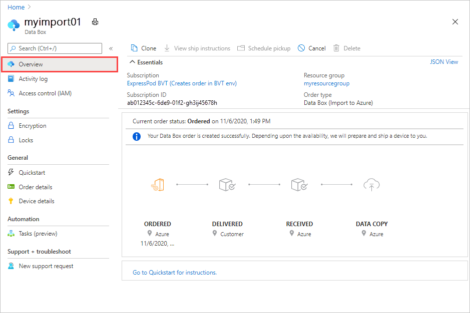
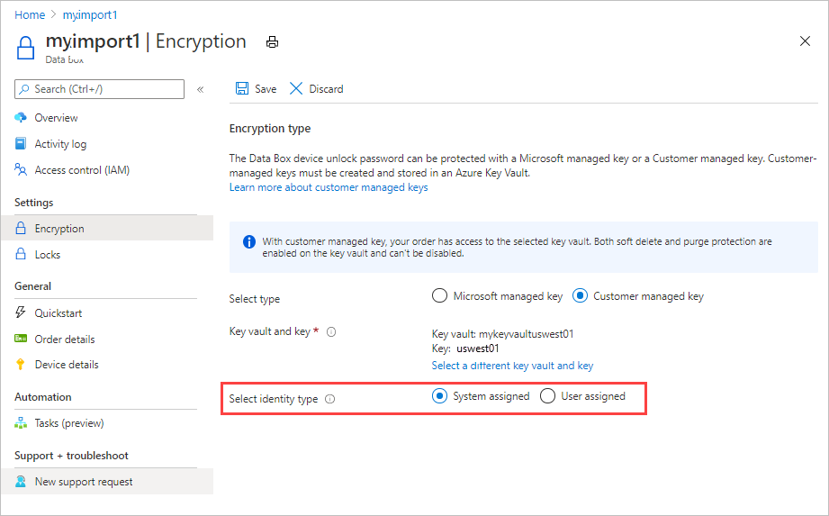
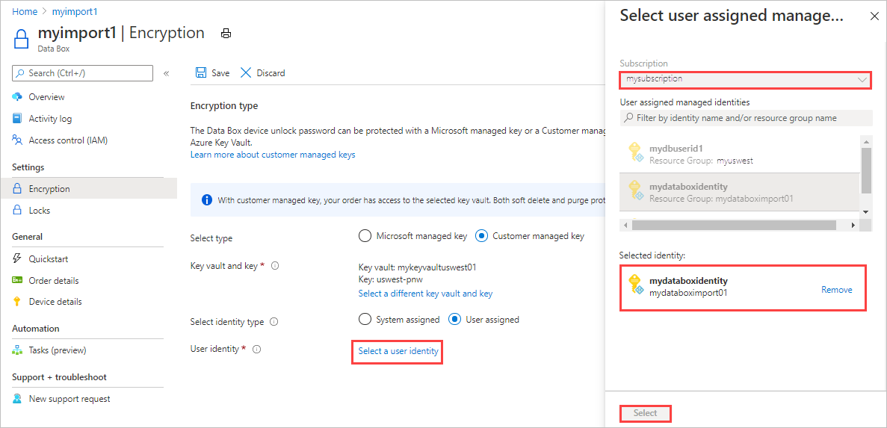
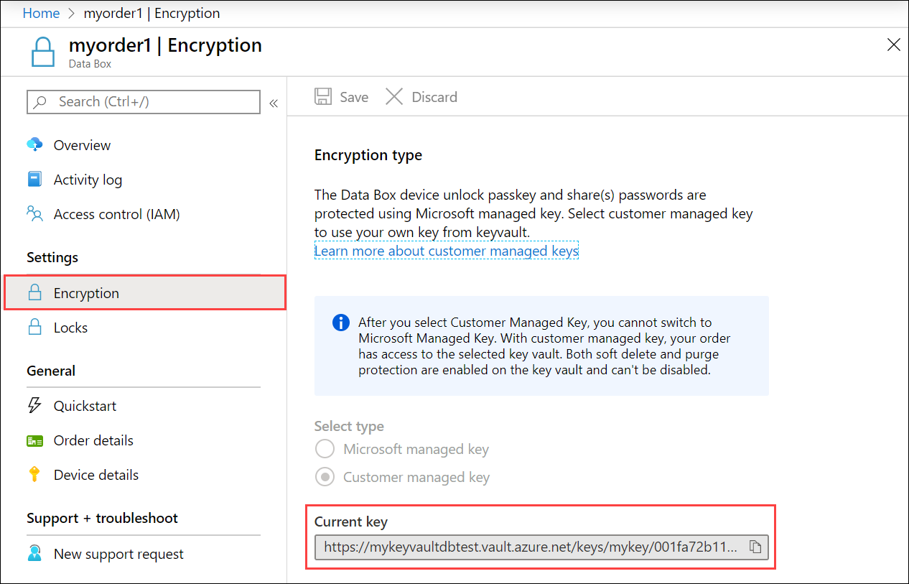

# Manage customer-managed keys in Azure Key Vault for Azure Data Box

Azure Data Box protects the device unlock key (also known as device password) that is used to lock the device via an encryption key. By default, the device unlock key for a Data Box order is encrypted with a Microsoft managed key. For additional control over the device unlock key, you can instead use a customer-managed key.

Customer-managed keys must be created and stored in an Azure Key Vault. For more information about Azure Key Vault, see [What is Azure Key Vault?](../key-vault/general/ove09rview.md).

You can configure a customer-managed key when you place a Data Box order or add one after the order is processed. For information about configuring a customer-managed key when you order your Data Box, see [Tutorial: Order Azure Data Box](data-box-deploy-ordered.md).  

This article shows how to use the [Azure portal](https://portal.azure.com/) to add a customer-managed key to an Azure Data Box device that is currently using a Microsoft managed key for encryption. This article applies to both Azure Data Box devices and Azure Data Box Heavy devices.

> [!IMPORTANT]
> You can disable the Microsoft managed key and move to a customer-managed key at any stage of your Data Box order. However, once you create a customer-managed key, you can't switch back to the Microsoft-managed key.

## Requirements

- The key must be created and stored in an Azure Key Vault. For more information about Azure Key Vault, see [What is Azure Key Vault?](../key-vault/general/overview.md).

  You can create a key vault when add a customer-managed key to a new or completed Data Box order or separately.To learn how to create a key vault using the Azure portal, see [Quickstart: Set and retrieve a secret from Azure Key Vault using the Azure portal](../key-vault/secrets/quick-create-portal.md)

- The key vault should be in the same region as the storage accounts you use for your data. Multiple storage accounts can be linked with your Azure Data Box resource.<!--This is recommended but not actually required. Anusha was to check for impact on costs.>

- **Soft delete** and **Do not purge** must be set on the key vault. These properties are not enabled by default. <!--Soft delete is enabled in the new Order flow. Verify whether that changed in the completed order.-->If you're using an existing key vault, see the **Enabling soft-delete** and **Enabling Purge Protection** sections in one of the following articles to find out how to enable these properties:
   - [How to use soft-delete with PowerShell](../key-vault/general/soft-delete-powershell.md).
   - [How to use soft-delete with CLI](../key-vault/general/soft-delete-cli.md).

- The key must be an RSA key of 2048 size or larger.

## Add key to device

To add a customer-managed key in the Azure portal after your Data Box order is complete, follow these steps.

1. Go to the **Overview** screen for your completed Data Box order.

    

2. Go to **Settings > Encryption**. Under **Encryption type**, you can choose how you want to protect your device unlock key. By default, a Microsoft managed key is used to protect your device unlock password. 

    

3. Select **Customer managed key** as the encryption type. Then select **Select a key vault and key**.

    

4. On the **Select key from Azure Key Vault** screen, the subscription is automatically populated. For **Key vault**, you can select an existing key vault from the dropdown list.

    

    You can also select **Create new** to create a new key vault. On the **Create key vault** screen, enter the resource group and a key vault name. Ensure that the **Soft delete** and **Purge protection** are enabled. Accept all other defaults. Select **Review + Create**.

    

5. Review the information associated with your key vault and select **Create**. Wait for a couple minutes for key vault creation to complete.

    

6. In the **Select key from Azure Key Vault**, you can select a key in the existing key vault.

    

7. If you want to create a new key, select **Create new**. RSA key size can be 2048 or greater.

    

8. Enter a name for your key, accept the other defaults, and select **Create**.

    

9. You are notified that a key is created in your key vault. Select the **Version** and then choose **Select**.

    

10. In the **Encryption type** settings, you can see the key vault and the key selected for your customer-managed key.

    

11. In the **Encryption type** options, select the type of identity to use to manage the customer-managed key for this resource.<!--Low confidence in this explanation.--> You can use a **system assigned** identity (the default) or select **user assigned** and choose an identity of your own.

    A user-assigned identity is an independent resource that is associated with a resource group. For more information, see [Managed identity types](/azure/active-directory/managed-identities-azure-resources/overview).  

    <!--Reshoot. Just the two selection types. The option to use a system assigned identity type is not included in the Order wizard.-->

    If you want to create a new user identity, select **Select a user identity** and then select your managed identity that you want to use.<!--Stopped shooting screens here (11/06). Will need to test a new order to get back to this screen.-->

    <!--Edit current screen from the Order tutorial to sub new options in the Encryption Type settings. Extra line? Reshoot would require lots of handwork to cleanse the Assigned management key pane of specifics. Make same update to Order tutorial.-->

    You can't create a new user identity here. To find out how to create one, see [Create, list, delete or assign a role to a user-assigned managed identity using the Azure portal](/azure-docs/blob/master/articles/active-directory/managed-identities-azure-resources/how-to-manage-ua-identity-portal).

    The selected user identity is shown in the **Encryption type** settings.

    

 12. Save the key.<!--No new picture needed? I boxed the Save command in the previous screenshot.-->

     

The key URL is displayed under **Encryption type**.

## Troubleshoot errors

If you receive any errors related to your customer-managed key, use the following table to troubleshoot.<!--Two new errors to be added. See video notes.-->

| Error   code| Error details| Recoverable?|
|-------------|--------------|---------|
| SsemUserErrorEncryptionKeyDisabled| Could not fetch the passkey as the customer managed key is disabled.| Yes, by enabling the key version.|
| SsemUserErrorEncryptionKeyExpired| Could not fetch the passkey as the customer managed key has expired.| Yes, by enabling the key version.|
| SsemUserErrorKeyDetailsNotFound| Could not fetch the passkey as the customer managed key could not be found.| If you deleted the key vault, you can't recover the customer-managed key.  If you migrated the key vault to a different tenant, see [Change a key vault tenant ID after a subscription move](../key-vault/general/move-subscription.md). If you deleted the key vault:<ol><li>Yes, if it is in the purge-protection duration, using the steps at [Recover a key vault](../key-vault/general/soft-delete-powershell.md#recovering-a-key-vault).</li><li>No, if it is beyond the purge-protection duration.</li></ol> Else if the key vault underwent a tenant migration, yes, it can be recovered using one of the below steps: <ol><li>Revert the key vault back to the old tenant.</li><li>Set `Identity = None` and then set the value back to `Identity = SystemAssigned`. This deletes and recreates the identity once the new identity has been created. Enable `Get`, `Wrap`, and `Unwrap` permissions to the new identity in the key vault's Access policy.</li></ol> |
| SsemUserErrorKeyVaultBadRequestException| Could not fetch the passkey as the customer managed key access is revoked.| Yes, check if: <ol><li>Key vault still has the MSI in the access policy.</li><li>Access policy provides permissions to Get, Wrap, Unwrap.</li><li>If key vault is in a vNet behind the firewall, check if **Allow Microsoft Trusted Services** is enabled.</li></ol>|
| SsemUserErrorKeyVaultDetailsNotFound| Could not fetch the passkey as the associated key vault for the customer managed key could not be found. | If you deleted the key vault, you can't recover the customer-managed key.  If you migrated the key vault to a different tenant, see [Change a key vault tenant ID after a subscription move](../key-vault/general/move-subscription.md). If you deleted the key vault:<ol><li>Yes, if it is in the purge-protection duration, using the steps at [Recover a key vault](../key-vault/general/soft-delete-powershell.md#recovering-a-key-vault).</li><li>No, if it is beyond the purge-protection duration.</li></ol> Else if the key vault underwent a tenant migration, yes, it can be recovered using one of the below steps: <ol><li>Revert the key vault back to the old tenant.</li><li>Set `Identity = None` and then set the value back to `Identity = SystemAssigned`. This deletes and recreates the identity once the new identity has been created. Enable `Get`, `Wrap`, and `Unwrap` permissions to the new identity in the key vault's Access policy.</li></ol> |
| SsemUserErrorSystemAssignedIdentityAbsent  | Could not fetch the passkey as the customer managed key could not be found.| Yes, check if: <ol><li>Key vault still has the MSI in the access policy.</li><li>Identity is of type System assigned.</li><li>Enable Get, Wrap and Unwrap permissions to the identity in the key vault’s Access policy.</li></ol>|
| Generic error  | Could not fetch the passkey.| This is a generic error. Contact Microsoft Support to troubleshoot the error and determine the next steps.|

## Next steps

- [What is Azure Key Vault?](../key-vault/general/overview.md)
- [Quickstart: Set and retrieve a secret from Azure Key Vault using the Azure portal](../key-vault/secrets/quick-create-portal.md)
