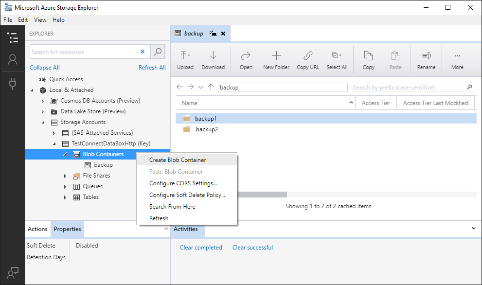
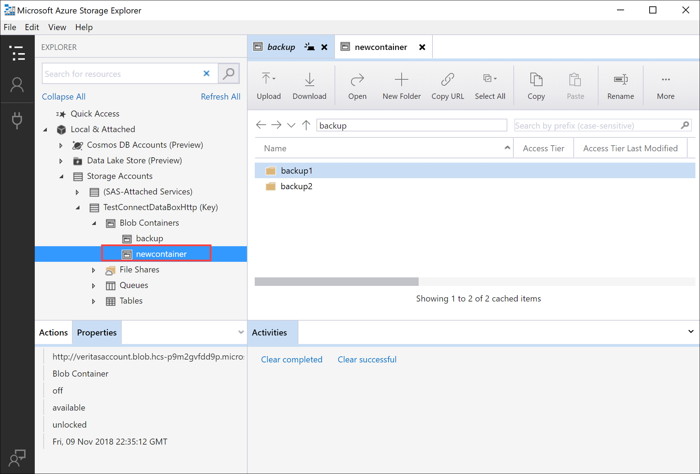

# Tutorial: Copy data via Azure Data Box Blob storage REST APIs  

This tutorial describes procedures to connect a Windows system to Data Box using Azure Blob storage REST APIs. The connection to the Data Box Blob storage REST APIs can be over *http* or *https*. Once connected, the steps required to copy the data to Data Box and prepare the Data Box to ship, are also described.

In this tutorial, you learn how to:

> [!div class="checklist"]
> * Connect to Data Box Blob storage via http
> * Connect to Data Box Blob storage via https
> * Copy data to Data Box
> * Prepare to ship

## Prerequisites

Before you begin, make sure that:

1. You've completed the [Tutorial: Set up Azure Data Box](data-box-deploy-set-up.md).
2. You've received your Data Box and the order status in the portal is **Delivered**.
3. You've reviewed the [system requirements for Data Box Blob storage](data-box-system-requirements-rest.md) and are familiar with supported versions of APIs, SDKs, and tools.
4. You have a host computer that has the data that you want to copy over to Data Box. Your host computer must
    - Run a [Supported operating system](data-box-system-requirements.md).
    - Be connected to a high-speed network. We strongly recommend that you have at least one 10-GbE connection. If a 10-GbE connection isn't available, a 1-GbE data link can be used but the copy speeds will be impacted.
5. You have the latest version of AzCopy on Linux or Windows. You'll use AzCopy to copy data to Azure from your host computer.
6. You have access to a GPv1 storage account associated with your Data Box. You'll copy data to this account.


## Connect to Data Box Blob storage

Based on the storage account selected, Data Box creates upto:
- Three shares for each associated storage account for GPv1 and GPv2.
- One share for premium or blob storage account.

Under block blob and page blob shares, first-level entities are containers, and second-level entities are blobs. Under shares for Azure Files, first-level entities are shares, second-level entities are files.

Consider the following example.

- Storage account: *Mystoracct*
- Share for block blob: *Mystoracct_BlockBlob/my-container/blob*
- Share for page blob: *Mystoracct_PageBlob/my-container/blob*
- Share for file: *Mystoracct_AzFile/my-share*

Depending on whether your Data Box is connected to a Windows Server host computer or to a Linux host, the steps to connect and copy can be different.

## Connect via http

Connection to Data Box Blob storage REST APIs over *http* require the following steps:

- Add the device IP and blob service endpoint to the remote host
- Configure third-party software and verify the connection

Each of these steps is described in the following sections.

### Add device IP address and blob service endpoint to the remote host

[!INCLUDE [data-box-add-device-ip](../../includes/data-box-add-device-ip.md)]

### Configure partner software and verify connection

[!INCLUDE [data-box-configure-partner-software](../../includes/data-box-configure-partner-software.md)]

[!INCLUDE [data-box-verify-connection](../../includes/data-box-verify-connection.md)]

## Connect via https

Connection to Azure Blob storage REST APIs over https requires the following steps:

- Download the certificate from Azure portal
- Prepare the host computer for remote management
- Add the device IP and blob service endpoint to the remote host
- Configure third-party software and verify the connection

Each of these steps is described in the following sections.

### Download certificate

Use the Azure portal to download certificate.

1. Sign into the Azure portal.
2. Go to your Data Box order and navigate to **General > Device details**.
3. Under **Device credentials**, go to **API access** to device. Click **Download**. This action downloads a **<your order name>.cer** certificate file. **Save** this file. You will nstall this certificate on the client or host computer that you will use to connect to the device.
 
### Prepare the host for remote management

Follow these steps to prepare the Windows client for a remote connection that uses an HTTPS session:

- Import the .cer file into the root store of the client or remote host.
- Add the device IP address and blob service endpoint to the hosts file on your Windows client.

Each of the preceding procedures, is described below.

Import the certificate on the remote host

You can use Windows PowerShell or the Windows Server UI to import and install the certificate on your host system.

**Using PowerShell**

1. Start a Windows PowerShell session as an administrator.
2. At the command prompt, type:

    ```
    Import-Certificate -FilePath C:\temp\localuihttps.cer -CertStoreLocation Cert:\LocalMachine\Root
    ```

**Using Windows Server UI**

1.	Right-click the .cer file and select **Install certificate**. This starts the Certificate Import Wizard.
 
2.	For **Store location**, select **Local Machine**, and then click **Next**.
3.	Select **Place all certificates in the following store**, and then click **Browse**. Navigate to the root store of your remote host, and then click **Next**.
4.	Click **Finish**. A message that tells you that the import was successful appears.

### To add device IP address and blob service endpoint to the remote host

[!INCLUDE [data-box-add-device-ip](../../includes/data-box-add-device-ip.md)]

### Configure partner software to establish connection

[!INCLUDE [data-box-configure-partner-software](../../includes/data-box-configure-partner-software.md)]

[!INCLUDE [data-box-verify-connection](../../includes/data-box-verify-connection.md)]

## Copy data to Data Box

Once you are connected to the Data Box shares, the next step is to copy data. Prior to data copy, ensure that you review the following considerations:

- Ensure that you copy the data to shares that correspond to the appropriate data format. For instance, copy the block blob data to the share for block blobs. If the data format does not match the appropriate share type, then at a later step, the data upload to Azure will fail.
-  While copying data, ensure that the data size conforms to the size limits described in the [Azure storage and Data Box limits](data-box-limits.md). 
- If data, which is being uploaded by Data Box, is concurrently uploaded by other applications outside of Data Box, this may result in upload job failures and data corruption.

You'll use AzCopy to copy data to Azure. The copy procedure has the following steps:

- Create a container
- Upload contents of a folder to Data Box Blob storage
- Upload modified files to Data Box Blob storage

Each of these steps is described in detail in the following sections. For more up-to-date and complete information on how to migrate data using AzCopy, go to [Tutorial: Migrate on-premises data to cloud storage by using AzCopy](/azure/storage/common/storage-use-azcopy-migrate-on-premises-data#upload-contents-of-a-folder-to-blob-storage).

### Create a container

The first step is to create a container, because blobs are always uploaded into a container. Containers organize groups of blobs like you organize files in folders on your computer.

Follow these steps to create a blob container.

1. Open Storage Explorer.
2. In the left pane, expand the storage account within which you wish to create the blob container.
3. Right-click **Blob Containers**, and from the context menu, select **Create Blob Container**.

   

4. A text box appears below the **Blob Containers** folder. Enter the name for your blob container. See the [Create the container and set permissions](/articles/storage/blobs/storage-quickstart-blobs-dotnet.md#create-the-container-and-set-permissions) for information on rules and restrictions on naming blob containers.
5. Press **Enter** when done to create the blob container, or **Esc** to cancel. Once the blob container is successfully created, it is displayed under the **Blob Containers** folder for the selected storage account.

   

Follow the steps in [Create a blob container](/azure/vs-azure-tools-storage-explorer-blobs#create-a-blob-container).

### Upload contents of a folder to Data Box Blob storage

Use AzCopy to upload all files in a folder to Blob storage on Windows or Linux. To upload all blobs in a folder, enter the following AzCopy command:

Linux
Windows

Copy
AzCopy /Source:C:\myfolder /Dest:https://myaccount.blob.core.windows.net/mycontainer /DestKey:<key> /S

Replace <key> and key with your account key. In the Azure portal, you can retrieve your account key by selecting Access keys under Settings in your storage account. Select a key, and paste it into the AzCopy command. 

If the specified destination container does not exist, AzCopy creates it and uploads the file into it. Update the source path to your data directory, and replace myaccount in the destination URL with your storage account name.

To upload the contents of the specified directory to Blob storage recursively, specify the --recursive (Linux) or /S (Windows) option. When you run AzCopy with one of these options, all subfolders and their files are uploaded as well.

### Upload modified files to Data Box Blob storage

Use AzCopy to upload files based on their last-modified time. To try this, modify or create new files in your source directory for test purposes. To upload only updated or new files, add the --exclude-older (Linux) or /XO (Windows) parameter to the AzCopy command.

If you only want to copy source resources that do not exist in the destination, specify both --exclude-older and --exclude-newer (Linux) or /XO and /XN (Windows) parameters in the AzCopy command. AzCopy uploads only the updated data, based on its time stamp.

Linux
Windows

Copy
AzCopy /Source:C:\myfolder /Dest:https://myaccount.blob.core.windows.net/mycontainer /DestKey:<key> /S /XO

## Prepare to ship

Final step is to prepare the device to ship. In this step, all the device shares are taken offline. The shares cannot be accessed once you start preparing the device to ship.
1. Go to **Prepare to ship** and click **Start preparation**. 
   
    

2. By default, checksums are computed inline during the prepare to ship. The checksum computation may take some time depending upon the size of your data. Click **Start preparation**.
    1. The device shares go offline and the device is locked when we prepare to ship.
        
         
   
    2. The device status updates to *Ready to ship* once the device preparation is complete. 
        
        

    3. Download the list of files (manifest) that were copied in this process. You can later use this list to verify the files uploaded to Azure.
        
        

3. Shut down the device. Go to **Shut down or restart** page and click **Shut down**. When prompted for confirmation, click **OK** to continue.
4. Remove the cables. The next step is to ship the device to Microsoft.

## Next steps

In this tutorial, you learned about Azure Data Box topics such as:

> [!div class="checklist"]
> * Connect to Data Box Blob storage via http
> * Connect to Data Box Blob storage via https
> * Copy data to Data Box
> * Prepare to ship

Advance to the next tutorial to learn how to ship your Data Box back to Microsoft.

> [!div class="nextstepaction"]
> [Ship your Azure Data Box to Microsoft](./data-box-deploy-picked-up.md)