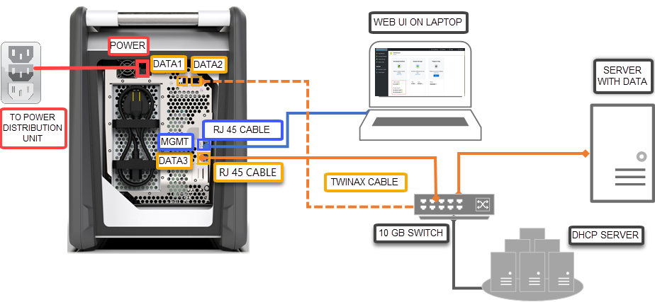
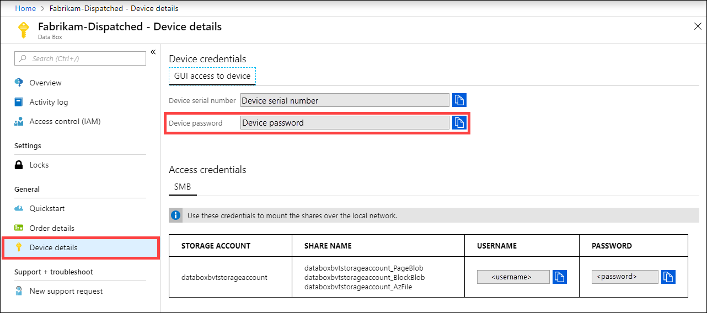

# Tutorial: Cable and connect to your Azure Data Box

This tutorial describes how to cable, connect, and turn on your Azure Data Box.

In this tutorial, you learn how to:

> [!div class="checklist"]
> * Cable your Data Box
> * Connect to your Data Box

## Prerequisites

Before you begin, make sure that:

1. You have completed the [Tutorial: Order Azure Data Box](data-box-deploy-ordered.md).
2. You have received your Data Box and the order status in the portal is **Delivered**. 
    - There is a shipping label in the clear pouch affixed to the device under the current label. Keep this label safe as you will use it for return shipment.
    - Some regions in Europe may receive the device packaged in a box. Ensure that you unpack the device and save the box for return shipment.
3. You have reviewed the [Data Box safety guidelines](data-box-safety.md).
4. You have received one grounded power cord to use with your 100-TB storage device.
5. You have a host computer that has the data that you want to copy over to Data Box. Your host computer must
    - Run a [Supported operating system](data-box-system-requirements.md).
    - Be connected to high-speed network. We strongly recommend that you have at least one 10-GbE connection. If a 10-GbE connection isn't available, a 1-GbE data link can be used but the copy speeds are impacted. 
6. You must have access to a flat surface where you can place the Data Box. If you want to place the device on a standard rack shelf, you need a 7U slot in your datacenter rack. You can place the device flat or upright in the rack.
7. You have procured the following cables to connect your Data Box to the host computer.
    - Two 10-GbE SFP+ Twinax copper cables (use with DATA 1, DATA 2 network interfaces). Data Box has the Mellanox ConnectX®-3 Pro EN Dual-Port 10GBASE-T Adapters w/ PCI Express 3.0 network interface, so cables that are compatible with this interface should work. For example, a CISCO SFP-H10GB-CU3M 10GBASE-CU TWINMAX SFP +3M cable was used for inhouse testing.
    - One RJ-45 CAT 6 network cable (use with MGMT network interface)
    - One RJ-45 CAT 6A OR one RJ-45 CAT 6 network cable (use with DATA 3 network interface configured as 10 Gbps or 1 Gbps respectively)

## Cable your device

Perform the following steps to cable your device.

1. Inspect the device for any evidence of tampering, or any other obvious damage. If the device is tampered or severely damaged, do not proceed. Contact Microsoft Support immediately to help you assess whether the device is in good working order and if they need to ship you a replacement.
2. Transport the device to the location where you wish to power it on. Place the device on a flat surface. The device can also be placed on a standard rack shelf.
3. Connect the power and network cables. The backplane of a connected device for a common configuration is shown below. Depending on your environment, you could choose from other [cabling options](data-box-cable-options.md).
    
    

    1. Connect the power cable to the labeled power input location. The other end of the power cable should be connected to a power distribution unit.
    2. Use the RJ-45 CAT 6 cable to connect the MGMT port on one end and a laptop on the other end.            
    3. Use the RJ-45 CAT 6A cable to connect to DATA 3 port on one end. DATA 3 is configured as 10 GbE if you connect via RJ-45 CAT 6A cable and as 1 GbE if you connect via RJ-45 CAT 6 cable.
    4. Depending on the network interfaces you want to connect for data transfer, use up to two 10-GbE SFP+ Twinax copper or fiber optic cables to connect the DATA 1 and DATA 2 ports respectively. 
    5. The other ends of the cables from the data ports are connected to the host computer via a 10-GbE switch.

4. Locate the power button on the front operating panel of the device. Turn on the device.

    

## Connect to your device

Perform the following steps to set up your device using the local web UI and the portal UI.

1. Configure the Ethernet adapter on the laptop you are using to connect to the device with a static IP address of 192.168.100.5 and subnet 255.255.255.0. 
2. Connect to MGMT port of your device and access its local web UI at https\://192.168.100.10. This may take up to 5 minutes after you turned on the device.
3. Click **Details** and then click **Go on to the webpage**.

    

4. You see a **Sign in** page for the local web UI. Ensure that the device serial number matches across both the portal UI and the local web UI. The device is locked at this point.
5. Sign into the [Azure portal](https://portal.azure.com).
6. Download the device credentials from portal. Go to **General > Device details**. Copy the **Device password**. The device password is tied to a specific order in the portal. 

    
    
    
7. Provide the device password that you got from the Azure portal in the previous step to sign into the local web UI of the device. Click **Sign in**.
8. On the **Dashboard**, ensure that the network interfaces are configured. 
    - If DHCP is enabled in your environment, network interfaces are automatically configured. 
    - If DHCP is not enabled, go to **Set network interfaces**, and assign static IPs if needed.

    

Once the data network interfaces are configured, you can also use the IP address of any of the DATA 1 - DATA 3 interfaces to access the local web UI at `https://<IP address of a data network interface>`. 

After the device setup is complete, you can connect to the device shares and copy the data from your computer to the device. 

## Next steps

In this tutorial, you learned about Azure Data Box topics such as:

> [!div class="checklist"]
> * Cable your Data Box
> * Connect to your Data Box

Advance to the next tutorial to learn how to copy data on your Data Box.

> [!div class="nextstepaction"]
> [Copy your data to Azure Data Box](./data-box-deploy-copy-data.md)

