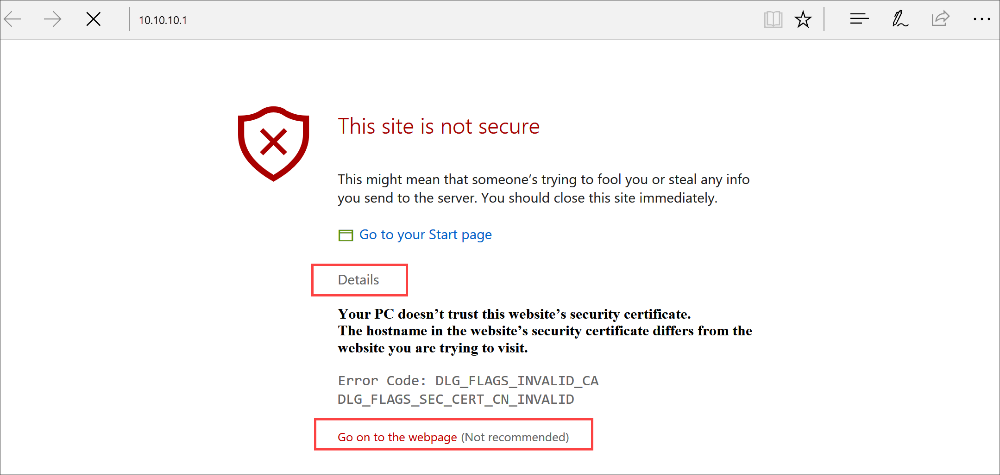

# Tutorial: Unpack, cable, connect your Azure Data Box

This tutorial describes how to unpack, connect, and turn on your Azure Data Box.

In this tutorial, you learn how to:

> [!div class="checklist"]
> * Cable your Data Box
> * Set up your Data Box

## Prerequisites

Before you begin, make sure that:

1. You have completed the [Tutorial: Order Azure Data Box](data-box-deploy-ordered.md).
2. You have received your Data Box and the order status in the portal is **Delivered**.
3. You have a host computer that has the data that you want to copy over to Data Box. Your host computer must
    - Run a [Supported operating system](data-box-system-requirements.md).
    - Be connected to high-speed network. We strongly recommend that you have at least one 10 GbE connection. If a 10 GbE connection isn't available, a 1 GbE data link can be used but the copy speeds are impacted. 
4. You must have access to a flat surface where you can place the Data Box. If you want to place the device on a standard rack shelf, you need a 7 U slot in your datacenter rack.
5. You must have the following cables to connect your Data Box to the host computer.
    - One grounded power cord 100 TB storage device
    - Two 10 GbE SFP+ Twinax copper cables
    - One 1 GbE RJ-45 CAT 6 network cable
    - One 1 GbE RJ-45 network cable
        

## Cable your device

Perform the following steps to cable your device.

1. Inspect the device for any evidence of tampering, or any other obvious damage. If the device is tampered or severely damaged, do not proceed. Contact Microsoft Support immediately to help you assess whether the device is in good working order and if they need to ship you a replacement.
2. Transport the device to the location where you wish to power it on. Place the device on a flat surface. The device can also be placed on a standard rack shelf.

    

3. Connect the power and network cables. The backplane of a connected device is shown below. 

    1. Connect the power cable to the labeled power input location. The other end of the power cable should be connected to a power distribution unit.
    2. Use the 1 GbE RJ45 cables to connect the MGMT and DATA 3 ports respectively.  
    
        > [!NOTE]
        >  - The management port (MGMT) cannot be used for data as this port is hard coded to IP address 192.168.100.10.
       
    3. Use the 10 GbE SFP+ Twinax copper cables to connect the DATA 1 and DATA 2 ports respectively.

    

4. Locate the power button on the front operating panel of the device. Turn on the device.

    

## Set up your device

Perform the following steps to set up your device using the local web UI and the portal UI.

1. Sign into the [Azure portal](https://portal.azure.com).
2. Download the device credentials from portal. Go to **General > Credentials**. Copy the **Device password**. The device password is tied to a specific order in the portal. 

    

3. Connect your host computer to the device via a CAT 6 network cable. 
4. Configure the Ethernet adapter on the computer you are using to connect to the device with a static IP address of 192.168.100.5 and subnet 255.255.255.0. 
5. Connect to MGMT port of your device and access its local web UI at https://192.168.100.10. This may take up to 5 minutes after you turned on the device.
6. Click **Details** and then click **Go on to the webpage**.

    

7. You see a **Sign in** page for the local web UI.
    
    > [!NOTE]
    > Ensure that the device serial number matches across both the portal UI and the local web UI.
7. The device is locked at this point. Provide the device password that you got from the Azure portal in the previous step to sign into the device. Click **Sign in**.
8. On the **Dashboard**, ensure that the network interfaces are configured. There are 4 network interfaces on your device, two 1 Gbps, and two 10 Gbps. One of the 1 Gbps is a management interface and hence not user-configurable. The remaining 3 network interfaces are dedicated to data and can be configured by the user. Both the 1 Gbps interfaces can also be used as 10 Gbps interfaces.
    - If DHCP is enabled in your environment, network interfaces are automatically configured. 
    - If DHCP is not enabled, go to **Set network interfaces**, and assign static IPs if needed.

    
Once the device setup is complete, you can connect to the device shares and copy the data from your computer to the device. 

## Next steps

In this tutorial, you learned about Azure Data Box topics such as:

> [!div class="checklist"]
> * Cable your Data Box
> * Set up your Data Box

Advance to the next tutorial to learn how to copy data on your Data Box.

> [!div class="nextstepaction"]
> [Ship your Azure Data Box back to Microsoft](./data-box-deploy-copy-data.md)

