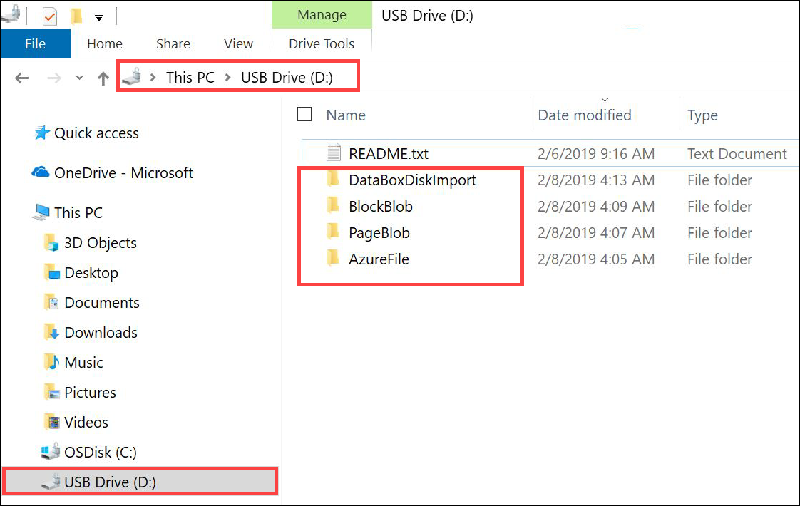
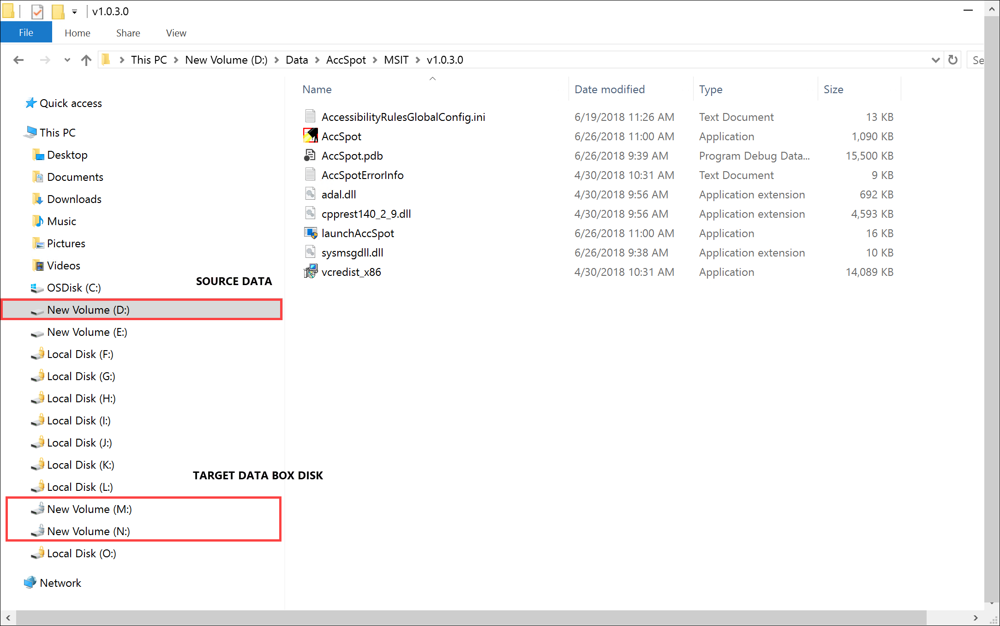
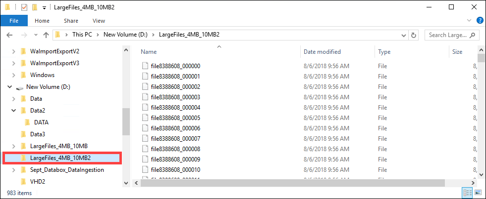
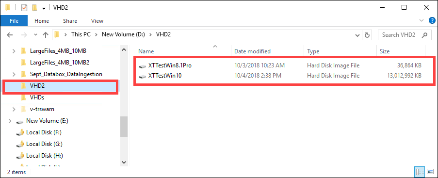
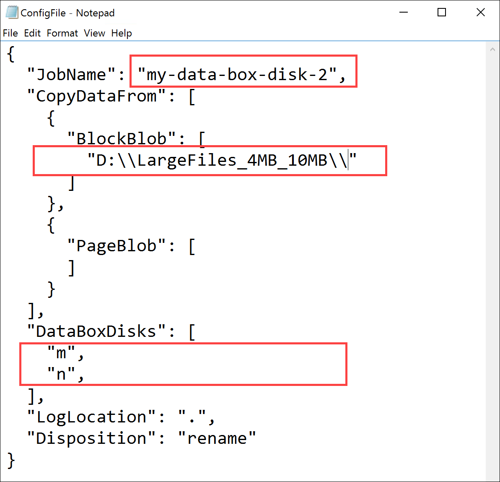
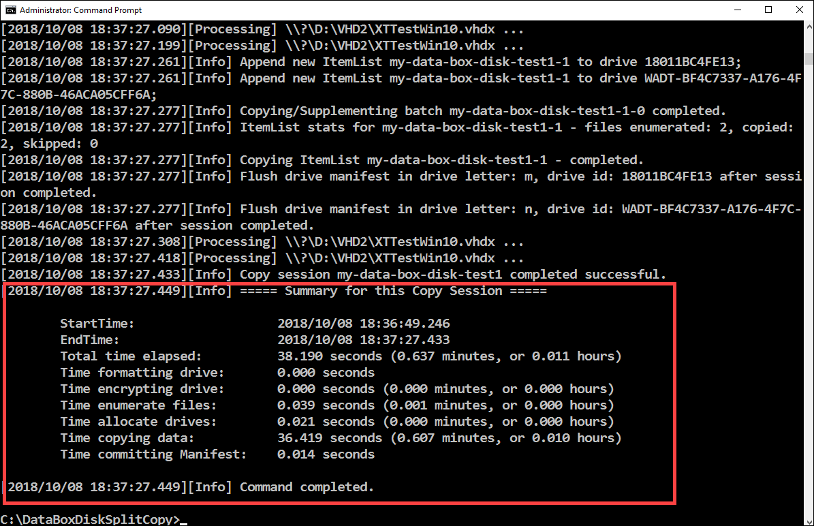
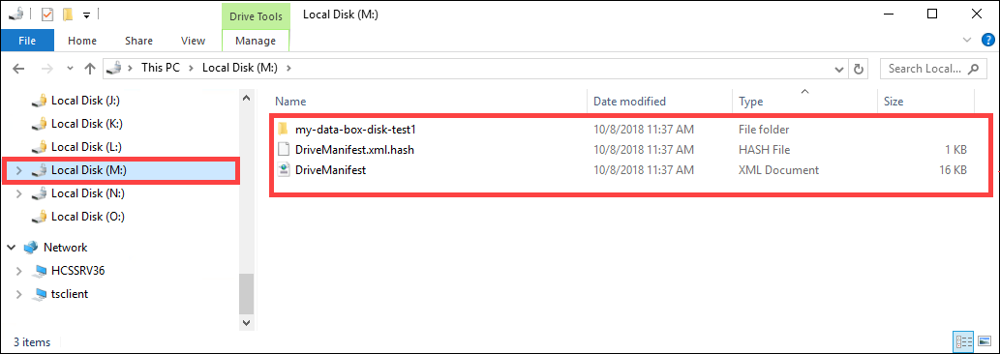
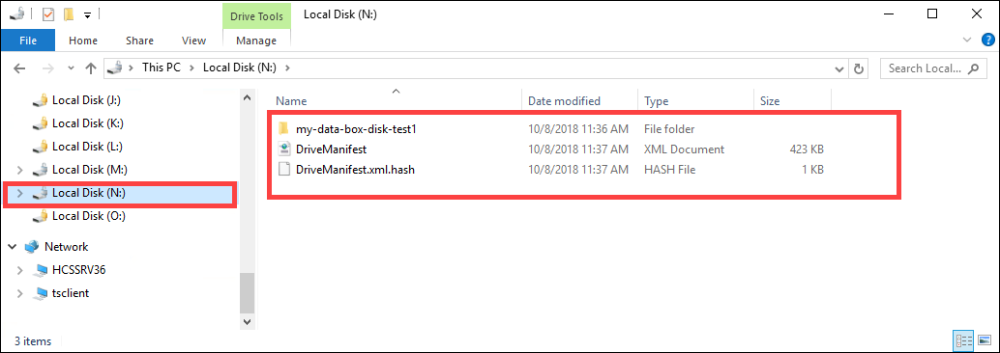
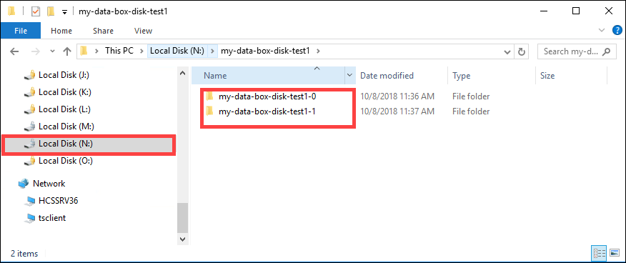
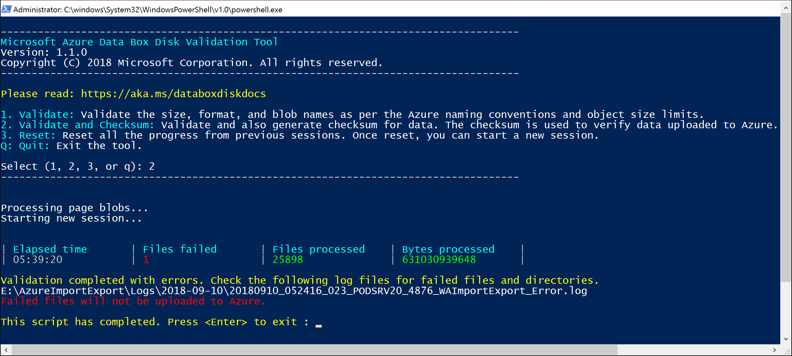

# Tutorial: Copy data to Azure Data Box Disk and verify

This tutorial describes how to copy data from your host computer and then generate checksums to verify data integrity.

In this tutorial, you learn how to:

> [!div class="checklist"]
> * Copy data to Data Box Disk
> * Verify data

## Prerequisites

Before you begin, make sure that:
- You have completed the [Tutorial: Install and configure your Azure Data Box Disk](data-box-disk-deploy-set-up.md).
- Your disks are unlocked and connected to a client computer.
- Your client computer that is used to copy data to the disks must run a [Supported operating system](data-box-disk-system-requirements.md##supported-operating-systems-for-clients).
- Make sure that the intended storage type for your data matches [Supported storage types](data-box-disk-system-requirements.md#supported-storage-types-for-upload).


## Copy data to disks

Review the following considerations before you copy the data to the disks:

- It is your responsibility to ensure that you copy the data to folders that correspond to the appropriate data format. For instance, copy the block blob data to the folder for block blobs. If the data format does not match the appropriate folder (storage type), then at a later step, the data upload to Azure fails.
- While copying data, ensure that the data size conforms to the size limits described in the [Azure storage and Data Box Disk limits](data-box-disk-limits.md).
- If data, which is being uploaded by Data Box Disk, is concurrently uploaded by other applications outside of Data Box Disk, then this could result in upload job failures and data corruption.

If you specified managed disks in the order, review the following additional considerations:

- You can only have one managed disk with a given name in a resource group across all the precreated folders and across all the Data Box Disk. This implies that the VHDs uploaded to the precreated folders should have unique names. Make sure that the given name does not match an already existing managed disk in a resource group. If VHDs have same names, then only one VHD is converted to managed disk with that name. The other VHDs are uploaded as page blobs into the staging storage account.
- Always copy the VHDs to one of the precreated folders. If you copy the VHDs outside of these folders or in a folder that you created, the VHDs are uploaded to Azure Storage account as page blobs and not managed disks.
- Only the fixed VHDs can be uploaded to create managed disks. Dynamic VHDs, differencing VHDs or VHDX files are not supported.
- Review [Managed disk limits in Azure object size limits](data-box-disk-limits.md#azure-object-size-limits).

Perform the following steps to connect and copy data from your computer to the Data Box Disk.

1. View the contents of the unlocked drive. The list of the precreated folders and subfolders in the drive is different depending upon the options selected when placing the Data Box Disk order.

    |Selected storage destination  |Storage account type|Staging storage account type |Folders and sub-folders  |
    |---------|---------|---------|------------------|
    |Storage account     |GPv1 or GPv2                 | NA | BlockBlob <br> PageBlob <br> AzureFile        |
    |Storage account     |Blob storage account         | NA | BlockBlob        |
    |Managed disks     |NA | GPv1 or GPv2         | ManagedDisk<ul> <li>PremiumSSD</li><li>StandardSSD</li><li>StandardHDD</li></ul>        |
    |Storage account <br> Managed disks     |GPv1 or GPv2 | GPv1 or GPv2         |BlockBlob <br> PageBlob <br> AzureFile <br> ManagedDisk<ul> <li> PremiumSSD </li><li>StandardSSD</li><li>StandardHDD</li></ul>         |
    |Storage account <br> Managed disks    |Blob storage account | GPv1 or GPv2         |BlockBlob <br> ManagedDisk<ul> <li>PremiumSSD</li><li>StandardSSD</li><li>StandardHDD</li></ul>         |

    An example screenshot of an order where a GPv2 storage account was specified is shown below:

    
 
2. Copy the data that needs to be imported as block blobs in to *BlockBlob* folder. Similarly, copy data such as VHD/VHDX to *PageBlob* folder and data in to *AzureFile* folder.

    A container is created in the Azure storage account for each subfolder under BlockBlob and PageBlob folders. All files under BlockBlob and PageBlob folders are copied into a default container `$root` under the Azure Storage account. Any files in the `$root` container are always uploaded as block blobs.

   Copy files to a folder within *AzureFile* folder. A sub-folder within *AzureFile* folder creates a fileshare. Files copied directly to *AzureFile* folder fail and are uploaded as block blobs.

    If files and folders exist in the root directory, then you must move those to a different folder before you begin data copy.

    > [!IMPORTANT]
    > All the containers, blobs, and filenames should conform to [Azure naming conventions](data-box-disk-limits.md#azure-block-blob-page-blob-and-file-naming-conventions). If these rules are not followed, the data upload to Azure will fail.

3. When copying files, ensure that files do not exceed ~4.7 TiB for block blobs, ~8 TiB for page blobs, and ~1 TiB for Azure Files. 
4. You can use drag and drop with File Explorer to copy the data. You can also use any SMB compatible file copy tool such as Robocopy to copy your data. Multiple copy jobs can be initiated using the following Robocopy command:

    `Robocopy <source> <destination>  * /MT:64 /E /R:1 /W:1 /NFL /NDL /FFT /Log:c:\RobocopyLog.txt` 
    
    The parameters and options for the command are tabulated as follows:
    
    |Parameters/Options  |Description |
    |--------------------|------------|
    |Source            | Specifies the path to the source directory.        |
    |Destination       | Specifies the path to the destination directory.        |
    |/E                  | Copies subdirectories including empty directories. |
    |/MT[:N]             | Creates multi-threaded copies with N threads where N is an integer between 1 and 128. <br>The default value for N is 8.        |
    |/R: <N>             | Specifies the number of retries on failed copies. The default value of N is 1,000,000 (one million retries).        |
    |/W: <N>             | Specifies the wait time between retries, in seconds. The default value of N is 30 (wait time 30 seconds).        |
    |/NFL                | Specifies that file names are not to be logged.        |
    |/NDL                | Specifies that directory names are not to be logged.        |
    |/FFT                | Assumes FAT file times (two-second precision).        |
    |/Log:<Log File>     | Writes the status output to the log file (overwrites the existing log file).         |

    Multiple disks can be used in parallel with multiple jobs running on each disk.

6. Check the copy status when the job is in progress. The following sample shows the output of the robocopy command to copy files to the Data Box Disk.

    ```
    C:\Users>robocopy
        -------------------------------------------------------------------------------
       ROBOCOPY     ::     Robust File Copy for Windows
    -------------------------------------------------------------------------------
    
      Started : Thursday, March 8, 2018 2:34:53 PM
           Simple Usage :: ROBOCOPY source destination /MIR
    
                 source :: Source Directory (drive:\path or \\server\share\path).
            destination :: Destination Dir  (drive:\path or \\server\share\path).
                   /MIR :: Mirror a complete directory tree.
    
        For more usage information run ROBOCOPY /?    
    
    ****  /MIR can DELETE files as well as copy them !
    
    C:\Users>Robocopy C:\Git\azure-docs-pr\contributor-guide \\10.126.76.172\devicemanagertest1_AzFile\templates /MT:64 /E /R:1 /W:1 /FFT 
    -------------------------------------------------------------------------------
       ROBOCOPY     ::     Robust File Copy for Windows
    -------------------------------------------------------------------------------
    
      Started : Thursday, March 8, 2018 2:34:58 PM
       Source : C:\Git\azure-docs-pr\contributor-guide\
         Dest : \\10.126.76.172\devicemanagertest1_AzFile\templates\
    
        Files : *.*
    
      Options : *.* /DCOPY:DA /COPY:DAT /MT:8 /R:1000000 /W:30
    
    ------------------------------------------------------------------------------
    
    100%        New File                 206        C:\Git\azure-docs-pr\contributor-guide\article-metadata.md
    100%        New File                 209        C:\Git\azure-docs-pr\contributor-guide\content-channel-guidance.md
    100%        New File                 732        C:\Git\azure-docs-pr\contributor-guide\contributor-guide-index.md
    100%        New File                 199        C:\Git\azure-docs-pr\contributor-guide\contributor-guide-pr-criteria.md
                New File                 178        C:\Git\azure-docs-pr\contributor-guide\contributor-guide-pull-request-co100%  .md
                New File                 250        C:\Git\azure-docs-pr\contributor-guide\contributor-guide-pull-request-et100%  e.md
    100%        New File                 174        C:\Git\azure-docs-pr\contributor-guide\create-images-markdown.md
    100%        New File                 197        C:\Git\azure-docs-pr\contributor-guide\create-links-markdown.md
    100%        New File                 184        C:\Git\azure-docs-pr\contributor-guide\create-tables-markdown.md
    100%        New File                 208        C:\Git\azure-docs-pr\contributor-guide\custom-markdown-extensions.md
    100%        New File                 210        C:\Git\azure-docs-pr\contributor-guide\file-names-and-locations.md
    100%        New File                 234        C:\Git\azure-docs-pr\contributor-guide\git-commands-for-master.md
    100%        New File                 186        C:\Git\azure-docs-pr\contributor-guide\release-branches.md
    100%        New File                 240        C:\Git\azure-docs-pr\contributor-guide\retire-or-rename-an-article.md
    100%        New File                 215        C:\Git\azure-docs-pr\contributor-guide\style-and-voice.md
    100%        New File                 212        C:\Git\azure-docs-pr\contributor-guide\syntax-highlighting-markdown.md
    100%        New File                 207        C:\Git\azure-docs-pr\contributor-guide\tools-and-setup.md
    ------------------------------------------------------------------------------
    
                   Total    Copied   Skipped  Mismatch    FAILED    Extras
        Dirs :         1         1         1         0         0         0
       Files :        17        17         0         0         0         0
       Bytes :     3.9 k     3.9 k         0         0         0         0
       Times :   0:00:05   0:00:00                       0:00:00   0:00:00
        
       Speed :                5620 Bytes/sec.
       Speed :               0.321 MegaBytes/min.
       Ended : Thursday, March 8, 2018 2:34:59 PM
        
    C:\Users>
    ```
 
    To optimize the performance, use the following robocopy parameters when copying the data.

    |    Platform    |    Mostly small files < 512 KB                           |    Mostly medium  files 512 KB-1 MB                      |    Mostly large files > 1 MB                             |   
    |----------------|--------------------------------------------------------|--------------------------------------------------------|--------------------------------------------------------|---|
    |    Data Box Disk        |    4 Robocopy sessions* <br> 16 threads per sessions    |    2 Robocopy sessions* <br> 16 threads per sessions    |    2 Robocopy sessions* <br> 16 threads per sessions    |  |
    
    **Each Robocopy session can have a maximum of 7,000 directories and 150 million files.*
    
    >[!NOTE]
    > The parameters suggested above are based on the environment used in inhouse testing.
    
    For more information on Robocopy command, go to [Robocopy and a few examples](https://social.technet.microsoft.com/wiki/contents/articles/1073.robocopy-and-a-few-examples.aspx).

6. Open the target folder to view and verify the copied files. If you have any errors during the copy process, download the log files for troubleshooting. The log files are located as specified in the robocopy command.
 
### Split and copy data to disks

This optional procedure may be used when you are using multiple disks and have a large dataset that needs to be split and copied across all the disks. The Data Box Split Copy tool helps split and copy the data on a Windows computer.

>[!IMPORTANT]
> Data Box Split Copy tool also validates your data. If you use Data Box Split Copy tool to copy data, you can skip the [validation step](#validate-data).
> Split Copy tool is not supported with managed disks.

1. On your Windows computer, ensure that you have the Data Box Split Copy tool downloaded and extracted in a local folder. This tool was downloaded when you downloaded the Data Box Disk toolset for Windows.
2. Open File Explorer. Make a note of the data source drive and drive letters assigned to Data Box Disk. 

     
 
3. Identify the source data to copy. For instance, in this case:
    - Following block blob data was identified.

             

    - Following page blob data was identified.

         
 
4. Go to the folder where the software is extracted. Locate the `SampleConfig.json` file in that folder. This is a read-only file that you can modify and save.

   
 
5. Modify the `SampleConfig.json` file.
 
    - Provide a job name. This creates a folder in the Data Box Disk and eventually becomes the container in the Azure storage account associated with these disks. The job name must follow the Azure container naming conventions. 
    - Supply a source path making note of the path format in the `SampleConfigFile.json`. 
    - Enter the drive letters corresponding to the target disks. The data is taken from the source path and copied across multiple disks.
    - Provide a path for the log files. By default, it is sent to the current directory where the `.exe` is located.

     

6. To validate the file format, go to `JSONlint`. Save the file as `ConfigFile.json`. 

     
 
7. Open a Command Prompt window. 

8. Run the `DataBoxDiskSplitCopy.exe`. Type

    `DataBoxDiskSplitCopy.exe PrepImport /config:<Your-config-file-name.json>`

     
 
9. Enter to continue the script.

    
  
10. When the dataset is split and copied, the summary of the Split Copy tool for the copy session is presented. A sample output is shown below.

    
 
11. Verify that the data is split across the target disks. 
 
    
    
	 
    If you examine the contents of `n:` drive further, you will see that two sub-folders are created corresponding to block blob and page blob format data.
    
     

12. If the copy session fails, then to recover and resume, use the following command:

    `DataBoxDiskSplitCopy.exe PrepImport /config:<configFile.json> /ResumeSession`

After the data copy is complete, you can proceed to validate your data. If you used the Split Copy tool, skip the validation (Split Copy tool validates as well) and advance to the next tutorial.


## Validate data

If you did not use the Split Copy tool to copy data, you will need to validate your data. To verify the data, perform the following steps.

1. Run the `DataBoxDiskValidation.cmd` for checksum validation in the *DataBoxDiskImport* folder of your drive.
    
    

2. Choose the appropriate option. **We recommend that you always validate the files and generate checksums by selecting option 2**. Depending upon your data size, this step may take a while. Once the script has completed, exit out of the command window. If there are any errors during validation and checksum generation, you are notified and a link to the error logs is also provided.

    

    > [!TIP]
    > - Reset the tool between two runs.
    > - Use option 1 if dealing with large data set containing small files (~ KBs). This option only validates the files, as checksum generation may take a very long time and the performance could be very slow.

3. If using multiple disks, run the command for each disk.

## Next steps

In this tutorial, you learned about Azure Data Box Disk topics such as:

> [!div class="checklist"]
> * Copy data to Data Box Disk
> * Verify data integrity

Advance to the next tutorial to learn how to return the Data Box Disk and verify the data upload to Azure.

> [!div class="nextstepaction"]
> [Ship your Azure Data Box back to Microsoft](./data-box-disk-deploy-picked-up.md)