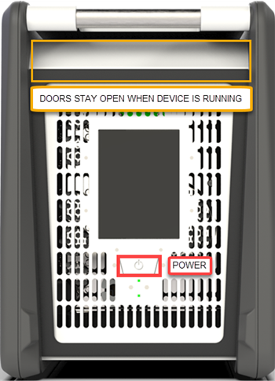
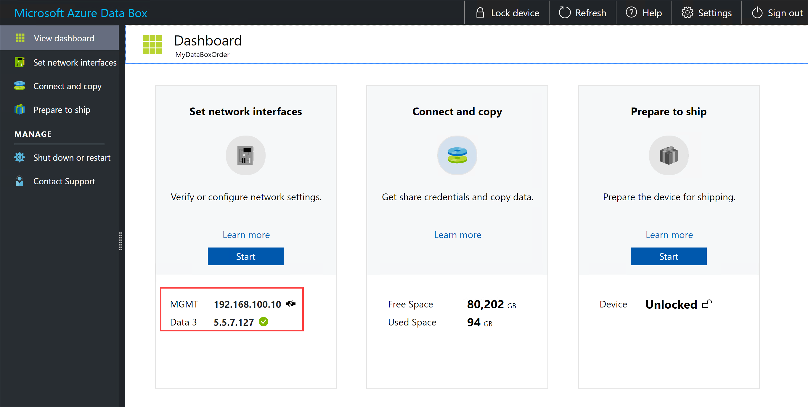

# Tutorial: Cable and connect to your Azure Data Box Heavy

This tutorial describes how to cable, connect, and turn on your Azure Data Box Heavy.

In this tutorial, you learn how to:

> [!div class="checklist"]
> * Cable your Data Box Heavy
> * Connect to your Data Box Heavy

## Prerequisites

Before you begin, make sure that:

1. You have completed the [Tutorial: Order Azure Data Box Heavy](data-box-heavy-deploy-ordered.md).
2. You have received your Data Box Heavy and the order status in the portal is **Delivered**.
3. You have reviewed the [Data Box Heavy safety guidelines](data-box-heavy-safety.md).
4. You have received four grounded power cords to use with your storage device.
5. You have a host computer that has the data that you want to copy over to Data Box Heavy. Your host computer must
    - Run a [Supported operating system](data-box-system-requirements.md).
    - Be connected to high-speed network. We strongly recommend that you have at least one 10-GbE connection. If a 10-GbE connection isn't available, a 1-GbE data link can be used but the copy speeds are impacted. 
6. You must have access to a flat surface where you can place the Data Box. If you want to place the device on a standard rack shelf, you need a 7U slot in your datacenter rack. You can place the device flat or upright in the rack.
7. You have procured the following cables to connect your Data Box to the host computer.
    - One or more 10-GbE SFP+ Twinax copper or SFP+ fiber optic cables (use with DATA 1, DATA 2 network interfaces). Data Box has the Mellanox ConnectX®-3 Pro EN Dual-Port 10GBASE-T Adapters w/ PCI Express 3.0 network interface, so cables that are compatible with this interface should work. For example, a CISCO SFP-H10GB-CU3M 10GBASE-CU TWINMAX SFP +3M cable was used for in-house testing. For more information, see the [list of supported cables and switches from Mellanox](https://www.mellanox.com/pdf/firmware/ConnectX3-FW-2_42_5000-release_notes.pdf).
    - One RJ-45 CAT 6 network cable (use with MGMT network interface)
    - One RJ-45 CAT 6A OR one RJ-45 CAT 6 network cable (use with DATA 3 network interface configured as 10 Gbps or 1 Gbps respectively)

## Cable your device for power

Take the following steps to cable your device.

1. Inspect the device for any evidence of tampering, or any other obvious damage. If the device is tampered or severely damaged, do not proceed. [Contact Microsoft Support](data-box-disk-contact-microsoft-support.md) immediately to help you assess whether the device is in good working order and if they need to ship you a replacement.
2. Move the device to the installation site.
3. Lock the rear casters on the device as shown below.
4. Locate the knobs that unlock the front and the back doors of the device. Unlock and move the front door until it is flush with the side of the device. Repeat this with the back door as well.
    Both the doors must stay open when the device is operational to allow for optimum front-to-back air flow through the device.

5. The tray at the back of the device should have 4 power cables. Remove all the cables from the tray and place them aside.
6. The next step is to identify the various ports at the back of the device. There are two device nodes, **NODE1** and **NODE2**. Each node has 4 network interfaces, **MGMT**, **DATA1**, **DATA2**, **DATA3**. **MGMT** is used to configure management during the initial configuration of the device. **DATA1**-**DATA3** are data ports. **MGMT** and **DATA3** ports are 1 Gbps, whereas **DATA1**, **DATA2** are 40/10 Gbps ports. At the bottom of the two device nodes, are four power supply units (PSUs) that are shared across the two device nodes. As you face this device, the **PSUs** are **PSU1**, **PSU2**, **PSU3**, and **PSU4** from left to right.
7. Connect all the 4 power cables to the device power supplies. The green LEDs turn on and blink.
8. Use the power buttons in the front plane to turn on the device nodes. Keep the power button depressed for a few seconds until the blue lights come on. All the green LEDs for the power supplies in the back of the device should now be solid. The front operating panel of the device also contains fault LEDs. When a fault LED is lit, it indicates a faulty PSU or a fan or an issue with the disk drives.  

## Cable first node for network

On one of the nodes of the device, take the following steps to cable for network.

1. Use a CAT 6 RJ-45 network cable (blue cable in the picture) to connect the host computer to the 1 Gbps management port.
2. Use a Twinax QSFP+ copper cable (black cables in the picture) to connect at least one 40 Gbps (preferred over 1 Gbps) network interface for data. If using a 10 Gbps switch, use a Twinax SFP+ copper cable with a QSFP+ to SFP+ adapter (the QSA adapter) to connect the 40 Gbps network interface for data.

    > [!IMPORTANT]
    > DATA 1 and DATA2 are switched and do not match what is displayed in the local web UI.
    > The 40 Gbps cable adapter connects when inserted the way as shown below.

## Configure first node

Take the following steps to set up your device using the local configuration and the Azure portal.

1. Download the device credentials from portal. Go to **General > Device details**. Copy the **Device password**. These passwords are tied to a specific order in the portal. Corresponding to the two nodes in Data Box Heavy, you will see the two device serial numbers. The device administrator password for both the nodes is the same.
2. Connect your client workstation to the device via a CAT6 RJ-45 network cable.
3. Configure the Ethernet adapter on the computer you are using to connect to device with a static IP address of `192.168.100.5` and subnet `255.255.255.0`. 
4. Connect to the local web UI of the device at the following URL: `http:// 192.168.100.10`. Click **Advanced** and then click **Proceed to 192.168.100.10 (unsafe)**.
5. You see a **Sign in** page for the local web UI.
    
    - One of the node serial numbers on this page matches across both the portal UI and the local web UI. Make a note of the node number to the serial number mapping. There are two nodes and two device serial numbers in the portal. This mapping helps you understand which node corresponds to which serial number.
    - The device is locked at this point.
    - Provide the device administrator password that you obtained in the previous step to sign into the device. Click **Sign in**.

4. Connect the power and network cables. The backplane of a connected device for a common configuration is shown below. Depending on your environment, you could choose from other [cabling options](data-box-cable-options.md).
    
    

    1. Connect the power cable to the labeled power input location. The other end of the power cable should be connected to a power distribution unit.
    2. Use the RJ-45 CAT 6 cable to connect the MGMT port on one end and a laptop on the other end.
    3. Use the RJ-45 CAT 6A cable to connect to DATA 3 port on one end. DATA 3 is configured as 10 GbE if you connect via RJ-45 CAT 6A cable and as 1 GbE if you connect via RJ-45 CAT 6 cable.
    4. Depending on the network interfaces you want to connect for data transfer, use up to two 10-GbE SFP+ Twinax copper or SFP+ fiber optic cables to connect the DATA 1 and DATA 2 ports respectively.
    5. The other ends of the cables from the data ports are connected to the host computer via a 10-GbE switch.

4. Locate the power button on the front operating panel of the device. Turn on the device.

    

## Connect to your device

Perform the following steps to set up your device using the local web UI and the portal UI.

1. Configure the Ethernet adapter on the laptop you are using to connect to the device with a static IP address of 192.168.100.5 and subnet 255.255.255.0.
2. Connect to MGMT port of your device and access its local web UI at https\://192.168.100.10. This may take up to 5 minutes after you turned on the device.
3. Click **Details** and then click **Go on to the webpage**.

   

4. You see a **Sign in** page for the local web UI. Ensure that the device serial number matches across both the portal UI and the local web UI. The device is locked at this point.
5. Sign into the [Azure portal](https://portal.azure.com).
6. Download the device credentials from portal. Go to **General > Device details**. Copy the **Device password**. The device password is tied to a specific order in the portal.

    

7. Provide the device password that you got from the Azure portal in the previous step to sign into the local web UI of the device. Click **Sign in**.
8. On the **Dashboard**, ensure that the network interfaces are configured. There are 4 network interfaces on your device, two 1 Gbps, and two 40 Gbps. Of these one of the 1 Gbps is a management interface and hence not user configurable. The remaining 3 network interfaces are dedicated to data and can be configured by the user.
   - If DHCP is enabled in your environment, network interfaces are automatically configured.
   - If DHCP is not enabled, go to **Set network interfaces**, and assign static IPs if needed.

     

Once the data network interfaces are configured, you can use the IP address of any of the DATA 1 - DATA 3 interfaces to access the local web UI at `https://<IP address of a data network interface>`.

## Configure the second node

Do the steps detailed in the [Configure the first node](#configure-first-node).

After the device setup is complete, you can connect to the device shares and copy the data from your computer to the device.

## Next steps

In this tutorial, you learned about Azure Data Box topics such as:

> [!div class="checklist"]
> * Cable your Data Box Heavy
> * Connect to your Data Box Heavy

Advance to the next tutorial to learn how to copy data on your Data Box Heavy.

> [!div class="nextstepaction"]
> [Copy your data to Azure Data Box](./data-box-deploy-copy-data.md)
