# Tutorial: Cable and connect to your Azure Data Box Heavy

This tutorial describes how to cable, connect, and turn on your Azure Data Box Heavy.

In this tutorial, you learn how to:

> [!div class="checklist"]
> * Cable your Data Box Heavy
> * Connect to your Data Box Heavy

## Prerequisites

Before you begin, make sure that:

1. You've completed the [Tutorial: Order Azure Data Box Heavy](data-box-heavy-deploy-ordered.md).
2. You've received your Data Box Heavy and the order status in the portal is **Delivered**.
3. You've reviewed the [Data Box Heavy safety guidelines](data-box-safety.md).
4. You must have access to a flat site in the datacenter with proximity to an available network connection that can accommodate a device with this footprint. This device can't be mounted on a rack.
5. You've received four grounded power cords to use with your storage device.
6. You should have a host computer connected to the datacenter network. Your Data Box Heavy will copy the data from this computer. Your host computer must run a [Supported operating system](data-box-heavy-system-requirements.md).
7. Your datacenter needs to have high-speed network. We strongly recommend that you have at least one 10-GbE connection. 
8. You need to have a laptop with RJ-45 cable to connect to the local UI and configure the device. Use the laptop to configure each node of the device once.
9. You need one 40-Gbps cable or 10-Gbps cable per device node.
    - Choose cables that are compatible with the [Mellanox MCX314A-BCCT](https://store.mellanox.com/products/mellanox-mcx314a-bcct-connectx-3-pro-en-network-interface-card-40-56gbe-dual-port-qsfp-pcie3-0-x8-8gt-s-rohs-r6.html) network interface.
    - For the 40-Gbps cable, device end of the cable needs to be QSFP+.
    - For the 10-Gbps cable, you need an SFP+ cable that plugs into a 10-Gbps switch on one end, with a QSFP+ to SFP+ adapter (or the QSA adapter) for the end that plugs into the device.

## Cable your device for power

Take the following steps to cable your device.

1. Inspect the device for any evidence of tampering, or any other obvious damage. If the device is tampered or severely damaged, do not proceed. [Contact Microsoft Support](data-box-disk-contact-microsoft-support.md) immediately to help you assess whether the device is in good working order and if they need to ship you a replacement.
2. Move the device to the installation site.

    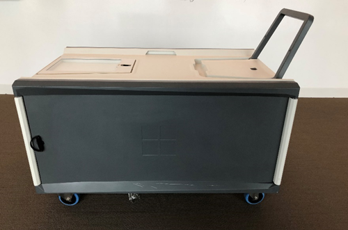

3. Lock the rear casters on the device as shown below.

    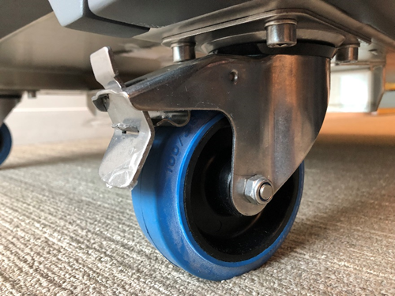

4. Locate the knobs that unlock the front and the back doors of the device. Unlock and move the front door until it is flush with the side of the device. Repeat this with the back door as well.
    Both the doors must stay open when the device is operational to allow for optimum front-to-back air flow through the device.

    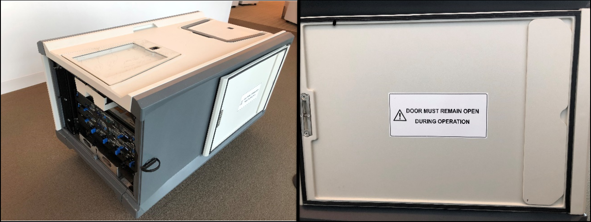

5. The tray at the back of the device should have four power cables. Remove all the cables from the tray and place them aside.

    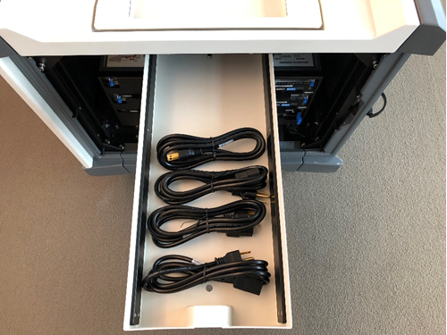

6. The next step is to identify the various ports at the back of the device. There are two device nodes, **NODE1** and **NODE2**. Each node has four network interfaces, **MGMT**, **DATA1**, **DATA2**, **DATA3**. **MGMT** is used to configure management during the initial configuration of the device. **DATA1**-**DATA3** are data ports. **MGMT** and **DATA3** ports are 1 Gbps, whereas **DATA1**, **DATA2** can work as 40-Gbps ports or 10-Gbps ports. At the bottom of the two device nodes, are four power supply units (PSUs) that are shared across the two device nodes. As you face this device, the **PSUs** are **PSU1**, **PSU2**, **PSU3**, and **PSU4** from left to right.

    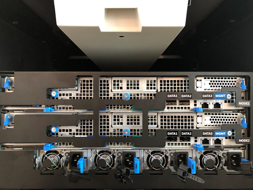

7. Connect all the four power cables to the device power supplies. The green LEDs turn on and blink.
8. Use the power buttons in the front plane to turn on the device nodes. Keep the power button depressed for a few seconds until the blue lights come on. All the green LEDs for the power supplies in the back of the device should now be solid. The front operating panel of the device also contains fault LEDs. When a fault LED is lit, it indicates a faulty PSU or a fan or an issue with the disk drives.  

    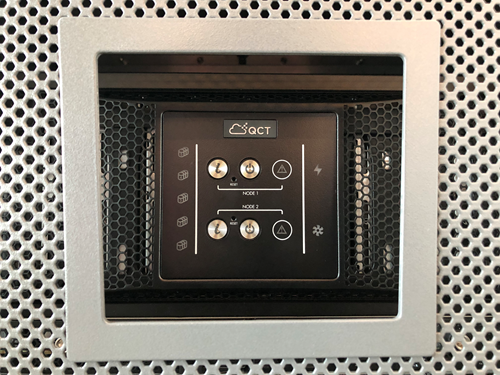

## Cable first node for network

On one of the nodes of the device, take the following steps to cable for network.

1. Use a CAT 6 RJ-45 network cable (blue cable in the picture) to connect the host computer to the 1-Gbps management port.
2. Use a Twinax QSFP+ copper cable (black cables in the picture) to connect at least one 40-Gbps (preferred over 1 Gbps) network interface for data. If using a 10-Gbps switch, use a Twinax SFP+ copper cable with a QSFP+ to SFP+ adapter (the QSA adapter) to connect the 40 Gbps network interface for data.

    

    > [!IMPORTANT]
    > DATA 1 and DATA2 are switched and do not match what is displayed in the local web UI.
    > The 40 Gbps cable adapter connects when inserted the way as shown below.

    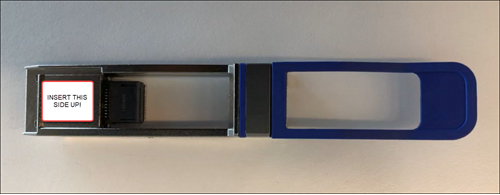

## Configure first node

Take the following steps to set up your device using the local configuration and the Azure portal.

1. Download the device credentials from portal. Go to **General > Device details**. Copy the **Device password**. These passwords are tied to a specific order in the portal. Corresponding to the two nodes in Data Box Heavy, you'll see the two device serial numbers. The device administrator password for both the nodes is the same.

    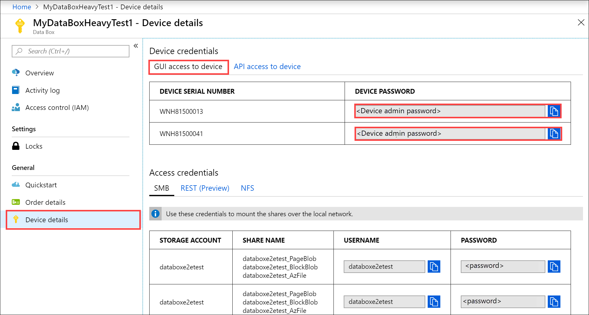

2. Connect your client workstation to the device via a CAT6 RJ-45 network cable.
3. Configure the Ethernet adapter on the computer you're using to connect to device with a static IP address of `192.168.100.5` and subnet `255.255.255.0`.

    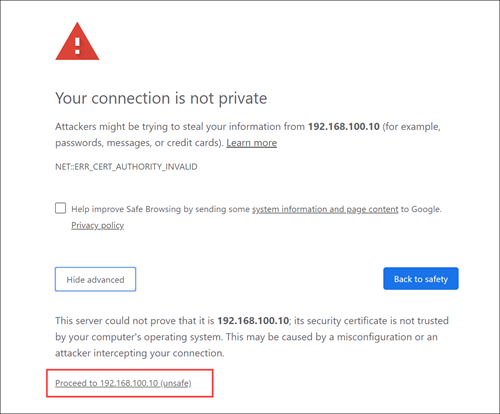

4. Connect to the local web UI of the device at the following URL: `http://192.168.100.10`. Click **Advanced** and then click **Proceed to 192.168.100.10 (unsafe)**.
5. You see a **Sign in** page for the local web UI.
    
    - One of the node serial numbers on this page matches across both the portal UI and the local web UI. Make a note of the node number to the serial number mapping. There are two nodes and two device serial numbers in the portal. This mapping helps you understand which node corresponds to which serial number.
    - The device is locked at this point.
    - Provide the device administrator password that you obtained in the previous step to sign into the device. Click **Sign in**.

    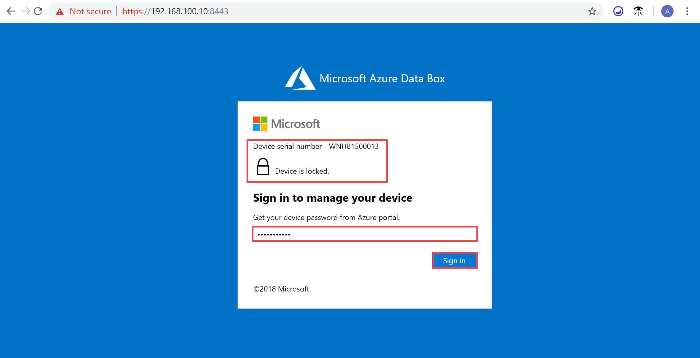

5. On the Dashboard, ensure that the network interfaces are configured. There are four network interfaces on your device node, two 1 Gbps, and two 40 Gbps. One of the 1-Gbps inteface is a management interface and hence not user configurable. The remaining three network interfaces are dedicated to data and can be configured by the user.

- If DHCP is enabled in your environment, network interfaces are automatically configured.
- If DHCP is not enabled, go to Set network interfaces, and assign static IPs if needed.

    

## Configure second node

Do the steps detailed in the [Configure the first node](#configure-first-node) for the second node of the device.

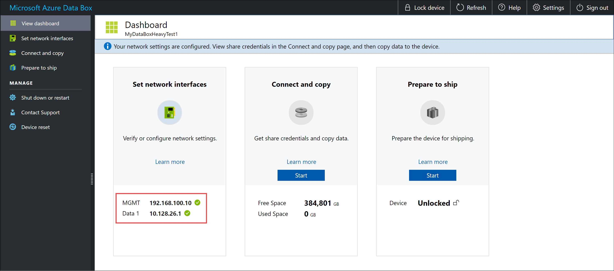

After the device setup is complete, you can connect to the device shares and copy the data from your computer to the device.

## Next steps

In this tutorial, you learned about Azure Data Box Heavy topics such as:

> [!div class="checklist"]
> * Cable your Data Box Heavy
> * Connect to your Data Box Heavy

Advance to the next tutorial to learn how to copy data on your Data Box Heavy.

> [!div class="nextstepaction"]
> [Copy your data to Azure Data Box](./data-box-heavy-deploy-copy-data.md)
