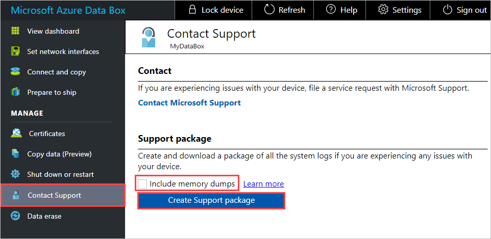
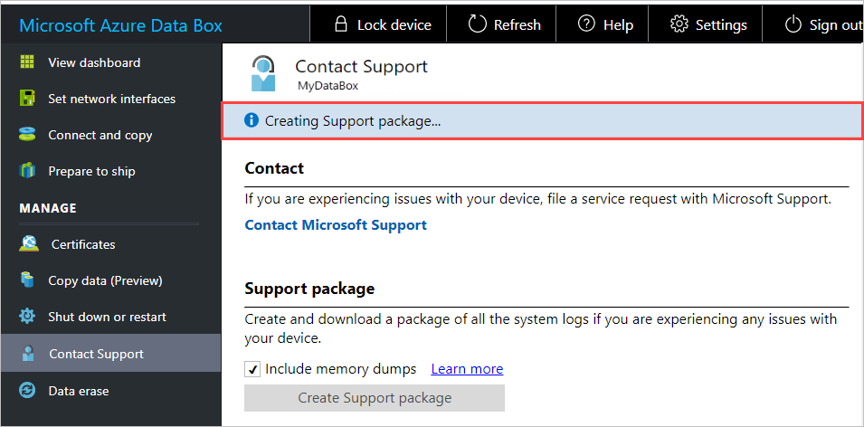
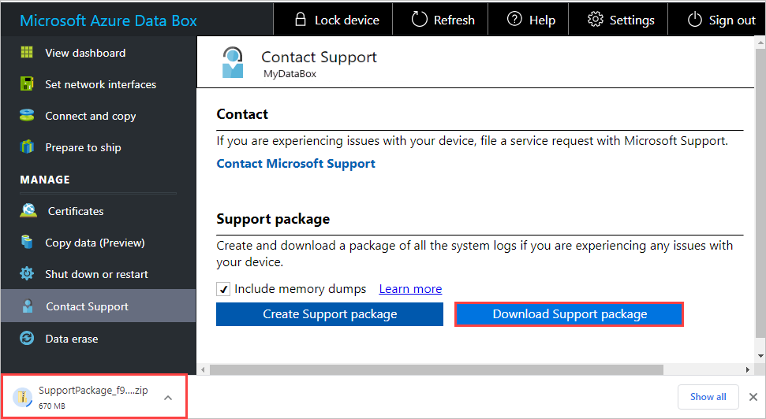
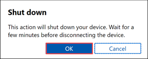
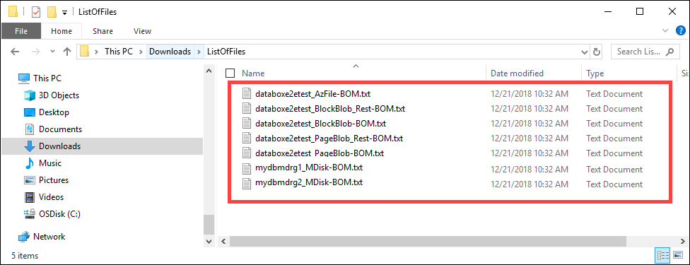
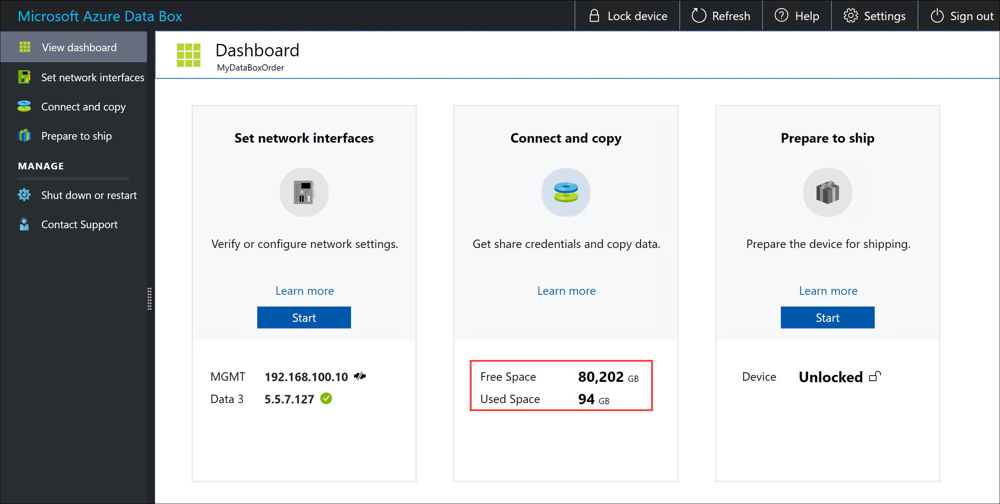
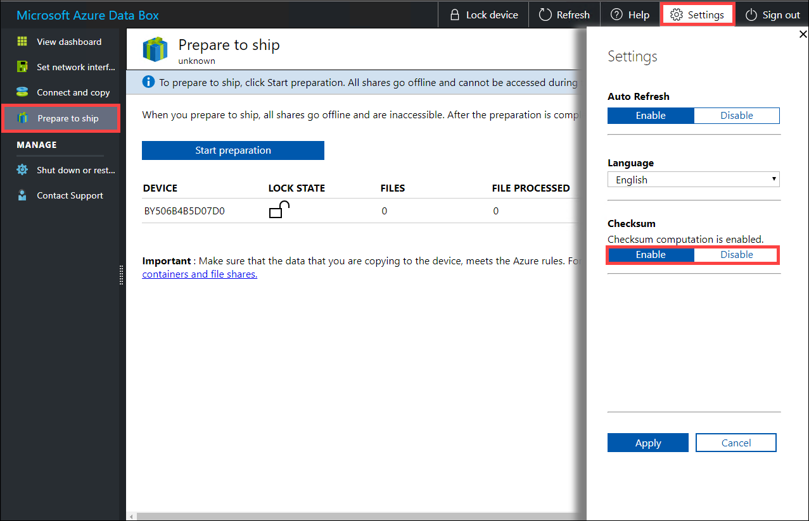
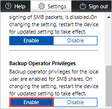
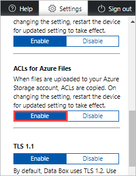
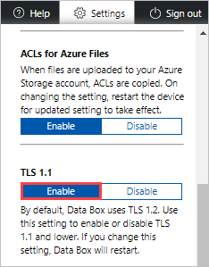

# Use the local web UI to administer your Data Box and Data Box Heavy

This article describes some of the configuration and management tasks performed on Data Box and Data Box Heavy devices. You can manage the Data Box and Data Box Heavy devices via the Azure portal UI and the local web UI for the device. This article focuses on tasks performed using the local web UI.

The local m UI for the Data Box and for Data Box Heavy is used for initial configuration of the device. You can also use the local web UI to shut down or restart the device, run diagnostic tests, update software, view copy logs, and generate a log package for Microsoft Support. On a Data Box Heavy device with two independent nodes, you can access two separate local web UIs corresponding to each node of the device.

This article includes the following tutorials:

- Generate a Support package
- Shut down or restart your device
- Download bill of material (BOM) or manifest files
- View available capacity of the device
- Skip checksum validation

[!INCLUDE [Data Box feature is in preview](../../includes/data-box-feature-is-preview-info.md)]

## Generate Support package

If you experience any device issues, you can create a Support package from the system logs. Microsoft Support uses this package to troubleshoot the issue. To generate a Support package, take the following steps:

1. In the local web UI, go to **Contact Support**. Optionally, select **Include memory dump**. Then select **Create Support package**.

    A memory dump is the contents of your device's memory, saved after a system failure.

    You shouldn't include a memory dump unless Support asks for one. Uploading the data is slow, and sensitive data is included. The data will be deleted from the Azure storage account after 30 days.<!--Has a 30-day delete policy been implemented or is this in discussion?-->

    

2. A Support package is gathered. This operation takes a few minutes.<!--Longer time estimate if a memory dump is included?-->

    

3. Once Support package creation is complete, select **Download Support package**.

    

4. The support package is downloaded to the Downloads folder. Open the folder to view the contents.

    If you included a memory dump, you should store the downloaded files in a location that requires Customer Lockbox access. For more information, see [How to use Customer Lockbox](./data-box-customer-lockbox.md).  

    

## Shut down or restart your device

You can shut down or restart your device using the local web UI. We recommend that before you restart, you take the shares offline on the host and then the device. Doing so minimizes any possibility of data corruption. Ensure that data copy isn't in progress when you shut down the device.

To shut down your device, take the following steps.

1. In the local web UI, go to **Shut down or restart**.

2. Select **Shut down**.

    

3. When prompted for confirmation, select **OK** to continue.

    

Once the device is shut down, use the power button on the front panel to turn on the device.

To restart your Data Box, perform the following steps.

1. In the local web UI, go to **Shut down or restart**.
2. Select **Restart**.

    

3. When prompted for confirmation, select **OK** to continue.

   The device shuts down and then restarts.

## Download BOM or manifest files

The BOM or the manifest files contain the list of the files that are copied to the Data Box or Data Box Heavy. These files are generated for an import order when you prepare the device to ship.

Before you begin, follow these steps to download BOM or manifest files for your import order:

1. Go to the local web UI for your device. Verify that your device has completed the **Prepare to ship** step. When the device preparation is complete, your device status is displayed as **Ready to ship**.

    

2. Select **Download list of files** to download the list of files that were copied on your Data Box.

    <!--  -->

3. In File Explorer, separate lists of files are generated depending on the protocol used to connect to the device and the Azure Storage type used.

    <!--  -->
    

   The following table maps the file names to the Azure Storage type and the connection protocol used.

    |File name  |Azure Storage type  |Connection protocol used |
    |---------|---------|---------|
    |utSAC1_202006051000_BlockBlob-BOM.txt     |Block blobs         |SMB/NFS         |
    |utSAC1_202006051000_PageBlob-BOM.txt     |Page blobs         |SMB/NFS         |
    |utSAC1_202006051000_AzFile-BOM.txt    |Azure Files         |SMB/NFS         |
    |utsac1_PageBlock_Rest-BOM.txt     |Page blobs         |REST        |
    |utsac1_BlockBlock_Rest-BOM.txt    |Block blobs         |REST         |

You use this list to verify the files uploaded into the Azure Storage account after the Data Box returns to the Azure datacenter. A sample manifest file is shown below.

> [!NOTE]
> On a Data Box Heavy, two sets of list of files (BOM files) are present corresponding to the two nodes on the device.

```xml
<file size="52689" crc64="0x95a62e3f2095181e">\databox\media\data-box-deploy-copy-data\prepare-to-ship2.png</file>
<file size="22117" crc64="0x9b160c2c43ab6869">\databox\media\data-box-deploy-copy-data\connect-shares-file-explorer2.png</file>
<file size="57159" crc64="0x1caa82004e0053a4">\databox\media\data-box-deploy-copy-data\verify-used-space-dashboard.png</file>
<file size="24777" crc64="0x3e0db0cd1ad438e0">\databox\media\data-box-deploy-copy-data\prepare-to-ship5.png</file>
<file size="162006" crc64="0x9ceacb612ecb59d6">\databox\media\data-box-cable-options\cabling-dhcp-data-only.png</file>
<file size="155066" crc64="0x051a08d36980f5bc">\databox\media\data-box-cable-options\cabling-2-port-setup.png</file>
<file size="150399" crc64="0x66c5894ff328c0b1">\databox\media\data-box-cable-options\cabling-with-switch-static-ip.png</file>
<file size="158082" crc64="0xbd4b4c5103a783ea">\databox\media\data-box-cable-options\cabling-mgmt-only.png</file>
<file size="148456" crc64="0xa461ad24c8e4344a">\databox\media\data-box-cable-options\cabling-with-static-ip.png</file>
<file size="40417" crc64="0x637f59dd10d032b3">\databox\media\data-box-portal-admin\delete-order1.png</file>
<file size="33704" crc64="0x388546569ea9a29f">\databox\media\data-box-portal-admin\clone-order1.png</file>
<file size="5757" crc64="0x9979df75ee9be91e">\databox\media\data-box-safety\japan.png</file>
<file size="998" crc64="0xc10c5a1863c5f88f">\databox\media\data-box-safety\overload_tip_hazard_icon.png</file>
<file size="5870" crc64="0x4aec2377bb16136d">\databox\media\data-box-safety\south-korea.png</file>
<file size="16572" crc64="0x05b13500a1385a87">\databox\media\data-box-safety\taiwan.png</file>
<file size="999" crc64="0x3f3f1c5c596a4920">\databox\media\data-box-safety\warning_icon.png</file>
<file size="1054" crc64="0x24911140d7487311">\databox\media\data-box-safety\read_safety_and_health_information_icon.png</file>
<file size="1258" crc64="0xc00a2d5480f4fcec">\databox\media\data-box-safety\heavy_weight_hazard_icon.png</file>
<file size="1672" crc64="0x4ae5cfa67c0e895a">\databox\media\data-box-safety\no_user_serviceable_parts_icon.png</file>
<file size="3577" crc64="0x99e3d9df341b62eb">\databox\media\data-box-safety\battery_disposal_icon.png</file>
<file size="993" crc64="0x5a1a78a399840a17">\databox\media\data-box-safety\tip_hazard_icon.png</file>
<file size="1028" crc64="0xffe332400278f013">\databox\media\data-box-safety\electrical_shock_hazard_icon.png</file>
<file size="58699" crc64="0x2c411d5202c78a95">\databox\media\data-box-deploy-ordered\data-box-ordered.png</file>
<file size="46816" crc64="0x31e48aa9ca76bd05">\databox\media\data-box-deploy-ordered\search-azure-data-box1.png</file>
<file size="24160" crc64="0x978fc0c6e0c4c16d">\databox\media\data-box-deploy-ordered\select-data-box-option1.png</file>
<file size="115954" crc64="0x0b42449312086227">\databox\media\data-box-disk-deploy-copy-data\data-box-disk-validation-tool-output.png</file>
<file size="6093" crc64="0xadb61d0d7c6d4deb">\databox\data-box-cable-options.md</file>
<file size="6499" crc64="0x080add29add367d9">\databox\data-box-deploy-copy-data-via-nfs.md</file>
<file size="11089" crc64="0xc3ce6b13a4fe3001">\databox\data-box-deploy-copy-data-via-rest.md</file>
<file size="9126" crc64="0x820856b5a54321ad">\databox\data-box-overview.md</file>
<file size="10963" crc64="0x5e9a14f9f4784fd8">\databox\data-box-safety.md</file>
<file size="5941" crc64="0x8631d62fbc038760">\databox\data-box-security.md</file>
<file size="12536" crc64="0x8c8ff93e73d665ec">\databox\data-box-system-requirements-rest.md</file>
<file size="3220" crc64="0x7257a263c434839a">\databox\data-box-system-requirements.md</file>
<file size="2823" crc64="0x63db1ada6fcdc672">\databox\index.yml</file>
<file size="4364" crc64="0x62b5710f58f00b8b">\databox\data-box-local-web-ui-admin.md</file>
<file size="3603" crc64="0x7e34c25d5606693f">\databox\TOC.yml</file>
```

This file contains the list of all the files that were copied on the Data Box or Data Box Heavy. In this file, *crc64* value relates to the checksum generated for the corresponding file.

## View available capacity of the device

You can use the device dashboard to view the available and used capacity of the device.

1. In the local web UI, go to **View dashboard**.
2. Under the **Connect and copy**, the free and used space on the device is shown.

    

## Skip checksum validation

Checksums are generated for your data by default when you prepare to ship. In certain rare cases, depending on the data type (small file sizes), the performance may be slow. In such instances, you can skip checksum.

Checksum computation during prepare to ship is only done for import orders, and not for export orders. 

We strongly recommend that you do not disable checksum unless the performance is severely affected.

1. In the top-right corner of the local web UI of your device, go to **Settings**.

    

2. **Disable** checksum validation
3. Select **Apply**.

> [!NOTE]
> The skip checksum computation option is available only when the Azure Data Box is unlocked. You won't see this option when the device is locked.

## Enable SMB signing

Server message block (SMB) signing is a feature through which communications using SMB can be digitally signed at the packet level. This signing prevents attacks that modify SMB packets in transit.

For more information related to SMB signing, see [Overview of Server Message Block signing](https://support.microsoft.com/help/887429/overview-of-server-message-block-signing).

To enable SMB signing in your Azure Device:

1. In the top-right corner of the local web UI of your device, select **Settings**.

    

2. **Enable** SMB Signing.

    

3. Select **Apply**.
4. In the local web UI, go to **Shut down or restart**.
5. Select **Restart**.

## Enable Backup Operator privileges

Your web UI users have Backup Operator privileges on SMB shares by default. If you don't want this, use **Enable Back Operator privileges** to disable or enable the privileges.

For information, see Backup Operators in [Active Directory Security Groups](/windows/security/identity-protection/access-control/active-directory-security-groups#backup-operators).

To enable Backup Operator privileges in your Azure Device:

1. In the top-right corner of the local web UI of your device, select **Settings**.

   

2. **Enable** Backup Operator privileges.

   

3. **Select Apply**.
4. In the local web UI, go to **Shut down or restart**.
5. Select **Restart**.

## Enable ACLs for Azure Files

Metadata on files is transferred by default when users upload data via SMB to your Data Box. The metadata includes access control lists (ACLs), file attributes, and timestamps. If you don't want this, use **ACLs for Azure files** to disable or enable this feature.

<!--For more information about metadata that is transferred, see [Preserving the ACLs and metadata with Azure Data Box](./data-box-local-web-ui-admin.md#enable-backup-operator-privileges) - IN DEVELOPMENT-->

> [!Note]
> To transfer metadata with files, you must be a Backup Operator. When you use this feature, make sure local users of the web UI are Backup Operators. See [Enable Backup Operator privileges](#enable-backup-operator-privileges).

To enable transfer of ACLs for Azure files:

1. In the top-right corner of the local web UI of your device, select **Settings**.

    

2. **Enable** ACLs for Azure files.

     
  
3. Select **Apply**.
4. In the local web UI, go to **Shut down or restart**.
5. Select **Restart**.

## Enable TLS 1.1

By default, Azure Data Box uses Transport Layer Security (TLS) 1.2 for encryption because it is more secure than TSL 1.1. However, if you or your clients use a browser to access data that doesn't support TLS 1.2, you may enable TLS 1.1.

For more information related to TLS, see [Azure Data Box Gateway security](../databox-online/data-box-gateway-security.md).

To enable TLS 1.1 in your Azure device:

1. In the top-right corner of the local web UI of your device, select **Settings**.

    

2. **Enable** TLS 1.1.

    

3. Select **Apply**.
4. In the local web UI, go to **Shut down or restart**.
5. Select **Restart**.

## Next steps

- Learn how to [Manage the Data Box and Data Box Heavy via the Azure portal](data-box-portal-admin.md).